

[]{.c5}

[]{#t.c1533342ca96f183b3893ba22a0729f876c7dc78}[]{#t.0}
[]{.c5}

[]{#t.becc57a3cbc8234fefa86176640c74d698584b7f}[]{#t.1}
+-----------------------------------+-----------------------------------+
| []{style="overflow: hidd |                                   |
| en; display: inline-block; margin | [Предложения и замечания          |
| : 0.00px 0.00px; border: 0.00px s | присылайте:]{.c116 .c68 .c100}    |
| olid #000000; transform: rotate(0 |                                   |
| .00rad) translateZ(0px); -webkit- | [В телеграмме                     |
| transform: rotate(0.00rad) transl |  ]{.c68}[[@asemushin](https://t.m |
| ateZ(0px); width: 154.00px; heigh | e/asemushin&sa=D&source=editors&u |
| t: 123.00px;"}                    | st=1636795598454000&usg=AOvVaw37_ |
|                                   | cpiP2HRbWloWdK3u-0P){.c11}]{.c7   |
|                                   | .c68}                             |
|                                   |                                   |
|                                   | [4pda                             |
|                                   | ]{.c68}[[Перейти](http://4pda.ru/ |
|                                   | forum/index.php?act%3Dqms%26mid%3 |
|                                   | D1444794&sa=D&source=editors&ust= |
|                                   | 1636795598454000&usg=AOvVaw365w8G |
|                                   | QpbWmQMwBe5bjjr1){.c11}]{.c7      |
|                                   | .c68}                             |
|                                   |                                   |
|                                   | [electrotransport.ru              |
|                                   |  ]{.c68}[[Перейти](https://electr |
|                                   | otransport.ru/ussr/index.php?acti |
|                                   | on%3Dpm;sa%3Dsend;u%3D61035&sa=D& |
|                                   | source=editors&ust=16367955984550 |
|                                   | 00&usg=AOvVaw2bIJ6VHkbaRKoOxETqYZ |
|                                   | 4z){.c11}]{.c7                    |
|                                   | .c68}[ ]{.c68 .c100 .c116}        |
|                                   |                                   |
|                                   | []{.c116 .c68 .c100}              |
+-----------------------------------+-----------------------------------+

[!!!! ---- Для чтения пользуйтесь ]{.c90 .c50 .c103}[[WEB
ВЕРСИЕЙ](https://docs.google.com/document/d/e/2PACX-1vTzl2QxOWdeJQcG0hcBYd-3nnC8XPuhW6VjMi3joZkp52fxQ6jmR0CpPBosIM-K9pygizVaLB9pFRsZ/pub&sa=D&source=editors&ust=1636795598456000&usg=AOvVaw0sZR-ZOGh1OJw1QBOypki2){.c11}]{.c7
.c50 .c103}[ документа. ---- !!!!]{.c46}

[Она загружается гораздо быстрее. ]{.c90 .c50
.c103}[[Перейти](https://docs.google.com/document/d/e/2PACX-1vTzl2QxOWdeJQcG0hcBYd-3nnC8XPuhW6VjMi3joZkp52fxQ6jmR0CpPBosIM-K9pygizVaLB9pFRsZ/pub&sa=D&source=editors&ust=1636795598456000&usg=AOvVaw0sZR-ZOGh1OJw1QBOypki2){.c11}]{.c7
.c50 .c103}[.]{.c46}

[]{.c116 .c100 .c103}

[[1 Общая информация о
самокате](#h.uqj0czpzkjfk){.c11}]{.c50}[        ]{.c50}[[1](#h.uqj0czpzkjfk){.c11}]{.c50}

[[1.1 Инструкция к
самокату](#h.ozqhv2c7p1wn){.c11}]{.c5}[        ]{.c5}[[1](#h.ozqhv2c7p1wn){.c11}]{.c5}

[[1.2
Обзоры](#h.e0itgsdt10wz){.c11}]{.c5}[        ]{.c5}[[1](#h.e0itgsdt10wz){.c11}]{.c5}

[[1.3
Видео](#h.pkdbr311v400){.c11}]{.c5}[        ]{.c5}[[1](#h.pkdbr311v400){.c11}]{.c5}

[[2
FAQ](#h.8hunwpjjxr9h){.c11}]{.c49}[        ]{.c49}[[1](#h.8hunwpjjxr9h){.c11}]{.c49}

[[2.1 Кто может доработать/отремонтировать
самокат?](#h.ghrwyege4673){.c11}]{.c5}[        ]{.c5}[[1](#h.ghrwyege4673){.c11}]{.c5}

[[2.2 Где взять ремкомплект для
самоката?](#h.tj3fwevp9v0e){.c11}]{.c5}[        ]{.c5}[[1](#h.tj3fwevp9v0e){.c11}]{.c5}

[[2.3 После сборки остались запчасти, что с ними
делать?](#h.86b9tvp2sl2v){.c11}]{.c5}[        ]{.c5}[[1](#h.86b9tvp2sl2v){.c11}]{.c5}

[[2.4 Что лучше, Ninebot ES или Xiaomi
Miija?](#h.5oc0fgexczld){.c11}]{.c5}[        ]{.c5}[[1](#h.5oc0fgexczld){.c11}]{.c5}

[[2.5 При каких температурах можно использовать
самокат?](#h.3v57tqitnq22){.c11}]{.c5}[        ]{.c5}[[1](#h.3v57tqitnq22){.c11}]{.c5}

[[2.6 Какой пластик использовать для печати
деталей?](#h.4hzr6ra4hwas){.c11}]{.c5}[        ]{.c5}[[1](#h.4hzr6ra4hwas){.c11}]{.c5}

[[2.7 Зачем нужна кнопка на дополнительной
батарее?](#h.7ved1041sc0j){.c11}]{.c5}[        ]{.c5}[[1](#h.7ved1041sc0j){.c11}]{.c5}

[[2.8 Как включить подсветку в дополнительной
батарее?](#h.mrr8y6o9ckul){.c11}]{.c5}[        ]{.c5}[[1](#h.mrr8y6o9ckul){.c11}]{.c5}

[[2.9 Сколько проедет самокат на одном
заряде?](#h.y1k4q14ix92y){.c11}]{.c5}[        ]{.c5}[[1](#h.y1k4q14ix92y){.c11}]{.c5}

[[2.10 Какой инструмент необходим для
самоката?](#h.5rr93cn4x35r){.c11}]{.c5}[        ]{.c5}[[1](#h.5rr93cn4x35r){.c11}]{.c5}

[[2.11 Как мыть
самокат?](#h.bv66764ecpj5){.c11}]{.c5}[        ]{.c5}[[1](#h.bv66764ecpj5){.c11}]{.c5}

[[2.12 Каковы причины болтанки, скрипов,
вибрации?](#h.i373n1ocm68b){.c11}]{.c5}[        ]{.c5}[[1](#h.i373n1ocm68b){.c11}]{.c5}

[[2.13 Забыл пароль от
самоката?](#h.kmsy227syz61){.c11}]{.c5}[        ]{.c5}[[1](#h.kmsy227syz61){.c11}]{.c5}

[[2.14 Что значит WS и
RS?](#h.l3hzchckl8qn){.c11}]{.c5}[        ]{.c5}[[1](#h.l3hzchckl8qn){.c11}]{.c5}

[[2.15 Как определить ревизию самоката
ES2/4?](#h.ygmf0hm8664s){.c11}]{.c5}[        ]{.c5}[[1](#h.ygmf0hm8664s){.c11}]{.c5}

[[2.16 Как узнать серийный номер
самоката?](#h.nyn8zlnsmjr){.c11}]{.c5}[        ]{.c5}[[1](#h.nyn8zlnsmjr){.c11}]{.c5}

[[2.17 Как поменять серийный номер через приложение
Ninebot?](#h.9f4h0h6cwxw2){.c11}]{.c5}[        ]{.c5}[[1](#h.9f4h0h6cwxw2){.c11}]{.c5}

[[3
Проблемы](#h.5tmqf3kg40h){.c11}]{.c49}[        ]{.c49}[[1](#h.5tmqf3kg40h){.c11}]{.c49}

[[3.1
Рулевое](#h.hlicmx2ojy72){.c11}]{.c5}[        ]{.c5}[[1](#h.hlicmx2ojy72){.c11}]{.c5}

[[3.1.1 Колесо повернуто относительно оси
руля](#h.8q94xjmcogb8){.c11}]{.c5}[        ]{.c5}[[1](#h.8q94xjmcogb8){.c11}]{.c5}

[[3.1.2-1 Люфт в рулевой (раскрутились
болты)](#h.3ab48uhk0h0l){.c11}]{.c5}[        ]{.c5}[[1](#h.3ab48uhk0h0l){.c11}]{.c5}

[[3.1.2-2 Люфт в рулевой (раскрутилась
гайка)](#h.jq8hyiilqs9v){.c11}]{.c5}[        ]{.c5}[[1](#h.jq8hyiilqs9v){.c11}]{.c5}

[[3.1.3-1 Скрип в рулевой (трение штока об
втулку)](#h.7crx6raikhv8){.c11}]{.c5}[        ]{.c5}[[1](#h.7crx6raikhv8){.c11}]{.c5}

[[3.1.3-2 Скрип в рулевой (трение в стыках посадки
подшипников)](#h.ql394uj35bsi){.c11}]{.c5}[        ]{.c5}[[1](#h.ql394uj35bsi){.c11}]{.c5}

[[3.1.3-3 Скрип в рулевой (трение пыльника об
металл)](#h.nrlods2r7vda){.c11}]{.c5}[        ]{.c5}[[1](#h.nrlods2r7vda){.c11}]{.c5}

[[3.1.4 Дребезжит
курок](#h.s0de0esocxit){.c11}]{.c5}[        ]{.c5}[[1](#h.s0de0esocxit){.c11}]{.c5}

[[3.1.5 Потертость руля при транспортировке (в первых
партиях)](#h.kuam64b2j1xr){.c11}]{.c5}[        ]{.c5}[[1](#h.kuam64b2j1xr){.c11}]{.c5}

[[3.1.6 Не достаёт разъем батареи (единичный
случай)](#h.cp0aepkkgxoi){.c11}]{.c5}[        ]{.c5}[[1](#h.cp0aepkkgxoi){.c11}]{.c5}

[[3.1.7 Вылезает резинка в
руле](#h.i8e6r5rqi9s7){.c11}]{.c5}[        ]{.c5}[[1](#h.i8e6r5rqi9s7){.c11}]{.c5}

[[3.1.8 Ломается крючок на
руле](#h.zh6z5fbe9m8m){.c11}]{.c5}[        ]{.c5}[[1](#h.zh6z5fbe9m8m){.c11}]{.c5}

[[3.1.9 Сломался узел крепления рулевой
стойки](#h.39vo0kojjkey){.c11}]{.c5}[        ]{.c5}[[1](#h.39vo0kojjkey){.c11}]{.c5}

[[3.1.10 Трещины в руле от крепления
болтами](#h.naq1gm1xxlw4){.c11}]{.c5}[        ]{.c5}[[1](#h.naq1gm1xxlw4){.c11}]{.c5}

[[3.2
Подвеска](#h.qntnjsmki6dd){.c11}]{.c5}[        ]{.c5}[[1](#h.qntnjsmki6dd){.c11}]{.c5}

[[3.2.1 Стук в
подвеске](#h.gk9xblvdy1cc){.c11}]{.c5}[        ]{.c5}[[1](#h.gk9xblvdy1cc){.c11}]{.c5}

[[3.2.2 Шумы в задней части
деки](#h.ve72tst81dhl){.c11}]{.c5}[        ]{.c5}[[1](#h.ve72tst81dhl){.c11}]{.c5}

[[3.2.3 Скрип
амортизатора](#h.5loi70zhv7kb){.c11}]{.c5}[        ]{.c5}[[1](#h.5loi70zhv7kb){.c11}]{.c5}

[[3.3
Электроника](#h.ma596e8ry2b5){.c11}]{.c5}[        ]{.c5}[[1](#h.ma596e8ry2b5){.c11}]{.c5}

[[3.3.1 Ошибка
10](#h.wnhtpls1oz4i){.c11}]{.c5}[        ]{.c5}[[1](#h.wnhtpls1oz4i){.c11}]{.c5}

[[3.3.2 Ошибка
11](#h.lytemupkgnxy){.c11}]{.c5}[        ]{.c5}[[1](#h.lytemupkgnxy){.c11}]{.c5}

[[3.3.3 Ошибка
12](#h.8skww0nm6oj6){.c11}]{.c5}[        ]{.c5}[[1](#h.8skww0nm6oj6){.c11}]{.c5}

[[3.3.4 Ошибка
13](#h.ssmc3b51250g){.c11}]{.c5}[        ]{.c5}[[1](#h.ssmc3b51250g){.c11}]{.c5}

[[3.3.5 Ошибка
14](#h.ywwctv89bro1){.c11}]{.c5}[        ]{.c5}[[1](#h.ywwctv89bro1){.c11}]{.c5}

[[3.3.6 Ошибка
15](#h.pljq75kbeptw){.c11}]{}[        ]{}[[1](#h.pljq75kbeptw){.c11}]{}

[[3.3.7 Ошибка
16](#h.b2v5jpzczwbl){.c11}]{.c5}[        ]{.c5}[[1](#h.b2v5jpzczwbl){.c11}]{.c5}

[[3.3.8 Ошибка
17](#h.4esst75jin75){.c11}]{.c5}[        ]{.c5}[[1](#h.4esst75jin75){.c11}]{.c5}

[[3.3.9 Ошибка
18](#h.dtlc2dq1dr1){.c11}]{.c5}[        ]{.c5}[[1](#h.dtlc2dq1dr1){.c11}]{.c5}

[[3.3.10 Ошибка
19](#h.l9czeof54gs1){.c11}]{.c5}[        ]{.c5}[[1](#h.l9czeof54gs1){.c11}]{.c5}

[[3.3.11 Ошибка
20](#h.ezdu4xhb7esu){.c11}]{.c5}[        ]{.c5}[[1](#h.ezdu4xhb7esu){.c11}]{.c5}

[[3.3.12 Ошибка
21](#h.tj57m1c1q9a7){.c11}]{.c5}[        ]{.c5}[[1](#h.tj57m1c1q9a7){.c11}]{.c5}

[[3.3.13 Ошибка
22](#h.a45to2c06gsb){.c11}]{.c5}[        ]{.c5}[[1](#h.a45to2c06gsb){.c11}]{.c5}

[[3.3.14 Ошибка
23](#h.rgn6rrxv5rv8){.c11}]{.c5}[        ]{.c5}[[1](#h.rgn6rrxv5rv8){.c11}]{.c5}

[[3.3.15 Ошибка
24](#h.mwke2lgho5nx){.c11}]{.c5}[        ]{.c5}[[1](#h.mwke2lgho5nx){.c11}]{.c5}

[[3.3.16 Ошибка
26](#h.89hui5s5f8d0){.c11}]{.c5}[        ]{.c5}[[1](#h.89hui5s5f8d0){.c11}]{.c5}

[[3.3.17 Ошибка
27](#h.faxudrlk4lbx){.c11}]{.c5}[        ]{.c5}[[1](#h.faxudrlk4lbx){.c11}]{.c5}

[[3.3.18 Ошибка
28](#h.52ggnlb6abnq){.c11}]{.c5}[        ]{.c5}[[1](#h.52ggnlb6abnq){.c11}]{.c5}

[[3.3.19 Ошибка
29](#h.irm895sezcv){.c11}]{.c5}[        ]{.c5}[[1](#h.irm895sezcv){.c11}]{.c5}

[[3.3.20 Ошибка
31](#h.wsawsyh9frzb){.c11}]{.c5}[        ]{.c5}[[1](#h.wsawsyh9frzb){.c11}]{.c5}

[[3.3.21 Ошибка
35](#h.cusb3mtqvq0g){.c11}]{.c5}[        ]{.c5}[[1](#h.cusb3mtqvq0g){.c11}]{.c5}

[[3.3.22 Ошибка
36](#h.bawmmtblmrr2){.c11}]{.c5}[        ]{.c5}[[1](#h.bawmmtblmrr2){.c11}]{.c5}

[[3.3.23 Ошибка
38](#h.ksihnd18bxr3){.c11}]{.c5}[        ]{.c5}[[1](#h.ksihnd18bxr3){.c11}]{.c5}

[[3.3.24 Ошибка
39](#h.4jogyzn50uve){.c11}]{.c5}[        ]{.c5}[[1](#h.4jogyzn50uve){.c11}]{.c5}

[[3.3.25 Ошибка
40](#h.okb7jaaz5yy3){.c11}]{.c5}[        ]{.c5}[[1](#h.okb7jaaz5yy3){.c11}]{.c5}

[[3.3.26 Ошибка
41](#h.8nhkipbqqkcx){.c11}]{.c5}[        ]{.c5}[[1](#h.8nhkipbqqkcx){.c11}]{.c5}

[[3.3.27 Ошибка
42](#h.2hijj5qv4re0){.c11}]{.c5}[        ]{.c5}[[1](#h.2hijj5qv4re0){.c11}]{.c5}

[[3.3.28 Ошибка
43](#h.95eaakysk0zv){.c11}]{.c5}[        ]{.c5}[[1](#h.95eaakysk0zv){.c11}]{.c5}

[[3.3.29 Ошибка
44](#h.4xjddc7z49o){.c11}]{.c5}[        ]{.c5}[[1](#h.4xjddc7z49o){.c11}]{.c5}

[[3.3.30 Ошибка
45](#h.1ypc8pu93nju){.c11}]{.c5}[        ]{.c5}[[1](#h.1ypc8pu93nju){.c11}]{.c5}

[[3.3.31 Ошибка
46](#h.q7t6yuq8e002){.c11}]{.c5}[        ]{.c5}[[1](#h.q7t6yuq8e002){.c11}]{.c5}

[[3.3.32 Ошибка
48](#h.ds91iusok45z){.c11}]{.c5}[        ]{.c5}[[1](#h.ds91iusok45z){.c11}]{.c5}

[[3.3.33 Ошибка
49](#h.4zlrruayiz9n){.c11}]{.c5}[        ]{.c5}[[1](#h.4zlrruayiz9n){.c11}]{.c5}

[[3.3.34 Ошибка
50](#h.t15vdvpbx824){.c11}]{.c5}[        ]{.c5}[[1](#h.t15vdvpbx824){.c11}]{.c5}

[[3.3.35 Ошибка
53](#h.tzswes9sgeb3){.c11}]{.c5}[        ]{.c5}[[1](#h.tzswes9sgeb3){.c11}]{.c5}

[[3.3.36 Проблемы с подсветкой деки и
стоп-сингалы](#h.hlolk397lght){.c11}]{.c5}[        ]{.c5}[[1](#h.hlolk397lght){.c11}]{.c5}

[[3.3.37 Короткое замыкание от отвалившегося болтика в дополнительной
батарее](#h.pluceng1ajlb){.c11}]{.c5}[        ]{.c5}[[1](#h.pluceng1ajlb){.c11}]{.c5}

[[3.3.38 Мигают стоп сигналы, самокат не
включается](#h.fct4bjev1zeo){.c11}]{.c5}[        ]{.c5}[[1](#h.fct4bjev1zeo){.c11}]{.c5}

[[3.3.39 Автоматическое отключение
самоката](#h.kbwv0kbu00ra){.c11}]{.c5}[        ]{.c5}[[1](#h.kbwv0kbu00ra){.c11}]{.c5}

[[3.3.40 Упала максимальная
скорость](#h.yd3nqd25v4rf){.c11}]{.c5}[        ]{.c5}[[1](#h.yd3nqd25v4rf){.c11}]{.c5}

[[3.3.41 Плохое соединение разъема питания во внешней батарее с
штекером](#h.2hq2yoiwovyi){.c11}]{.c5}[        ]{.c5}[[2](#h.2hq2yoiwovyi){.c11}]{.c5}

[[3.3.42 Не горят светодиоды в дополнительной
батарее](#h.go8nxkqo4lw7){.c11}]{.c5}[        ]{.c5}[[2](#h.go8nxkqo4lw7){.c11}]{.c5}

[[3.3.43 Cамокат показывает красный
ключ](#h.g11k9w7njo83){.c11}]{.c5}[        ]{.c5}[[2](#h.g11k9w7njo83){.c11}]{.c5}

[[3.3.44 Самокат не
заряжается](#h.fuo2vl732107){.c11}]{.c5}[        ]{.c5}[[2](#h.fuo2vl732107){.c11}]{.c5}

[[3.3.45 Перегрев
самоката](#h.77ynhqai73qi){.c11}]{.c5}[        ]{.c5}[[2](#h.77ynhqai73qi){.c11}]{.c5}

[[3.3.46 Трещит мотор
колесо](#h.dlfo2k5yaakq){.c11}]{.c5}[        ]{.c5}[[2](#h.dlfo2k5yaakq){.c11}]{.c5}

[[3.3.47 Двойной писк при
торможении](#h.vtaanh5ttvu3){.c11}]{.c5}[        ]{.c5}[[2](#h.vtaanh5ttvu3){.c11}]{.c5}

[[3.3.48 Дополнительная батарея моргает всеми четырьмя
диодами](#h.f1sso2e7drs9){.c11}]{.c5}[        ]{.c5}[[2](#h.f1sso2e7drs9){.c11}]{.c5}

[[3.3.49 Плавятся коннекторы кабеля на мотор
колесо](#h.xlm5rlizcyfv){.c11}]{.c5}[        ]{.c5}[[2](#h.xlm5rlizcyfv){.c11}]{.c5}

[[3.3.50 Самокат не включается, не
заряжается](#h.up98s3jmpf4k){.c11}]{.c5}[        ]{.c5}[[2](#h.up98s3jmpf4k){.c11}]{.c5}

[[3.3.51 Через кнопку в руле вода попадает в
руль](#h.yd7cunyc605s){.c11}]{.c5}[        ]{.c5}[[2](#h.yd7cunyc605s){.c11}]{.c5}

[[3.3.52 Круиз контроль срабатывает только до половины зажатого курка
газа](#h.tyspuyd3r0b){.c11}]{.c5}[        ]{.c5}[[2](#h.tyspuyd3r0b){.c11}]{.c5}

[[3.3.53 Зависли показания текущей
скорости](#h.z49akyouzmzt){.c11}]{.c5}[        ]{.c5}[[2](#h.z49akyouzmzt){.c11}]{.c5}

[[3.4 Программное
обеспечение](#h.v38c602gclwe){.c11}]{.c5}[        ]{.c5}[[2](#h.v38c602gclwe){.c11}]{.c5}

[[3.4.1 Отключение от самоката при отключении экрана
смартфона](#h.z347dlin6wau){.c11}]{.c5}[        ]{.c5}[[2](#h.z347dlin6wau){.c11}]{.c5}

[[3.4.2 Проблемы с подключением
программы](#h.3p5sccq4flja){.c11}]{.c5}[        ]{.c5}[[2](#h.3p5sccq4flja){.c11}]{.c5}

[[3.5
Ходовая](#h.a5x8j5g0jvop){.c11}]{.c5}[        ]{.c5}[[2](#h.a5x8j5g0jvop){.c11}]{.c5}

[[3.5.1 Люфт заднего
колеса](#h.1e65jn2c97x){.c11}]{.c5}[        ]{.c5}[[2](#h.1e65jn2c97x){.c11}]{.c5}

[[3.5.2 Люфт в мотор
колесе](#h.l42jvr9dtny7){.c11}]{.c5}[        ]{.c5}[[2](#h.l42jvr9dtny7){.c11}]{.c5}

[[3.5.3 Стук в мотор колесе при
газе](#h.7uiw4258qjpv){.c11}]{.c5}[        ]{.c5}[[2](#h.7uiw4258qjpv){.c11}]{.c5}

[[3.5.3 Болтанка руля в стороны по ходу
движения](#h.npgk5dqqroqk){.c11}]{.c5}[        ]{.c5}[[2](#h.npgk5dqqroqk){.c11}]{.c5}

[[3.5.4 Заливает
спину](#h.v4tsbfraclt7){.c11}]{.c5}[        ]{.c5}[[2](#h.v4tsbfraclt7){.c11}]{.c5}

[[3.5.5 Ржавеет
подшипник](#h.iwh7rwqfzj2l){.c11}]{.c5}[        ]{.c5}[[2](#h.iwh7rwqfzj2l){.c11}]{.c5}

[[3.5.6 Разломилась тормозная
колодка](#h.rppsl39gj01z){.c11}]{.c5}[        ]{.c5}[[2](#h.rppsl39gj01z){.c11}]{.c5}

[[3.5.7 Отломилось крыло от тормозной
колодки](#h.ph1qnxmhcm3b){.c11}]{.c5}[        ]{.c5}[[2](#h.ph1qnxmhcm3b){.c11}]{.c5}

[[3.5.8 Не ровное переднее крыло (единичный
случай)](#h.24jqy786mjdx){.c11}]{.c5}[        ]{.c5}[[2](#h.24jqy786mjdx){.c11}]{.c5}

[[3.5.9 Порезы
покрышки](#h.c8zfqrnlux7f){.c11}]{.c5}[        ]{.c5}[[2](#h.c8zfqrnlux7f){.c11}]{.c5}

[[3.5.10 Самокат из коробки без заглушки в
деке](#h.65m66rmbrhuj){.c11}]{.c5}[        ]{.c5}[[2](#h.65m66rmbrhuj){.c11}]{.c5}

[[3.5.11 Раскручиваются
болты.](#h.wjis20hg24yy){.c11}]{.c5}[        ]{.c5}[[2](#h.wjis20hg24yy){.c11}]{.c5}

[[3.5.12 Скрип тормозной
колодки](#h.blx2hmcaq9z0){.c11}]{.c5}[        ]{.c5}[[2](#h.blx2hmcaq9z0){.c11}]{.c5}

[[3.5.13 Вибрация мотор
колеса](#h.idu8bo8tmya){.c11}]{.c5}[        ]{.c5}[[2](#h.idu8bo8tmya){.c11}]{.c5}

[[3.5.14 Колесо либо руль прокручивается на 360
градусов](#h.4bt80flm36ve){.c11}]{.c5}[        ]{.c5}[[2](#h.4bt80flm36ve){.c11}]{.c5}

[[3.5.15 Стирается покрышка мотор
колеса](#h.4fg8c0awq9s5){.c11}]{.c5}[        ]{.c5}[[2](#h.4fg8c0awq9s5){.c11}]{.c5}

[[3.5.16 Пробой в переднем
амортизаторе](#h.4nv7e6nc0z7a){.c11}]{.c5}[        ]{.c5}[[2](#h.4nv7e6nc0z7a){.c11}]{.c5}

[[3.6 Узел
сложения](#h.dkt0v0p1a1so){.c11}]{.c5}[        ]{.c5}[[2](#h.dkt0v0p1a1so){.c11}]{.c5}

[[3.6.1 Выпадают резинки в узле
сложения](#h.g87mh5mze28o){.c11}]{.c5}[        ]{.c5}[[2](#h.g87mh5mze28o){.c11}]{.c5}

[[3.6.2 Плохие болты в узле
сложения](#h.ijy9sa2s0civ){.c11}]{.c5}[        ]{.c5}[[2](#h.ijy9sa2s0civ){.c11}]{.c5}

[[3.6.3 Люфт втулок в узле
сложения](#h.i6wy0znf5i7p){.c11}]{.c5}[        ]{.c5}[[2](#h.i6wy0znf5i7p){.c11}]{.c5}

[[3.6.4 Скрип в узле
сложения](#h.1snnsb1qdk5p){.c11}]{.c5}[        ]{.c5}[[2](#h.1snnsb1qdk5p){.c11}]{.c5}

[[3.7
Прочее](#h.tiiyb5fibrqd){.c11}]{.c5}[        ]{.c5}[[2](#h.tiiyb5fibrqd){.c11}]{.c5}

[[3.7.1 Отломилось крепление
 курка](#h.oxbakqo8p2e5){.c11}]{.c5}[        ]{.c5}[[2](#h.oxbakqo8p2e5){.c11}]{.c5}

[[3.7.2 Отвалилась опорная
планка](#h.9fti918w4k6s){.c11}]{.c5}[        ]{.c5}[[2](#h.9fti918w4k6s){.c11}]{.c5}

[[3.7.3 Заедает курок газа
(акселератора)](#h.fkkbemrqj8ak){.c11}]{.c5}[        ]{.c5}[[2](#h.fkkbemrqj8ak){.c11}]{.c5}

[[3.7.4 На руле криво установлена
кнопка](#h.j1b2yg7reibs){.c11}]{.c5}[        ]{.c5}[[2](#h.j1b2yg7reibs){.c11}]{.c5}

[[3.7.5 Облез отражатель в
фаре](#h.pzxlthjzgzz){.c11}]{.c5}[        ]{.c5}[[2](#h.pzxlthjzgzz){.c11}]{.c5}

[[3.7.6 Стук от
подножки](#h.a5ko0795cw37){.c11}]{.c5}[        ]{.c5}[[2](#h.a5ko0795cw37){.c11}]{.c5}

[[3.7.7 Дребезжит подсветка в
деке](#h.tmmyee3zz43k){.c11}]{.c5}[        ]{.c5}[[2](#h.tmmyee3zz43k){.c11}]{.c5}

[[4 Самостоятельная доработка
самоката](#h.y28p08cufgcu){.c11}]{.c49}[        ]{.c49}[[2](#h.y28p08cufgcu){.c11}]{.c49}

[[4.1
Ходовая](#h.19nwykl5whff){.c11}]{.c5}[        ]{.c5}[[2](#h.19nwykl5whff){.c11}]{.c5}

[[4.1.1 Устранение люфта заднего
колеса](#h.v2xvgl2oolzy){.c11}]{.c5}[        ]{.c5}[[2](#h.v2xvgl2oolzy){.c11}]{.c5}

[[4.1.2 Установка втулки в
рулевое](#h.jxkbvocbutgh){.c11}]{.c5}[        ]{.c5}[[2](#h.jxkbvocbutgh){.c11}]{.c5}

[[4.1.3 Установка втулки в узел
сложения](#h.knxeohriuz20){.c11}]{.c5}[        ]{.c5}[[2](#h.knxeohriuz20){.c11}]{.c5}

[[4.1.4 Замена
подшипников](#h.vbqf87lfknie){.c11}]{.c5}[        ]{.c5}[[2](#h.vbqf87lfknie){.c11}]{.c5}

[[4.1.5 Замена резинки в узел
сложения](#h.k1e431a4st2z){.c11}]{.c5}[        ]{.c5}[[2](#h.k1e431a4st2z){.c11}]{.c5}

[[4.1.6 Установка шайбы гровера в узел крепления
руля](#h.c31g9eqg7kod){.c11}]{.c5}[        ]{.c5}[[2](#h.c31g9eqg7kod){.c11}]{.c5}

[[4.1.7 Установка прокладки в узле соединения рулевой стойки с рулевой
колонкой](#h.5xqbypb7fgw1){.c11}]{.c5}[        ]{.c5}[[2](#h.5xqbypb7fgw1){.c11}]{.c5}

[[4.1.8 Установка заднего пневмо
колеса](#h.4wa6xfqym1d5){.c11}]{.c5}[        ]{.c5}[[2](#h.4wa6xfqym1d5){.c11}]{.c5}

[[4.1.9 Установка топливного шланга под язычок тормозной
колодки](#h.f5epxhf8x5xc){.c11}]{.c5}[        ]{.c5}[[2](#h.f5epxhf8x5xc){.c11}]{.c5}

[[4.1.10 Установка заднего колеса с барабанным
тормозом](#h.5edb09n1g8p4){.c11}]{.c5}[        ]{.c5}[[2](#h.5edb09n1g8p4){.c11}]{.c5}

[[4.1.10 Установка на мотор колесо ободного
тормоза](#h.24ixjak9m1wy){.c11}]{.c5}[        ]{.c5}[[2](#h.24ixjak9m1wy){.c11}]{.c5}

[[4.1.10 Установка на заднее колесо дискового
тормоза](#h.rwnrls7d5wlu){.c11}]{.c5}[        ]{.c5}[[2](#h.rwnrls7d5wlu){.c11}]{.c5}

[[4.1.11 Замена
покрышки](#h.8mw4shypjj06){.c11}]{.c5}[        ]{.c5}[[2](#h.8mw4shypjj06){.c11}]{.c5}

[[4.1.12 Установка мотор колеса от Xiaomi Miija
m365](#h.jjkvq4c3hygn){.c11}]{.c5}[        ]{.c5}[[2](#h.jjkvq4c3hygn){.c11}]{.c5}

[[4.1.13 Установка пневмо покрышки на мотор
колесо](#h.scoxdao649d6){.c11}]{.c5}[        ]{.c5}[[2](#h.scoxdao649d6){.c11}]{.c5}

[[4.2
Амортизаторы](#h.a88imn2bakwx){.c11}]{.c5}[        ]{.c5}[[2](#h.a88imn2bakwx){.c11}]{.c5}

[[4.2.1 Пыльник для заднего
амортизатора](#h.e35tr3yh5u94){.c11}]{.c5}[        ]{.c5}[[2](#h.e35tr3yh5u94){.c11}]{.c5}

[[4.2.2 Доработка заднего
амортизатора](#h.bnk15ygrq1a5){.c11}]{.c5}[        ]{.c5}[[2](#h.bnk15ygrq1a5){.c11}]{.c5}

[[4.2.2.1 Установка
прокладок/втулок](#h.dd2jez97p2jk){.c11}]{.c5}[        ]{.c5}[[2](#h.dd2jez97p2jk){.c11}]{.c5}

[[4.2.2.2 Установка мебельных заглушек
17х17](#h.oqhet3bd0bg5){.c11}]{.c5}[        ]{.c5}[[2](#h.oqhet3bd0bg5){.c11}]{.c5}

[[4.2.2.3 Замена
пружины](#h.qv0kelov8gk){.c11}]{.c5}[        ]{.c5}[[2](#h.qv0kelov8gk){.c11}]{.c5}

[[4.2.3 Доработка переднего
амортизатора](#h.3hhjg0yap5em){.c11}]{.c5}[        ]{.c5}[[2](#h.3hhjg0yap5em){.c11}]{.c5}

[[4.3
Электроника](#h.r16o2ot8tmx8){.c11}]{.c5}[        ]{.c5}[[2](#h.r16o2ot8tmx8){.c11}]{.c5}

[[4.3.1 Защита
кабеля](#h.piojl4z92hod){.c11}]{.c5}[        ]{.c5}[[2](#h.piojl4z92hod){.c11}]{.c5}

[[4.3.2 Гидроизоляция электрики в
деке](#h.yifg9dqxy73g){.c11}]{.c5}[        ]{.c5}[[2](#h.yifg9dqxy73g){.c11}]{.c5}

[[4.3.3 Защита от шума внешней
батареи.](#h.i8ruannrr7ma){.c11}]{.c5}[        ]{.c5}[[2](#h.i8ruannrr7ma){.c11}]{.c5}

[[4.3.4 Кабель-переходник для дополнительной
батареи.](#h.85ooxqmnpfbj){.c11}]{.c5}[        ]{.c5}[[2](#h.85ooxqmnpfbj){.c11}]{.c5}

[[4.3.4 Быстросъемная доп.батарея из
внутренней.](#h.j7o7b2nbkm75){.c11}]{.c5}[        ]{.c5}[[2](#h.j7o7b2nbkm75){.c11}]{.c5}

[[4.4
Обвес](#h.9qjo54e0t0aw){.c11}]{.c5}[        ]{.c5}[[2](#h.9qjo54e0t0aw){.c11}]{.c5}

[[4.4.1 Детский
руль](#h.nyie5kwrja6o){.c11}]{.c5}[        ]{.c5}[[2](#h.nyie5kwrja6o){.c11}]{.c5}

[[4.4.2 Брызговики на заднее
колесо](#h.97ox0fjwf1l6){.c11}]{.c5}[        ]{.c5}[[2](#h.97ox0fjwf1l6){.c11}]{.c5}

[[4.4.3 Защита крыла от боковой
грязи](#h.ddwm6zurnip4){.c11}]{.c5}[        ]{.c5}[[2](#h.ddwm6zurnip4){.c11}]{.c5}

[[4.4.4 Брызговик на
деку](#h.w0qafbevk9jp){.c11}]{.c5}[        ]{.c5}[[2](#h.w0qafbevk9jp){.c11}]{.c5}

[[4.4.5 Брызговик на переднее
колесо](#h.smmsg91xraf7){.c11}]{.c5}[        ]{.c5}[[2](#h.smmsg91xraf7){.c11}]{.c5}

[[4.5
Прочее](#h.duqid7tmwqti){.c11}]{.c5}[        ]{.c5}[[2](#h.duqid7tmwqti){.c11}]{.c5}

[[4.5.1 Утепление
батареи](#h.ugwfinjmalek){.c11}]{.c5}[        ]{.c5}[[2](#h.ugwfinjmalek){.c11}]{.c5}

[[4.5.2 Переноска на
руль](#h.7t9fxp31spit){.c11}]{.c5}[        ]{.c5}[[2](#h.7t9fxp31spit){.c11}]{.c5}

[[4.5.3 Ремень на
руль](#h.vczi0viaetpr){.c11}]{.c5}[        ]{.c5}[[2](#h.vczi0viaetpr){.c11}]{.c5}

[[4.5.4 Защита в месте контакта руля с задним
крылом.](#h.7tsomgp53unk){.c11}]{.c5}[        ]{.c5}[[2](#h.7tsomgp53unk){.c11}]{.c5}

[[4.5.5
Чехол](#h.5c3cs72j3d33){.c11}]{.c5}[        ]{.c5}[[2](#h.5c3cs72j3d33){.c11}]{.c5}

[[4.5.6
Сиденья](#h.vlswiie0yqla){.c11}]{.c5}[        ]{.c5}[[2](#h.vlswiie0yqla){.c11}]{.c5}

[[4.5.7 Доработка курка. Избавление от треска при
вибрации](#h.fqx01pny328l){.c11}]{.c5}[        ]{.c5}[[2](#h.fqx01pny328l){.c11}]{.c5}

[[4.5.8 Оклейка самоката
винилом](#h.8n0p7de7kidf){.c11}]{.c5}[        ]{.c5}[[2](#h.8n0p7de7kidf){.c11}]{.c5}

[[4.5.9 Стальная планка под дополнительную
батарею](#h.8udkydoyop1g){.c11}]{.c5}[        ]{.c5}[[2](#h.8udkydoyop1g){.c11}]{.c5}

[[5 Покупные аксессуары для
самоката](#h.21jvuad1sg9r){.c11}]{.c49}[        ]{.c49}[[2](#h.21jvuad1sg9r){.c11}]{.c49}

[[5.1 Детский
руль](#h.27cxfxb9tm4n){.c11}]{.c5}[        ]{.c5}[[2](#h.27cxfxb9tm4n){.c11}]{.c5}

[[5.2 Брызговики на заднее
колесо](#h.ozpqsayz2icr){.c11}]{.c5}[        ]{.c5}[[2](#h.ozpqsayz2icr){.c11}]{.c5}

[[5.3 Подставка для
ребенка](#h.wt65ifb67cnn){.c11}]{.c5}[        ]{.c5}[[2](#h.wt65ifb67cnn){.c11}]{.c5}

[[5.4 Чехол для
самоката](#h.cp4ixyp86h08){.c11}]{.c5}[        ]{.c5}[[2](#h.cp4ixyp86h08){.c11}]{.c5}

[[5.5 Ремень на
руль](#h.y9hparlpltwm){.c11}]{.c5}[        ]{.c5}[[2](#h.y9hparlpltwm){.c11}]{.c5}

[[5.6 Крепление на
стену](#h.t5jztamb88da){.c11}]{.c5}[        ]{.c5}[[2](#h.t5jztamb88da){.c11}]{.c5}

[[5.7
Звонок](#h.vkf2uq84vol8){.c11}]{.c5}[        ]{.c5}[[2](#h.vkf2uq84vol8){.c11}]{.c5}

[[5.8 Противоугонный
трос](#h.qtwmubs2htvp){.c11}]{.c5}[        ]{.c5}[[3](#h.qtwmubs2htvp){.c11}]{.c5}

[[5.9 Накладка на
деку](#h.66ez7fypztgr){.c11}]{.c5}[        ]{.c5}[[3](#h.66ez7fypztgr){.c11}]{.c5}

[[5.10 Держатель для
телефона](#h.vwz01k3rzmon){.c11}]{.c5}[        ]{.c5}[[3](#h.vwz01k3rzmon){.c11}]{.c5}

[[5.11 Ручки на
руль](#h.29peeyggswda){.c11}]{.c5}[        ]{.c5}[[3](#h.29peeyggswda){.c11}]{.c5}

[[5.12 Подставка для стакана/музыкальной
колонки](#h.ypticm46o0qk){.c11}]{.c5}[        ]{.c5}[[3](#h.ypticm46o0qk){.c11}]{.c5}

[[5.13 Переноска на
руль](#h.kex4f1mnp0xv){.c11}]{.c5}[        ]{.c5}[[3](#h.kex4f1mnp0xv){.c11}]{.c5}

[[5.14
Фонари](#h.x3d4ehiln1h5){.c11}]{.c5}[        ]{.c5}[[3](#h.x3d4ehiln1h5){.c11}]{.c5}

[[5.15 Сумка с креплением на
руль](#h.7plyrx7x4ow4){.c11}]{.c5}[        ]{.c5}[[3](#h.7plyrx7x4ow4){.c11}]{.c5}

[[5.16
Сиденье](#h.li3iz4xh0hui){.c11}]{.c5}[        ]{.c5}[[3](#h.li3iz4xh0hui){.c11}]{.c5}

[[5.17 Зеркала заднего
вида](#h.yhlda25n8288){.c11}]{.c5}[        ]{.c5}[[3](#h.yhlda25n8288){.c11}]{.c5}

[[5.18
Шлем](#h.limtwxn8a231){.c11}]{.c5}[        ]{.c5}[[3](#h.limtwxn8a231){.c11}]{.c5}

[[5.19
Инструмент](#h.qrjyte5i1c9x){.c11}]{.c5}[        ]{.c5}[[3](#h.qrjyte5i1c9x){.c11}]{.c5}

[[6
Запчасти](#h.eo0u0i1h6ca9){.c11}]{.c49}[        ]{.c49}[[3](#h.eo0u0i1h6ca9){.c11}]{.c49}

[[6.1
Рама](#h.xl31cskjifg7){.c11}]{.c5}[        ]{.c5}[[3](#h.xl31cskjifg7){.c11}]{.c5}

[[6.2 Рулевая
стойка](#h.7j0pcjbuegft){.c11}]{.c5}[        ]{.c5}[[3](#h.7j0pcjbuegft){.c11}]{.c5}

[[6.3 Задний
амортизатор](#h.d6zklotubj1h){.c11}]{.c5}[        ]{.c5}[[3](#h.d6zklotubj1h){.c11}]{.c5}

[[6.4
Руль](#h.n0g32zsvcfyq){.c11}]{.c5}[        ]{.c5}[[3](#h.n0g32zsvcfyq){.c11}]{.c5}

[[6.5 Узел
сложения](#h.muu0t5tenzpw){.c11}]{.c5}[        ]{.c5}[[3](#h.muu0t5tenzpw){.c11}]{.c5}

[[6.6
Винты](#h.np303685wl86){.c11}]{.c5}[        ]{.c5}[[3](#h.np303685wl86){.c11}]{.c5}

[[7 STL модели для 3d
принтера](#h.jyvmw2fomwxf){.c11}]{.c49}[        ]{.c49}[[3](#h.jyvmw2fomwxf){.c11}]{.c49}

[[7.1 Втулки, деталь
амортизатора](#h.eh6xdf7n3dc3){.c11}]{.c5}[        ]{.c5}[[3](#h.eh6xdf7n3dc3){.c11}]{.c5}

[[7.2 Втулки для заднего
колеса](#h.imi84f2glzc0){.c11}]{.c5}[        ]{.c5}[[3](#h.imi84f2glzc0){.c11}]{.c5}

[[7.3 Крючок на
руль](#h.nwymjfrz0a5a){.c11}]{.c5}[        ]{.c5}[[3](#h.nwymjfrz0a5a){.c11}]{.c5}

[[7.4 Опорная планка для
деки](#h.k4q90bb0mm46){.c11}]{.c5}[        ]{.c5}[[3](#h.k4q90bb0mm46){.c11}]{.c5}

[[7.5 Ручка для
переноски](#h.hedlbimsliee){.c11}]{.c5}[        ]{.c5}[[3](#h.hedlbimsliee){.c11}]{.c5}

[[7.6 Втулка
амортизатора](#h.9wh8p8yfc73u){.c11}]{.c5}[        ]{.c5}[[3](#h.9wh8p8yfc73u){.c11}]{.c5}

[[7.8 Коробочка разъем
(большая)](#h.sbfru7vukptu){.c11}]{.c5}[        ]{.c5}[[3](#h.sbfru7vukptu){.c11}]{.c5}

[[7.9 Коробочка разъем
(малая)](#h.bhup8ne0bcn3){.c11}]{.c5}[        ]{.c5}[[3](#h.bhup8ne0bcn3){.c11}]{.c5}

[[7.10 Пыльник
деки](#h.9cx2m3wj27bt){.c11}]{.c5}[        ]{.c5}[[3](#h.9cx2m3wj27bt){.c11}]{.c5}

[[7.11 Рулевая втулка со смещением
(3’)](#h.ikgi4ujy4b1s){.c11}]{.c5}[        ]{.c5}[[3](#h.ikgi4ujy4b1s){.c11}]{.c5}

[[7.12 Рулевая втулка со смещением
(4’)](#h.u1cbv9gczkmw){.c11}]{.c5}[        ]{.c5}[[3](#h.u1cbv9gczkmw){.c11}]{.c5}

[[7.13 Ручка
переноски](#h.h995r3wpdoob){.c11}]{.c5}[        ]{.c5}[[3](#h.h995r3wpdoob){.c11}]{.c5}

[[7.14 Крепление самоката к
стене](#h.jp18btuu0pkg){.c11}]{.c5}[        ]{.c5}[[3](#h.jp18btuu0pkg){.c11}]{.c5}

[[7.15 Опорная
планка](#h.r3rtillsck39){.c11}]{.c5}[        ]{.c5}[[3](#h.r3rtillsck39){.c11}]{.c5}

[[7.16
Крючок](#h.35lcqtcde84q){.c11}]{.c5}[        ]{.c5}[[3](#h.35lcqtcde84q){.c11}]{.c5}

[[7.17
Брызговик](#h.2plher6qyk8i){.c11}]{.c5}[        ]{.c5}[[3](#h.2plher6qyk8i){.c11}]{.c5}

[[7.18 Планка для доп.
батареи](#h.kh6yser4d34b){.c11}]{.c5}[        ]{.c5}[[3](#h.kh6yser4d34b){.c11}]{.c5}

[[7.19 Детали в узел
сложения](#h.qhiwy3k2b9uu){.c11}]{.c5}[        ]{.c5}[[3](#h.qhiwy3k2b9uu){.c11}]{.c5}

[[7.20
Подстаканник](#h.tcyp3ixu8az0){.c11}]{.c5}[        ]{.c5}[[3](#h.tcyp3ixu8az0){.c11}]{.c5}

[[7.21 Деталь
подставки](#h.8874rp8kj17u){.c11}]{.c5}[        ]{.c5}[[3](#h.8874rp8kj17u){.c11}]{.c5}

[[7.22 Крепление на
стену](#h.8o9z0sf6mtst){.c11}]{.c5}[        ]{.c5}[[3](#h.8o9z0sf6mtst){.c11}]{.c5}

[[7.23
Брызговик](#h.6zxiv5im62hw){.c11}]{.c5}[        ]{.c5}[[3](#h.6zxiv5im62hw){.c11}]{.c5}

[[7.24 Крыло на переднее
колесо](#h.9x9qr7wuqmix){.c11}]{.c5}[        ]{.c5}[[3](#h.9x9qr7wuqmix){.c11}]{.c5}

[[7.24 Крыло на заднее
колесо](#h.if99xgjpskvg){.c11}]{.c5}[        ]{.c5}[[3](#h.if99xgjpskvg){.c11}]{.c5}

[[7.25 Крышка датчика холла в
курок](#h.kdavgr53uokz){.c11}]{.c5}[        ]{.c5}[[3](#h.kdavgr53uokz){.c11}]{.c5}

[[8 Размеры деталей
самоката](#h.os0k42jex0nm){.c11}]{.c49}[        ]{.c49}[[3](#h.os0k42jex0nm){.c11}]{.c49}

[[8.1 Задний
амортизатор](#h.phhuiiy9vr10){.c11}]{.c5}[        ]{.c5}[[3](#h.phhuiiy9vr10){.c11}]{.c5}

[[8.2
Руль](#h.mhapp6g3qed3){.c11}]{.c5}[        ]{.c5}[[3](#h.mhapp6g3qed3){.c11}]{.c5}

[[8.3
Покрышка](#h.o9ddy9fdc096){.c11}]{.c5}[        ]{.c5}[[3](#h.o9ddy9fdc096){.c11}]{.c5}

[[8.4 Передний
амортизатор](#h.9mbb36m94o05){.c11}]{.c5}[        ]{.c5}[[3](#h.9mbb36m94o05){.c11}]{.c5}

[[8.5 Мотор
колесо](#h.3oyztoeh7hp){.c11}]{.c5}[        ]{.c5}[[3](#h.3oyztoeh7hp){.c11}]{.c5}

[[8.6 Корончатая гайка, резиновый демпфер и шток переднего
колеса](#h.owrxoxllagcu){.c11}]{.c5}[        ]{.c5}[[3](#h.owrxoxllagcu){.c11}]{.c5}

[[9 Различная полезная
информация](#h.tcw2ctb3ras6){.c11}]{.c49}[        ]{.c49}[[3](#h.tcw2ctb3ras6){.c11}]{.c49}

[[9.1 Wiki статья по литий ионным
аккумуляторам](#h.3chkz4z1jvyg){.c11}]{.c5}[        ]{.c5}[[3](#h.3chkz4z1jvyg){.c11}]{.c5}

[[9.2 Фотографии электронной
начинки](#h.1y4mqiyth8n7){.c11}]{.c5}[        ]{.c5}[[3](#h.1y4mqiyth8n7){.c11}]{.c5}

[[9.3 Правовые аспекты пользования
самокатом](#h.t58wwij2tb4j){.c11}]{.c5}[        ]{.c5}[[3](#h.t58wwij2tb4j){.c11}]{.c5}

[[9.4 Замеры на разных режимах
езды](#h.iu4fu85oewu1){.c11}]{.c5}[        ]{.c5}[[3](#h.iu4fu85oewu1){.c11}]{.c5}

[[9.5 Где подчерпнуть информацию по
самокату](#h.hgm611tpt0xu){.c11}]{.c5}[        ]{.c5}[[3](#h.hgm611tpt0xu){.c11}]{.c5}

[[10 Софт для
самоката](#h.4q4hmq17b9da){.c11}]{.c49}[        ]{.c49}[[3](#h.4q4hmq17b9da){.c11}]{.c49}

[[10.1 NINEBattery (информация по
батареям)](#h.hgbyngm3mjy2){.c11}]{.c5}[        ]{.c5}[[3](#h.hgbyngm3mjy2){.c11}]{.c5}

[[10.2 NinebotFun utility (информация по
батареям)](#h.u6hz6wplzon7){.c11}]{.c5}[        ]{.c5}[[3](#h.u6hz6wplzon7){.c11}]{.c5}

[[10.3 ES RollBack Android утилита для отката и восстановления прошивок
модулей
самоката.](#h.r85muazeqksx){.c11}]{.c5}[        ]{.c5}[[3](#h.r85muazeqksx){.c11}]{.c5}

[[10.4 ESmax free кастомная
прошивка](#h.dyxfvb6bei18){.c11}]{.c5}[        ]{.c5}[[3](#h.dyxfvb6bei18){.c11}]{.c5}

[[10.5
Darknessbot](#h.g1s4cmg16ika){.c11}]{.c5}[        ]{.c5}[[3](#h.g1s4cmg16ika){.c11}]{.c5}

[[10.6 Ninebot (+ старые
версии)](#h.aytbuo8vfd1e){.c11}]{.c5}[        ]{.c5}[[3](#h.aytbuo8vfd1e){.c11}]{.c5}

[1 Общая информация о самокате]{.c78} {#h.uqj0czpzkjfk .c60 .c30}
=====================================

------------------------------------------------------------------------

[]{.c114 .c100}

[1.1 Инструкция к самокату]{.c10} {#h.ozqhv2c7p1wn .c8}
---------------------------------

[На английском:]{.c5}

[[https://fccid.io/2ALS8-NT9527/User-Manual/User-Manual-3471796.iframe](https://fccid.io/2ALS8-NT9527/User-Manual/User-Manual-3471796.iframe&sa=D&source=editors&ust=1636795598564000&usg=AOvVaw1UdLueit4Z-4FMQSdIFjPQ){.c11}]{.c7}

[]{.c5}

[На русском: ]{.c5}

[[https://t.me/Ninebot\_ES/2448](https://t.me/Ninebot_ES/2448&sa=D&source=editors&ust=1636795598565000&usg=AOvVaw3R7-agJqMpIgOZzyfGNRgS){.c11}]{.c7}

[[https://t.me/Ninebot\_ES/2455](https://t.me/Ninebot_ES/2455&sa=D&source=editors&ust=1636795598565000&usg=AOvVaw1m7ZzNumIet4spK89v7hBB){.c11}]{.c7}

[1.2 Обзоры]{.c10} {#h.e0itgsdt10wz .c8}
------------------

[Ninebot ES1: ]{.c5}

1.  [[Обзор электросамоката Ninebot KickScooter ES: всё
    внутри!](http://scooter777.ru/article/5627&sa=D&source=editors&ust=1636795598567000&usg=AOvVaw26ADMq7ocJx0Yh_DZ20TOr){.c11}]{.c7}[ ]{.c5}
2.  [[Разборка самоката в офисе
    Экодрифта](https://electro.club/forum/razbiraem_Ninebot_ES1_v_ofise_Ecodrift&sa=D&source=editors&ust=1636795598567000&usg=AOvVaw0AZzoEdi1LG9GOGMeefRXy){.c11}]{.c7}

[Ninebot ES2: ]{.c5}

1.  [[Обзор электросамоката Ninebot by Segway Kickscooter ES2. Второе
    пришествие](https://ecodrift.ru/wiki/elektrosamokaty/obzor-elektrosamokata-ninebot-by-segway-kickscooter-es2/&sa=D&source=editors&ust=1636795598568000&usg=AOvVaw3CyjBLklsWhcUnEEvbTCkm){.c11}]{.c7}
2.  [[Обзор Ninebot KickScooter ES2: алюминиевый
    красавец](http://scooter777.ru/article/6310&sa=D&source=editors&ust=1636795598568000&usg=AOvVaw0bq7Id6FXOsO7qIKiJVuvs){.c11}]{.c7}

[1.3 Видео]{.c10} {#h.pkdbr311v400 .c8}
-----------------

1.  [[Технический обзор разобранного Ninebot by Segway Kickscooter
    ES1](https://youtu.be/nnjTFgcI15E&sa=D&source=editors&ust=1636795598569000&usg=AOvVaw0z9psig7VSkjmVYnnO_rz5){.c11}]{.c7}
2.  [[Электросамокат Ninebot by SegWay KickScooter ES1 убийца Xiaomi
    Mijia Electric Scooter
    (обзор)](https://youtu.be/HfosEUYXvT8&sa=D&source=editors&ust=1636795598570000&usg=AOvVaw0p3XnSVq3i2axgYB4iD4br){.c11}]{.c7}
3.  [[Обзор электросамоката Ninebot
    ES4](https://youtu.be/afKOWZqjhA0&sa=D&source=editors&ust=1636795598570000&usg=AOvVaw224GwL8liyxF9EiS35d86N){.c11}]{.c7}
4.  [[Сравнение Ninebot ES и Xiaomi
    Miija](https://youtu.be/Z5HTBNQ6Zm8&sa=D&source=editors&ust=1636795598571000&usg=AOvVaw0V0nFXNTmDYpBiI8Er6upm){.c11}]{.c7}
5.  [[Видео по узлу
    сложения](https://youtu.be/nH0UM9DtbEU&sa=D&source=editors&ust=1636795598571000&usg=AOvVaw0Tgevi0uI0Xg5t3NCuEmTj){.c11}]{.c7}
6.  [[Разборка внешней
    батареи](https://youtu.be/e10WmiaO_FQ&sa=D&source=editors&ust=1636795598572000&usg=AOvVaw2Gf9G-bhFlKNyatpZz3iKY){.c11}]{.c7}
7.  [[Полный цикл работ по модернизации механики
    ES2](https://youtu.be/QUCPiVX4F8k&sa=D&source=editors&ust=1636795598572000&usg=AOvVaw2rJzfcJJ68JLraV9t35fnz){.c11}]{.c7}
8.  [[Разбираем все основные механические болячки
    ES2](https://www.youtube.com/watch?v%3DaE1cmJyUhy8&sa=D&source=editors&ust=1636795598573000&usg=AOvVaw24aRcMpzdk6H4WmqpPY34S){.c11}]{.c7}
9.  [[Полная разборка
    самоката](https://youtu.be/bTMKUIi2EJY&sa=D&source=editors&ust=1636795598573000&usg=AOvVaw2M0JN-jmfvAZySb6rgIxGt){.c11}]{.c7}

[]{.c5}

[2 FAQ]{.c78} {#h.8hunwpjjxr9h .c30 .c60}
=============

------------------------------------------------------------------------

[]{.c100 .c114}

[2.1 Кто может доработать/отремонтировать самокат?]{.c10} {#h.ghrwyege4673 .c111 .c21}
---------------------------------------------------------

[]{.c5}

[]{#t.5e5e73ad52a223e49063108d8655e96ea74613f8}[]{#t.2}
+-----------------------+-----------------------+-----------------------+
| [Город]{.c5}          | [Контакты]{.c5}       | [Какие работы         |
|                       |                       | выполняются]{.c5}     |
+-----------------------+-----------------------+-----------------------+
| [г. Москва]{.c5}      | [Алексей              | [Разработка и         |
|                       | Переверзев]{.c5}      | установка кастомной   |
|                       |                       | прошивки ESMAX.]{.c5} |
|                       | [Телеграм: @Weagle95  |                       |
|                       | ]{.c5}                | [Ремонт и             |
|                       |                       | модернизация          |
|                       |                       | электроники самоката  |
|                       |                       | любой сложности]{.c5} |
+-----------------------+-----------------------+-----------------------+
| [г. Москва]{.c5}      | [Иван Бережной]{.c5}  | [механика - апгрейд   |
|                       |                       | узлов и замена        |
|                       | [+7(977) 392-09-22,   | штатных з/ч;          |
|                       | ]{.c5}                | электроника - пайка   |
|                       |                       | резистора и замена    |
|                       | [Телеграм:            | штатных з/ч]{.c5}     |
|                       | @mrChippolino,        |                       |
|                       | @mrVaneG, ]{.c5}      | [печать втулок]{.c5}  |
|                       |                       |                       |
|                       | [Gmail:               |                       |
|                       | ]{}[<NINEBOTES@GMAIL. |                       |
|                       | COM>]{.c7}            |                       |
|                       |                       |                       |
|                       | []{.c5}               |                       |
|                       |                       |                       |
|                       | [Варианты приема и    |                       |
|                       | ремонта:]{.c5}        |                       |
|                       |                       |                       |
|                       | -   [мастерская в     |                       |
|                       |     Подольске Иван    |                       |
|                       |     mrVaneG ]{.c5}    |                       |
|                       | -   [мастерская в     |                       |
|                       |     Железнодорожном   |                       |
|                       |     Алексей           |                       |
|                       |     mrChippolino.]{.c |                       |
|                       | 5}                    |                       |
|                       |                       |                       |
|                       | [Тех. канал:          |                       |
|                       | ]{}[[https://t.me/ES\ |                       |
|                       | _techsupport](https:/ |                       |
|                       | /t.me/ES_techsupport& |                       |
|                       | sa=D&source=editors&u |                       |
|                       | st=1636795598581000&u |                       |
|                       | sg=AOvVaw2l2Qx4p2ayJA |                       |
|                       | YdOPANqxwW){.c11}]{.c |                       |
|                       | 7}                    |                       |
+-----------------------+-----------------------+-----------------------+
| [г. Москва]{.c5}      | [Сервисный Центр      | [Ремонт любого        |
|                       | "Точка"]{.c5}         | электротранспорта     |
|                       |                       | (электросамокаты,     |
|                       | [v-tochke.ru]{.c5}    |  гироскутеры, сегвеи, |
|                       |                       | мини сегвеи и др.),   |
|                       | [+74991103223]{.c5}   | любой                 |
|                       |                       | сложности;]{.c5}      |
|                       | [г.Москва, БЦ         |                       |
|                       | "Капитал",            | [Ремонт плат          |
|                       |  Остаповский проезд,  | BMS;]{.c5}            |
|                       |  дом 3, строение 5,   |                       |
|                       | подъезд 2.]{.c5}      | [Ремонт АКБ;]{.c5}    |
|                       |                       |                       |
|                       | [Телеграм: @JekkiMsk  | [Сборка АКБ по ТУ     |
|                       | (это Нонейм)]{.c5}    | заказчика;]{.c5}      |
|                       |                       |                       |
|                       |                       | [Ремонт центральных   |
|                       |                       | плат;]{.c5}           |
|                       |                       |                       |
|                       |                       | [Ремонт ручек         |
|                       |                       | газа/тормоза;]{.c5}   |
|                       |                       |                       |
|                       |                       | [Ремонт/модернизация  |
|                       |                       | электропроводки;]{.c5 |
|                       |                       | }                     |
|                       |                       |                       |
|                       |                       | [Ремонт любых         |
|                       |                       | механических          |
|                       |                       | повреждений;]{.c5}    |
|                       |                       |                       |
|                       |                       | [Апгрейд              |
|                       |                       | электротранспорта;]{. |
|                       |                       | c5}                   |
|                       |                       |                       |
|                       |                       | [Подготовка к         |
|                       |                       | сезонному             |
|                       |                       | хранению;]{.c5}       |
|                       |                       |                       |
|                       |                       | [Модернизация         |
|                       |                       | ПО;]{.c5}             |
|                       |                       |                       |
|                       |                       | [Ремонт бытовой       |
|                       |                       | техники всех          |
|                       |                       | производителей.]{.c5} |
+-----------------------+-----------------------+-----------------------+
| [г. Москва]{.c5}      | [Ден                  | [Ремонт  самоката     |
|                       | Домбровский]{.c5}     | любой сложности       |
|                       |                       | :]{.c5}               |
|                       | []{.c5}               |                       |
|                       |                       | [Установка прошивки   |
|                       | [+79663164499]{.c5}   | ESMAX - появляется    |
|                       |                       | накат и тормоз.]{.c5} |
|                       | [пишем в              |                       |
|                       | whatsapp]{.c5}        | [Заменяем пружины под |
|                       |                       | тяжелых ездоков или   |
|                       | []{.c5}               | для мамы с            |
|                       |                       | ребенком.]{.c5}       |
|                       | [Метро Ленинский      |                       |
|                       | Проспект или ]{.c5}   | [Замена рулевой       |
|                       |                       | втулки, смазка,       |
|                       | [МЦК Площадь          | протяжка.]{.c5}       |
|                       | Гагарина,]{.c5}       |                       |
|                       |                       | [Устранение люфтов в  |
|                       | []{.c5}               | механизме             |
|                       |                       | сложения]{.c5}        |
|                       | [ул. Вавилова 9а стр  |                       |
|                       | 5]{.c5}               | [Убираем скрипы       |
|                       |                       | задней подвески и     |
|                       | [к широкой            | призвуки              |
|                       | лестнице]{.c5}        | пластика]{.c5}        |
|                       |                       |                       |
|                       | [Мастерская тут -     | [Печатаем втулки      |
|                       | 55.701297,            | задней оси и любые    |
|                       | 37.588982]{.c5}       | другие детали.]{.c5}  |
|                       |                       |                       |
|                       | [ ]{.c5}              | [Решаем проблему со   |
|                       |                       | светом и дорабатываем |
|                       | [Телеграм:            | контроллера.]{.c5}    |
|                       | @DenDombrovskij -     |                       |
|                       | очень редко           | [Износилась покрышка  |
|                       | читаю.]{.c5}          | - поменяем!]{.c5}     |
|                       |                       |                       |
|                       |                       | []{.c5}               |
+-----------------------+-----------------------+-----------------------+
| [г.                   | [Олег +7 999 222 1488 | [СПБ север города,    |
| Санкт-Петербург]{.c5} | ]{.c5}                | либо мастерская на    |
|                       |                       | черной речке.]{.c5}   |
|                       | [telegram:            |                       |
|                       | @SurgeSPB]{.c5}       | [Комплекты втулок,    |
|                       |                       | замена узлов.]{.c5}   |
|                       |                       |                       |
|                       |                       | [Правка               |
|                       |                       | предохранителя на     |
|                       |                       | фару, сложный ремонт  |
|                       |                       | контроллеров M365/ES2 |
|                       |                       | (даже с пробитым      |
|                       |                       | CPU), ремонт          |
|                       |                       | самокатных батарей,   |
|                       |                       | пересборка на новые   |
|                       |                       | ячейки. Перевод M365  |
|                       |                       | на 12-13-15S]{.c5}    |
|                       |                       |                       |
|                       |                       | [Активация новых      |
|                       |                       | контролллеров         |
|                       |                       | M365/ES2 (ошибки      |
|                       |                       | 21,35)]{.c5}          |
|                       |                       |                       |
|                       |                       | [Альтернативная       |
|                       |                       | кастомная прошивка    |
|                       |                       | ES2 / откат на        |
|                       |                       | 1.2.0]{.c5}           |
+-----------------------+-----------------------+-----------------------+
| [г.                   | [Сергей ]{.c5}        | [механика - апгрейд   |
| Санкт-Петербург]{.c5} |                       | узлов и замена        |
|                       | [+7(927)              | штатных з/ч; ]{.c5}   |
|                       | 559-55-57]{.c5}       |                       |
|                       |                       | [электроника - пайка  |
|                       | [Телеграм:            | резистора и замена    |
|                       | @s\_mirekin]{.c5}     | штатных з/ч ]{.c5}    |
+-----------------------+-----------------------+-----------------------+
| [г.                   | [Дмитрий              | [прошивка ес на       |
| Санкт-Петербург]{.c5} | Шандригин]{.c5}       | кастом от Алексея,    |
|                       |                       | печать втулок, замена |
|                       | [+7(900)              | предохранителя]{.c54} |
|                       | 659-69-77]{.c24}      |                       |
|                       |                       |                       |
|                       | [Телеграм:            |                       |
|                       | ]{}[@DmitriiShandrigi |                       |
|                       | nSPB]{.c24}           |                       |
+-----------------------+-----------------------+-----------------------+
| [г.                   | [Евгений]{.c5}        | [  электроника -      |
| Екатеринбург]{.c5}    |                       | пайка резистора       |
|                       | [+79222259527]{.c5}   | (просадка скорости    |
|                       |                       | при включении         |
|                       | [Телеграм:            | фонаря)]{.c24}        |
|                       | @ijenium]{.c5}        |                       |
|                       |                       | [  замена,            |
|                       |                       | восстановление        |
|                       |                       | коннекторов в рулевой |
|                       |                       | стойке.]{.c24}        |
|                       |                       |                       |
|                       |                       | [  механика - upgrade |
|                       |                       | узлов и замена        |
|                       |                       | штатных з/ч]{.c24}    |
|                       |                       |                       |
|                       |                       | [  3d-печать          |
|                       |                       | запчастей (втулки,    |
|                       |                       | ремкомплекты)]{.c24}  |
|                       |                       |                       |
|                       |                       | [  прошивка, откат    |
|                       |                       | прошивки]{.c24}       |
+-----------------------+-----------------------+-----------------------+
| [г. Симферополь,      | [Алексей]{.c5}        | [• продажа]{.c24}     |
| Крым]{.c5}            |                       |                       |
|                       | [+79782058575]{.c5}   | [• аксессуары]{.c24}  |
|                       |                       |                       |
|                       | [Телеграм:            | [• ремонт             |
|                       | @manwithnoface]{.c5}  | электроники]{.c24}    |
|                       |                       |                       |
|                       | []{.c5}               | [• ремонт, доработка, |
|                       |                       | тюнинг                |
|                       |                       | механики]{.c24}       |
|                       |                       |                       |
|                       |                       | [• установка          |
|                       |                       | кастомной прошивки    |
|                       |                       | ESMax]{.c24}          |
|                       |                       |                       |
|                       |                       | [• активация          |
|                       |                       | контроллера не        |
|                       |                       | прошедшего эту        |
|                       |                       | процедуру на          |
|                       |                       | заводе]{.c24}         |
|                       |                       |                       |
|                       |                       | [• откат стоковой     |
|                       |                       | прошивки]{.c24}       |
+-----------------------+-----------------------+-----------------------+
| [г.                   | [Алексей]{.c116 .c74  | [электроника - пайка  |
| Ростов-на-Дону]{.c5}  | .c100}                | резистора ]{}         |
|                       |                       |                       |
|                       | [WhatsApp: +7(928)    |                       |
|                       | 122-76-52 ]{.c74}     |                       |
+-----------------------+-----------------------+-----------------------+
| [г. Уфа]{.c5}         | [Эльдар]{.c5}         | [• доработка механики |
|                       |                       | "вкруг"]{.c5}         |
| []{.c5}               | [+79050007701]{.c5}   |                       |
|                       |                       | [• усиление           |
|                       | [ninebot-ufa.ru]{.c5} | контроллера]{.c5}     |
|                       |                       |                       |
|                       | [Телеграм:            | [• ТО всех узлов с    |
|                       | @eldar\_ufa]{}        | заменой               |
|                       |                       | расходников]{.c5}     |
|                       |                       |                       |
|                       |                       | [• замена резины,     |
|                       |                       | подшипников]{.c5}     |
|                       |                       |                       |
|                       |                       | [• бесплатная         |
|                       |                       | прошивка]{.c5}        |
+-----------------------+-----------------------+-----------------------+
| [г. Минск,            | [+7 977 8838200(      | [Ремонт и доработка - |
| Беларусь]{.c5}        | telegram) Ян, +375 29 | контроллера,мотор-кол |
|                       | 5950179               | еса                   |
|                       | (viber,telegram)      | ( пайка, замена       |
|                       | Христина]{.c116 .c74  | проводки, замена      |
|                       | .c100}                | предохранителей и     |
|                       |                       | сгоревших элементов)  |
|                       |                       | , устранение люфтов,  |
|                       |                       | моделирование и       |
|                       |                       | печать на 3D          |
|                       |                       | принтере( втулки,     |
|                       |                       | щетки, ручки, защита  |
|                       |                       | ) Замена              |
|                       |                       | контроллера.замена    |
|                       |                       | подшипников.          |
|                       |                       | Установка прошивки    |
|                       |                       | esmax, откат          |
|                       |                       | прошивки. Есть        |
|                       |                       | возможность, одолжить |
|                       |                       | ключ для откручивания |
|                       |                       | вилки.]{.c5}          |
+-----------------------+-----------------------+-----------------------+
| [г. Алматы,           | [Олег Павлов]{.c5}    | [Ходовка, перепайка   |
| Казахстан]{.c5}       |                       | контроллера, детали   |
|                       | [+7(777)              | для апгрейта в        |
|                       | 782-38-95]{.c5}       | наличии, прошивка     |
|                       |                       | кастомной прошивкой   |
|                       | [Телеграм:            | от Алексея            |
|                       | ]{}[@zakin72]{.c54}   | Переверзева.]{.c5}    |
+-----------------------+-----------------------+-----------------------+
| [г. Алматы,           | [Осман или Ильяс      | [Полная доработка по  |
| Казахстан]{.c5}       | ]{.c5}                | механике. ]{.c5}      |
|                       |                       |                       |
|                       | [Магазин              | [Ремонт, печать       |
|                       | escooter.kz]{.c5}     | деталей и всего       |
|                       |                       | прочего. Ремонт       |
|                       | [+7(707)              | контроллера и всего   |
|                       | 528-89-01]{.c5}       | что касается          |
|                       |                       | Ninebota]{.c5}        |
|                       | [Телеграм:            |                       |
|                       | ]{}[@OsmanTemirov]{.c |                       |
|                       | 54}                   |                       |
+-----------------------+-----------------------+-----------------------+
| [г. Висагинас,        | [Дмитрий Новиков      | [Услуги електроника   |
| Литва]{.c5}           |  ]{.c5}               | кустарный доработки   |
|                       |                       | ремонт и механика     |
|                       | [+370 60897894 ]{.c5} | замена деталей СNC    |
|                       |                       | токарь и помощь у     |
|                       | [Email                | кого проблема с       |
|                       | mitiajnov@hotmail.com |  гарантией]{.c5}      |
|                       | ]{.c5}                |                       |
+-----------------------+-----------------------+-----------------------+

[]{.c5}

[2.2 Где взять ремкомплект для самоката?]{.c10} {#h.tj3fwevp9v0e .c86 .c30}
-----------------------------------------------

[За ремкомплектом обращаться к Ивану (в телеграме Иван Самокат, на
форуме электротранспорта
]{}[[Ванёг](https://electrotransport.ru/ussr/index.php?action%3Dprofile;u%3D59710&sa=D&source=editors&ust=1636795598617000&usg=AOvVaw2Dvsd_046YPJKhGMJ7ZiJt){.c11}]{.c7}[)]{.c5}

[]{.c5}

[Информация по установке деталей:]{.c5}

[[В
телеграмме](https://t.me/Ninebot_ES/7583&sa=D&source=editors&ust=1636795598618000&usg=AOvVaw2OSa6vGfWPl4j-tURUUDfo){.c11}]{.c7}

[[На
электротранспорте](https://electrotransport.ru/ussr/index.php?topic%3D48865.msg1310745%23msg1310745&sa=D&source=editors&ust=1636795598619000&usg=AOvVaw027RbbkXEDbudoqtSvY718){.c11}]{.c7}

[]{.c5}

[Источник:
]{}[[Перейти](https://electrotransport.ru/ussr/index.php?topic%3D48865.msg1322371%23msg1322371&sa=D&source=editors&ust=1636795598620000&usg=AOvVaw1eUXLdIxHHS1BDQdbMht60){.c11}]{.c7}

[Цены на детали (в рублях):]{.c5}

[Пластиковые детали можно самостоятельно распечатать на 3д принтере.
Модели размещены ]{}[[здесь](#h.jyvmw2fomwxf){.c11}]{.c7}[.]{.c5}

[]{.c5}

[]{.c5}

[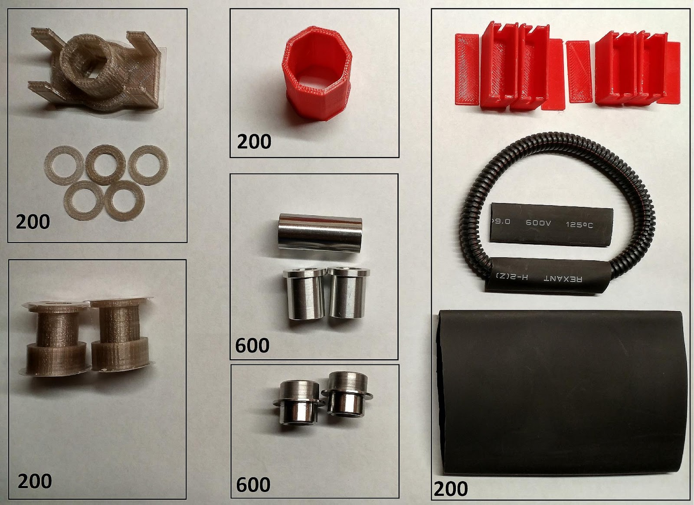]{style="overflow: hidden; display: inline-block; margin: 0.00px 0.00px; border: 0.00px solid #000000; transform: rotate(0.00rad) translateZ(0px); -webkit-transform: rotate(0.00rad) translateZ(0px); width: 430.50px; height: 313.04px;"}

[2.3 После сборки остались запчасти, что с ними делать?]{.c10} {#h.86b9tvp2sl2v .c8}
--------------------------------------------------------------

[Источник:
]{}[[Перейти](https://electrotransport.ru/ussr/index.php?topic%3D48865.msg1298366%23msg1298366&sa=D&source=editors&ust=1636795598622000&usg=AOvVaw22WhRuIGgjhS1WHmjl2n6p){.c11}]{.c7}

[Транспортировочная резинка была прикреплена к рулю. Она не нужна (на
выброс).]{.c5}

[Болт запасной.]{.c5}

[]{style="overflow: hidden; display: inline-block; margin: 0.00px 0.00px; border: 0.00px solid #000000; transform: rotate(0.00rad) translateZ(0px); -webkit-transform: rotate(0.00rad) translateZ(0px); width: 298.50px; height: 223.59px;"}

[2.4 Что лучше, Ninebot ES или Xiaomi Miija?]{.c10} {#h.5oc0fgexczld .c8}
---------------------------------------------------

[Ниже указаны основные параметры самокатов. Выбор за Вами :)]{.c5}

[Источники данных:]{.c5}

[[https://electro.club/wiki/elektrosamokat\_Xiaomi\_Mi\_Electric\_Scooter\_M365](https://electro.club/wiki/elektrosamokat_Xiaomi_Mi_Electric_Scooter_M365&sa=D&source=editors&ust=1636795598624000&usg=AOvVaw2Mhuvn3hK3BWzfiLWf80cD){.c11}]{.c7}

[[https://electrotransport.ru/ussr/index.php?topic=48865.0\#topmsg](https://electrotransport.ru/ussr/index.php?topic%3D48865.0%23topmsg&sa=D&source=editors&ust=1636795598624000&usg=AOvVaw2oH9RQikeji5xfuDH6vxJf){.c11}]{.c7}[ ]{.c5}

[]{.c5}

[ВИДЕО: ]{.c82}

[Сравнение Ninebot ES и Xiaomi
Miija]{.c90}[ ]{}[[https://youtu.be/Z5HTBNQ6Zm8](https://youtu.be/Z5HTBNQ6Zm8&sa=D&source=editors&ust=1636795598625000&usg=AOvVaw2X_OawrCF-Y3z99Vn2VsGs){.c11}]{.c7}[ ]{.c5}

[Обзор электросамоката Ninebot ES2 в сравнении с хитом продаж 2017 года
- Xiaomi Mijia
365]{.c90}[ ]{}[[https://youtu.be/YsoXVOFZZWk](https://youtu.be/YsoXVOFZZWk&sa=D&source=editors&ust=1636795598626000&usg=AOvVaw0fm0D4fFx3kNsFfRoFjoAc){.c11}]{.c7}[ ]{.c5}

[]{.c5}

[]{#t.dc5d7c0f64f919bce9f59dc7b17fd397b2837690}[]{#t.3}
+-----------------------+-----------------------+-----------------------+
| [Параметры]{.c49}     | [Ninebot ES]{.c49}    | [Xiaomi Miija]{.c49}  |
+-----------------------+-----------------------+-----------------------+
| []{.c5}               | [Самокат новый. Много | [Самокат на рынке     |
|                       | нерешенных проблем.   | второй год. Много     |
|                       |  Небольшой выбор      | решений проблем.      |
|                       | аксессуаров]{.c5}     | Большой выбор         |
|                       |                       | аксессуаров. Выпущена |
|                       |                       | вторая версия         |
|                       |                       | самоката с            |
|                       |                       | исправлением          |
|                       |                       | некоторых недочетов   |
|                       |                       | первых версий]{.c5}   |
+-----------------------+-----------------------+-----------------------+
| []{.c5}               | [Возможность          | [Установка доп.       |
|                       | установки доп.        | батареи в только      |
|                       | батареи заводского    | “кустарного”          |
|                       | изготовления.]{.c5}   | производства с        |
|                       |                       | врезкой в электронную |
|                       |                       | начинку и снятием     |
|                       |                       | гарантии.]{.c5}       |
+-----------------------+-----------------------+-----------------------+
| []{.c5}               | [Литые покрышки. По   | [Пневматические       |
|                       | сравнению с Xiaomi    | покрышки едет мягче,  |
|                       | самокат едет          | чем Ninebot, но       |
|                       | жёстче.]{.c5}         | необходимо следить за |
|                       |                       | давлением и есть      |
|                       |                       | возможность в дороге  |
|                       |                       | проколоть колесо. Так |
|                       |                       | же  есть возможность  |
|                       |                       | установки литых       |
|                       |                       | покрышек (на данный   |
|                       |                       | момент уже 3          |
|                       |                       | поколение).]{.c5}     |
+-----------------------+-----------------------+-----------------------+
| []{.c5}               | []{.c5}               | [Возможна установка   |
|                       |                       | кастомной прошивки    |
|                       |                       | для самоката]{.c5}    |
+-----------------------+-----------------------+-----------------------+
| []{.c5}               | [У Ninebot ES2/4 два  | [Цельнолитая дека.    |
|                       | узла сочленения деки  | Возможно более        |
|                       | - узел сложения и     | предпочтителен для    |
|                       | амортизатор.]{.c5}    | ездоков более 100     |
|                       |                       | кг.]{.c5}             |
+-----------------------+-----------------------+-----------------------+
| []{.c5}               | [Информативный        | [Малоинформативный    |
|                       | индикатор на руле.    | индикатор на руле.    |
|                       | Показывает скорость,  | Показывает только     |
|                       | заряд батареи, и      | заряд батареи и режим |
|                       | режим поездки. При    | поездки.]{.c5}        |
|                       | зарядке показывает %  |                       |
|                       | заряда батареи в      | []{.c5}               |
|                       | цифрах.]{.c5}         |                       |
|                       |                       | []{.c5}               |
|                       | []{style= | Wrp9Muav-Y7KuLeQ58pLs |
|                       | "overflow: hidden; di | lSer1Qso.jpg)]{style= |
|                       | splay: inline-block;  | "overflow: hidden; di |
|                       | margin: 0.00px 0.00px | splay: inline-block;  |
|                       | ; border: 0.00px soli | margin: 0.00px 0.00px |
|                       | d #000000; transform: | ; border: 0.00px soli |
|                       |  rotate(0.00rad) tran | d #000000; transform: |
|                       | slateZ(0px); -webkit- |  rotate(0.00rad) tran |
|                       | transform: rotate(0.0 | slateZ(0px); -webkit- |
|                       | 0rad) translateZ(0px) | transform: rotate(0.0 |
|                       | ; width: 219.00px; he | 0rad) translateZ(0px) |
|                       | ight: 129.33px;"}     | ; width: 220.50px; he |
|                       |                       | ight: 147.33px;"}     |
+-----------------------+-----------------------+-----------------------+
| []{.c5}               | [Более простая и      | [Более эффективная,   |
|                       | менее эффективная     | но более              |
|                       | система торможения    | требовательная к      |
|                       | задним крылом.]{.c5}  | уходу и регулировке   |
|                       |                       | система               |
|                       |                       | торможения.]{.c5}     |
+-----------------------+-----------------------+-----------------------+
| []{.c5}               | [Есть дополнительная  | []{.c5}               |
|                       | подсветка в           |                       |
|                       | деке.]{.c5}           |                       |
|                       |                       |                       |
|                       | []{style= |                       |
|                       | "overflow: hidden; di |                       |
|                       | splay: inline-block;  |                       |
|                       | margin: 0.00px 0.00px |                       |
|                       | ; border: 0.00px soli |                       |
|                       | d #000000; transform: |                       |
|                       |  rotate(0.00rad) tran |                       |
|                       | slateZ(0px); -webkit- |                       |
|                       | transform: rotate(0.0 |                       |
|                       | 0rad) translateZ(0px) |                       |
|                       | ; width: 219.00px; he |                       |
|                       | ight: 126.67px;"}     |                       |
+-----------------------+-----------------------+-----------------------+
| []{.c5}               | []{.c5}               | [В первых партиях     |
|                       |                       | многие самокаты       |
|                       |                       | возвращались в        |
|                       |                       | гарантийный ремонт.   |
|                       |                       | Из-за этого,          |
|                       |                       | например,             |
|                       |                       | ]{}[[продавцы         |
|                       |                       | отказываются          |
|                       |                       | продавать самокат с   |
|                       |                       | гарантийным           |
|                       |                       | ремонтом.](https://t. |
|                       |                       | me/NINEBOTES/5089&sa= |
|                       |                       | D&source=editors&ust= |
|                       |                       | 1636795598639000&usg= |
|                       |                       | AOvVaw2a2PowEEx--Mjd_ |
|                       |                       | -llT-Oq){.c11}]{.c7}  |
+-----------------------+-----------------------+-----------------------+
| []{.c5}               | [Высокий центр        | [Низкий центр         |
|                       | тяжести из-за батареи | тяжести. Лучше        |
|                       | в руле. В разложенном | управляется.]{.c5}    |
|                       | состоянии             |                       |
|                       | неустойчив.]{.c5}     |                       |
+-----------------------+-----------------------+-----------------------+

[]{.c5}

[]{#t.670bb7fde211202853478deb5a47223fd61eea55}[]{#t.4}
+-----------------------+-----------------------+-----------------------+
| [Аккумулятор]{.c5}    | [ES1/2: 187Втч        | [M365: 280втч         |
|                       | (]{}[5.2Ач)           | (]{}[7.8Ач)]{.c70}    |
|                       | ]{.c70}[(расширяется  |                       |
|                       | до 374Втч)]{.c5}      | [M187: 187Втч         |
|                       |                       | (]{}[5.2Ач)]{.c70}    |
|                       | [ES4: 374Втч          |                       |
|                       | (]{}[10,4Ач)]{.c70}   |                       |
+-----------------------+-----------------------+-----------------------+
| [Пробег]{.c5}         | [ES1/2: 20 км]{.c5}   | [30 км]{.c5}          |
|                       |                       |                       |
|                       | [ES4: 35 км ]{.c5}    |                       |
+-----------------------+-----------------------+-----------------------+
| [Макс. скорость]{.c5} | [ES1: 20км/ч (с доп.  | [25 км/ч]{.c5}        |
|                       | аккумулятором         |                       |
|                       | 25км/ч)]{.c5}         |                       |
|                       |                       |                       |
|                       | [ES2: 25км/ч]{.c5}    |                       |
|                       |                       |                       |
|                       | [ES4: 30км/ч]{.c5}    |                       |
+-----------------------+-----------------------+-----------------------+
| [Максимальная         | [100 кг]{.c5}         | [100 кг]{.c5}         |
| нагрузка]{.c70}       |                       |                       |
+-----------------------+-----------------------+-----------------------+
| [Номинальная мощность | [ES1: 250Вт]{.c5}     | [250 Вт]{.c5}         |
| двигателя]{.c5}       |                       |                       |
|                       | [ES2/4: 300Вт]{.c5}   |                       |
+-----------------------+-----------------------+-----------------------+
| [Максимальная         | [ES1: 500Вт]{.c5}     | [500 Вт]{.c5}         |
| мощность              |                       |                       |
| двигателя]{.c5}       | [ES2: 600Вт]{.c5}     |                       |
|                       |                       |                       |
|                       | [ES4: 800Вт]{.c5}     |                       |
+-----------------------+-----------------------+-----------------------+
| [Вес]{.c5}            | [ES1: 11 кг]{.c5}     | [12,5 кг]{.c5}        |
|                       |                       |                       |
|                       | [ES2: 12,5 кг]{.c5}   |                       |
|                       |                       |                       |
|                       | [ES4: 14 кг]{.c5}     |                       |
+-----------------------+-----------------------+-----------------------+
| [Амортизатор]{.c5}    | [ES1: передний        | [нет]{.c5}            |
|                       | (пружина)]{.c5}       |                       |
|                       |                       |                       |
|                       | [ES2/4:               |                       |
|                       | передний+задний       |                       |
|                       | ]{.c5}                |                       |
+-----------------------+-----------------------+-----------------------+

[2.5 При каких температурах можно использовать самокат?]{.c10} {#h.3v57tqitnq22 .c8}
--------------------------------------------------------------

[В ]{}[[инструкции](#h.ozqhv2c7p1wn){.c11}]{.c7}[ на 16 странице
написано: ]{.c5}

[]{style="overflow: hidden; display: inline-block; margin: 0.00px 0.00px; border: 0.00px solid #000000; transform: rotate(0.00rad) translateZ(0px); -webkit-transform: rotate(0.00rad) translateZ(0px); width: 661.42px; height: 149.33px;"}

[]{style="overflow: hidden; display: inline-block; margin: 0.00px 0.00px; border: 0.00px solid #000000; transform: rotate(0.00rad) translateZ(0px); -webkit-transform: rotate(0.00rad) translateZ(0px); width: 661.42px; height: 130.67px;"}

[Есть ]{}[[опыт
поездок](https://t.me/Ninebot_ES/466&sa=D&source=editors&ust=1636795598654000&usg=AOvVaw3lIVlCGQLIJZjYuE28Laai){.c11}]{.c7}[ при
температуре -26°С. Согласно
]{}[[wiki](https://ru.wikipedia.org/wiki/%25D0%259B%25D0%25B8%25D1%2582%25D0%25B8%25D0%25B9-%25D0%25B8%25D0%25BE%25D0%25BD%25D0%25BD%25D1%258B%25D0%25B9_%25D0%25B0%25D0%25BA%25D0%25BA%25D1%2583%25D0%25BC%25D1%2583%25D0%25BB%25D1%258F%25D1%2582%25D0%25BE%25D1%2580%23%25D0%25A1%25D0%25BD%25D0%25B8%25D0%25B6%25D0%25B5%25D0%25BD%25D0%25B8%25D0%25B5_%25D1%2591%25D0%25BC%25D0%25BA%25D0%25BE%25D1%2581%25D1%2582%25D0%25B8_%25D0%25BF%25D1%2580%25D0%25B8_%25D0%25BD%25D0%25B8%25D0%25B7%25D0%25BA%25D0%25B8%25D1%2585_%25D1%2582%25D0%25B5%25D0%25BC%25D0%25BF%25D0%25B5%25D1%2580%25D0%25B0%25D1%2582%25D1%2583%25D1%2580%25D0%25B0%25D1%2585&sa=D&source=editors&ust=1636795598654000&usg=AOvVaw1s2-yX-hyUa2sx2IYihIKm){.c11}]{.c7}[ 
при “]{}[При снижении температуры окружающего воздуха ниже 0 °C
происходит снижение мощности литий ионного аккумулятора до 40-50 %”,
т.е. на холоде проедете расстояние в \~2 раза меньше заявленного
производителем. Для сохранения ёмкости
]{.c121}[[советовали](https://t.me/NINEBOTES/3679&sa=D&source=editors&ust=1636795598655000&usg=AOvVaw0GUi-s7pGMakxePDdWsXP3){.c11}]{.c7}[ не
опускать температуру батареи ниже +10°С. Для сохранения температуры
батареи можно ]{}[[утеплить руль](#h.ugwfinjmalek){.c11}]{.c7}[. Быстрее
всего охлаждается батарея на открытых пространствах и большой скорости.
При повышении температуры до +20°С емкость аккумулятора восстановится
(так же указано и в инструкции).]{.c5}

[По утрамбованному снегу самокат не едет. Переднее колесо прорезает
верхнюю утрамбованную корку до мягкого слоя и встаёт. По льду колесо
скользит и норовит вырваться в бок при этом есть возможность
]{}[[вывернуть колесо относительно руля](#h.8q94xjmcogb8){.c11}]{.c7}[.
]{.c5}

[Самокат однозначно не всесезонный (проверено на себе):\
1. По льду скользит и уходит из под ног\
2. По утоптанной снежной тропинке в лесу не едет, колесо прорезает
твердую корку сверху, после проваливается в мягкую и колесо крутится на
месте\
3. Очень маленькое расстояние до крыла. Мокрый снег забивается и колесо
еле крутится\
4. На красном S режиме на снеге колесо проскальзывает\
5. При мокром снеге заднее колесо забивается снегом после чего
невозможно сложить самокат из-за того, что крючок не может попасть в
крыло.]{.c5}

[]{style="overflow: hidden; display: inline-block; margin: 0.00px 0.00px; border: 0.00px solid #000000; transform: rotate(0.00rad) translateZ(0px); -webkit-transform: rotate(0.00rad) translateZ(0px); width: 700.00px; height: 330.67px;"}

[Картинка взята
]{}[[здесь](https://habr.com/company/mugenpower/blog/171845/&sa=D&source=editors&ust=1636795598656000&usg=AOvVaw215urXqzAZy6XJV9MDro6w){.c11}]{.c7}[.]{.c5}

[2.6 Какой пластик использовать для печати деталей?]{.c10} {#h.4hzr6ra4hwas .c8}
----------------------------------------------------------

[ABS пластик не подойдёт поскольку он более жёсткий и не может выполнять
функцию сайленблоков
(]{}[[источник](https://t.me/Ninebot_ES/2076&sa=D&source=editors&ust=1636795598657000&usg=AOvVaw0rGJh8BDWsCJUTGFrTe7Rv){.c11}]{.c7}[).
Нужен упругий пластик, твердый будет разбиваться от
вибрации.(]{}[[источник](https://t.me/Ninebot_ES/2077&sa=D&source=editors&ust=1636795598657000&usg=AOvVaw3YC0CisBgtpei8XnLqPpIL){.c11}]{.c7}[).
Нужен SBS. Лучше всего Nylon и PETG
(]{}[[источник](https://t.me/Ninebot_ES/3512&sa=D&source=editors&ust=1636795598658000&usg=AOvVaw2XBqonpWSWH_PZLoUGCGO-){.c11}]{.c7}[)]{.c5}

[2.7 Зачем нужна кнопка на дополнительной батарее?]{.c10} {#h.7ved1041sc0j .c86 .c30}
---------------------------------------------------------

[Кнопка на дополнительной батарее нужна для отображения заряда батареи.
4 светодиода - полностью заряжена. 2 светодиода - заряжена на
половину.]{.c5}

[2.8 Как включить подсветку в дополнительной батарее?]{.c10} {#h.mrr8y6o9ckul .c86 .c30}
------------------------------------------------------------

[Для подстветки дополнительной батареи необходимо включить фару.]{.c5}

[2.9 Сколько проедет самокат на одном заряде?]{.c10} {#h.y1k4q14ix92y .c86 .c30}
----------------------------------------------------

[Согласно инструкции:]{.c5}

[Номинальная мощность аккумулятора ES1 - 187 Wh (5,2 Ah), ES2 - 187 Wh
(5,2 Ah),  ES4 - 374 Wh (10,4 Ah).]{.c5}

[Типичный диапазон ES1 - 25 км, ES2 - 25 км,  ES4 - 45 км с
примечаниями:]{.c5}

[Типичный диапазон: протестирован при полной нагрузке, вес 165 фунтов
(75 кг), температуре 77˚F (25˚C), 60% максимальной скорости на
среднестатистическом тротуаре.]{.c5}

[]{.c5}

[На
]{}[[форуме](https://electrotransport.ru/ussr/index.php?topic%3D48865.msg1313022%23msg1313022&sa=D&source=editors&ust=1636795598662000&usg=AOvVaw3Y3lZQ_FfszKtT2Ui1C3P4){.c11}]{.c7}[ зафиксированы
следующие показатели режимов самоката:]{.c5}

[Красный S - максимальная скорость ]{}[30 км/ч]{.c50}[, потребляемый ток
]{}[20А]{.c49}

[Белый S - максимальная скорость ]{}[25 км/ч]{.c50}[, потребляемый ток
]{}[10А]{.c49}

[Эко режим - максимальная скорость ]{}[16 км/ч]{.c50}[, потребляемый ток
]{}[4А]{.c49}

[]{.c5}

[Исходя из выше перечисленного можно предположить, что типичный диапазон
возможно достигнуть на экорежиме (60%\*30км/ч=18 км/ч). Самый большой
расход будет на режиме красный S, причём разность между белым S и
красным S в потреблении тока составляет 2 раза. ]{.c5}

[]{.c5}

[Советы для владельцев ES1/2 желающих увеличить дальность поездки:]{.c5}

1.  [Перед нажатием курка газа наберите как можно большую скорость
    отталкиваясь ногой]{.c5}
2.  [Производите движение на режиме Эко]{.c5}
3.  [Дайте батарее “отдохнуть” (например, перерывы на светофоре).]{.c5}
4.  [Толкайте включенный самокат рядом с собой для зарядки батареи от
    рекуперации]{.c5}

[]{.c5}

[Так же хотелось бы обратить внимание, что по % остатку батареи на
дисплее не стоит ориентироваться в качестве определения остатка
километража, т.к. график напряжения в зависимости от время разряда не
линейный.]{.c5}

[]{style="overflow: hidden; display: inline-block; margin: 0.00px 0.00px; border: 0.00px solid #000000; transform: rotate(0.00rad) translateZ(0px); -webkit-transform: rotate(0.00rad) translateZ(0px); width: 310.74px; height: 393.50px;"}

[2.10 Какой инструмент необходим для самоката?]{.c10} {#h.5rr93cn4x35r .c86 .c30}
-----------------------------------------------------

[]{.c5}

[]{#t.3e8c9f899f884aed83821aae33ece6ac6b631b9f}[]{#t.5}
+-----------------------------------+-----------------------------------+
| []{style="overflow: hidd | [Максимальный номер 8 для         |
| en; display: inline-block; margin | регулировки пружины               |
| : 0.00px 0.00px; border: 0.00px s | амортизатора.]{.c5}               |
| olid #000000; transform: rotate(0 |                                   |
| .00rad) translateZ(0px); -webkit- | [Снятие заднего блока (колесо и   |
| transform: rotate(0.00rad) transl | амортизатор): №2.5, №3, №5]{.c5}  |
| ateZ(0px); width: 263.00px; heigh |                                   |
| t: 39.00px;"}                     | [Разборка амортизатора: №8]{.c5}  |
+-----------------------------------+-----------------------------------+
| []{style="overflow: hidd |                                   |
| en; display: inline-block; margin |                                   |
| : 0.00px 0.00px; border: 0.00px s |                                   |
| olid #000000; transform: rotate(0 |                                   |
| .00rad) translateZ(0px); -webkit- |                                   |
| transform: rotate(0.00rad) transl |                                   |
| ateZ(0px); width: 245.00px; heigh |                                   |
| t: 39.00px;"}                     |                                   |
+-----------------------------------+-----------------------------------+
| []{style="overflow: hidd |                                   |
| en; display: inline-block; margin |                                   |
| : 0.00px 0.00px; border: 0.00px s |                                   |
| olid #000000; transform: rotate(0 |                                   |
| .00rad) translateZ(0px); -webkit- |                                   |
| transform: rotate(0.00rad) transl |                                   |
| ateZ(0px); width: 233.50px; heigh |                                   |
| t: 39.00px;"}                     |                                   |
+-----------------------------------+-----------------------------------+
| []{style="overflow: hidd |                                   |
| en; display: inline-block; margin |                                   |
| : 0.00px 0.00px; border: 0.00px s |                                   |
| olid #000000; transform: rotate(0 |                                   |
| .00rad) translateZ(0px); -webkit- |                                   |
| transform: rotate(0.00rad) transl |                                   |
| ateZ(0px); width: 74.00px; height |                                   |
| : 65.00px;"}                      |                                   |
+-----------------------------------+-----------------------------------+
| []{style="overflow: hidd | колеса. Можно так же сделать      |
| en; display: inline-block; margin | своими руками из трубного         |
| : 0.00px 0.00px; border: 0.00px s | свечного ключа 16мм.]{.c5}        |
| olid #000000; transform: rotate(0 |                                   |
| .00rad) translateZ(0px); -webkit- |                                   |
| transform: rotate(0.00rad) transl |                                   |
| ateZ(0px); width: 112.50px; heigh |                                   |
| t: 149.06px;"}                    |                                   |
+-----------------------------------+-----------------------------------+

[]{.c5}

[2.11 Как мыть самокат?]{.c10} {#h.bv66764ecpj5 .c86 .c30}
------------------------------

[Источник:
]{}[[Перейти](https://t.me/Ninebot_ES/11204&sa=D&source=editors&ust=1636795598675000&usg=AOvVaw2A2AXWIv6cn2QXB10hTvMw){.c11}]{.c7}

[После улицы сбиваю грязь водой из разбрызгивателя с четырехгранной
насадкой. распрыскиватель использую в режиме поток "stream".
Распрыскивателя хватает чтобы убрать грязь со всего самоката. Можно
дополнительно пройтись щёткой.]{.c5}

[]{style="overflow: hidden; display: inline-block; margin: 0.00px 0.00px; border: 0.00px solid #000000; transform: rotate(0.00rad) translateZ(0px); -webkit-transform: rotate(0.00rad) translateZ(0px); width: 153.00px; height: 320.00px;"}

[]{.c5}

[2.12 Каковы причины болтанки, скрипов, вибрации?]{.c10} {#h.i373n1ocm68b .c86 .c30}
--------------------------------------------------------

[]{.c5}

[]{#t.97bc4b679fb14f411d567ef57c55d06c402125f5}[]{#t.6}
+-----------------------+-----------------------+-----------------------+
| []{.c5}               | [Спереди]{.c5}        | [Сзади]{.c5}          |
+-----------------------+-----------------------+-----------------------+
| [Люфты]{.c5}          | [Руль болтается       | []{.c5}               |
|                       | влево-вправо:]{.c26}  |                       |
|                       |                       |                       |
|                       | 1.  [[Раскрутились    |                       |
|                       |     болты в нижней    |                       |
|                       |     части             |                       |
|                       |     руля.](#h.wjis20h |                       |
|                       | g24yy){.c11}]{.c7}[ Р |                       |
|                       | ешения:               |                       |
|                       |     а).               |                       |
|                       |     ]{}[[Промазать    |                       |
|                       |     болты фиксатором  |                       |
|                       |     резьбы](#h.wjis20 |                       |
|                       | hg24yy){.c11}]{.c7}[. |                       |
|                       |     б).               |                       |
|                       |     ]{}[[Поставить    |                       |
|                       |     шайбы             |                       |
|                       |     гровера](#h.c31g9 |                       |
|                       | eqg7kod){.c11}]{.c7}[ |                       |
|                       |  в).                  |                       |
|                       |     Поставить новые   |                       |
|                       |     болты]{.c5}       |                       |
|                       | 2.  [Люфт в месте     |                       |
|                       |     крепления рулевой |                       |
|                       |     стойки с вилкой.  |                       |
|                       |     Решение:          |                       |
|                       |     ]{}[[Поставить    |                       |
|                       |     прокладку](#h.5xq |                       |
|                       | bypb7fgw1){.c11}]{.c7 |                       |
|                       | }                     |                       |
|                       |                       |                       |
|                       | [Руль болтается       |                       |
|                       | вперед-назад:]{.c26}  |                       |
|                       |                       |                       |
|                       | 1.  [[Выпали резинки  |                       |
|                       |     в узле сложения   |                       |
|                       |     или пришли в      |                       |
|                       |     негодность](#h.g8 |                       |
|                       | 7mh5mze28o){.c11}]{.c |                       |
|                       | 7}[.                  |                       |
|                       |     Решение:          |                       |
|                       |     ]{}[[Заменить     |                       |
|                       |     резинки           |                       |
|                       |     сложения](#h.k1e4 |                       |
|                       | 31a4st2z){.c11}]{.c7} |                       |
|                       | 2.  [[Люфт втулок в   |                       |
|                       |     узле              |                       |
|                       |     сложения](#h.i6wy |                       |
|                       | 0znf5i7p){.c11}]{.c7} |                       |
|                       | [.                    |                       |
|                       |     Решение:          |                       |
|                       |     ]{}[[Заменить     |                       |
|                       |     втулки на         |                       |
|                       |     новые](#h.knxeohr |                       |
|                       | iuz20){.c11}]{.c7}    |                       |
|                       | 3.  [Раскрутилась     |                       |
|                       |     гайка в рулевой   |                       |
|                       |     колонке. Решение: |                       |
|                       |     ]{}[[Подкрутить   |                       |
|                       |     гайку.](#h.3ab48u |                       |
|                       | hk0h0l){.c11}]{.c7}   |                       |
|                       | 4.  [Раскрутилась     |                       |
|                       |     корончатая        |                       |
|                       |     гайка]{.c5}       |                       |
|                       | 5.  [[Сломались/раскр |                       |
|                       | утились               |                       |
|                       |     болты в узле      |                       |
|                       |     сложения](#h.ijy9 |                       |
|                       | sa2s0civ){.c11}]{.c7} |                       |
|                       | 6.  [[Раскрутились    |                       |
|                       |     боковые болты в   |                       |
|                       |     месте соединения  |                       |
|                       |     узла сложения и   |                       |
|                       |     рулевой           |                       |
|                       |     колонки](#h.wjis2 |                       |
|                       | 0hg24yy){.c11}]{.c7}[ |                       |
|                       | .                     |                       |
|                       |     Решение:          |                       |
|                       |     ]{}[[Промазать    |                       |
|                       |     болты фиксатором  |                       |
|                       |     резьбы](#h.wjis20 |                       |
|                       | hg24yy){.c11}]{.c7}[. |                       |
|                       | ]{.c5}                |                       |
+-----------------------+-----------------------+-----------------------+
| [Скрипы]{.c5}         | 1.  [[Скрип от трения | 1.  [Скрипит          |
|                       |     пыльника об       |     амортизатор.      |
|                       |     металлическую     |     Решения: а).      |
|                       |     поверхность       |     Доработка         |
|                       |     руля.](#h.nrlods2 |     амортизатора б).  |
|                       | r7vda){.c11}]{.c7}[ Р |     Смазка            |
|                       | ешение:               |     амортизатора]{.c5 |
|                       |     Смазать пыльник   | }                     |
|                       |     силиконовой       | 2.  [Раскрутился      |
|                       |     смазкой.]{.c5}    |     фиксирующий болт  |
|                       | 2.  [[Скрип от трения |     заднего           |
|                       |     штока об          |     амортизатора.]{.c |
|                       |     пластиковую       | 5}                    |
|                       |     втулку в рулевой  | 3.  [Подшипник в      |
|                       |     колонке](#h.7crx6 |     колесе пришёл в   |
|                       | raikhv8){.c11}]{.c7}[ |     негодность.]{.c5} |
|                       | .                     |                       |
|                       |     Решение: Смазать  | []{.c5}               |
|                       |     силиконовой       |                       |
|                       |     смазкой.]{.c5}    |                       |
|                       | 3.  [[Скрип от трения |                       |
|                       |     пластиковой       |                       |
|                       |     прокладки об      |                       |
|                       |     боковые пластины  |                       |
|                       |     узла              |                       |
|                       |     сложения](#h.1snn |                       |
|                       | sb1qdk5p){.c11}]{.c7} |                       |
|                       | [:                    |                       |
|                       |     Решение: Смазать  |                       |
|                       |     силиконовой       |                       |
|                       |     смазкой]{.c5}     |                       |
|                       | 4.  [[Скрип от трения |                       |
|                       |     в стыке посадки   |                       |
|                       |     подшипников.](#h. |                       |
|                       | ql394uj35bsi){.c11}]{ |                       |
|                       | .c7}[ Решение:        |                       |
|                       |     Смазать литиевой  |                       |
|                       |     смазкой]{.c5}     |                       |
|                       | 5.  [Мусор между      |                       |
|                       |     колесом и         |                       |
|                       |     крылом]{.c5}      |                       |
|                       | 6.  [Подшипник в      |                       |
|                       |     колесе пришёл в   |                       |
|                       |     негодность.]{.c5} |                       |
+-----------------------+-----------------------+-----------------------+
| [Дребезжание]{.c5}    | 1.  [[Выпали резинки  | 1.  [Вибрация         |
|                       |     в узле            |     тормозной колодки |
|                       |     сложения](#h.g87m |     об опорную ось.   |
|                       | h5mze28o){.c11}]{.c7} |     Решения:          |
|                       | 2.  [[Сломались/раскр |     Установка         |
|                       | утились               |     демпфера.]{.c5}   |
|                       |     болты в узле      | 2.  [Люфт втулок в    |
|                       |     сложения](#h.ijy9 |     колесе. Решения:  |
|                       | sa2s0civ){.c11}]{.c7} |     ]{}[[Установка    |
|                       | 3.  [Дребезжит        |     новых пластиковых |
|                       |     подножка.         |     или металлических |
|                       |     Решение:          |     втулок, установка |
|                       |     ]{}[[Проложить    |     прокладок,        |
|                       |     подкладку.](#h.a5 |     намотка           |
|                       | ko0795cw37){.c11}]{.c |     фум-ленты.](#h.v2 |
|                       | 7}                    | xvgl2oolzy){.c11}]{.c |
|                       | 4.  [Люфт втулок узла | 7}                    |
|                       |     сложения.]{.c5}   | 3.  [[Дребезжит       |
|                       |                       |     пластиковый       |
|                       |                       |     корпус            |
|                       |                       |     светодиодной      |
|                       |                       |     ленты в деке.     |
|                       |                       |     Возможное         |
|                       |                       |     решение:          |
|                       |                       |     Приклеить корпус  |
|                       |                       |     к                 |
|                       |                       |     деке](#h.tmmyee3z |
|                       |                       | z43k){.c11}]{.c7}     |
+-----------------------+-----------------------+-----------------------+

[]{.c5}

[2.13 Забыл пароль от самоката?]{.c10} {#h.kmsy227syz61 .c86 .c30}
--------------------------------------

[Для сброса пароля необходимо перезагрузить самокат:]{.c5}

[Зажать курки газ+тормоз. Включить самокат. Послушать писк.
Выключить.]{.c49}

[]{.c5}

[Если залоченный самокат не соединяется с приложением даже после
перезагрузки телефона, оставьте его в покое на 40-60 минут. Он уснёт,
после включения всё станет ок.
(]{}[[источник](https://t.me/NINEBOT_ES/35726&sa=D&source=editors&ust=1636795598692000&usg=AOvVaw0qirmvFnsZj9b_lwRZvnaf){.c11}]{.c7}[)]{.c5}

[]{.c5}

[2.14 Что значит WS и RS?]{.c10} {#h.l3hzchckl8qn .c86 .c30}
--------------------------------

[WS = White Sport = Белый спорт режим, RS = Red Sport = Красный спорт
режим]{.c5}

[2.15 Как определить ревизию самоката ES2/4?]{.c10} {#h.ygmf0hm8664s .c30 .c86}
---------------------------------------------------

[Основные отличительные черты:]{.c5}

[Первая - плоская наклейка, нет болтов фиксации резинок в узле
сложения]{.c5}

[Вторая - болты фиксации резинок в узле сложения, наклейка с пупырками,
пыльник на заднем амортизаторе, на заднем крыле резиновая наклейка
полумесяцем]{.c5}

[Третья - мягкая пружина на переднем амортизаторе]{.c5}

[]{.c5}

[Версия самоката указана в углу коробки, либо в инструкции (если коробку
выбросили):]{.c5}

[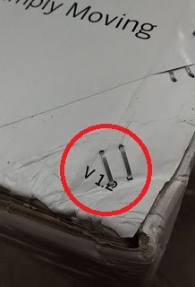]{style="overflow: hidden; display: inline-block; margin: 0.00px 0.00px; border: 0.00px solid #000000; transform: rotate(0.00rad) translateZ(0px); -webkit-transform: rotate(0.00rad) translateZ(0px); width: 122.50px; height: 179.82px;"}[]{style="overflow: hidden; display: inline-block; margin: 0.00px 0.00px; border: 0.00px solid #000000; transform: rotate(0.00rad) translateZ(0px); -webkit-transform: rotate(0.00rad) translateZ(0px); width: 177.00px; height: 178.00px;"}

[]{.c5}

[]{.c5}

[]{#t.457e55373ffccb3068bf7c28e67be80ae17763ed}[]{#t.7}
[Изменения]{.c49}

[Было]{.c49}

[Стало]{.c49}

[V1.1]{.c5}

[Поменяли на пупырчатую наклейку]{.c5}

[]{style="overflow: hidden; display: inline-block; margin: 0.00px 0.00px; border: 0.00px solid #000000; transform: rotate(0.00rad) translateZ(0px); -webkit-transform: rotate(0.00rad) translateZ(0px); width: 234.00px; height: 156.00px;"}

[]{style="overflow: hidden; display: inline-block; margin: 0.00px 0.00px; border: 0.00px solid #000000; transform: rotate(0.00rad) translateZ(0px); -webkit-transform: rotate(0.00rad) translateZ(0px); width: 234.00px; height: 156.00px;"}

[Добавили пыльник на аммортизатор]{.c5}

[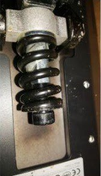]{style="overflow: hidden; display: inline-block; margin: 0.00px 0.00px; border: 0.00px solid #000000; transform: rotate(0.00rad) translateZ(0px); -webkit-transform: rotate(0.00rad) translateZ(0px); width: 168.00px; height: 292.00px;"}

[]{style="overflow: hidden; display: inline-block; margin: 0.00px 0.00px; border: 0.00px solid #000000; transform: rotate(0.00rad) translateZ(0px); -webkit-transform: rotate(0.00rad) translateZ(0px); width: 207.00px; height: 276.00px;"}

[Добавили болты фиксации резинок в узле сложения]{.c5}

[]{.c5}

[]{style="overflow: hidden; display: inline-block; margin: 0.00px 0.00px; border: 0.00px solid #000000; transform: rotate(0.00rad) translateZ(0px); -webkit-transform: rotate(0.00rad) translateZ(0px); width: 240.00px; height: 320.00px;"}

[Добавили на заднем крыле резиновую наклейку полумесяцем]{.c5}

[]{.c5}

[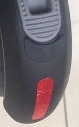]{style="overflow: hidden; display: inline-block; margin: 0.00px 0.00px; border: 0.00px solid #000000; transform: rotate(0.00rad) translateZ(0px); -webkit-transform: rotate(0.00rad) translateZ(0px); width: 156.00px; height: 251.00px;"}

[V1.2]{.c49}

[Мягкая пружина на переднем аммортизаторе]{.c5}

[]{.c5}

[]{.c5}

[V1.3]{.c49}

[Добавилась черная расцветка]{.c5}

[]{style="overflow: hidden; display: inline-block; margin: 0.00px 0.00px; border: 0.00px solid #000000; transform: rotate(0.00rad) translateZ(0px); -webkit-transform: rotate(0.00rad) translateZ(0px); width: 198.50px; height: 298.60px;"}

[]{style="overflow: hidden; display: inline-block; margin: 0.00px 0.00px; border: 0.00px solid #000000; transform: rotate(0.00rad) translateZ(0px); -webkit-transform: rotate(0.00rad) translateZ(0px); width: 198.00px; height: 300.00px;"}

[Сам самокат не чёрный, а графитовый, с блеском. На фото ниже снизу
труба ЕS2/4, вверху ES1.]{.c5}

[]{.c5}

[]{style="overflow: hidden; display: inline-block; margin: 0.00px 0.00px; border: 0.00px solid #000000; transform: rotate(0.00rad) translateZ(0px); -webkit-transform: rotate(0.00rad) translateZ(0px); width: 240.00px; height: 320.00px;"}

[Поменялась подножка.]{.c5}

[]{style="overflow: hidden; display: inline-block; margin: 0.00px 0.00px; border: 0.00px solid #000000; transform: rotate(0.00rad) translateZ(0px); -webkit-transform: rotate(0.00rad) translateZ(0px); width: 128.00px; height: 205.00px;"}

[]{style="overflow: hidden; display: inline-block; margin: 0.00px 0.00px; border: 0.00px solid #000000; transform: rotate(0.00rad) translateZ(0px); -webkit-transform: rotate(0.00rad) translateZ(0px); width: 180.00px; height: 246.00px;"}

[Добавились втулки на оси амортизатора.]{.c5}

[]{style="overflow: hidden; display: inline-block; margin: 0.00px 0.00px; border: 0.00px solid #000000; transform: rotate(0.00rad) translateZ(0px); -webkit-transform: rotate(0.00rad) translateZ(0px); width: 234.00px; height: 312.00px;"}

[]{style="overflow: hidden; display: inline-block; margin: 0.00px 0.00px; border: 0.00px solid #000000; transform: rotate(0.00rad) translateZ(0px); -webkit-transform: rotate(0.00rad) translateZ(0px); width: 240.67px; height: 180.50px;"}

[Убрали «рельсы» по которым голова вставлялась в трубу]{.c5}

[]{.c5}

[]{style="overflow: hidden; display: inline-block; margin: 0.00px 0.00px; border: 0.00px solid #000000; transform: rotate(0.00rad) translateZ(0px); -webkit-transform: rotate(0.00rad) translateZ(0px); width: 188.00px; height: 250.00px;"}

[Пластик более серый, как на m365]{.c5}

[]{.c5}

[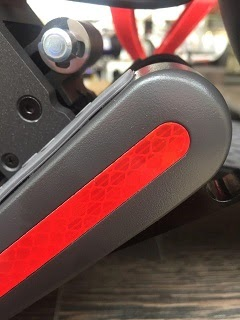]{style="overflow: hidden; display: inline-block; margin: 0.00px 0.00px; border: 0.00px solid #000000; transform: rotate(0.00rad) translateZ(0px); -webkit-transform: rotate(0.00rad) translateZ(0px); width: 240.00px; height: 320.00px;"}

[Другой серийник]{.c5}

[]{.c5}

[]{style="overflow: hidden; display: inline-block; margin: 0.00px 0.00px; border: 0.00px solid #000000; transform: rotate(0.00rad) translateZ(0px); -webkit-transform: rotate(0.00rad) translateZ(0px); width: 289.00px; height: 385.33px;"}

[V1.4]{.c50}

[4 - Это дьявольское число, которое приносит сплошные неприятности и
беды. Версии 1.4 нет.]{.c5}

[V1.5]{.c50}

[]{.c5}

[]{.c5}

[[https://t.me/NINEBOT\_ES/187462](https://t.me/NINEBOT_ES/187462&sa=D&source=editors&ust=1636795598719000&usg=AOvVaw2RUFOrceqyXpB8mrk79ima){.c11}]{.c7}[ ]{.c5}

[Коннекторы заменены на “банана-стайл”, которые держат 8 Ампер (на белом
спорте ток 10А, на красном спорте ток 20А) и поэтому часто горят
коннекторы и контроллер.]{.c5}

[]{style="overflow: hidden; display: inline-block; margin: 0.00px 0.00px; border: 0.00px solid #000000; transform: rotate(0.00rad) translateZ(0px); -webkit-transform: rotate(0.00rad) translateZ(0px); width: 289.00px; height: 153.33px;"}

[]{.c5}

[v 1.5 разошлись лепестки на верхнем коннекторе:]{.c5}

[]{.c5}

[]{style="overflow: hidden; display: inline-block; margin: 0.00px 0.00px; border: 0.00px solid #000000; transform: rotate(0.00rad) translateZ(0px); -webkit-transform: rotate(0.00rad) translateZ(0px); width: 280.00px; height: 488.00px;"}

[Типа таких контакты:]{.c5}

[]{.c5}

[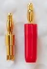]{style="overflow: hidden; display: inline-block; margin: 0.00px 0.00px; border: 0.00px solid #000000; transform: rotate(0.00rad) translateZ(0px); -webkit-transform: rotate(0.00rad) translateZ(0px); width: 97.00px; height: 143.00px;"}

[Сгоревшие дорожки контроллера:]{.c5}

[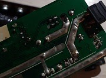]{style="overflow: hidden; display: inline-block; margin: 0.00px 0.00px; border: 0.00px solid #000000; transform: rotate(0.00rad) translateZ(0px); -webkit-transform: rotate(0.00rad) translateZ(0px); width: 180.00px; height: 132.00px;"}

[]{.c5}

[[https://t.me/NINEBOT\_ES/187460](https://t.me/NINEBOT_ES/187460&sa=D&source=editors&ust=1636795598723000&usg=AOvVaw0OalfNsmk6_aAPPFrX4rga){.c11}]{.c7}[ ]{.c5}

[Контроллер rev 2.0, переразведена цепь первичного dc-dc регулятора.
]{.c5}

[По моим прикидкам, он переварит большее напряжение, да и в целом старый
был слабым местом]{.c5}

[]{.c5}

[2.16 Как узнать серийный номер самоката?]{.c10} {#h.nyn8zlnsmjr .c86 .c30}
------------------------------------------------

1.  [По наклейке на деке]{.c5}

[]{style="overflow: hidden; display: inline-block; margin: 0.00px 0.00px; border: 0.00px solid #000000; transform: rotate(0.00rad) translateZ(0px); -webkit-transform: rotate(0.00rad) translateZ(0px); width: 320.00px; height: 240.00px;"}

2.  [По наклейке в заглушке мотор колеса]{.c5}

[]{style="overflow: hidden; display: inline-block; margin: 0.00px 0.00px; border: 0.00px solid #000000; transform: rotate(0.00rad) translateZ(0px); -webkit-transform: rotate(0.00rad) translateZ(0px); width: 180.00px; height: 320.00px;"}[]{style="overflow: hidden; display: inline-block; margin: 0.00px 0.00px; border: 0.00px solid #000000; transform: rotate(0.00rad) translateZ(0px); -webkit-transform: rotate(0.00rad) translateZ(0px); width: 240.00px; height: 320.00px;"}

3.  [По наклейке на коробке]{.c5}

[]{style="overflow: hidden; display: inline-block; margin: 0.00px 0.00px; border: 0.00px solid #000000; transform: rotate(0.00rad) translateZ(0px); -webkit-transform: rotate(0.00rad) translateZ(0px); width: 320.00px; height: 240.00px;"}

4.  [В приложении]{.c5}

[]{style="overflow: hidden; display: inline-block; margin: 0.00px 0.00px; border: 0.00px solid #000000; transform: rotate(0.00rad) translateZ(0px); -webkit-transform: rotate(0.00rad) translateZ(0px); width: 180.00px; height: 320.00px;"}

[]{.c5}

[2.17 Как поменять серийный номер через приложение Ninebot?]{.c10} {#h.9f4h0h6cwxw2 .c86 .c30}
------------------------------------------------------------------

[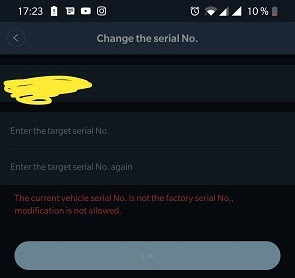]{style="overflow: hidden; display: inline-block; margin: 0.00px 0.00px; border: 0.00px solid #000000; transform: rotate(0.00rad) translateZ(0px); -webkit-transform: rotate(0.00rad) translateZ(0px); width: 295.00px; height: 278.00px;"}

[нужно залогиниться в официальном приложении с аккаута реселлера, потом
можно будет сменить серийный номер на другой (левые серийники не
воспринимает, нужно брать серийник с какого-либо донора, или в интернете
найти)]{.c5}

[на реселлерских аккаунтах часто меняют пароли, на 07.03.2019 работают
эти аккаунты:]{.c5}

[]{.c5}

[логин ninebotservice, пароль 123456]{.c5}

[логин 奔跑吧·兄弟, пароль 1q2w3e4r5t]{.c5}

[]{.c5}

[если покупали новый контроллер, спрашивайте у продавца временный логин
и пароль]{.c5}

[]{.c5}

[p.s. нужно искать серийный номер, который уже работал с внутренней
батареей, потому что если взять любой, то будет несовместимость по
серийному номеру с батареей. то бишь нужен донор с рабочей батареей,
тогда можно будет перезаписать серийник и использовать батарею, которая
поставлялась вместе с ним. так гарантирована 100%
работоспособность]{.c5}

[]{.c5}

[Дополнительно по теме смены серийного номера:
]{}[[https://www.scooterhacking.org/forum/viewtopic.php?f=6&t=14](https://www.scooterhacking.org/forum/viewtopic.php?f%3D6%26t%3D14&sa=D&source=editors&ust=1636795598730000&usg=AOvVaw1a1BHWOQ_kQbOL3hwS63yJ){.c11}]{.c7}[ ]{.c5}

[]{.c5}

[3 Проблемы]{.c78} {#h.5tmqf3kg40h .c60 .c30}
==================

------------------------------------------------------------------------

[]{.c5}

[3.1 Рулевое]{.c10} {#h.hlicmx2ojy72 .c8}
-------------------

### [3.1.1 Колесо повернуто относительно оси руля]{.c18} {#h.8q94xjmcogb8 .c39 .c30}

[[Статья по проблеме на
экодрифте](https://ecodrift.ru/wiki/elektrosamokaty/lyuft_rulya_elektrosamokata_ninebot_es2_es1_es4_ocherednoy_proschet_inzhenerov/&sa=D&source=editors&ust=1636795598732000&usg=AOvVaw0HL2wA_So_Q47cup9og9dn){.c11}]{.c7}

[]{.c5}

[Решение: Кривизна колеса относительно руля исправляется ]{}[[установкой
втулки со смещением в 4 градуса](#h.u1cbv9gczkmw){.c11}]{.c7}[. Правда
угол везде разный и на конкретном экземпляре 4-х градусов оказалось
недостаточно, 5-7 было бы лучше.]{.c5}

[]{.c5}

[См. так. же: FAQ ]{}[[Где взять ремкомплект (в т.ч.
втулку)](#h.tj3fwevp9v0e){.c11}]{.c7}

[]{.c5}

[P.S. а вот это видео прислал наш корейский друг
]{}[[ссылка](https://t.me/Ninebot_ES/5357&sa=D&source=editors&ust=1636795598734000&usg=AOvVaw221g6W2lNlCoxoAOB-hwJj){.c11}]{.c7}[ :)]{.c5}

[]{.c5}

[Комментарий по теме:
]{}[[Перейти](https://t.me/Ninebot_ES/3215&sa=D&source=editors&ust=1636795598735000&usg=AOvVaw0o4cgYhtMffH7PMwSOFFGV){.c11}]{.c7}[ ]{.c5}

[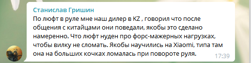]{style="overflow: hidden; display: inline-block; margin: 0.00px 0.00px; border: 0.00px solid #000000; transform: rotate(0.00rad) translateZ(0px); -webkit-transform: rotate(0.00rad) translateZ(0px); width: 518.00px; height: 130.00px;"}

### [3.1.2-1 Люфт в рулевой (раскрутились болты)]{.c18} {#h.3ab48uhk0h0l .c39 .c30}

[Источник (видео):
]{}[[https://t.me/Ninebot\_ES/2779](https://t.me/Ninebot_ES/2779&sa=D&source=editors&ust=1636795598736000&usg=AOvVaw0tJXArU69bHgIh69b1Jq7m){.c11}]{.c7}[ ]{.c5}

[]{style="overflow: hidden; display: inline-block; margin: 0.00px 0.00px; border: 0.00px solid #000000; transform: rotate(0.00rad) translateZ(0px); -webkit-transform: rotate(0.00rad) translateZ(0px); width: 303.72px; height: 167.50px;"}

[Автор сообщения обратился в магазин в котором покупал самокат (Омикс).
Там сняли пломбу и об этом указали в чеке.]{.c5}

[Возможное решение - подтянуть болты в основании руля (2 болта под
пломбой и 2 болта спереди). Желательно смазать болты фиксатором резьбы
для исключения повторного раскручивания. Так же проблему решает
]{}[[установка прокладки в место соединения руля с
вилкой](#h.5xqbypb7fgw1){.c11}]{.c7}[ и ]{}[[установка шайб
гровера](#h.c31g9eqg7kod){.c11}]{.c7}[.]{.c5}

[!!! Возможна потеря гарантии, т.к. на этом месте стоит пломба. Без её
повреждения невозможно подтянуть болты !!!]{.c82}

[Из чата ламобайл и люксвело разрешает подтягивать болты под
пломбой.]{.c5}

[]{.c5}

[]{style="overflow: hidden; display: inline-block; margin: 0.00px 0.00px; border: 0.00px solid #000000; transform: rotate(0.00rad) translateZ(0px); -webkit-transform: rotate(0.00rad) translateZ(0px); width: 115.50px; height: 204.19px;"}[]{style="overflow: hidden; display: inline-block; margin: 0.00px 0.00px; border: 0.00px solid #000000; transform: rotate(0.00rad) translateZ(0px); -webkit-transform: rotate(0.00rad) translateZ(0px); width: 153.50px; height: 205.00px;"}

[]{.c49}

### [3.1.2-2 Люфт в рулевой (раскрутилась гайка)]{.c18} {#h.jq8hyiilqs9v .c39 .c30}

[Решение:]{.c50}[  Затянуть гайку см.
]{}[[видео](https://www.youtube.com/watch?v%3Dd1WZOM8CuRk&sa=D&source=editors&ust=1636795598739000&usg=AOvVaw1M_imnont8d7P9lyOiUARp){.c11}]{.c7}

[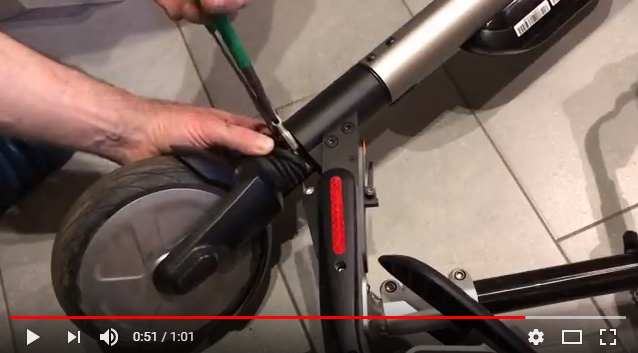]{style="overflow: hidden; display: inline-block; margin: 0.00px 0.00px; border: 0.00px solid #000000; transform: rotate(0.00rad) translateZ(0px); -webkit-transform: rotate(0.00rad) translateZ(0px); width: 309.00px; height: 171.58px;"}

### [3.1.3-1 Скрип в рулевой (трение штока об втулку)]{.c18} {#h.7crx6raikhv8 .c39 .c30}

[Источник (видео):
]{}[[Перейти](https://t.me/Ninebot_ES/4033&sa=D&source=editors&ust=1636795598740000&usg=AOvVaw3ogXysdH8i52GWOWU_ivDr){.c11}]{.c7}[ ]{.c5}

[Решение: Лечение временное - хорошо побрызгать силиконовой проникающей
смазкой на втулку, под резиновым пыльником пружины, непрерывно качая
руль как на видео через какое-то время снова появится, но может к тому
моменту уже и саму втулку менять будет пора (источник:
]{}[[перейти](https://t.me/Ninebot_ES/4050&sa=D&source=editors&ust=1636795598740000&usg=AOvVaw1QfsaRB_QjjBv5UlQwZ6d6){.c11}]{.c7}[).]{.c5}

### [3.1.3-2 Скрип в рулевой (трение в стыках посадки подшипников)]{.c18} {#h.ql394uj35bsi .c39 .c30}

[Источник:
]{}[[Перейти](https://t.me/Ninebot_ES/2527&sa=D&source=editors&ust=1636795598741000&usg=AOvVaw3gak7KCULYxSGaObHjhqpE){.c11}]{.c7}[ ]{.c5}

[Хорошо побрызгать литиевой смазкой в стыки посадки подшипников в
рулевом стакане разница в смазке - силикон хорошо проникает, но дает
тонкую пленку, аналогично wd40, а литий хуже проникает, но дает хороший
устойчивый к влаге слой (источник:
]{}[[перейти](https://t.me/Ninebot_ES/4050&sa=D&source=editors&ust=1636795598742000&usg=AOvVaw3Ucsis05ls4nU0k4UW8cBr){.c11}]{.c7}[).]{.c5}

### [3.1.3-3 Скрип в рулевой (трение пыльника об металл)]{.c18} {#h.nrlods2r7vda .c39 .c30}

[Скрип возникает ]{}[[от трения
пыльника](https://t.me/Ninebot_ES/7504&sa=D&source=editors&ust=1636795598743000&usg=AOvVaw09uVl9ELrnyA57eB1V6fWC){.c11}]{.c7}[ об
металлическую поверхность руля. Смазать соединение.]{.c5}

[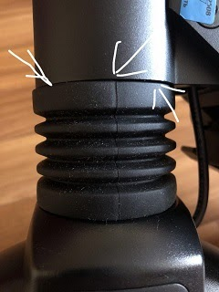]{style="overflow: hidden; display: inline-block; margin: 0.00px 0.00px; border: 0.00px solid #000000; transform: rotate(0.00rad) translateZ(0px); -webkit-transform: rotate(0.00rad) translateZ(0px); width: 240.00px; height: 320.00px;"}

### [3.1.4 Дребезжит курок]{} {#h.s0de0esocxit .c39 .c30}

[Источник:
]{}[[Перейти](https://t.me/Ninebot_ES/2278&sa=D&source=editors&ust=1636795598744000&usg=AOvVaw2_PYgzL-T1hwyKd22ugbnt){.c11}]{.c7}[ (видео)]{.c5}

[Решение:
]{}[[Перейти](https://t.me/Ninebot_ES/2401&sa=D&source=editors&ust=1636795598745000&usg=AOvVaw30TNhWQiOkGEfM-ilgZqEt){.c11}]{.c7}

[Решено прокладкой изоленты по кругу]{.c5}

### [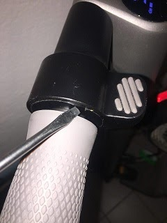]{style="overflow: hidden; display: inline-block; margin: 0.00px 0.00px; border: 0.00px solid #000000; transform: rotate(0.00rad) translateZ(0px); -webkit-transform: rotate(0.00rad) translateZ(0px); width: 240.00px; height: 320.00px;"} {#h.kdrd47n0q0it .c105 .c30}

### [3.1.5 Потертость руля при транспортировке (в первых партиях)]{.c18} {#h.kuam64b2j1xr .c39 .c30}

[Источник:
]{}[[Перейти](https://t.me/NINEBOTES/4071&sa=D&source=editors&ust=1636795598746000&usg=AOvVaw1_Z5OEp8eFgmZ-K9S2Q2eF){.c11}]{.c7}

[Было замечено в первых партиях.]{.c5}

[]{style="overflow: hidden; display: inline-block; margin: 0.00px 0.00px; border: 0.00px solid #000000; transform: rotate(0.00rad) translateZ(0px); -webkit-transform: rotate(0.00rad) translateZ(0px); width: 149.59px; height: 265.83px;"}[]{style="overflow: hidden; display: inline-block; margin: 0.00px 0.00px; border: 0.00px solid #000000; transform: rotate(0.00rad) translateZ(0px); -webkit-transform: rotate(0.00rad) translateZ(0px); width: 298.50px; height: 168.09px;"} {#h.mq9hid70f5sy .c30 .c108}
==============================================================================================================================================================================================================================================================================================================================================================================================================================================================================================================================================================================================================================================

### [3.1.6 Не достаёт разъем батареи (единичный случай)]{.c18} {#h.cp0aepkkgxoi .c39 .c30}

[Источник:
]{}[[Перейти](https://t.me/NINEBOTES/1193&sa=D&source=editors&ust=1636795598748000&usg=AOvVaw0RDae4iKa5ewX3k7yPiBDS){.c11}]{.c7}

[Видимо был единичный случай]{.c5}

[]{.c5}

[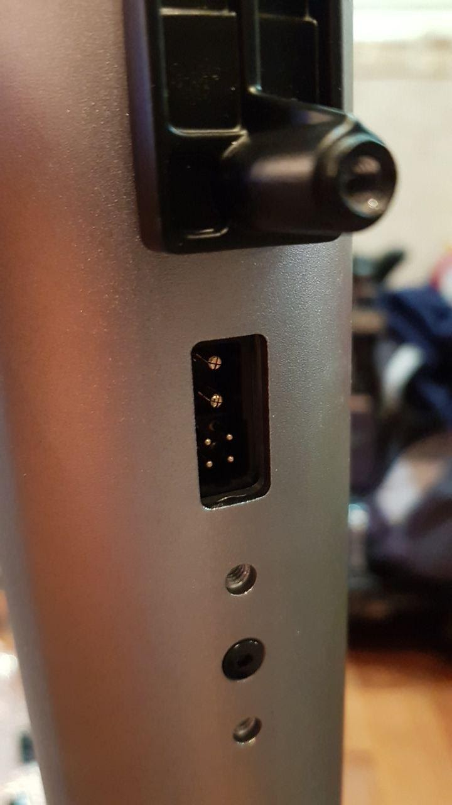]{style="overflow: hidden; display: inline-block; margin: 0.00px 0.00px; border: 0.00px solid #000000; transform: rotate(0.00rad) translateZ(0px); -webkit-transform: rotate(0.00rad) translateZ(0px); width: 168.50px; height: 299.82px;"}[]{style="overflow: hidden; display: inline-block; margin: 0.00px 0.00px; border: 0.00px solid #000000; transform: rotate(0.00rad) translateZ(0px); -webkit-transform: rotate(0.00rad) translateZ(0px); width: 406.54px; height: 228.50px;"}

### [3.1.7 Вылезает резинка в руле]{.c18} {#h.i8e6r5rqi9s7 .c39 .c30}

[Источник:
]{}[[Перейти](https://t.me/Ninebot_ES/2542&sa=D&source=editors&ust=1636795598749000&usg=AOvVaw2j-lMrmLLaehAPaOavyJcV){.c11}]{.c7}

[]{style="overflow: hidden; display: inline-block; margin: 0.00px 0.00px; border: 0.00px solid #000000; transform: rotate(0.00rad) translateZ(0px); -webkit-transform: rotate(0.00rad) translateZ(0px); width: 281.50px; height: 210.88px;"}

### [3.1.8 Ломается крючок на руле]{.c18} {#h.zh6z5fbe9m8m .c39 .c30}

[Источник:
]{}[[Перейти](https://electrotransport.ru/ussr/index.php?topic%3D48865.msg1226994%23msg1226994&sa=D&source=editors&ust=1636795598750000&usg=AOvVaw3TY3k0KSJNhh1eSOV4lFPt){.c11}]{.c7}[ ]{.c5}

[Решение: ]{}[[приобрести новую](#h.eo0u0i1h6ca9){.c11}]{.c7}[либо
]{}[[распечатать на 3д принтере](#h.nwymjfrz0a5a){.c11}]{.c7}

[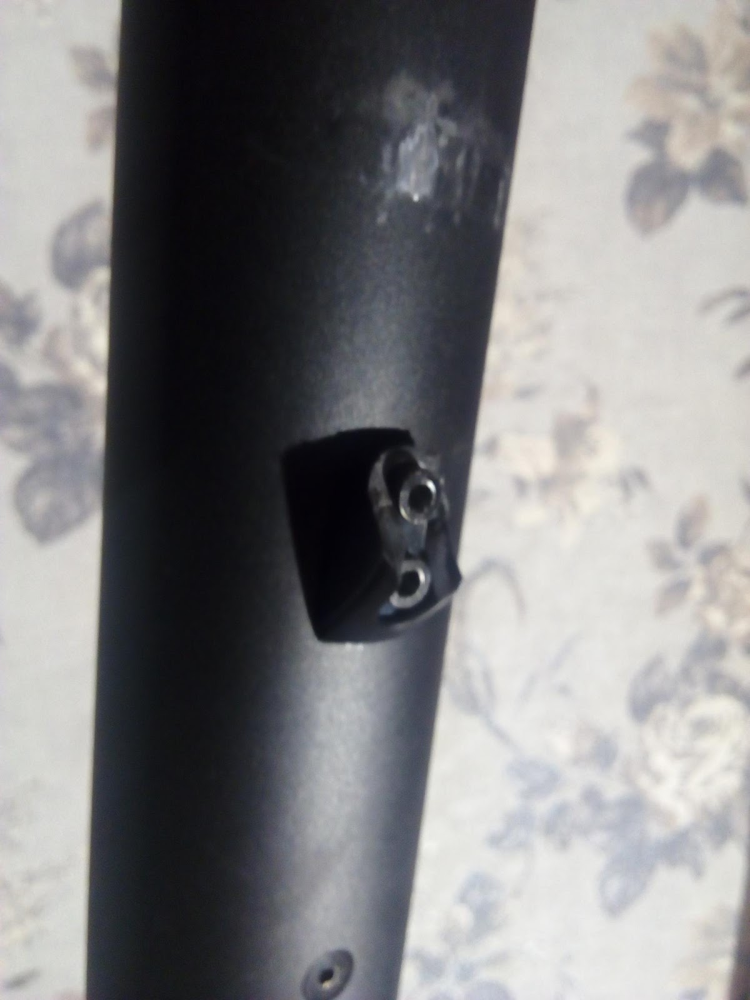]{style="overflow: hidden; display: inline-block; margin: 0.00px 0.00px; border: 0.00px solid #000000; transform: rotate(0.00rad) translateZ(0px); -webkit-transform: rotate(0.00rad) translateZ(0px); width: 221.50px; height: 296.18px;"} {#h.z7tmbal5ipyy .c84 .c30}
-----------------------------------------------------------------------------------------------------------------------------------------------------------------------------------------------------------------------------------------------------------------------------------------------------------------------

### [3.1.9 Сломался узел крепления рулевой стойки]{.c18} {#h.39vo0kojjkey .c39 .c30}

[]{style="overflow: hidden; display: inline-block; margin: 0.00px 0.00px; border: 0.00px solid #000000; transform: rotate(0.00rad) translateZ(0px); -webkit-transform: rotate(0.00rad) translateZ(0px); width: 453.50px; height: 453.50px;"}

[]{.c5}

[Источник:]{.c5}

[[https://t.me/NINEBOT\_ES/165013](https://t.me/NINEBOT_ES/165013&sa=D&source=editors&ust=1636795598753000&usg=AOvVaw1juRH-fQKsZAbcVoHZ2WhZ){.c11}]{.c7}[ ]{.c5}

[[https://t.me/NINEBOT\_ES/157800](https://t.me/NINEBOT_ES/157800&sa=D&source=editors&ust=1636795598753000&usg=AOvVaw0mpRiJyR4BzYiXYEySjFWP){.c11}]{.c7}[ ]{.c5}

[]{.c5}

[Отремонтировано за 2000 руб. здесь :
]{}[[https://vk.com/clubmotoferrum](https://vk.com/clubmotoferrum&sa=D&source=editors&ust=1636795598754000&usg=AOvVaw3iK0i6gcKVY3Qbe--nYfy7){.c11}]{.c7}

[После сварки появляется щель, которую необходимо чем-либо
прикрыть.]{.c5}

[]{.c5}

[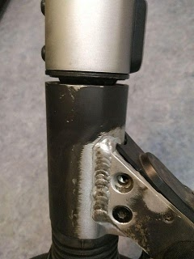]{style="overflow: hidden; display: inline-block; margin: 0.00px 0.00px; border: 0.00px solid #000000; transform: rotate(0.00rad) translateZ(0px); -webkit-transform: rotate(0.00rad) translateZ(0px); width: 240.00px; height: 320.00px;"}[]{style="overflow: hidden; display: inline-block; margin: 0.00px 0.00px; border: 0.00px solid #000000; transform: rotate(0.00rad) translateZ(0px); -webkit-transform: rotate(0.00rad) translateZ(0px); width: 240.00px; height: 320.00px;"}[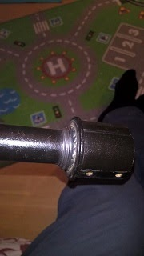]{style="overflow: hidden; display: inline-block; margin: 0.00px 0.00px; border: 0.00px solid #000000; transform: rotate(0.00rad) translateZ(0px); -webkit-transform: rotate(0.00rad) translateZ(0px); width: 180.00px; height: 320.00px;"}

### [3.1.10 Трещины в руле от крепления болтами ]{.c18} {#h.naq1gm1xxlw4 .c39 .c30}

[[https://t.me/NINEBOT\_ES/211660](https://t.me/NINEBOT_ES/211660&sa=D&source=editors&ust=1636795598756000&usg=AOvVaw3rSOTj5TlvOvDScb1KrEYB){.c11}]{.c7}[ ]{.c5}

[]{.c5}

[Возникает из-за постоянного подкручивания заводских винтов.]{.c5}

[]{.c5}

[]{style="overflow: hidden; display: inline-block; margin: 0.00px 0.00px; border: 0.00px solid #000000; transform: rotate(0.00rad) translateZ(0px); -webkit-transform: rotate(0.00rad) translateZ(0px); width: 430.00px; height: 322.00px;"}

[3.2 Подвеска ]{.c10} {#h.qntnjsmki6dd .c8}
---------------------

### [3.2.1 Стук в подвеске]{.c18} {#h.gk9xblvdy1cc .c39 .c30}

[Источник:
]{}[[Перейти](https://electrotransport.ru/ussr/index.php?topic%3D48865.msg1295959%23msg1295959&sa=D&source=editors&ust=1636795598758000&usg=AOvVaw1swzJ_dlU9mttJw8ZcM64Q){.c11}]{.c7}

[Возможное решение: ]{}[[Установка мебельных
заглушек](#h.oqhet3bd0bg5){.c11}]{.c7}

[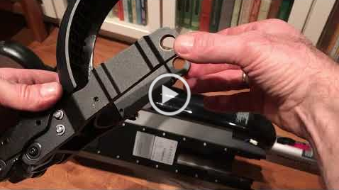]{style="overflow: hidden; display: inline-block; margin: 0.00px 0.00px; border: 0.00px solid #000000; transform: rotate(0.00rad) translateZ(0px); -webkit-transform: rotate(0.00rad) translateZ(0px); width: 327.50px; height: 183.10px;"}

[]{.c5}

### [3.2.2 Шумы в задней части деки]{.c18} {#h.ve72tst81dhl .c39 .c30}

[Источник (видео): ]{.c5}

[[Видео №
1](https://t.me/Ninebot_ES/2747&sa=D&source=editors&ust=1636795598760000&usg=AOvVaw1D7N0VI700VHmt8dxIzsxV){.c11}]{.c7}

[[Видео №
2](https://t.me/Ninebot_ES/2756&sa=D&source=editors&ust=1636795598761000&usg=AOvVaw0qsUm4dXExO_LSSVU2srt-){.c11}]{.c7}[ ]{.c5}

[[Видео №
3](https://t.me/Ninebot_ES/2763&sa=D&source=editors&ust=1636795598761000&usg=AOvVaw3IolSIye-fIPANpmuBd686){.c11}]{.c7}[ ]{.c5}

[[Видео №
4](https://t.me/Ninebot_ES/2764&sa=D&source=editors&ust=1636795598762000&usg=AOvVaw3n4I0OcgepBMzf-r9iei5M){.c11}]{.c7}[ ]{.c5}

[]{.c5}

[Решение: Ослабла пружина амортизатора. Подкрутить фиксирующий болт.
Нужен шестигранный ключ \#8]{.c5}

[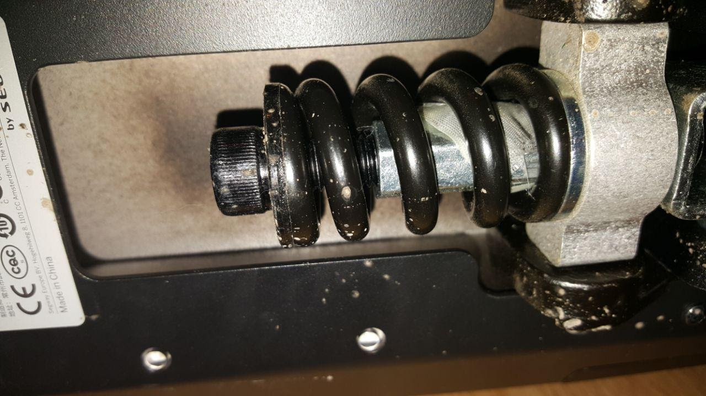]{style="overflow: hidden; display: inline-block; margin: 0.00px 0.00px; border: 0.00px solid #000000; transform: rotate(0.00rad) translateZ(0px); -webkit-transform: rotate(0.00rad) translateZ(0px); width: 299.50px; height: 169.47px;"}[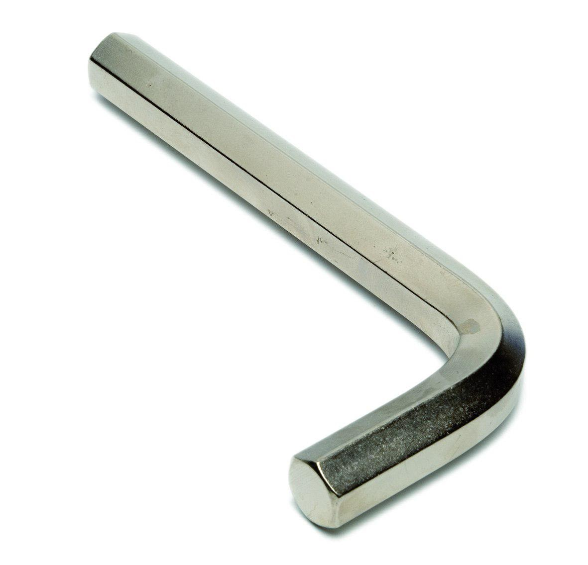]{style="overflow: hidden; display: inline-block; margin: 0.00px 0.00px; border: 0.00px solid #000000; transform: rotate(0.00rad) translateZ(0px); -webkit-transform: rotate(0.00rad) translateZ(0px); width: 174.82px; height: 167.50px;"}

### [3.2.3 Скрип амортизатора ]{.c18} {#h.5loi70zhv7kb .c39 .c30}

[Временное решение: Смазать шток ]{}[[водостойкой
смазкой](https://t.me/Ninebot_ES/9003&sa=D&source=editors&ust=1636795598763000&usg=AOvVaw0d1eOezoqVmBdj_3hmGD9z){.c11}]{.c7}[.
Например,
]{}[[такой](https://t.me/Ninebot_ES/8996&sa=D&source=editors&ust=1636795598764000&usg=AOvVaw3tT71xQ7-Yv6tg8cAw4tp9){.c11}]{.c7}[.]{.c5}

[Постоянное решение: ]{}[[Доработка
амортизатора](#h.a88imn2bakwx){.c11}]{.c7}

[3.3 Электроника]{.c10} {#h.ma596e8ry2b5 .c8}
-----------------------

### [3.3.1 Ошибка 10]{.c18} {#h.wnhtpls1oz4i .c39 .c30}

[Ошибка 10 Нам сообщает о плохом соединении с Bluetooth. (Источник:
]{}[[Перейти](https://t.me/Ninebot_ES/8934&sa=D&source=editors&ust=1636795598765000&usg=AOvVaw3nkOZF-GNi3B11cy3Rlv9J){.c11}]{.c7}[)]{.c5}

[Аналог от m365: 10 – Ошибка коммуникации с головным модулем
(]{}[[Источник](https://mimod.ru/ru_RU/m365errorcodes/&sa=D&source=editors&ust=1636795598765000&usg=AOvVaw2js5zzTac7w2o-y8ujpm_v){.c11}]{.c7}[)]{.c5}

[]{.c2}

[Автоперевод с корейского
(]{.c58}[[источник](https://t.me/NINEBOT_ES/41958&sa=D&source=editors&ust=1636795598766000&usg=AOvVaw0huEfntBNmTejFv8RzgBzN){.c11}]{.c7}[):]{.c2}

[Симптомы: Над HUD и соединением платы управления]{.c5}

[Решения: Проверьте правильность проводки]{.c5}

[Часть: HUD, пульт управления]{.c5}

[]{.c5}

[Вариант 1: ]{.c49}

[Проблемы с ПО]{.c49}

[Источник:
]{}[[Перейти](https://electrotransport.ru/ussr/index.php?topic%3D48865.msg1305132%23msg1305132&sa=D&source=editors&ust=1636795598768000&usg=AOvVaw188HdiofLMsQZ4DutGH9MS){.c11}]{.c7}[ ]{}

[Из
]{}[[сообщения](https://electrotransport.ru/ussr/index.php?topic%3D48865.msg1305239%23msg1305239&sa=D&source=editors&ust=1636795598769000&usg=AOvVaw2dCZ2TiTtXRddFnjEd1EX-){.c11}]{.c7}[:
“Вчера заметил ровно так же. Нашел закономерность. 1. вкл. самокат 2.
подключается он по Bluetooth к смартфону (iphone). 3. на экране самоката
загорается ошибка 10 и тухнет и так много раз. Но если зайти в настройки
самоката или отключиться от приложения ошибка пропадает. Дилер говорит
10-я ошибка это недоустановленное обновление. А на iphone сейчас косяк с
приложением, как его открываешь выходит уведомление чтоб обновиться на
4.4.3 и перейти в appstore, но установлена именно эта версия, в appstore
его не обновляет. Пробовал удалить/установить приложение. ничего не
выходит.\
Решение не подключать к приложения (пока не выйдет исправление).”]{.c5}

[]{.c5}

[Вариант 2]{.c50}[:  установить ]{}[[альтернативное
приложение](https://electrotransport.ru/ussr/index.php?topic%3D48865.msg1305290%23msg1305290&sa=D&source=editors&ust=1636795598770000&usg=AOvVaw0RUlqB4VNSmMwq3Qo_oiGf){.c11}]{.c7}[ Darknessbot.]{.c5}

[Внимание!!! Из-за альтернативного приложения также возможно
возникновение попеременное отображение ошибок 10 / 25, 10 / 14, 10 / 12.
Проблема решается выключением самоката удержанием кнопки на дисплее \~
10 секунд. ]{.c5}

[]{.c5}

[Вариант 3:]{.c49}

[Источник:
]{}[[https://t.me/NINEBOT\_ES/309008](https://t.me/NINEBOT_ES/309008&sa=D&source=editors&ust=1636795598771000&usg=AOvVaw0i78TYLpVFE5fciElMukt_){.c11}]{.c7}[ ]{.c5}

[У кого-то недавно была, помогло передернуть голубую фишку в верху
трубы. У меня же была эта ошибка и оказалось расшаталась фишка которая в
контроллере впаяна.]{.c5}

[]{.c5}

[[Коды ошибок ninebot
Es1/2/4](https://segway-service.ru/error-codes/kody-osibok-ninebot-es124/&sa=D&source=editors&ust=1636795598772000&usg=AOvVaw2gqHs4H4qRMzUI8C0ATWsE){.c11}]{.c7}

[Описание и способ решения: Нет связи между панелью приборов и панелью
управления, проверьте контакты.]{.c72}

[Неисправный элемент: Панель управления, панель приборов]{.c72}

### [3.3.2 Ошибка 11]{.c18} {#h.lytemupkgnxy .c39 .c30}

[Автоперевод с корейского (]{.c58
.c100}[[источник](https://t.me/NINEBOT_ES/41958&sa=D&source=editors&ust=1636795598774000&usg=AOvVaw2aBEMXtCpqFRN7_FQkzKGE){.c11}]{.c7}[):]{.c2}

[Симптомы: Электропроводка двигателя A Измеренная ошибка тока]{.c5}

[Решения: Контрольная панель и проверка двигателя]{.c5}

[Часть: Панель управления]{.c5}

[]{.c5}

[[Коды ошибок ninebot
Es1/2/4](https://segway-service.ru/error-codes/kody-osibok-ninebot-es124/&sa=D&source=editors&ust=1636795598775000&usg=AOvVaw0nEPa-HB3GBuDQMbBSJeC0){.c11}]{.c7}

[Описание и способ решения: Нет тока (или недостаточен) фазы А на
электродвигателе, проверьте Панель управления.]{.c72}

[Неисправный элемент: Панель управления]{.c80}

### [3.3.3 Ошибка 12 ]{.c18} {#h.8skww0nm6oj6 .c39 .c30}

[Возникла совместно с ошибкой 10 при использовании приложения
Darknessbot. “Самокат едет, но рывками, тормоз через раз, скорость
12-17, мигает ошибка 10 и 12.”
(]{}[[Источник](https://t.me/Ninebot_ES/29526&sa=D&source=editors&ust=1636795598777000&usg=AOvVaw0od2lyRlwR2lixMHb4K2hE){.c11}]{.c7}[)
После отключения программы всё прошло. ]{.c5}

[Аналог от m365: 11, 12, 13, 28, 29 – Ошибки калибровки датчиков тока
или проблемы с силовыми ключами.
(]{}[[Источник](https://mimod.ru/ru_RU/m365errorcodes/&sa=D&source=editors&ust=1636795598778000&usg=AOvVaw3GSZ7P7o_QwKH-p6xINn8A){.c11}]{.c7}[)]{.c5}

[]{.c5}

[Автоперевод с корейского (]{.c58
.c100}[[источник](https://t.me/NINEBOT_ES/41958&sa=D&source=editors&ust=1636795598778000&usg=AOvVaw3k8JjN7FzGDb2o-aTiPAkQ){.c11}]{.c7}[):]{.c2}

[Симптомы: Электропроводка двигателя B Ошибка измерения тока]{.c5}

[Решения: Контрольная панель и проверка двигателя]{.c5}

[Часть: Панель управления]{.c5}

[]{.c5}

[[Коды ошибок ninebot
Es1/2/4](https://segway-service.ru/error-codes/kody-osibok-ninebot-es124/&sa=D&source=editors&ust=1636795598780000&usg=AOvVaw1XAhuRgGTjILBBvHEAzG0u){.c11}]{.c7}

[Описание и способ решения: Нет тока (или недостаточен) фазы B на
электродвигателе, проверьте Панель управления.]{.c72}

[Неисправный элемент: Панель управления]{.c80}

### [3.3.4 Ошибка 13 ]{.c18} {#h.ssmc3b51250g .c39 .c30}

[Автоперевод с корейского (]{.c58
.c100}[[источник](https://t.me/NINEBOT_ES/41958&sa=D&source=editors&ust=1636795598781000&usg=AOvVaw3e2r5fsVjnaGTJgQCkE4EJ){.c11}]{.c7}[):]{.c2}

[Симптомы: Проводка двигателя C Ошибка измерения тока]{.c5}

[Решения: Контрольная панель и проверка двигателя]{.c5}

[Часть: Панель управления]{.c5}

[]{.c5}

[[Коды ошибок ninebot
Es1/2/4](https://segway-service.ru/error-codes/kody-osibok-ninebot-es124/&sa=D&source=editors&ust=1636795598783000&usg=AOvVaw3JrXuVMoodrN4u-q_ektq8){.c11}]{.c7}

[Описание и способ решения: Нет тока (или недостаточен) фазы C на
электродвигателе, проверьте Панель управления.]{.c72}

[Неисправный элемент: Панель управления]{.c80}

### [3.3.5 Ошибка 14]{.c18} {#h.ywwctv89bro1 .c39 .c30}

[Ошибка курка газа]{}

[]{.c5}

[Вариант №1: Не рабочий датчик холла]{.c49}

[Источник:
]{}[[Перейти](https://electrotransport.ru/ussr/index.php?topic%3D48865.msg1242935%23msg1242935&sa=D&source=editors&ust=1636795598785000&usg=AOvVaw0qMw2VH9qLcX40xidhdC78){.c11}]{.c7}

[[Советуют](https://electrotransport.ru/ussr/index.php?topic%3D48865.msg1243017%23msg1243017&sa=D&source=editors&ust=1636795598786000&usg=AOvVaw1bjxo7wk-KBaDI6k22iXsQ){.c11}]{.c7}[ разобрать
курок газа и проверить датчик холла. ]{.c5}

[Другое решение: ]{}[[Заменить датчик холла S50H либо
SS49](https://electrotransport.ru/ussr/index.php?topic%3D48865.msg1257386%23msg1257386&sa=D&source=editors&ust=1636795598786000&usg=AOvVaw0Z_AgJstFRFQgRMhzsDPcP){.c11}]{.c7}[.]{.c5}

[Примечание: “Я, чтобы удобней было снимать и ремонтировать курок газа
(ошибка 14) оба курка ослабил, выкрутил болты в самом руле (под
декоративными пластиковыми накладками) и ослабил болты выноса руля, сам
руль сдвинул и снял с него курок.”
(]{}[[источник](https://t.me/Ninebot_ES/15380&sa=D&source=editors&ust=1636795598787000&usg=AOvVaw2X26oz0yAJbv1W_QCmZNBE){.c11}]{.c7}[)]{.c5}

[Что бы полностью поменять курок газа, необходимо вытащить дисплей.
Подробно с картинками описан процесс
]{}[[здесь](https://t.me/Ninebot_ES/15596&sa=D&source=editors&ust=1636795598787000&usg=AOvVaw1MF2JRBzrcTa1gzmB2_gVT){.c11}]{.c7}[.
]{.c5}

[[Видео по разборке
руля.](https://www.youtube.com/watch?v%3DvIPf5ocy9-A&sa=D&source=editors&ust=1636795598788000&usg=AOvVaw3lTk2OFuTOFzyXIQ0Q-D2y){.c11}]{.c7}

[[Видео по разборке и сборке
курка](https://youtu.be/9C2lW-ajgIk&sa=D&source=editors&ust=1636795598789000&usg=AOvVaw3bgHxuQwFdOufEFaik6tzp){.c11}]{.c7}

[Купить в Чип и Дип ]{.c90}[[SS49E, Датчик Холла аналог 100G биполярный
TO92](https://www.chipdip.ru/product/ss49e&sa=D&source=editors&ust=1636795598789000&usg=AOvVaw0l_0pBXLRtOSIRKMx8vyHu){.c11}]{.c7}

[Аналог: AH3503 TO-92UA (источник https://t.me/NINEBOT\_ES/205036)]{.c5}

[]{.c49}

[Вариант №2. Вылетел магнит из гнезда в курке газа]{.c49}

[Источник:
]{}[[Перейти](https://electrotransport.ru/ussr/index.php?topic%3D48865.msg1322405%23msg1322405&sa=D&source=editors&ust=1636795598791000&usg=AOvVaw1t5mIBlfU4d9CWmfifzHe9){.c11}]{.c7}

[Снятие и разборка курка аналогично описанному в варианте № 1]{.c5}

[[Видео по разбору курка (чат в
Telegram)](https://t.me/NINEBOT_ES/32706&sa=D&source=editors&ust=1636795598792000&usg=AOvVaw1T7UYtGHslvB9S0n78qhPe){.c11}]{.c7}[ 
 ]{.c90}[[То же видео на
Youtube](https://youtu.be/O-SUVF1VO44&sa=D&source=editors&ust=1636795598792000&usg=AOvVaw06sT-M53IO4WuJtN70D0rp){.c11}]{.c7}

[[Видео по разборке и сборке
курка](https://youtu.be/9C2lW-ajgIk&sa=D&source=editors&ust=1636795598792000&usg=AOvVaw3bQmYMNBZqoBDIBSVabH2y){.c11}]{.c7}

[]{.c49}

[Вариант №3. Зажат курок при включении самоката]{.c49}

[Источник (видео):
]{}[[Перейти](http://cafe.naver.com/starfleet/26611&sa=D&source=editors&ust=1636795598793000&usg=AOvVaw1XsjNUQ3Q1Xm25YxRPAV_z){.c11}]{.c7}

[Решение: отпустить курок газа.]{.c5}

[]{.c5}

[Вариант №4. Сломалось крепление датчика холла]{.c49}

[Распечатать на 3д принтере крепление. ]{}[[Скачать
модель](#h.kdavgr53uokz){.c11}]{.c7}[.]{.c5}

[]{.c49}

[Вариант №5. Перебит провод от контроллера к дисплею]{.c49}

[Источник:
]{}[[Перейти](http://4pda.ru/forum/index.php?s%3D%26showtopic%3D839290%26view%3Dfindpost%26p%3D88941174&sa=D&source=editors&ust=1636795598795000&usg=AOvVaw1DigRGrvxvpQLe57HTvrr5){.c11}]{.c7}[ ]{.c5}

### [3.3.6 Ошибка 15]{.c18} {#h.pljq75kbeptw .c39 .c30}

[Ошибка курка тормоза]{.c5}

[]{.c5}

[Причины и решения аналогичны ]{}[[п. 3.3.5 Ошибка
14](#h.ywwctv89bro1){.c11}]{.c7}[ (ошибка курка газа)]{}

### [3.3.7 Ошибка 16]{} {#h.b2v5jpzczwbl .c30 .c39}

[Автоперевод с корейского (]{.c58
.c100}[[источник](https://t.me/NINEBOT_ES/41958&sa=D&source=editors&ust=1636795598798000&usg=AOvVaw2Xui-zTScKILT1LcWImtX9){.c11}]{.c7}[):]{.c2}

[Симптомы: Нарушение аномалий компонентов MOS]{.c5}

[Решения: Проверка контрольной панели]{.c5}

[Часть: Панель управления, внутренняя батарея]{.c5}

[]{.c5}

[[Источник](http://4pda.ru/forum/index.php?s%3D%26showtopic%3D839290%26view%3Dfindpost%26p%3D75646016&sa=D&source=editors&ust=1636795598799000&usg=AOvVaw3meu3Q3j6b5qgG2REklrb1){.c11}]{.c7}[:
“Я остановился, попытался включить он пискнул 3 раза и вырубился.
Попробовал его катить и включить, начала мигать ошибка 24, потом 16,
потом снова 24. сдал я его по гарантии, сегодня отзвонились, сказали,
что там просто клемма от вибрации разобралась. Вставили клемму обратно и
все заработало.”]{.c5}

[]{.c5}

[[https://t.me/NINEBOT\_ES/209446](https://t.me/NINEBOT_ES/209446&sa=D&source=editors&ust=1636795598800000&usg=AOvVaw2P2gw4hPJuenbTcRpRj00t){.c11}]{.c7}

[Разобрал стойку. Добрался до соединения платы управления с батарейкой,
вытащил и вставил эти (выделенные красным) разъёмы, и собрал обратно.
Признаки которые были у меня. Доехал до магазина, буквально 400 метров,
и выключил в магазине. Когда выдвигался обратно самокат выдал ошибку 16.
Включить толкая самокат не помогло. Ошибка 21 не вылетала (только когда
перепрошивался). Перепрошивка не помогала. Один раз заработал сам, когда
открутил переднюю стойку, видимо контакт появился краткосрочно. В момент
поломки самокат был с прошивкой есмакс 10, в процессе ремонта
перепрошился на сток 1,2.]{.c5}

[]{style="overflow: hidden; display: inline-block; margin: 0.00px 0.00px; border: 0.00px solid #000000; transform: rotate(0.00rad) translateZ(0px); -webkit-transform: rotate(0.00rad) translateZ(0px); width: 250.00px; height: 165.00px;"}

[]{.c5}

[]{.c5}

[[Коды ошибок ninebot
Es1/2/4](https://segway-service.ru/error-codes/kody-osibok-ninebot-es124/&sa=D&source=editors&ust=1636795598802000&usg=AOvVaw0Po005IrojnAPReooctIK-){.c11}]{.c7}

[Описание и способ решения: Контроллер аккумулятора неисправен,
проверьте Панель управления.]{.c72}

[Неисправный элемент: Панель управления]{.c80}

### [3.3.8 Ошибка 17]{.c18} {#h.4esst75jin75 .c39 .c30}

[Автоперевод с корейского
(]{.c58}[[источник](https://t.me/NINEBOT_ES/41958&sa=D&source=editors&ust=1636795598803000&usg=AOvVaw1UimCTnwzvXKOkF0AMUlX9){.c11}]{.c7}[):]{.c2}

[Симптомы: Нарушение работы внешнего аккумулятора]{.c5}

[Решения: Проверка контрольной панели]{.c5}

[Часть: Контрольная панель, внешняя батарея]{.c5}

[]{.c5}

[[Коды ошибок ninebot
Es1/2/4](https://segway-service.ru/error-codes/kody-osibok-ninebot-es124/&sa=D&source=editors&ust=1636795598805000&usg=AOvVaw2lXv7VAy1iTEAwuMCT7OFx){.c11}]{.c7}

[Описание и способ решения: Контроллер внешнего аккумулятора неисправен,
проверьте Панель управления.]{.c72}

[Неисправный элемент: Панель управления]{.c80}

### [3.3.9 Ошибка 18]{.c18} {#h.dtlc2dq1dr1 .c39 .c30}

[Ошибка датчиков Холла.]{.c5}

[]{.c5}

[Аналог от m365: 18 – Ошибка датчиков Холла.
(]{}[[Источник](https://mimod.ru/ru_RU/m365errorcodes/&sa=D&source=editors&ust=1636795598807000&usg=AOvVaw1GOffB9WS99-HntNup1HXa){.c11}]{.c7}[)]{.c5}

[]{.c5}

[Автоперевод с корейского
(]{.c58}[[источник](https://t.me/NINEBOT_ES/41958&sa=D&source=editors&ust=1636795598807000&usg=AOvVaw04EUfTAnzm9m04gJfUKty9){.c11}]{.c7}[):]{.c2}

[Симптомы: Ошибка датчика двигателя]{.c5}

[Решения: Двигатель, проверка контрольной панели]{.c5}

[Часть: Двигатель, пульт управления]{.c5}

[]{.c5}

[Источник (видео):
]{}[[Перейти](https://t.me/Ninebot_ES/19266&sa=D&source=editors&ust=1636795598809000&usg=AOvVaw2c4L6rE1HslfynoZGeB3tx){.c11}]{.c7}

[Сообщения: ]{.c5}

1.  [Контроллер при включении меряет сопротивление обмотки, если в
    диапазон не попадает - выскакивает 18я ошибка
    (]{}[[источник](https://t.me/NINEBOT_ES/31249&sa=D&source=editors&ust=1636795598810000&usg=AOvVaw0W0nvqxPM1ukzTgYOEzda3){.c11}]{.c7}[)]{.c5}
2.  [Перебил один провод (Красный тонкий 2 рядного разъема) и сломал
    одну фишку. Всё восстановил, ошибка исчезла.
    (]{}[[источник](https://t.me/NINEBOT_ES/34268&sa=D&source=editors&ust=1636795598810000&usg=AOvVaw34BeteFxL4mv-l00g3Bjw2){.c11}]{.c7}[)]{.c5}
3.  [Самокат начал самопроизвольно останавливаться и дергаться в
    процессе движения. Потом возникла ошибка 18-я. В рулевой стакане
    (где амортизатор) передавило проводку.
    (]{}[[источник](http://4pda.ru/forum/index.php?s%3D%26showtopic%3D839290%26view%3Dfindpost%26p%3D75810740&sa=D&source=editors&ust=1636795598811000&usg=AOvVaw2sorhtniCQZ9qfMbNCt6py){.c11}]{.c7}[)]{.c5}
4.  [На разобранном самокате дисплей показывал ошибку 18. После
    подключения мотор-колеса к контроллеру ошибка ушла.
    (]{}[[видео](https://t.me/NINEBOT_ES/47421&sa=D&source=editors&ust=1636795598811000&usg=AOvVaw2OnLDCvaAhk41cuWat378X){.c11}]{.c7}[)]{.c5}
5.  [Тема на форуме ]{}[[Как проверить датчики Холла не разбирая
    мотор](https://electrotransport.ru/ussr/index.php?topic%3D15817.0&sa=D&source=editors&ust=1636795598812000&usg=AOvVaw0-VbL3m7MJ4FcP3RRQMr2l){.c11}]{.c7}[.
    ]{.c5}

[Купить в Чип и Дип ]{}[[SS41, Датчик Холла двухполярный цифровой 150G
TO92](https://www.chipdip.ru/product/ss41&sa=D&source=editors&ust=1636795598813000&usg=AOvVaw1Ju2SDPa39rXjugoDGQbhu){.c11}]{.c7}[ 
(220 руб)]{.c5}

[В Митинском радиорынке аналогичный датчик SS41F стоит 40 руб.
]{}[[https://s-10mitino.ru/s-10/kontakty.htm](https://s-10mitino.ru/s-10/kontakty.htm&sa=D&source=editors&ust=1636795598813000&usg=AOvVaw2-3l2eU_CxV_9oS8tHt8vw){.c11}]{.c7}[ ]{.c5}

[Датчики холла в моторе: Маркировка разная две штуки одного вида и одна
штука (посередине) другого
(]{}[[источник](https://t.me/NINEBOT_ES/84648&sa=D&source=editors&ust=1636795598814000&usg=AOvVaw0J252qBp85skyGGdWMlZx8){.c11}]{.c7}[)]{.c5}

[]{.c2}

[По центру можно использовать датчик холла тот же ss41 как и по краям,
только необходимо обточить грани, перевернуть и поменять + питания с
выходом как на фото.
]{.c58}[[https://t.me/NINEBOT\_ES/207471](https://t.me/NINEBOT_ES/207471&sa=D&source=editors&ust=1636795598815000&usg=AOvVaw21NrUahtGV9WCZJ6XZxM2W){.c11}]{.c7}[ ]{.c2}

[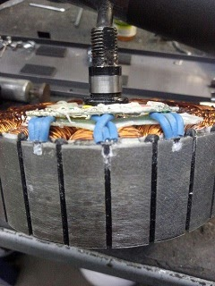]{style="overflow: hidden; display: inline-block; margin: 0.00px 0.00px; border: 0.00px solid #000000; transform: rotate(0.00rad) translateZ(0px); -webkit-transform: rotate(0.00rad) translateZ(0px); width: 240.00px; height: 320.00px;"}

[]{.c2}

[]{#t.bedd91236247fc0ea67182873a2158f66d756ac2}[]{#t.8}
+-----------------------------------+-----------------------------------+
| [Датчики холла по краям]{.c2}     | [Датчики холла по центру]{.c2}    |
+-----------------------------------+-----------------------------------+
| []{style="overflow: hidd | L1YOF.jpg)]{style="overflow: hidd |
| en; display: inline-block; margin | en; display: inline-block; margin |
| : 0.00px 0.00px; border: 0.00px s | : 0.00px 0.00px; border: 0.00px s |
| olid #000000; transform: rotate(0 | olid #000000; transform: rotate(0 |
| .00rad) translateZ(0px); -webkit- | .00rad) translateZ(0px); -webkit- |
| transform: rotate(0.00rad) transl | transform: rotate(0.00rad) transl |
| ateZ(0px); width: 208.00px; heigh | ateZ(0px); width: 170.50px; heigh |
| t: 184.00px;"}                    | t: 185.11px;"}                    |
+-----------------------------------+-----------------------------------+
| []{style="overflow: hidd | cH83C.jpg)]{style="overflow: hidd |
| en; display: inline-block; margin | en; display: inline-block; margin |
| : 0.00px 0.00px; border: 0.00px s | : 0.00px 0.00px; border: 0.00px s |
| olid #000000; transform: rotate(0 | olid #000000; transform: rotate(0 |
| .00rad) translateZ(0px); -webkit- | .00rad) translateZ(0px); -webkit- |
| transform: rotate(0.00rad) transl | transform: rotate(0.00rad) transl |
| ateZ(0px); width: 176.00px; heigh | ateZ(0px); width: 176.00px; heigh |
| t: 184.00px;"}                    | t: 177.00px;"}                    |
+-----------------------------------+-----------------------------------+

[]{.c2}

[]{.c2}

[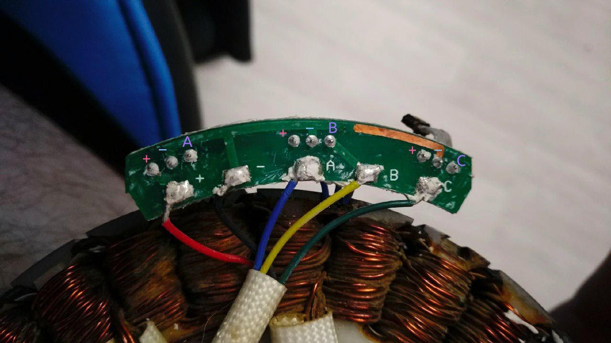]{style="overflow: hidden; display: inline-block; margin: 0.00px 0.00px; border: 0.00px solid #000000; transform: rotate(0.00rad) translateZ(0px); -webkit-transform: rotate(0.00rad) translateZ(0px); width: 700.00px; height: 393.33px;"}[]{style="overflow: hidden; display: inline-block; margin: 0.00px 0.00px; border: 0.00px solid #000000; transform: rotate(0.00rad) translateZ(0px); -webkit-transform: rotate(0.00rad) translateZ(0px); width: 700.00px; height: 393.33px;"}[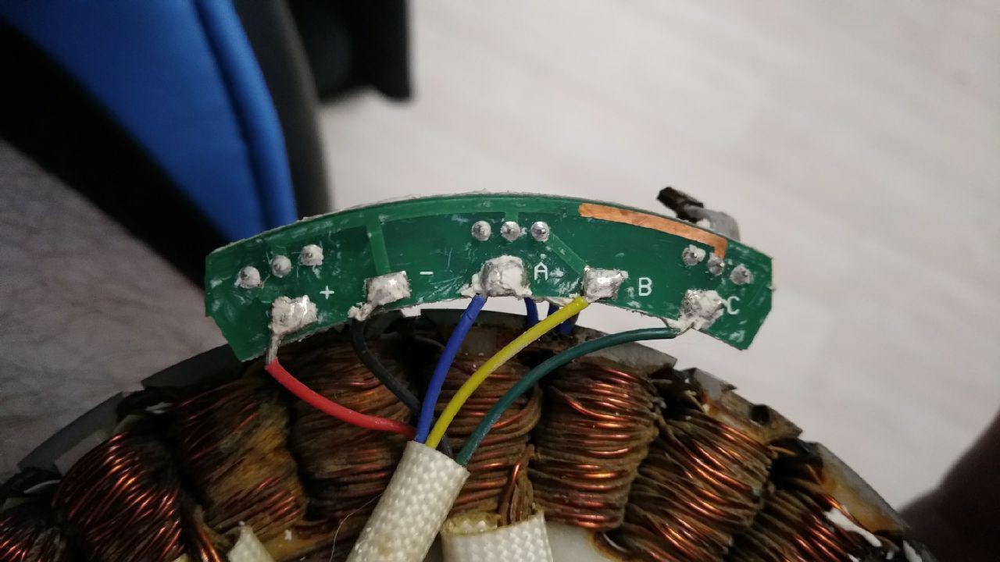]{style="overflow: hidden; display: inline-block; margin: 0.00px 0.00px; border: 0.00px solid #000000; transform: rotate(0.00rad) translateZ(0px); -webkit-transform: rotate(0.00rad) translateZ(0px); width: 700.00px; height: 393.33px;"}

[[Коды ошибок ninebot
Es1/2/4](https://segway-service.ru/error-codes/kody-osibok-ninebot-es124/&sa=D&source=editors&ust=1636795598819000&usg=AOvVaw1C1Q_xR5ecYREXoFFi4TvG){.c11}]{.c7}

[Описание и способ решения: Контроллер внешнего аккумулятора неисправен,
проверьте Панель управления.]{.c72}

[Неисправный элемент: Панель управления, электродвигатель]{.c80}

### [3.3.10 Ошибка 19]{.c18} {#h.l9czeof54gs1 .c39 .c30}

[Источник:
]{}[[Перейти](https://electrotransport.ru/ussr/index.php?topic%3D48865.msg1319394%23msg1319394&sa=D&source=editors&ust=1636795598821000&usg=AOvVaw2DAzuBFVgBsCUo6FbMTqpW){.c11}]{.c7}

[Со слов автора: “Раньше батарея самоката и доп работали параллельно, а
после обновы сперва основная высаживается в ноль, а доп остается
заряженной. После всего этого выдает ошибку 19.”]{.c5}

[]{.c5}

[[https://t.me/NINEBOT\_ES/178675](https://t.me/NINEBOT_ES/178675&sa=D&source=editors&ust=1636795598822000&usg=AOvVaw0xQuARXQq31n1lC09MkOoW){.c11}]{.c7}[ ]{.c5}

[Ошибка 19 это разбег в напряжениях ячеек более чем в 1в (ну или 0.5в, я
точно не помню)]{.c5}

[]{.c5}

[Автоперевод с корейского
(]{.c58}[[источник](https://t.me/NINEBOT_ES/41958&sa=D&source=editors&ust=1636795598823000&usg=AOvVaw21Hrpid5opP4pG8Pn9BgB1){.c11}]{.c7}[):]{.c2}

[Симптомы: Аномальное напряжение батареи]{.c5}

[Решения: Встроенная батарея и соответствующая проводка, проверка платы
управления]{.c5}

[]{.c5}

[[Коды ошибок ninebot
Es1/2/4](https://segway-service.ru/error-codes/kody-osibok-ninebot-es124/&sa=D&source=editors&ust=1636795598824000&usg=AOvVaw3vyDL06kU8E0SlOm70HrJ0){.c11}]{.c7}

[Описание и способ решения: Ошибка напряжения на аккумуляторе, проверьте
Панель управления, соединительные провода.]{.c72}

[Неисправный элемент: Панель управления, аккумулятор]{.c80}

### [3.3.11 Ошибка 20]{.c18} {#h.ezdu4xhb7esu .c39 .c30}

[Автоперевод с корейского
(]{.c58}[[источник](https://t.me/NINEBOT_ES/41958&sa=D&source=editors&ust=1636795598826000&usg=AOvVaw36OANmDexoRIOk-azRvTfE){.c11}]{.c7}[):]{.c2}

[Симптомы: Ошибка внешнего напряжения батареи]{.c5}

[Решения: Внешняя батарея и соответствующая проводка, проверка платы
управления]{.c5}

[]{.c5}

[[Коды ошибок ninebot
Es1/2/4](https://segway-service.ru/error-codes/kody-osibok-ninebot-es124/&sa=D&source=editors&ust=1636795598827000&usg=AOvVaw3baoIsFIF8JPQuRM4nK5QL){.c11}]{.c7}

[Описание и способ решения: Ошибка напряжения на внешнем аккумуляторе,
проверьте Панель управления, соединительные провода.]{.c72}

[Неисправный элемент: Панель управления, аккумулятор]{.c80}

### [3.3.12 Ошибка 21]{.c18} {#h.tj57m1c1q9a7 .c39 .c30}

1.  [С ошибкой 19 поставил на зарядку, теперь ошибка 21
    (]{}[[Источник](https://electrotransport.ru/ussr/index.php?topic%3D48865.msg1319550%23msg1319550&sa=D&source=editors&ust=1636795598828000&usg=AOvVaw2ocj3VNAWlj_wXdb7sO8at){.c11}]{.c7}[)]{.c5}
2.  [У меня такое было. Разобрал оказалось разъем бмски слабо сидит на
    контактах контроллера. Вот и выскочил. Я на капельку клея посадил
    его к плате.
    (]{}[[Источник](https://t.me/NINEBOT_ES/148961&sa=D&source=editors&ust=1636795598829000&usg=AOvVaw0zmSpHWKrJJqnfZ0si2KAZ){.c11}]{.c7}[)]{.c5}
3.  [Из-за скачка напряжения в сети при зарядке (как потом выяснилось)
    «завис» контроллер на бмс. горел синим постоянно. батарея
    заряжалась. но 21 ошибка. в общем, «холодный ресет» помог. снятие
    верхней платы бмс и ее повторная установка на место. после этого
    кнопка «ресет».
    ]{}[[https://t.me/NINEBOT\_ES/178681](https://t.me/NINEBOT_ES/178681&sa=D&source=editors&ust=1636795598829000&usg=AOvVaw0MOdUFKtbNqQeMPBVRi8jH){.c11}]{.c7}
4.  [После обновления до последней версии прошивки ошибка ушла (видимо
    были разные версии прошивок контроллера и бмс батареи, возникших
    после некорректного обновления)]{.c5}

[]{.c5}

[Аналог от m365: 21 – Ошибка обмена данными с BMS
(]{}[[Источник](https://mimod.ru/ru_RU/m365errorcodes/&sa=D&source=editors&ust=1636795598830000&usg=AOvVaw3EJgkcS5zEYq6ABSSqEduj){.c11}]{.c7}[)]{.c5}

[]{.c5}

[Автоперевод с корейского
(]{.c58}[[источник](https://t.me/NINEBOT_ES/41958&sa=D&source=editors&ust=1636795598831000&usg=AOvVaw11BajffpF6sCNHsZmT2X9m){.c11}]{.c7}[):]{.c2}

[Симптомы: Ошибка связи встроенной батареи]{.c5}

[Решения: Встроенная батарея и соответствующая проводка, проверка платы
управления]{.c5}

[]{.c5}

[[Коды ошибок ninebot
Es1/2/4](https://segway-service.ru/error-codes/kody-osibok-ninebot-es124/&sa=D&source=editors&ust=1636795598833000&usg=AOvVaw1Qo6lwxznZ44w5mSuV82fD){.c11}]{.c7}

[Описание и способ решения: Потеря соединения с аккумулятором, проверьте
Панель управления, соединительные провода.]{.c72}

[Неисправный элемент: Аккумулятор]{.c80}

### [3.3.13 Ошибка 22]{.c18} {#h.a45to2c06gsb .c39 .c30}

[Аналог от m365: 22, 23 – Ошибки серийного номера BMS
(]{}[[Источник](https://mimod.ru/ru_RU/m365errorcodes/&sa=D&source=editors&ust=1636795598835000&usg=AOvVaw1tRDi09q3rvp8jpjDLUVBI){.c11}]{.c7}[)]{.c5}

[]{.c2}

[Автоперевод с корейского
(]{.c58}[[источник](https://t.me/NINEBOT_ES/41958&sa=D&source=editors&ust=1636795598835000&usg=AOvVaw1OD6rUCedguYFo5x4gitzG){.c11}]{.c7}[):]{.c2}

[Симптомы: Ошибка встроенной батареи]{.c5}

[Решения: Замена аккумулятора]{.c5}

[Часть: Аккумулятор]{.c5}

[]{.c5}

[[Коды ошибок ninebot
Es1/2/4](https://segway-service.ru/error-codes/kody-osibok-ninebot-es124/&sa=D&source=editors&ust=1636795598837000&usg=AOvVaw0nwanwAWcXC7B9GoTKc49X){.c11}]{.c7}

[Описание и способ решения: Не удается считать код аккумулятора,
замените аккумулятор.]{.c72}

[Неисправный элемент: Аккумулятор]{.c80}

### [3.3.14 Ошибка 23]{.c18} {#h.rgn6rrxv5rv8 .c39 .c30}

[Аналог от m365: 22, 23 – Ошибки серийного номера BMS
(]{}[[Источник](https://mimod.ru/ru_RU/m365errorcodes/&sa=D&source=editors&ust=1636795598838000&usg=AOvVaw0rRvk9nYJk5foaEjjT69wM){.c11}]{.c7}[)]{.c5}

[]{.c5}

[Автоперевод с корейского
(]{.c58}[[источник](https://t.me/NINEBOT_ES/41958&sa=D&source=editors&ust=1636795598839000&usg=AOvVaw3C-kbFU2lM41kA0kpDhVcM){.c11}]{.c7}[):]{.c2}

[Симптомы: Начальный серийный аккумулятор]{.c5}

[Решения: Замена аккумулятора]{.c5}

[Часть: Аккумулятор]{.c5}

[]{.c5}

[[Коды ошибок ninebot
Es1/2/4](https://segway-service.ru/error-codes/kody-osibok-ninebot-es124/&sa=D&source=editors&ust=1636795598840000&usg=AOvVaw3rYpfTV_Nh5UjiFvh7bl_e){.c11}]{.c7}

[Описание и способ решения: Неверный серийный номер аккумулятора,
замените аккумулятор.]{.c72}

[Неисправный элемент: Аккумулятор]{.c80}

### [3.3.15 Ошибка 24]{.c18} {#h.mwke2lgho5nx .c39 .c30}

[Аналог от m365: 24 – Не верное питающее напряжение
(]{}[[Источник](https://mimod.ru/ru_RU/m365errorcodes/&sa=D&source=editors&ust=1636795598842000&usg=AOvVaw0wG48vkk2MoUU9Y3lhxVR_){.c11}]{.c7}[)]{.c5}

[]{.c5}

[Автоперевод с корейского
(]{.c58}[[источник](https://t.me/NINEBOT_ES/41958&sa=D&source=editors&ust=1636795598843000&usg=AOvVaw3_9sQ9AkRgA_dN29-JD320){.c11}]{.c7}[):]{.c2}

[Симптомы: Ошибка системного напряжения]{.c5}

[Решения: Проверка контрольной панели]{.c5}

[Часть: Контрольная панель, внутренняя батарея, внешняя батарея]{.c5}

[]{.c5}

[[Источник](http://4pda.ru/forum/index.php?s%3D%26showtopic%3D839290%26view%3Dfindpost%26p%3D75646016&sa=D&source=editors&ust=1636795598844000&usg=AOvVaw3jEaUfcpgUXaFQo3VhFyf2){.c11}]{.c7}[:
“Я остановился, попытался включить он пискнул 3 раза и вырубился.
Попробовал его катить и включить, начала мигать ошибка 24, потом 16,
потом снова 24. сдал я его по гарантии, сегодня отзвонились, сказали,
что там просто клемма от вибрации разобралась. Вставили клемму обратно и
все заработало.”]{.c5}

[]{.c5}

[[Коды ошибок ninebot
Es1/2/4](https://segway-service.ru/error-codes/kody-osibok-ninebot-es124/&sa=D&source=editors&ust=1636795598845000&usg=AOvVaw0bdS4gnOVe1QHh2BNrS_G5){.c11}]{.c7}

[Описание и способ решения: Не пройден тест напряжения, проверьте Панель
управления.]{.c72}

[Неисправный элемент: Панель управления, аккумулятор, внешний
аккумулятор]{.c80}

### [3.3.16 Ошибка 26]{.c18} {#h.89hui5s5f8d0 .c39 .c30}

[Автоперевод с корейского
(]{.c58}[[источник](https://t.me/NINEBOT_ES/41958&sa=D&source=editors&ust=1636795598847000&usg=AOvVaw2YzpRpujTYzL-2Ns-AhbK9){.c11}]{.c7}[):]{.c2}

[Симптомы: Ошибка хранения]{.c5}

[]{.c5}

[[Коды ошибок ninebot
Es1/2/4](https://segway-service.ru/error-codes/kody-osibok-ninebot-es124/&sa=D&source=editors&ust=1636795598848000&usg=AOvVaw3Md7-qhpei97ENwLKCaLKJ){.c11}]{.c7}

[Описание и способ решения: Ошибка записи во флэш память, проверьте
Панель управления.]{.c72}

[Неисправный элемент: Панель управления]{.c80}

### [3.3.17 Ошибка 27]{.c18} {#h.faxudrlk4lbx .c39 .c30}

[Аналог от m365: 27 – Не верный серийный номер. На практике означает,
что контроллер не был активирован и требуется сервисная процедура,
доступная на фабрике, в сервис-центрах и некоторым дилерам.
(]{}[[Источник](https://mimod.ru/ru_RU/m365errorcodes/&sa=D&source=editors&ust=1636795598849000&usg=AOvVaw3nJcaDy8FckP9HGIk-meYc){.c11}]{.c7}[)]{.c5}

[]{.c5}

[Автоперевод с корейского
(]{.c58}[[источник](https://t.me/NINEBOT_ES/41958&sa=D&source=editors&ust=1636795598850000&usg=AOvVaw26Z3UyGJymc0YVGlCRb_gq){.c11}]{.c7}[):]{.c2}

[Симптомы: Ошибка паролей контрольной панели]{.c5}

[Решения: Проверка контрольной панели]{.c5}

[Часть: Панель управления]{.c5}

[]{.c5}

[[Коды ошибок ninebot
Es1/2/4](https://segway-service.ru/error-codes/kody-osibok-ninebot-es124/&sa=D&source=editors&ust=1636795598851000&usg=AOvVaw2vwXsiOf78glnsd9R4SUNi){.c11}]{.c7}

[Описание и способ решения: Ошибка контроллера, замените Панель
управления.]{.c72}

[Неисправный элемент: Панель управления]{.c80}

### [3.3.18 Ошибка 28]{.c18} {#h.52ggnlb6abnq .c39 .c30}

[Автоперевод с корейского
(]{.c58}[[источник](https://t.me/NINEBOT_ES/41958&sa=D&source=editors&ust=1636795598856000&usg=AOvVaw1iyaWbQEuGLdMDSyM7PDlb){.c11}]{.c7}[):]{.c2}

[Симптомы: Разрыв компонента МОП-привода двигателя]{.c5}

[Решения: Проверка контрольной панели]{.c5}

[Часть: Панель управления]{.c5}

[]{.c5}

[[Коды ошибок ninebot
Es1/2/4](https://segway-service.ru/error-codes/kody-osibok-ninebot-es124/&sa=D&source=editors&ust=1636795598859000&usg=AOvVaw1LT8dDMKjGk57m0umbQ9Eu){.c11}]{.c7}

[Описание и способ решения: Короткое замыкание на верхнем мосту
контроллера электродвигателя.]{.c72}

[Неисправный элемент: Панель управления]{.c80}

### [3.3.19 Ошибка 29]{.c18} {#h.irm895sezcv .c39 .c30}

[Автоперевод с корейского
(]{.c58}[[источник](https://t.me/NINEBOT_ES/41958&sa=D&source=editors&ust=1636795598860000&usg=AOvVaw1dFlo8RF8957jdbOaACEmf){.c11}]{.c7}[):]{.c2}

[Симптомы: Сбой мостового двигателя с механическим приводом]{.c5}

[Решения: Проверка контрольной панели]{.c5}

[Часть: Панель управления]{.c5}

[]{.c5}

[[Коды ошибок ninebot
Es1/2/4](https://segway-service.ru/error-codes/kody-osibok-ninebot-es124/&sa=D&source=editors&ust=1636795598862000&usg=AOvVaw0c0325nvfe8uzTD0n3jGwo){.c11}]{.c7}

[Описание и способ решения: Короткое замыкание на нижнем мосту
контроллера электродвигателя.]{.c72}

[Неисправный элемент: Панель управления]{.c80}

### [3.3.20 Ошибка 31]{.c18} {#h.wsawsyh9frzb .c39 .c30}

[Автоперевод с корейского
(]{.c58}[[источник](https://t.me/NINEBOT_ES/41958&sa=D&source=editors&ust=1636795598863000&usg=AOvVaw1ECVfBbEqwSTZUzOA_rD96){.c11}]{.c7}[):]{.c2}

[Симптомы: Программная ошибка]{.c5}

[Решения: Проверка контрольной панели]{.c5}

[Часть: Панель управления]{.c5}

[]{.c5}

[[Коды ошибок ninebot
Es1/2/4](https://segway-service.ru/error-codes/kody-osibok-ninebot-es124/&sa=D&source=editors&ust=1636795598864000&usg=AOvVaw2OyqT10mvhVZp6NvzaALRI){.c11}]{.c7}

[Описание и способ решения: Ошибка прошивки, проверьте Панель
управления.]{.c72}

[Неисправный элемент: Панель управления]{.c80}

### [3.3.21 Ошибка 35]{.c18} {#h.cusb3mtqvq0g .c39 .c30}

[Серийный номер не верный
(]{}[[источник](https://t.me/NINEBOT_ES/32577&sa=D&source=editors&ust=1636795598866000&usg=AOvVaw2ZCJHWd1HpH-KIcLK9p5aM){.c11}]{.c7}[)]{.c5}

[]{.c5}

[Автоперевод с корейского
(]{.c58}[[источник](https://t.me/NINEBOT_ES/41958&sa=D&source=editors&ust=1636795598867000&usg=AOvVaw2zdKqPsKBemJ1eysDf-J6a){.c11}]{.c7}[):]{.c2}

[Симптомы: Последовательная ошибка контроллера]{.c5}

[Решения: Активировать активацию дистрибьютора]{.c5}

[]{.c5}

[[Коды ошибок ninebot
Es1/2/4](https://segway-service.ru/error-codes/kody-osibok-ninebot-es124/&sa=D&source=editors&ust=1636795598868000&usg=AOvVaw3AeLljW_RuJsLFFSxLy0MB){.c11}]{.c7}

[Описание и способ решения: Ошибка чтения серийного номера, замените
Панель управления.]{.c72}

[Неисправный элемент: Панель управления]{.c80}

### [3.3.22 Ошибка 36]{.c18} {#h.bawmmtblmrr2 .c39 .c30}

[Аналог от m365: 36 – Ошибка датчика температуры батареи или перегрев.
(]{}[[Источник](https://mimod.ru/ru_RU/m365errorcodes/&sa=D&source=editors&ust=1636795598869000&usg=AOvVaw1P7yn129KizjGoUnxdZIHi){.c11}]{.c7}[)]{.c5}

### [3.3.23 Ошибка 38]{.c18} {#h.ksihnd18bxr3 .c39 .c30}

[Battery charging protection error. Please check if the extra battery is
loose or check the error code again before restarting the vehicle.
Ошибка защиты от зарядки аккумулятора. Пожалуйста, проверьте, не
разряжена ли дополнительная батарея, или проверьте код ошибки еще раз
перед перезапуском транспортного средства.]{.c5}

[Выключите самокат. Отсоедините внешнею бату. Подождите несколько часов,
может даже часов 12, и подключите ЗУ не включая самокат с кнопки
(]{}[[Источник](http://4pda.ru/forum/index.php?s%3D%26showtopic%3D839290%26view%3Dfindpost%26p%3D85914080&sa=D&source=editors&ust=1636795598870000&usg=AOvVaw2yHPvQS7K1lWfM3RRYj8Fv){.c11}]{.c7}[)]{.c5}

### [3.3.24 Ошибка 39]{.c18} {#h.4jogyzn50uve .c39 .c30}

[Аналог от m365: 39 – Аналогично ошибке 27, но в случае если контроллер
активировали не правильно.
(]{}[[Источник](https://mimod.ru/ru_RU/m365errorcodes/&sa=D&source=editors&ust=1636795598871000&usg=AOvVaw3EdQFAV5dcwVOb4K10Wa5v){.c11}]{.c7}[)]{.c5}

[]{.c5}

[[Коды ошибок ninebot
Es1/2/4](https://segway-service.ru/error-codes/kody-osibok-ninebot-es124/&sa=D&source=editors&ust=1636795598872000&usg=AOvVaw2JdfcEc5FUKv0DNKyprmJF){.c11}]{.c7}

[Описание и способ решения: Ошибка термодатчика аккумулятора, замените
аккумулятор.]{.c72}

[Неисправный элемент: Аккумулятор]{.c80}

### [3.3.25 Ошибка 40]{.c18} {#h.okb7jaaz5yy3 .c39 .c30}

[Аналог от m365: Ошибка датчика температуры контроллера или перегрев.
(]{}[[Источник](https://mimod.ru/ru_RU/m365errorcodes/&sa=D&source=editors&ust=1636795598873000&usg=AOvVaw22o8xZHwP9_wcBM0oVgrDo){.c11}]{.c7}[)]{.c5}

[]{.c5}

[[Коды ошибок ninebot
Es1/2/4](https://segway-service.ru/error-codes/kody-osibok-ninebot-es124/&sa=D&source=editors&ust=1636795598874000&usg=AOvVaw32WA7Ftf2ypIhPdHZfXqvU){.c11}]{.c7}

[Описание и способ решения: Ошибка температуры панели управления,
проверьте Панель управления.]{.c72}

[Неисправный элемент: Панель управления, аккумулятор]{.c72}

[]{.c72}

### [3.3.26 Ошибка 41]{.c18} {#h.8nhkipbqqkcx .c39 .c30}

[[Коды ошибок ninebot
Es1/2/4](https://segway-service.ru/error-codes/kody-osibok-ninebot-es124/&sa=D&source=editors&ust=1636795598876000&usg=AOvVaw1fJXYnCny_jayWqeWXqEcA){.c11}]{.c7}

[Описание и способ решения: Ошибка температуры внешнего аккумулятора,
замените внешний аккумулятор.]{.c72}

[Неисправный элемент: Внешний аккумулятор]{.c72}

### [3.3.27 Ошибка 42]{.c18} {#h.2hijj5qv4re0 .c39 .c30}

[Источник: ]{}[[Исходник на
корейском](https://docs.google.com/document/d/1vC43gIny226W6dJXI6_fTs4uuSUprYa8bew6wChzEtU/edit&sa=D&source=editors&ust=1636795598877000&usg=AOvVaw0MD-bo-WCRsdqxAgLtY4O3){.c11}]{.c7}[ ]{}[[Автоперевод](https://docs.google.com/document/d/1xwSq0Gc27AyJogYoKZlOmzG30ETNhEnHx9ftSmHyaE0/edit%23&sa=D&source=editors&ust=1636795598877000&usg=AOvVaw3gitdI3CH2RCTYevZxxtm0){.c11}]{.c7}

[Вариант 1:]{.c49}

[Связано с плохим контактом c дополнительной батареей:]{.c5}

1.  [Батарея отходит в связи с раскручиванием планки крепления
    дополнительной батареи.]{.c5}
2.  [Нагар на контактах, либо ]{}[[их
    оплавление](https://t.me/NINEBOT_ES/107959&sa=D&source=editors&ust=1636795598879000&usg=AOvVaw2a0zk7ms7wNwA1fatdhh8y){.c11}]{.c7}[ из-за
    большой нагрузки (езда на
    ]{}[]{style="overflow: hidden; display: inline-block; margin: 0.00px 0.00px; border: 0.00px solid #000000; transform: rotate(0.00rad) translateZ(0px); -webkit-transform: rotate(0.00rad) translateZ(0px); width: 13.00px; height: 13.00px;"}[ режиме)]{.c5}
3.  [При сильном прикручивании нижнего болта внешней батареи может
    отогнуться крепёжная планка. Подробнее на
    ]{}[[видео](https://www.youtube.com/watch?v%3Dm1FCArQ2cpo%26feature%3Dyoutu.be%26t%3D4m13s&sa=D&source=editors&ust=1636795598880000&usg=AOvVaw1yB-y3kDwBy9eDCLiqhOPS){.c11}]{.c7}[.]{.c5}

[Возможные решения: ]{.c5}

1.  [Как следует закрутить болты крепления внешней батареи. Для затяжки
    необходимо снять внешнюю батарею. Под силиконовыми заглушками
    находятся два болта. После снятия батареи будет видна монтажная
    планка. На этой планке находятся три болта крепления к рулю. Их то и
    необходимо подтягивать.]{.c5}
2.  [Снять ]{.c5}
3.  [Очистить контакты.]{.c5}

[]{.c5}

[P.S. Из-за плохого контакта возможна разбалансировка внешней и
внутренней батареи самоката. При необходимости можно отдельно зарядить
отсоединенную внешнюю батарею и батарею в самокате, и после этого
подключать внешнюю батарею.]{.c5}

[]{.c49}

[Вариант 2:]{.c49}

[Обломился контакт в контроллере]{.c5}

[]{.c5}

[]{#t.ee9c4ffb607397e8f22f59c4a413005457ea00d7}[]{#t.9}
+-----------------------------------+-----------------------------------+
| [До v 1.3]{.c5}                   | [v. 1.5]{.c5}                     |
+-----------------------------------+-----------------------------------+
| []{style="overflow: hidd | rn1wd.jpg)]{style="overflow: hidd |
| en; display: inline-block; margin | en; display: inline-block; margin |
| : 0.00px 0.00px; border: 0.00px s | : 0.00px 0.00px; border: 0.00px s |
| olid #000000; transform: rotate(0 | olid #000000; transform: rotate(0 |
| .00rad) translateZ(0px); -webkit- | .00rad) translateZ(0px); -webkit- |
| transform: rotate(0.00rad) transl | transform: rotate(0.00rad) transl |
| ateZ(0px); width: 214.00px; heigh | ateZ(0px); width: 244.00px; heigh |
| t: 155.00px;"}                    | t: 140.00px;"}                    |
+-----------------------------------+-----------------------------------+

[]{.c5}

[]{.c49}

[Вариант 3:]{.c49}

[Отвалился контакт в дополнительной батарее
]{}[[https://t.me/NINEBOT\_ES/171847](https://t.me/NINEBOT_ES/171847&sa=D&source=editors&ust=1636795598886000&usg=AOvVaw2dpknWJMGuQLXtpqxcqhCl){.c11}]{.c7}[ ]{.c5}

[]{.c5}

[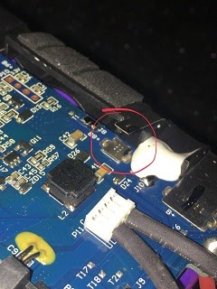]{style="overflow: hidden; display: inline-block; margin: 0.00px 0.00px; border: 0.00px solid #000000; transform: rotate(0.00rad) translateZ(0px); -webkit-transform: rotate(0.00rad) translateZ(0px); width: 240.00px; height: 320.00px;"}[]{style="overflow: hidden; display: inline-block; margin: 0.00px 0.00px; border: 0.00px solid #000000; transform: rotate(0.00rad) translateZ(0px); -webkit-transform: rotate(0.00rad) translateZ(0px); width: 240.00px; height: 320.00px;"}

[]{.c5}

[]{.c5}

[Вариант 4:]{.c50}

[Источник:
]{}[[http://4pda.ru/forum/index.php?showtopic=839290](http://4pda.ru/forum/index.php?showtopic%3D839290&sa=D&source=editors&ust=1636795598888000&usg=AOvVaw3DCpxFxIeoHS4-MIBaB2BH){.c11}]{.c7}[ ]{.c5}

[Сразу после установки батареи самокат дал ошибку 42, которая вскоре
исчезла сама собой, а после пробной поездки, выключения и повторного
включения - ошибку 50. После ее появления я подключил самокат к
приложению, обновил прошивку дополнительной батареи, и всё стало
нормально]{.c5}

[]{.c5}

[После обновления прошивки проблема ушла
]{}[[https://t.me/NINEBOT\_ES/126215](https://t.me/NINEBOT_ES/126215&sa=D&source=editors&ust=1636795598889000&usg=AOvVaw3RKHRkQt4RSi51-dvTjtTS){.c11}]{.c7}

[Вот тут указаны в приложении версии прошивок BMS:]{.c5}

[]{.c5}

[]{style="overflow: hidden; display: inline-block; margin: 0.00px 0.00px; border: 0.00px solid #000000; transform: rotate(0.00rad) translateZ(0px); -webkit-transform: rotate(0.00rad) translateZ(0px); width: 430.00px; height: 427.00px;"}

[]{.c5}

[[Коды ошибок ninebot
Es1/2/4](https://segway-service.ru/error-codes/kody-osibok-ninebot-es124/&sa=D&source=editors&ust=1636795598891000&usg=AOvVaw1wb1fumGiy8zzgYXOmvmVe){.c11}]{.c7}

[Описание и способ решения: Ошибка связи с внешним аккумулятором,
проверьте внешний аккумулятор, Панель управления, соединительный
кабель.]{.c72}

[Неисправный элемент: Панель управления, внешний аккумулятор]{.c72}

[]{.c72}

[Вариант 5: Выгорел UART]{.c49}

[Источник:
]{}[[https://t.me/NINEBOT\_ES/202185](https://t.me/NINEBOT_ES/202185&sa=D&source=editors&ust=1636795598893000&usg=AOvVaw3A3LlNLIA_F_sDPmZPnjfZ){.c11}]{.c7}[ ]{.c5}

[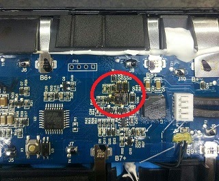]{style="overflow: hidden; display: inline-block; margin: 0.00px 0.00px; border: 0.00px solid #000000; transform: rotate(0.00rad) translateZ(0px); -webkit-transform: rotate(0.00rad) translateZ(0px); width: 320.00px; height: 264.00px;"}

[Вариант 6: Плохой контакт на 4 пиновом контакте]{.c49}

[Источник:
]{}[[https://t.me/NINEBOT\_ES/202951](https://t.me/NINEBOT_ES/202951&sa=D&source=editors&ust=1636795598894000&usg=AOvVaw2uyYYj3c-UKHlr722y0TfY){.c11}]{.c7}

[Дело в четырехконтактном на акб. Когда он не затянут, разбиваются мамы.
Просто сделай их овальными и будет счастье. Только без фанатизма, а то
штырь заломает маму]{.c5}

[]{.c5}

[]{style="overflow: hidden; display: inline-block; margin: 0.00px 0.00px; border: 0.00px solid #000000; transform: rotate(0.00rad) translateZ(0px); -webkit-transform: rotate(0.00rad) translateZ(0px); width: 319.00px; height: 174.00px;"}

[Вариант 7: Заменить транзистор в контроллере]{.c49}

[Источник:
]{}[[https://electrotransport.ru/ussr/index.php?msg=1557977](https://electrotransport.ru/ussr/index.php?msg%3D1557977&sa=D&source=editors&ust=1636795598896000&usg=AOvVaw2VkHjPyrfrGV-fHD2yyJ-2){.c11}]{.c7}[ ]{.c5}

[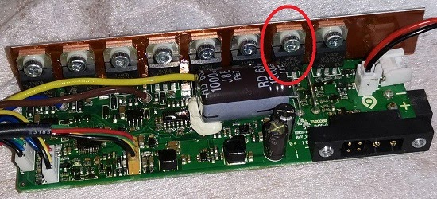]{style="overflow: hidden; display: inline-block; margin: 0.00px 0.00px; border: 0.00px solid #000000; transform: rotate(0.00rad) translateZ(0px); -webkit-transform: rotate(0.00rad) translateZ(0px); width: 550.00px; height: 250.00px;"}

### [3.3.28 Ошибка 43 ]{.c18} {#h.95eaakysk0zv .c39 .c30}

[[Коды ошибок ninebot
Es1/2/4](https://segway-service.ru/error-codes/kody-osibok-ninebot-es124/&sa=D&source=editors&ust=1636795598897000&usg=AOvVaw0tDuNxAiTdohvbU4sHOgzl){.c11}]{.c7}

[Описание и способ решения: Ошибка чтения данных с внешнего
аккумулятора, замените внешний аккумулятор.]{.c72}

[Неисправный элемент: Внешний аккумулятор]{.c80}

### [3.3.29 Ошибка 44 ]{.c18} {#h.4xjddc7z49o .c39 .c30}

[Автоперевод с корейского
(]{.c58}[[источник](https://t.me/NINEBOT_ES/41958&sa=D&source=editors&ust=1636795598898000&usg=AOvVaw05FzF3JJmJP-lOgPhzQR6f){.c11}]{.c7}[):]{.c2}

[Симптомы: Последовательная ошибка аккумулятора]{.c5}

[Решения: Проверка контроллера и аккумулятора]{.c5}

[Часть: Панель управления, аккумулятор]{.c5}

[]{.c5}

[[Коды ошибок ninebot
Es1/2/4](https://segway-service.ru/error-codes/kody-osibok-ninebot-es124/&sa=D&source=editors&ust=1636795598900000&usg=AOvVaw0B4LVs3GJBO4SRuCQmRVF0){.c11}]{.c7}

[Описание и способ решения: Неверный серийный номер внешнего
аккумулятора, замените внешний аккумулятор.]{.c72}

[Неисправный элемент: Внешний аккумулятор]{.c72}

### [3.3.30 Ошибка 45]{.c18} {#h.1ypc8pu93nju .c39 .c30}

[[https://t.me/NINEBOT\_ES/162448](https://t.me/NINEBOT_ES/162448&sa=D&source=editors&ust=1636795598901000&usg=AOvVaw1Z0_2zb5zIcWXWabfrDLYr){.c11}]{.c7}[ ]{}

[Описание: built-in battery is overly discharged and not available to
charge. Please replace battery. ]{.c5}

[Внутренняя батарея слишком разряжена и не может заряжаться. Замените
батарею.]{.c5}

[]{.c5}

[Решение: Ошибка бмс. Нужно вынуть внутренную батарею. Зажать кнопку
перезагрузки на батарее. Если батарея мигает синим, то ошибка снялась.
После этого перепрошить самокат, для удаления ошибки из памяти.]{.c5}

[Если батарея также не работает, значит нужно найти проблемную банку в
батарее и заменить ее на новую, либо поменять плату бмс.]{}

### [3.3.31 Ошибка 46 ]{.c18} {#h.q7t6yuq8e002 .c39 .c30}

[Platon:]{.c5}

[Проблема с контактами внутри внешнего аккумулятора
(]{}[[источник](https://t.me/NINEBOT_ES/114779&sa=D&source=editors&ust=1636795598903000&usg=AOvVaw2YKYOtP02CSk_EW-tUgdxM){.c11}]{.c7}[)]{.c5}

[]{style="overflow: hidden; display: inline-block; margin: 0.00px 0.00px; border: 0.00px solid #000000; transform: rotate(0.00rad) translateZ(0px); -webkit-transform: rotate(0.00rad) translateZ(0px); width: 320.00px; height: 174.00px;"}

### [3.3.32 Ошибка 48]{.c18} {#h.ds91iusok45z .c39 .c30}

[Источник:
]{}[[https://t.me/NINEBOT\_ES/118948](https://t.me/NINEBOT_ES/118948&sa=D&source=editors&ust=1636795598905000&usg=AOvVaw1yfdN0E3Z38kNhLUFUUW9F){.c11}]{.c7}[ ]{}

[]{style="overflow: hidden; display: inline-block; margin: 0.00px 0.00px; border: 0.00px solid #000000; transform: rotate(0.00rad) translateZ(0px); -webkit-transform: rotate(0.00rad) translateZ(0px); width: 328.50px; height: 118.57px;"}

### [3.3.33 Ошибка 49]{.c18} {#h.4zlrruayiz9n .c39 .c30}

[Dmitriy Lugovoy: Дата обновления на батарее не соответствует. Надо
обновить батарею.]{.c5}

[Решение: Обновить прошивки через приложение Ninebot. Как вариант
попробовать обновить прошивки с другого телефона.]{}

[]{style="overflow: hidden; display: inline-block; margin: 0.00px 0.00px; border: 0.00px solid #000000; transform: rotate(0.00rad) translateZ(0px); -webkit-transform: rotate(0.00rad) translateZ(0px); width: 292.27px; height: 133.61px;"}

### [3.3.34 Ошибка 50]{.c18} {#h.t15vdvpbx824 .c39 .c30}

[Ошибка возникает из-за разных версий BMS в самокате и внешней
батарее.]{.c5}

[Решение: Обновить прошивки через приложение Ninebot. Как вариант
попробовать обновить прошивки с другого телефона.]{.c5}

[]{style="overflow: hidden; display: inline-block; margin: 0.00px 0.00px; border: 0.00px solid #000000; transform: rotate(0.00rad) translateZ(0px); -webkit-transform: rotate(0.00rad) translateZ(0px); width: 266.50px; height: 154.81px;"}

### [3.3.35 Ошибка 53]{.c18} {#h.tzswes9sgeb3 .c39 .c30}

[Low discharge (низкий разряд). 3.3 вольта на банку.
(]{}[[источник](https://t.me/NINEBOT_ES/140147&sa=D&source=editors&ust=1636795598908000&usg=AOvVaw3TcpL1ncCwUcGKTHTqu7BE){.c11}]{.c7}[)]{.c5}

[@Weagle95: Оставили на зарядке на сутки, просевшая банка чуть поднялась
и БМС сняло ошибку, после чего зарядилась штатно.  При наличии рук и
источника питания проблема решается подачей напряжения чуть выше батареи
в силовой разъем батареи, но для этого надо разбирать самокат возможно
тоже самое можно сделать через силовой разъем внешней батареи при
включенном самокате, но я не проверял, это должен был быть план Б.]{}

### [3.3.36 Проблемы с подсветкой деки и стоп-сингалы]{.c18} {#h.hlolk397lght .c39 .c30}

[Вариант 1. Плохое соединение контактов]{.c49}

[Возможно решение: ]{}[[поменять местами контакты
(видео)](https://youtu.be/vIPf5ocy9-A&sa=D&source=editors&ust=1636795598910000&usg=AOvVaw3ap8BaHBmY1WIzII4ZD3qQ){.c11}]{.c7}

[]{.c5}

[Вариант 2. Обрыв провода]{.c49}

[Повреждение (в том числе разрыв) черного кабеля идущего в деку.]{.c5}

[]{.c5}

[Вариант 3. Сгорел диод в контроллере (к деке)]{.c49}

[Источник:
]{}[[https://t.me/NINEBOT\_ES/243509](https://t.me/NINEBOT_ES/243509&sa=D&source=editors&ust=1636795598911000&usg=AOvVaw05965U8jCEpewded-raa8y){.c11}]{.c7}[ ]{.c5}

[]{.c5}

[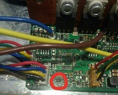]{style="overflow: hidden; display: inline-block; margin: 0.00px 0.00px; border: 0.00px solid #000000; transform: rotate(0.00rad) translateZ(0px); -webkit-transform: rotate(0.00rad) translateZ(0px); width: 240.00px; height: 194.00px;"}

[]{.c49}

[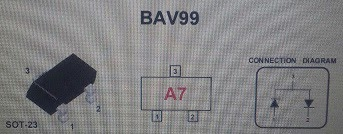]{style="overflow: hidden; display: inline-block; margin: 0.00px 0.00px; border: 0.00px solid #000000; transform: rotate(0.00rad) translateZ(0px); -webkit-transform: rotate(0.00rad) translateZ(0px); width: 343.00px; height: 134.00px;"}

[]{.c49}

[Вариант 4. Сгорел диод в контроллере (стоп-сигналы)]{.c49}

[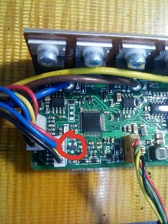]{style="overflow: hidden; display: inline-block; margin: 0.00px 0.00px; border: 0.00px solid #000000; transform: rotate(0.00rad) translateZ(0px); -webkit-transform: rotate(0.00rad) translateZ(0px); width: 240.00px; height: 320.00px;"}[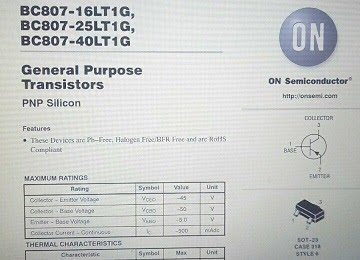]{style="overflow: hidden; display: inline-block; margin: 0.00px 0.00px; border: 0.00px solid #000000; transform: rotate(0.00rad) translateZ(0px); -webkit-transform: rotate(0.00rad) translateZ(0px); width: 360.00px; height: 260.00px;"}

[]{.c49}

[Вариант 5. Коррозия контактов]{.c50}

[Источник:
]{}[[Перейти](https://electrotransport.ru/ussr/index.php?topic%3D48865.msg1244073%23msg1244073&sa=D&source=editors&ust=1636795598914000&usg=AOvVaw2GNq22GiuCmhh5drGnX2pF){.c11}]{.c7}

[Самокат был отправлен в гарантийный ремонт.]{.c5}

[Со слов автора “Они не нашли причину. Сказали, вылавливайте и снимайте
на видео.”]{.c5}

[Корейские друзья пишут о наличии коррозии ]{}[[Исходник на
корейском](https://docs.google.com/document/d/1vC43gIny226W6dJXI6_fTs4uuSUprYa8bew6wChzEtU/edit&sa=D&source=editors&ust=1636795598915000&usg=AOvVaw2sD-nfQnnIefz1ta_RyqC1){.c11}]{.c7}[ ]{}[[Автоперевод](https://docs.google.com/document/d/1xwSq0Gc27AyJogYoKZlOmzG30ETNhEnHx9ftSmHyaE0/edit%23&sa=D&source=editors&ust=1636795598916000&usg=AOvVaw1JIW5jhrWfO27MaFBy3iWt){.c11}]{.c7}

[Возможное решение: ]{}[[гидроизоляция электрики в
деке](#h.lpf0l6ulpkqa){.c11}]{.c7}

[]{.c5}

[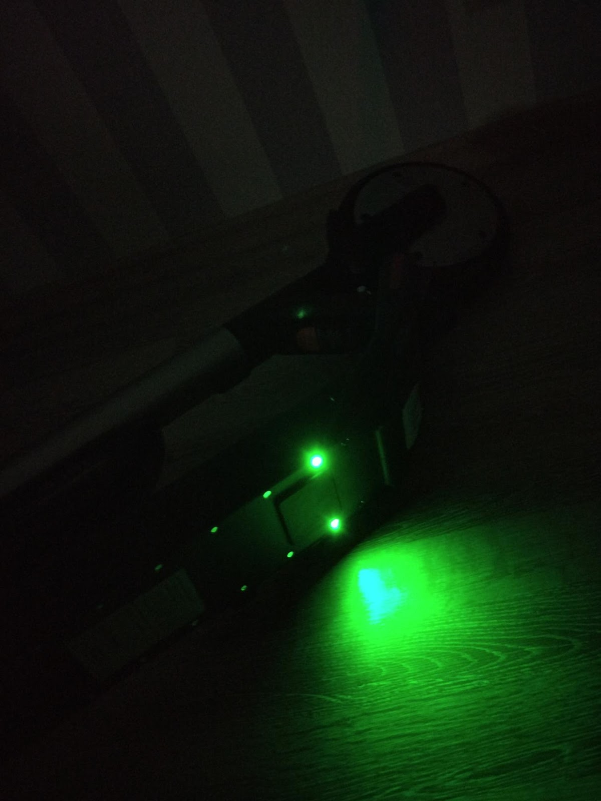]{style="overflow: hidden; display: inline-block; margin: 0.00px 0.00px; border: 0.00px solid #000000; transform: rotate(0.00rad) translateZ(0px); -webkit-transform: rotate(0.00rad) translateZ(0px); width: 174.50px; height: 232.67px;"}

### [3.3.37 Короткое замыкание от отвалившегося болтика в дополнительной батарее]{.c18} {#h.pluceng1ajlb .c39 .c30}

[Источник: ]{.c5}

[[Перейти](https://electrotransport.ru/ussr/index.php?topic%3D48865.msg1299868%23msg1299868&sa=D&source=editors&ust=1636795598918000&usg=AOvVaw0koIY53o70EV9HtoJHBhAV){.c11}]{.c7}

[[Перейти](https://t.me/Ninebot_ES/3155&sa=D&source=editors&ust=1636795598918000&usg=AOvVaw2b8mJFpX2lFMmjaoh48rya){.c11}]{.c7}[ ]{.c5}

[]{.c5}

[См. ]{}[[Видео по разборке дополнительной
батареи](https://youtu.be/Ew4S4TxW5WI&sa=D&source=editors&ust=1636795598919000&usg=AOvVaw17MafhrkVUKcB4VatntTCZ){.c11}]{.c7}[.]{.c5}

[]{.c5}

[Дополнительно:]{.c5}

[Видео по порядку разборки дополнительной батареи (без звука):
]{}[[Перейти](https://t.me/Ninebot_ES/7275&sa=D&source=editors&ust=1636795598920000&usg=AOvVaw3WXgBml5uPgWzLUYbkhCnc){.c11}]{.c7}

[На этом видео можно посмотреть как слабо закручены болты в батарее:
]{}[[Перейти](https://t.me/Ninebot_ES/7222&sa=D&source=editors&ust=1636795598921000&usg=AOvVaw09d3Xf-RABKOsKlVlwZqS9){.c11}]{.c7}

[Порядок разборки батареи:]{.c5}

[]{style="overflow: hidden; display: inline-block; margin: 0.00px 0.00px; border: 0.00px solid #000000; transform: rotate(0.00rad) translateZ(0px); -webkit-transform: rotate(0.00rad) translateZ(0px); width: 320.00px; height: 180.00px;"}

[]{.c5}

[!! ВАЖНО !!! При обнаружении неисправности по возможности прекратить
движение с дополнительной батареей и отвезти самокат в гарантийный
сервис, чтобы исключить возможность поломки батареи или возгорания из-за
возникновения короткого замыкания.]{.c36}

[]{style="overflow: hidden; display: inline-block; margin: 0.00px 0.00px; border: 0.00px solid #000000; transform: rotate(0.00rad) translateZ(0px); -webkit-transform: rotate(0.00rad) translateZ(0px); width: 254.98px; height: 143.50px;"}[]{style="overflow: hidden; display: inline-block; margin: 0.00px 0.00px; border: 0.00px solid #000000; transform: rotate(0.00rad) translateZ(0px); -webkit-transform: rotate(0.00rad) translateZ(0px); width: 254.98px; height: 143.50px;"}[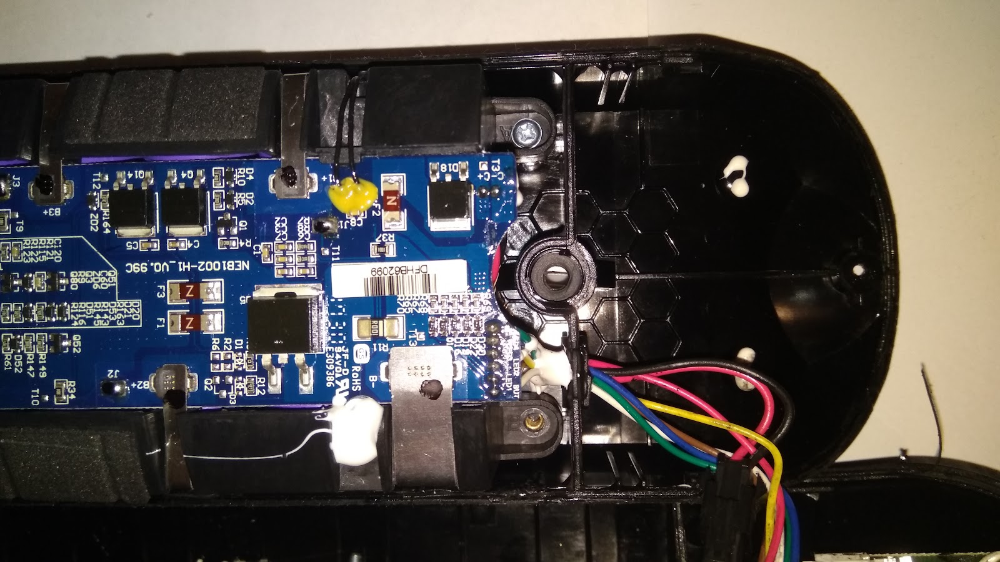]{style="overflow: hidden; display: inline-block; margin: 0.00px 0.00px; border: 0.00px solid #000000; transform: rotate(0.00rad) translateZ(0px); -webkit-transform: rotate(0.00rad) translateZ(0px); width: 256.50px; height: 144.35px;"}[]{style="overflow: hidden; display: inline-block; margin: 0.00px 0.00px; border: 0.00px solid #000000; transform: rotate(0.00rad) translateZ(0px); -webkit-transform: rotate(0.00rad) translateZ(0px); width: 254.98px; height: 143.50px;"}

### [3.3.38 Мигают стоп сигналы, самокат не включается]{.c18} {#h.fct4bjev1zeo .c39 .c30}

[Источник (видео):
]{}[[Перейти](https://t.me/KickscooterNinebot/25599&sa=D&source=editors&ust=1636795598924000&usg=AOvVaw0nSAJWXzDnv43ARSlY1gHK){.c11}]{.c7}[ ]{.c5}

[Решение: Плохой контакт 4-х контактного кабеля блока управления в узле
соединения верхней части руля с нижней (в
]{}[[сообщении](https://t.me/KickscooterNinebot/25679&sa=D&source=editors&ust=1636795598924000&usg=AOvVaw3SMqLbluLdCl8YAR3skKU8){.c11}]{.c7}[ коннектор
juliet)]{.c5}

[]{.c5}

[]{style="overflow: hidden; display: inline-block; margin: 0.00px 0.00px; border: 0.00px solid #000000; transform: rotate(0.00rad) translateZ(0px); -webkit-transform: rotate(0.00rad) translateZ(0px); width: 187.00px; height: 210.00px;"}

### []{.c18} {#h.j1f41jj842la .c39 .c30 .c101}

### [3.3.39 Автоматическое отключение самоката  ]{.c18} {#h.kbwv0kbu00ra .c39 .c30}

[Источник: ]{}[[Исходник на
корейском](https://docs.google.com/document/d/1vC43gIny226W6dJXI6_fTs4uuSUprYa8bew6wChzEtU/edit&sa=D&source=editors&ust=1636795598926000&usg=AOvVaw2OmEGzy5oKcUtyqkaYSX3s){.c11}]{.c7}[ ]{}[[Автоперевод](https://docs.google.com/document/d/1xwSq0Gc27AyJogYoKZlOmzG30ETNhEnHx9ftSmHyaE0/edit%23&sa=D&source=editors&ust=1636795598927000&usg=AOvVaw0awzm-adc5tCUk6AAZn1dj){.c11}]{.c7}

[При резком торможении из батареи подаётся на мотор колесо большой ток.
Что бы сохранить предохранители предусмотрено отключение
электропитания.]{.c5}

[Решение: исключить резкое торможение мотором.]{.c5}

### [3.3.40 Упала максимальная скорость]{.c18} {#h.yd3nqd25v4rf .c39 .c30}

[Вариант 1. Падает скорость и моргают задние габариты, при включенной
фаре тускнеет экран. Максимальная скорость падает только при включенной
фаре.]{.c26}

[]{.c5}

[Источник (видео):
]{}[[Перейти](https://t.me/Ninebot_ES/5629&sa=D&source=editors&ust=1636795598929000&usg=AOvVaw3T6lyq-pKMiVYubLjZbBk0){.c11}]{.c7}[ ]{.c5}

[]{.c5}

[Описание проблемы:]{.c58 .c50}[ Голова в штатном режиме потребляет по 5
вольтам - это очень мало, порядка 150ма. Плюс почти все в голове
работает от 3.3 вольта, так что там все хорошо... Фиюз стоит
неправильный, должен стоять во-первых на больший ток во-вторых с другой
характеристикой, нужно ставить 0603 0 ом. Стоковый он как было правильно
замечено еще и деградирует. Когда я его снял, его сопротивление было
порядка 2ом вместо положенных 0.1 и меньше, соответственно на простой
работе головы на нем падало 0.3 вольта. Это не страшно...пока не
включается фара. Она жрет 3 ватта, а это еще 0.6 ампера по 5 вольтам!
Следовательно на фьюзе начинает падать уже 1.2 вольта + 0.3 вольта от
головы. Он греется и его сопротивление растет. Отсюда попадаем в режим,
когда на стабилизатор 3.3 приходит слишком мало для его нормальной
работы, тускнеет экран. А со скоростью вообще сказка: В ручках стоят
датчики холла, для их нормальной линейной работы нужно питание от 4.2 до
6 вольт, если ниже, они начинают давать неправильный коэффициент на
выходе.]{.c5}

[]{.c5}

[ВНИМАНИЕ!!!! ]{.c90 .c50}[Перед тем как работать с контроллером
необходимо разрядить конденсаторы, иначе можно получить взрыв. см.
видео:]{.c82}

[[как разрядить конденсатор с помощью 15 w
лампочки](https://youtu.be/SWdsPrkmESo&sa=D&source=editors&ust=1636795598930000&usg=AOvVaw3VLaSkIBdXpgVOBvxSSdjI){.c11}]{.c7}

[[осторожно! заряженный
конденсатор.](https://youtu.be/UgN0qkmHVc4&sa=D&source=editors&ust=1636795598931000&usg=AOvVaw0-2q9BOd8p_nSyqvSmcyix){.c11}]{.c7}

[]{.c5}

[Решение 1: Замена предохранителя]{.c49}

[Один фиюз (fuse с англ. = предохранитель) поменять на резистор нулевку
(]{}[[источник](https://t.me/NINEBOT_ES/38237&sa=D&source=editors&ust=1636795598932000&usg=AOvVaw0eSPnPPiMCakPDUzbF1xM9){.c11}]{.c7}[)
]{.c5}

[Ради успокоения совести поставьте типоразмер 0603, там по мощности
достаточно, а если что, как предохранитель сработает.
 ]{}[[https://www.chipdip.ru/product0/9000070541](https://www.chipdip.ru/product0/9000070541&sa=D&source=editors&ust=1636795598932000&usg=AOvVaw1FYgofmYfHIxoBepzEkjAC){.c11}]{.c7}[ ]{.c5}

[]{.c5}

[Видео по снятию контроллера]{.c5}

[[Часть
1](https://t.me/NINEBOT_ES/40317&sa=D&source=editors&ust=1636795598933000&usg=AOvVaw1fVSQ5aioL9rV4lRH4tGGZ){.c11}]{.c7}[ ]{.c5}

[[Часть
2](https://t.me/NINEBOT_ES/40318&sa=D&source=editors&ust=1636795598934000&usg=AOvVaw1AGlPMwQCtlx1xwVoY2Tj-){.c11}]{.c7}

[]{.c5}

[Видео Разборка/сборка и пайка контроллера ninebot ES2:
]{}[[https://youtu.be/m1FCArQ2cpo](https://youtu.be/m1FCArQ2cpo&sa=D&source=editors&ust=1636795598935000&usg=AOvVaw3RGLkn0VHXqxNpXNypa9X7){.c11}]{.c7}[ ]{.c5}

[]{.c5}

[]{style="overflow: hidden; display: inline-block; margin: 0.00px 0.00px; border: 0.00px solid #000000; transform: rotate(0.00rad) translateZ(0px); -webkit-transform: rotate(0.00rad) translateZ(0px); width: 180.00px; height: 320.00px;"}[]{style="overflow: hidden; display: inline-block; margin: 0.00px 0.00px; border: 0.00px solid #000000; transform: rotate(0.00rad) translateZ(0px); -webkit-transform: rotate(0.00rad) translateZ(0px); width: 180.00px; height: 320.00px;"}[]{style="overflow: hidden; display: inline-block; margin: 0.00px 0.00px; border: 0.00px solid #000000; transform: rotate(0.00rad) translateZ(0px); -webkit-transform: rotate(0.00rad) translateZ(0px); width: 180.00px; height: 320.00px;"}

[]{.c5}

[Решение 2: Замена контроллера]{.c50}[. По сообщению ламобайл после
замены контроллера повторно с проблемой не обращаются. При покупке
]{}[[нового
контроллера](https://opt.lamobile.ru/product/materinskaya-plata-14-02-0017-00&sa=D&source=editors&ust=1636795598936000&usg=AOvVaw2gEePXnYUi_743OSMHapqT){.c11}]{.c7}[ (не
по гарантии) необходимо у продавца запросить и установить новый серийный
номер. см. ]{}[[Как поменять серийный номер через приложение
Ninebot?](#h.9f4h0h6cwxw2){.c11}]{.c7}

[]{.c5}

[Решение 3: Ездить с выключенной фарой.]{.c49}

[]{.c5}

[Вариант 2. Максимальная скорость на красном режиме стала не больше
19-20 км/ч]{.c26}

[Источник:
]{}[[Перейти](https://t.me/NINEBOT_ES/32889&sa=D&source=editors&ust=1636795598938000&usg=AOvVaw2km3d633R3SMNxNCOKh19L){.c11}]{.c7}

[Решение: Выяснилось, что у автора сообщения самокат был сдан в ремонт и
был заменён контроллер. Предположили, что контроллер был установлен от
ES1, т.к. в приложении отсутствует кнопка управления подсветкой в деке,
а так же в приложении изображение ES1 (нет разреза в месте заднего
амортизатора). К тому же согласно инструкции максимальная скорость ЕS1
составляет 20 км/ч. Необходимо в контроллере прописать серийный номер от
ES2. см. ]{}[[Как поменять серийный номер через приложение
Ninebot?](#h.9f4h0h6cwxw2){.c11}]{.c7}

[]{style="overflow: hidden; display: inline-block; margin: 0.00px 0.00px; border: 0.00px solid #000000; transform: rotate(0.00rad) translateZ(0px); -webkit-transform: rotate(0.00rad) translateZ(0px); width: 180.00px; height: 320.00px;"}

[Вариант 3. Максимальная скорость упала после обновления прошивки]{.c26}

[Источник:
]{}[[Перейти](https://electrotransport.ru/ussr/index.php?topic%3D48865.msg1328971%23msg1328971&sa=D&source=editors&ust=1636795598939000&usg=AOvVaw1XbjvHWl0KBytQkq67Zqsu){.c11}]{.c7}

[Решение: Нужно попереключать режимы
(]{}[[источник](https://electrotransport.ru/ussr/index.php?topic%3D48865.msg1329012%23msg1329012&sa=D&source=editors&ust=1636795598939000&usg=AOvVaw1ulumAAG4kDPWcmfGs21ws){.c11}]{.c7}[)]{.c5}

[]{.c5}

[Вариант 4. Отклеился и сместился магнит в курке газа относительно
датчика холла]{.c26}

[Источник:
]{}[[Перейти](https://t.me/NINEBOT_ES/32881&sa=D&source=editors&ust=1636795598940000&usg=AOvVaw2-ASJ5ILS53rxgb2U6G7RN){.c11}]{.c7}

[Решение: После разборки курка и проклейки магнитов проблема исчезла.
Cместился магнит относительно датчика холла.]{.c5}

[]{.c5}

[Вариант 5. Максимальная скорость уменьшилась совместно с появлением
ошибки 42]{.c26}

[Решение: Аналогично решению ]{}[[по ошибке
42](#h.2hijj5qv4re0){.c11}]{.c7}[ - подкрутить крепление дополнительной
батареи к рулю.]{.c5}

[]{.c5}

[Вариант 6. Рассинхронизация заряда внутренней и внешней батарей]{.c26}

[Источник:
]{}[[https://t.me/NINEBOT\_ES/199448](https://t.me/NINEBOT_ES/199448&sa=D&source=editors&ust=1636795598942000&usg=AOvVaw1hTxcoe2l3QKQSxIpr-Wqe){.c11}]{.c7}[ ]{.c5}

[Ко мне на ремонт приезжал клиент, у него при разном заряде (более 20%)
самокат не ехал быстрее 20-22 кмч, причем он тоже купил акб, и до конца
не зарядил, поставили на зарядку, он дошел на 2-х акб где то до 75% и
поехал как надо, больше не обращался.]{.c5}

[]{.c5}

[Вариант 7. На экране зависли показания текущей скорости.]{.c26}

[Более подробно описано в разделе ]{}[[Зависли показания текущей
скорости](#h.z49akyouzmzt){.c11}]{.c7}

[Решение: выключить и включить самокат.]{.c5}

[]{.c5}

[Вариант 8. Прочее]{.c26}

[Скорость снижается зимой при низких температурах из-за снижения
температуры батареи]{.c5}

### [3.3.41 Плохое соединение разъема питания во внешней батарее с штекером]{.c18} {#h.2hq2yoiwovyi .c39 .c30}

[Источник:
]{}[[Перейти](https://t.me/Ninebot_ES/11982&sa=D&source=editors&ust=1636795598945000&usg=AOvVaw2Qn-yKq_pJrxu88S7gQqLX){.c11}]{.c7}

### [3.3.42 Не горят светодиоды в дополнительной батарее]{.c18} {#h.go8nxkqo4lw7 .c39 .c30}

[Источник:
]{}[[Перейти](https://t.me/Ninebot_ES/13836&sa=D&source=editors&ust=1636795598946000&usg=AOvVaw37gveudo-WARp6BZBLz86Y){.c11}]{.c7}

[Решения: ]{.c5}

1.  [Светодиоды в дополнительной батарее работают только при включенной
    фаре. ]{.c5}
2.  [Плохое соединение дополнительной батареи к рулю (см.
    ]{}[[источник](https://t.me/Ninebot_ES/13888&sa=D&source=editors&ust=1636795598947000&usg=AOvVaw0oB_37Or8jEclrUn3EjT88){.c11}]{.c7}[)]{.c5}

### [3.3.43 Cамокат показывает красный ключ]{.c18} {#h.g11k9w7njo83 .c39 .c30}

[Вариант 1:]{.c49}

[Источник:
]{}[[Перейти](https://t.me/Ninebot_ES/14859&sa=D&source=editors&ust=1636795598948000&usg=AOvVaw1A2bCg7OoMqAkPNN97V3Mb){.c11}]{.c7}

[Значок появился на активированном самокате во время движения при
переключении режимов.]{.c5}

[]{.c5}

[Вариант 2:]{.c49}

[Ключ появился на спуске. Ушла после рестарта самоката
(]{}[[источник](https://t.me/NINEBOT_ES/45222&sa=D&source=editors&ust=1636795598949000&usg=AOvVaw0dbwYSHtCT7Mis1Sd9_vT3){.c11}]{.c7}[)]{.c5}

[]{.c5}

[Вариант 3:]{.c49}

[Ключ выскакивал на ходу с сторонним приложением
(]{}[[источник](https://t.me/NINEBOT_ES/44533&sa=D&source=editors&ust=1636795598950000&usg=AOvVaw0KTBaydcuDNiIxsAM-MR4G){.c11}]{.c7}[)]{.c5}

### [3.3.44 Самокат не заряжается]{.c18} {#h.fuo2vl732107 .c39 .c30}

[Вариант 1]{.c49}

[Источник:
]{}[[Перейти](https://t.me/Ninebot_ES/14001&sa=D&source=editors&ust=1636795598951000&usg=AOvVaw22MvawrLiX8hGvG-2ZoDUz){.c11}]{.c7}

[Проблема в плохом контакте штекера зарядного устройства и внешней
батареей / рулём. ]{.c5}

[]{.c5}

[Вариант 2]{.c49}

[[Перегрев самоката](#h.77ynhqai73qi){.c11}]{.c7}[. Необходимо подождать
когда температура батареи станет меньше 40⁰С]{.c5}

### [3.3.45 Перегрев самоката]{.c18} {#h.77ynhqai73qi .c77 .c30}

[Источник:
]{}[[Перейти](http://4pda.ru/forum/index.php?s%3D%26showtopic%3D839290%26view%3Dfindpost%26p%3D72684406&sa=D&source=editors&ust=1636795598953000&usg=AOvVaw1pbOKmUi3I-C80K16JOpp9){.c11}]{.c7}

[]{.c5}

[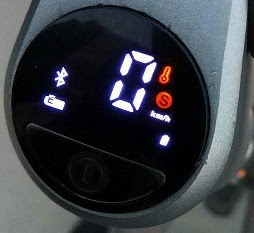]{style="overflow: hidden; display: inline-block; margin: 0.00px 0.00px; border: 0.00px solid #000000; transform: rotate(0.00rad) translateZ(0px); -webkit-transform: rotate(0.00rad) translateZ(0px); width: 254.00px; height: 233.00px;"}

[Значок перегрева возникает при достижении температуры 40 градусов
батареей, либо контроллером. На мотор колесе датчик температуры
отсутствует. Перегрев возникает как правило при высокой нагрузке (езда
на
]{}[]{style="overflow: hidden; display: inline-block; margin: 0.00px 0.00px; border: 0.00px solid #000000; transform: rotate(0.00rad) translateZ(0px); -webkit-transform: rotate(0.00rad) translateZ(0px); width: 13.00px; height: 13.00px;"}[ режиме,
подъем в горку, большой вес ездока) на самокатах ES1 и ES2 (т.е. без доп
батареи). При перегреве батарея не заряжается.]{.c5}

[]{.c5}

[Решение проблемы: Установка дополнительной батареи (нагрузка при езде в
этом случае распределяется равномерно между двумя батареями). Помощь
самокату ногой при подъеме в гору. ]{.c5}

### [3.3.46 Трещит мотор колесо]{} {#h.dlfo2k5yaakq .c77 .c30}

[Вариант 1. Закоротило фазу, расплавились коннекторы]{.c49}

[]{.c49}

[Варианты соединений см. ]{}[[3.3.49 Плавятся коннекторы кабеля на мотор
колесо](#h.xlm5rlizcyfv){.c11}]{.c7}

[]{style="overflow: hidden; display: inline-block; margin: 0.00px 0.00px; border: 0.00px solid #000000; transform: rotate(0.00rad) translateZ(0px); -webkit-transform: rotate(0.00rad) translateZ(0px); width: 320.00px; height: 313.00px;"}

[]{.c49}

[Вариант 2. Проблемы с датчиком холла на мотор колесе]{.c49}

[]{.c49}

[В мотор колесо подходят датчики холла SS41F (на ]{}[[Митинском
радиорынке](https://s-10mitino.ru/s-10/prais.htm&sa=D&source=editors&ust=1636795598958000&usg=AOvVaw1T_vpGA7st8DdjfvELR7bB){.c11}]{.c7}[ 40
руб. за шт.)]{.c5}

[Два SS41F, а третий (по центру) какой-то SS41 с инверсным
выходом.]{.c5}

[]{.c5}

[]{.c5}

[]{style="overflow: hidden; display: inline-block; margin: 0.00px 0.00px; border: 0.00px solid #000000; transform: rotate(0.00rad) translateZ(0px); -webkit-transform: rotate(0.00rad) translateZ(0px); width: 320.00px; height: 180.00px;"}

[]{.c5}

[]{.c49}

[Вариант 3. В мотор колесе отвалился магнит]{.c49}

[]{.c49}

[Вариант 4. Отошёл контакт в месте подключения датчиков Холла к
контроллеру]{.c49}

[]{.c5}

[См. видео:
]{}[[https://youtu.be/p6jV3tg1mFE](https://youtu.be/p6jV3tg1mFE&sa=D&source=editors&ust=1636795598961000&usg=AOvVaw03x95RLyuig0qDmolHHyC_){.c11}]{.c7}[ ]{.c5}

[]{style="overflow: hidden; display: inline-block; margin: 0.00px 0.00px; border: 0.00px solid #000000; transform: rotate(0.00rad) translateZ(0px); -webkit-transform: rotate(0.00rad) translateZ(0px); width: 225.00px; height: 173.00px;"}

[]{.c5}

[Вариант 5. Требуется заменить транзистор (мосфет).]{.c49}

[]{.c49}

[Установленный на заводе: ]{.c5}

[ncep85t14 ]{.c90
.c50}[(]{}[[источник](http://4pda.ru/forum/index.php?s%3D%26showtopic%3D839290%26view%3Dfindpost%26p%3D84776103&sa=D&source=editors&ust=1636795598963000&usg=AOvVaw32-Pd4O_Z6wVLKEhy8FloY){.c11}]{.c7}[)]{.c5}

[]{.c5}

[Аналоги:
]{}[[https://t.me/NINEBOT\_ES/204814](https://t.me/NINEBOT_ES/204814&sa=D&source=editors&ust=1636795598964000&usg=AOvVaw30XxNogatrH_HOG_GoqAdI){.c11}]{.c7}

[самое быстрое - irfb4110pbf]{.c5}

[IRLB4030]{.c5}

[IPP030N10N5]{.c5}

[NCEP85T25]{.c5}

[NCEP01T18]{.c5}

[NCE01H16]{.c5}

[stp240n10f7]{.c5}

[]{.c5}

[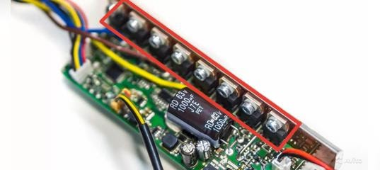]{style="overflow: hidden; display: inline-block; margin: 0.00px 0.00px; border: 0.00px solid #000000; transform: rotate(0.00rad) translateZ(0px); -webkit-transform: rotate(0.00rad) translateZ(0px); width: 537.00px; height: 240.00px;"}

[]{.c5}

[Вариант 6. Обрыв фазового провода.]{.c49}

[Источник:
]{}[[https://t.me/NINEBOT\_ES/202748](https://t.me/NINEBOT_ES/202748&sa=D&source=editors&ust=1636795598967000&usg=AOvVaw2fSfvsXzmG9W1yjk14Mmgy){.c11}]{.c7}[ ]{.c5}

[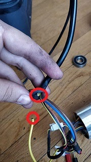]{style="overflow: hidden; display: inline-block; margin: 0.00px 0.00px; border: 0.00px solid #000000; transform: rotate(0.00rad) translateZ(0px); -webkit-transform: rotate(0.00rad) translateZ(0px); width: 180.00px; height: 320.00px;"}

### [3.3.47 Двойной писк при торможении]{.c18} {#h.vtaanh5ttvu3 .c77 .c30}

[Источник:
]{}[[Перейти](https://electrotransport.ru/ussr/index.php?topic%3D48865.msg1333900%23msg1333900&sa=D&source=editors&ust=1636795598968000&usg=AOvVaw3_UeT9FfgcZBKZlEGPE1-U){.c11}]{.c7}

[Связано с защитой самоката. Писк появляется как правило при полном
заряде батарей. При торможении мотор колесом работает рекуперация и
большой ток идёт батареи. Что бы защитить батареи от перезаряда
контроллер подаёт сигнал. Так же самокат может самопроизвольно
выключиться. Следует осторожно спускаться с горок на полностью
заряженном самокате.]{.c5}

### [3.3.48 Дополнительная батарея моргает всеми четырьмя диодами]{.c18} {#h.f1sso2e7drs9 .c77 .c30}

[Вариант 1. Моргают из-за плохого контакта 4 пинов ]{.c49}

[Источник:
]{}[[https://t.me/NINEBOT\_ES/202951](https://t.me/NINEBOT_ES/202951&sa=D&source=editors&ust=1636795598970000&usg=AOvVaw1TwRRwT8psm6YD4ycwCI0e){.c11}]{.c7}

[Дело в четырехконтактном на акб. Когда он не затянут, разбиваются мамы.
Просто сделай их овальными и будет счастье. Только без фанатизма, а то
штырь заломает маму]{.c5}

[]{.c5}

[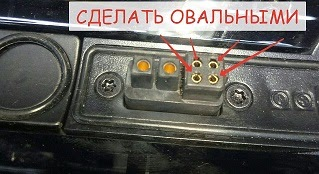]{style="overflow: hidden; display: inline-block; margin: 0.00px 0.00px; border: 0.00px solid #000000; transform: rotate(0.00rad) translateZ(0px); -webkit-transform: rotate(0.00rad) translateZ(0px); width: 319.00px; height: 174.00px;"}

[]{.c5}

[Очистить контакты от нагара очистителем контактов.]{.c5}

[]{.c5}

[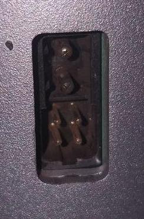]{style="overflow: hidden; display: inline-block; margin: 0.00px 0.00px; border: 0.00px solid #000000; transform: rotate(0.00rad) translateZ(0px); -webkit-transform: rotate(0.00rad) translateZ(0px); width: 133.50px; height: 203.53px;"}

[]{.c5}

[Вариант 2. Болт раскрутился и закоротил. ]{.c50}[Актуально для батарей
выпущенных до лета 2018 г.]{.c36}

[Источник:
]{}[[Перейти](https://t.me/Ninebot_ES/20057&sa=D&source=editors&ust=1636795598973000&usg=AOvVaw3_LbUV1lT_8os5_fAmXC4T){.c11}]{.c7}

[Решение: “Болт открутился погремел и закоротил контакты на плате. В
сервис”
(]{}[[источник](https://t.me/Ninebot_ES/20059&sa=D&source=editors&ust=1636795598973000&usg=AOvVaw1dsLHT_OZjkfQlKDuqZ35j){.c11}]{.c7}[)]{.c5}

[Проблема наблюдалась \~ до середины лета 2018 года. В новых партиях
завод решил проблему заливкой раскручивающихся болтов компаундом.]{.c5}

[]{.c5}

[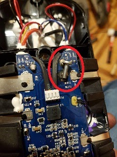]{style="overflow: hidden; display: inline-block; margin: 0.00px 0.00px; border: 0.00px solid #000000; transform: rotate(0.00rad) translateZ(0px); -webkit-transform: rotate(0.00rad) translateZ(0px); width: 240.00px; height: 320.00px;"}

### []{.c18} {#h.6j57gy7lxgf2 .c77 .c30 .c101}

### [3.3.49 Плавятся коннекторы кабеля на мотор колесо]{.c18} {#h.xlm5rlizcyfv .c30 .c77}

[Из-за плохого контакта соединений плавятся коннекторы.]{.c5}

[Для предотвращения проблемы необходимо разжать контакты для более
плотного соединения.]{.c5}

[]{.c5}

[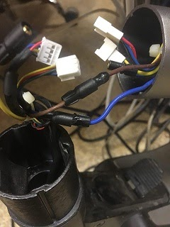]{style="overflow: hidden; display: inline-block; margin: 0.00px 0.00px; border: 0.00px solid #000000; transform: rotate(0.00rad) translateZ(0px); -webkit-transform: rotate(0.00rad) translateZ(0px); width: 240.00px; height: 320.00px;"}

[]{.c5}

[ВАРИАНТЫ СОЕДИНЕНИЙ:]{.c5}

[]{.c5}

[]{#t.15c74d542a9ee07cb1d58b125f4cb9ac5ccfd24f}[]{#t.10}
+-----------------------------------+-----------------------------------+
| [Разъем MT60                      | [WAGO 221-612 ]{.c5}              |
| (]{}[[источник](https://t.me/NINE |                                   |
| BOT_ES/42393&sa=D&source=editors& | [{.c11}]{.c7} | uf9k1.png)]{style="overflow: hidd |
| [)                                | en; display: inline-block; margin |
| Пример установки:                 | : 0.00px 0.00px; border: 0.00px s |
| ]{}[[https://t.me/NINEBOT\_ES/959 | olid #000000; transform: rotate(0 |
| 38](https://t.me/NINEBOT_ES/95938 | .00rad) translateZ(0px); -webkit- |
| &sa=D&source=editors&ust=16367955 | transform: rotate(0.00rad) transl |
| 98978000&usg=AOvVaw1bGpkhRTfcP12o | ateZ(0px); width: 119.50px; heigh |
| 32oU2XFX){.c11}]{.c7}[ ]{.c5}     | t: 119.50px;"}                    |
|                                   |                                   |
| ### []{style="overflow:  |                                   |
| hidden; display: inline-block; ma |                                   |
| rgin: 0.00px 0.00px; border: 0.00 |                                   |
| px solid #000000; transform: rota |                                   |
| te(0.00rad) translateZ(0px); -web |                                   |
| kit-transform: rotate(0.00rad) tr |                                   |
| anslateZ(0px); width: 320.00px; h |                                   |
| eight: 240.00px;"} {#h.z8pjm0tal9 |                                   |
| cv .c30 .c123}                    |                                   |
+-----------------------------------+-----------------------------------+
| [Винтовой клеммник. Обращайте     | [Припаять напрямую.]{.c5}         |
| внимание, что ток в самокате      |                                   |
| достигает 20А.]{.c5}              |                                   |
|                                   |                                   |
| [[https://t.me/NINEBOT\_ES/92092] |                                   |
| (https://t.me/NINEBOT_ES/92092&sa |                                   |
| =D&source=editors&ust=16367955989 |                                   |
| 80000&usg=AOvVaw3i4KJJO-UY4FBGYj_ |                                   |
| r0me9){.c11}]{.c7}[ ]{.c5}        |                                   |
|                                   |                                   |
| []{style="overflow: hidd |                                   |
| en; display: inline-block; margin |                                   |
| : 0.00px 0.00px; border: 0.00px s |                                   |
| olid #000000; transform: rotate(0 |                                   |
| .00rad) translateZ(0px); -webkit- |                                   |
| transform: rotate(0.00rad) transl |                                   |
| ateZ(0px); width: 335.00px; heigh |                                   |
| t: 250.67px;"}                    |                                   |
+-----------------------------------+-----------------------------------+
| []{.c5}                           | []{.c5}                           |
|                                   |                                   |
| []{style="overflow: hidd |                                   |
| en; display: inline-block; margin |                                   |
| : 0.00px 0.00px; border: 0.00px s |                                   |
| olid #000000; transform: rotate(0 |                                   |
| .00rad) translateZ(0px); -webkit- |                                   |
| transform: rotate(0.00rad) transl |                                   |
| ateZ(0px); width: 335.00px; heigh |                                   |
| t: 185.33px;"}                    |                                   |
|                                   |                                   |
| []{.c5}                           |                                   |
|                                   |                                   |
| [[aliexpress](https://ru.aliexpre |                                   |
| ss.com/item/Wago-2/32921595086.ht |                                   |
| ml?spm%3Da2g0v.search0104.3.9.6be |                                   |
| 02ad6ekf1jh%26transAbTest%3Dae803 |                                   |
| _3%26ws_ab_test%3Dsearchweb0_0%25 |                                   |
| 2Csearchweb201602_9_10065_10068_3 |                                   |
| 19_317_10696_453_10084_454_10083_ |                                   |
| 10618_10307_10301_537_536_10059_1 |                                   |
| 0884_10889_10887_321_322_10915_10 |                                   |
| 103_10914_10911_10910%252Csearchw |                                   |
| eb201603_56%252CppcSwitch_0%26alg |                                   |
| o_pvid%3D1e50b8df-4746-4b78-9122- |                                   |
| 6b9c10d7f825%26algo_expid%3D1e50b |                                   |
| 8df-4746-4b78-9122-6b9c10d7f825-1 |                                   |
| &sa=D&source=editors&ust=16367955 |                                   |
| 98983000&usg=AOvVaw0K12Wb3FhTWg65 |                                   |
| HRKTf-DG){.c11}]{.c7}             |                                   |
+-----------------------------------+-----------------------------------+

[]{.c5}

### [3.3.50 Самокат не включается, не заряжается]{.c18} {#h.up98s3jmpf4k .c77 .c30}

[Вариант 1:]{.c49}

[Сообщение автора: “Историю не знаю, попал с жалобами «не заряжается, не
включается».]{.c5}

[Оказалось, что на акб большой разбаланс по ячейкам и сдохла бмс.]{.c5}

[Подкинули рабочую батарею - контроллер тоже труп.”
(]{}[[источник](http://4pda.ru/forum/index.php?s%3D%26showtopic%3D839290%26view%3Dfindpost%26p%3D74101473&sa=D&source=editors&ust=1636795598985000&usg=AOvVaw1twKRFjLJL-A9V9LYGrfOG){.c11}]{.c7}[)]{.c5}

[]{.c5}

[Вариант 2:]{.c49}

[После торможения с горки самокат не включается.]{.c5}

[Взорвался DC-DC. Находится на контроллере под конденсатором.]{.c5}

[tps54160
]{}[[http://www.ti.com/lit/ds/symlink/tps54160.pdf](http://www.ti.com/lit/ds/symlink/tps54160.pdf&sa=D&source=editors&ust=1636795598988000&usg=AOvVaw2NtqQEFYz0ecECcP2yL1pe){.c11}]{.c7}[ ]{.c5}

[]{.c5}

[]{style="overflow: hidden; display: inline-block; margin: 0.00px 0.00px; border: 0.00px solid #000000; transform: rotate(0.00rad) translateZ(0px); -webkit-transform: rotate(0.00rad) translateZ(0px); width: 480.00px; height: 446.00px;"}

[]{.c5}

### [3.3.51 Через кнопку в руле вода попадает в руль]{.c18} {#h.yd7cunyc605s .c77 .c30}

[Вода попадает через кнопку. Пример:
]{}[[https://t.me/NINEBOT\_ES/211216](https://t.me/NINEBOT_ES/211216&sa=D&source=editors&ust=1636795598991000&usg=AOvVaw2L8MofmokGprBn7n0OIow9){.c11}]{.c7}

[]{.c5}

[Вариант защиты на
]{}[[алиэкспресс](https://ru.aliexpress.com/item/33061214387.html?srcSns%3Dsns_Copy%26tid%3Dwhite_backgroup_101%26mb%3DQ2nw3z9jk8nJoAe%26tt%3Dsns_Copy%26aff_platform%3Ddefault%26cpt%3D1564128390893%26sk%3D4mXQpAC%26aff_trace_key%3Db25efe7257d34d129eaa12611213da66-1564128390893-08634-4mXQpAC%26businessType%3DProductDetail%26platform%3DAE%26terminal_id%3D57223bc1be8346718f0776784cd46bc5&sa=D&source=editors&ust=1636795598992000&usg=AOvVaw2yxNV_c8aWM_6hW4fxOuO3){.c11}]{.c7}

[]{style="overflow: hidden; display: inline-block; margin: 0.00px 0.00px; border: 0.00px solid #000000; transform: rotate(0.00rad) translateZ(0px); -webkit-transform: rotate(0.00rad) translateZ(0px); width: 231.50px; height: 182.95px;"}

### [3.3.52 Круиз контроль срабатывает только до половины зажатого курка газа]{.c18} {#h.tyspuyd3r0b .c77 .c30}

[Проблема: круиз контроль срабатывает только до половины зажатого курка
газа, на полностью зажатом не срабатывает. Искал откуда ноги растут
около двух месяцев. Кстати в дополнении к этому было падение скорости с
включенной фарой, но это меня не смущало так как в темное время суток не
катался. В общем проблема с курком пропала после замены нулевого
резистора на плате.]{.c5}

[Более подробно про нулевой резистор см. в разделе ]{}[[Упала
максимальная скорость](#h.yd3nqd25v4rf){.c11}]{.c7}

### [3.3.53 Зависли показания текущей скорости]{.c18} {#h.z49akyouzmzt .c77 .c30}

[Чтобы ехать, бот генерирует поле под углом к статору. Это как держать
морковку на палке, сидя на ослике. Идти к ней он будет, а догнать не
сможет. Сгенерированное поле заставяляет смещаться ротор. На мелкой
скорости или при слабом поле, когда энергии подается совсем немного,
можно силой нарушить вектор. Бот перестанет понимать что происходит и
зайдет в ступор. А-ля будет ожидать 0 на датчике холла, который никогда
не произойдет из за проворота колеса. Вот и зависает.
(]{}[[источник](https://t.me/NINEBOT_ES/240334&sa=D&source=editors&ust=1636795598995000&usg=AOvVaw2TNSM43cQe1CTuNI0BCZ5x){.c11}]{.c7}[).]{}

[Решение проблемы: ]{}[Выключить и включить самокат.]{.c49}

### [3.3.54 Не работает фара]{.c18} {#h.n4kg6bsovj17 .c77 .c30}

[Заменить драйвер ]{.c5}

[]{style="overflow: hidden; display: inline-block; margin: 0.00px 0.00px; border: 0.00px solid #000000; transform: rotate(0.00rad) translateZ(0px); -webkit-transform: rotate(0.00rad) translateZ(0px); width: 445.92px; height: 534.44px;"}

[]{.c5}

[Артикул: PAM2804]{.c5}

[]{.c5}

[3.4 Программное обеспечение]{.c10} {#h.v38c602gclwe .c8}
-----------------------------------

### [3.4.1 Отключение от самоката при отключении экрана смартфона]{.c18} {#h.z347dlin6wau .c39 .c30}

[Источник:
]{}[[Перейти](https://t.me/NINEBOTES/5838&sa=D&source=editors&ust=1636795598999000&usg=AOvVaw1-CZ18itF5Fj82YYxOStup){.c11}]{.c7}

[Проблема замечена на Android 8.1, Iphone]{.c5}

[По Iphone выложили скрин:
]{}[[Перейти](https://t.me/NINEBOTES/2433&sa=D&source=editors&ust=1636795598999000&usg=AOvVaw1Gwlve2kgK7gN3p4ftCIKp){.c11}]{.c7}[ ]{.c5}

[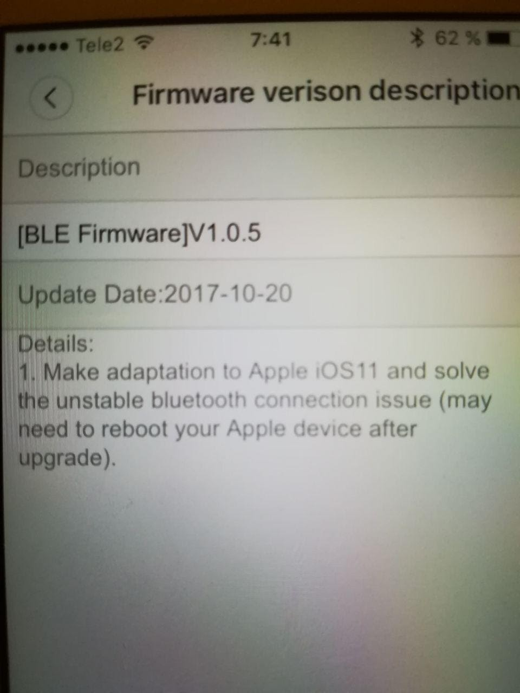]{style="overflow: hidden; display: inline-block; margin: 0.00px 0.00px; border: 0.00px solid #000000; transform: rotate(0.00rad) translateZ(0px); -webkit-transform: rotate(0.00rad) translateZ(0px); width: 232.50px; height: 308.34px;"}

### [3.4.2 Проблемы с подключением программы]{.c18} {#h.3p5sccq4flja .c77 .c30}

[Источник:
]{}[[Перейти](https://electrotransport.ru/ussr/index.php?topic%3D48865.msg1326135%23msg1326135&sa=D&source=editors&ust=1636795599001000&usg=AOvVaw18UL-Ba4o-iZrfwU9lPeJ4){.c11}]{.c7}

[Проблема связана с блокировкой Роскомназдором многих IP адресов.]{.c5}

[Решение: Необходима ]{}[[установка и настройка
VPN](https://yandex.ru/yandsearch?clid%3D1864185%26text%3D%25D0%25B0%25D0%25BD%25D0%25B4%25D1%2580%25D0%25BE%25D0%25B8%25D0%25B4%2520%25D0%25BD%25D0%25B0%25D1%2581%25D1%2582%25D1%2580%25D0%25BE%25D0%25B9%25D0%25BA%25D0%25B0%2520%25D0%25B2%25D0%25BF%25D0%25BD%26lr%3D213&sa=D&source=editors&ust=1636795599001000&usg=AOvVaw3GtrPUBOJnYEqXvwSigvjD){.c11}]{.c7}[.]{.c5}

[3.5 Ходовая]{.c10} {#h.a5x8j5g0jvop .c8}
-------------------

### [3.5.1 Люфт заднего колеса ]{.c18} {#h.1e65jn2c97x .c39 .c30}

[Видео:
]{}[[Перейти](http://cafe.naver.com/starfleet/26216&sa=D&source=editors&ust=1636795599003000&usg=AOvVaw2c2aoxNSvhaVk5Tie3EdhO){.c11}]{.c7}

[Решения: См. раздел  ]{}[[Устранение люфта заднего
колеса](#h.v2xvgl2oolzy){.c11}]{.c7}

### [3.5.2 Люфт в мотор колесе]{.c18} {#h.l42jvr9dtny7 .c39 .c30}

[Источник (видео):
]{}[[Источник](https://youtu.be/WZQljRHl8Ms&sa=D&source=editors&ust=1636795599004000&usg=AOvVaw0DcyehgBlz2VT8b8gopdry){.c11}]{.c7}

[Ни на что не влияет. Если затянуть гайки сильнее люфта не будет.]{.c5}

[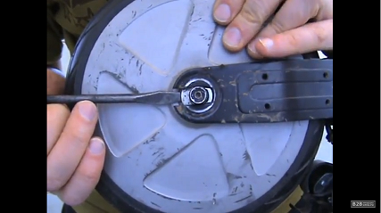]{style="overflow: hidden; display: inline-block; margin: 0.00px 0.00px; border: 0.00px solid #000000; transform: rotate(0.00rad) translateZ(0px); -webkit-transform: rotate(0.00rad) translateZ(0px); width: 295.54px; height: 165.50px;"}

[]{.c5}

### [3.5.3 Стук в мотор колесе при газе]{.c18} {#h.7uiw4258qjpv .c39 .c30}

[Причина: Люфт в оси мотор колеса. см.
]{}[[Видео](https://youtu.be/RQpIFmGk_ag&sa=D&source=editors&ust=1636795599005000&usg=AOvVaw1TNVPiYKvg_fSCNyFrpltp){.c11}]{.c7}

[Длительных тестов на 28.03.2019 нет. Не понятно какой способ наиболее
действенный.]{.c5}

[]{.c5}

[Варианты решения:]{.c5}

1.  [Источник:
    ]{}[[https://t.me/NINEBOT\_ES/142985](https://t.me/NINEBOT_ES/142985&sa=D&source=editors&ust=1636795599007000&usg=AOvVaw2MJz-ZyN8joO0YJjTipg_m){.c11}]{.c7}[ ]{.c5}

[Аргоновая сварка. Сделал одну прихватку. Держать шов будут только
крайние пластины. Сварщик сказал, что бесполезно всё это. Сказал страшно
варить, покоробит пластины и в оси могут поплавиться провода.]{.c5}

[]{.c5}

[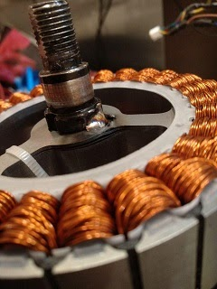]{style="overflow: hidden; display: inline-block; margin: 0.00px 0.00px; border: 0.00px solid #000000; transform: rotate(0.00rad) translateZ(0px); -webkit-transform: rotate(0.00rad) translateZ(0px); width: 240.00px; height: 320.00px;"}

[]{.c5}

[2. Источник:
]{}[[https://t.me/NINEBOT\_ES/144814](https://t.me/NINEBOT_ES/144814&sa=D&source=editors&ust=1636795599008000&usg=AOvVaw1iYmjwGnab3--sqSQ-PveU){.c11}]{.c7}

[Обычная сварка. ]{.c5}

[]{.c5}

[]{style="overflow: hidden; display: inline-block; margin: 0.00px 0.00px; border: 0.00px solid #000000; transform: rotate(0.00rad) translateZ(0px); -webkit-transform: rotate(0.00rad) translateZ(0px); width: 240.00px; height: 320.00px;"}

[]{.c5}

[3. Разобрать ось и посадить на эпоксидную смолу, либо фиксатор оси. В
чате предположили, что из-за высокой температуры мотор колеса такое
соединение не будет работать
]{}[[https://t.me/NINEBOT\_ES/144794](https://t.me/NINEBOT_ES/144794&sa=D&source=editors&ust=1636795599010000&usg=AOvVaw2s3R34YJxlJ6tbooRfIamk){.c11}]{.c7}[ ]{}

### [3.5.3 Болтанка руля в стороны по ходу движения]{.c18} {#h.npgk5dqqroqk .c39 .c30}

[Источник и видео:
]{}[[Перейти](https://electrotransport.ru/ussr/index.php?topic%3D48865.msg1316023%23msg1316023&sa=D&source=editors&ust=1636795599011000&usg=AOvVaw3gnedAKHWC6G2gpU2yF6n0){.c11}]{.c7}[.
]{}[[Видео](https://youtu.be/d1WZOM8CuRk&sa=D&source=editors&ust=1636795599011000&usg=AOvVaw3EaR_2UUh16FmCpEvpqCiH){.c11}]{.c7}[.]{.c5}

[]{.c5}

[]{style="overflow: hidden; display: inline-block; margin: 0.00px 0.00px; border: 0.00px solid #000000; transform: rotate(0.00rad) translateZ(0px); -webkit-transform: rotate(0.00rad) translateZ(0px); width: 298.00px; height: 167.36px;"}

### [3.5.4 Заливает спину ]{.c18} {#h.v4tsbfraclt7 .c39 .c30}

[Источник:]{.c5}

[[Перейти](https://t.me/NINEBOTES/2133&sa=D&source=editors&ust=1636795599013000&usg=AOvVaw2FO3JKwaN784PtdFBXQITk){.c11}]{.c7}

[[Перейти](https://t.me/NINEBOTES/2735&sa=D&source=editors&ust=1636795599013000&usg=AOvVaw2JqNwztJolf2lqzqvAj6rJ){.c11}]{.c7}[ ]{.c5}

[]{.c5}

[Решение:]{.c5}

[Установка готового ]{}[[брызговика](#h.ozpqsayz2icr){.c11}]{.c7}[ на
заднее крыло, либо ]{}[[изготовление своими
руками](#h.97ox0fjwf1l6){.c11}]{.c7}[.]{.c5}

[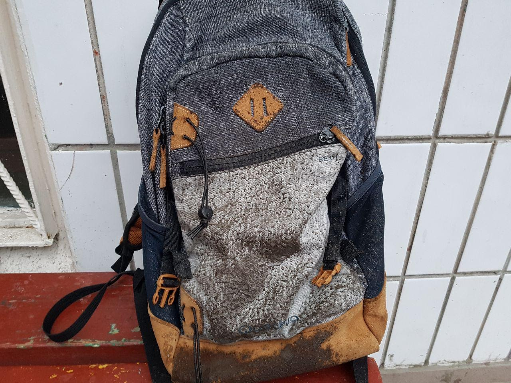]{style="overflow: hidden; display: inline-block; margin: 0.00px 0.00px; border: 0.00px solid #000000; transform: rotate(0.00rad) translateZ(0px); -webkit-transform: rotate(0.00rad) translateZ(0px); width: 350.77px; height: 262.50px;"}[]{style="overflow: hidden; display: inline-block; margin: 0.00px 0.00px; border: 0.00px solid #000000; transform: rotate(0.00rad) translateZ(0px); -webkit-transform: rotate(0.00rad) translateZ(0px); width: 197.07px; height: 262.50px;"}

[Разворот протектора проблему ]{}[не решает.]{.c36}

[]{style="overflow: hidden; display: inline-block; margin: 0.00px 0.00px; border: 0.00px solid #000000; transform: rotate(0.00rad) translateZ(0px); -webkit-transform: rotate(0.00rad) translateZ(0px); width: 454.50px; height: 302.34px;"}

### [3.5.5 Ржавеет подшипник]{.c18} {#h.iwh7rwqfzj2l .c39 .c30}

[Источник:
]{}[[Перейти](https://t.me/NINEBOTES/1354&sa=D&source=editors&ust=1636795599016000&usg=AOvVaw30geBbUIOe790thQK9VDJf){.c11}]{.c7}

[Видео с шумом:
]{}[[Перейти](https://t.me/Ninebot_ES/7959&sa=D&source=editors&ust=1636795599016000&usg=AOvVaw03RvVu1xrbSx-DTWEIK96O){.c11}]{.c7}

[Решается ]{}[[установкой новых
подшипников](#h.10k696jv59w5){.c11}]{.c7}[.]{.c5}

[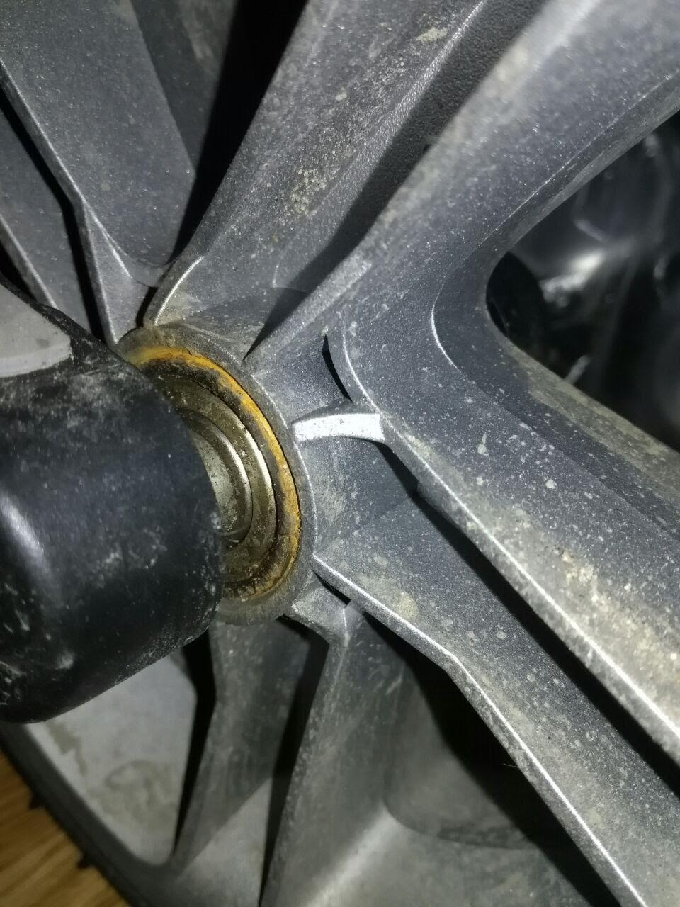]{style="overflow: hidden; display: inline-block; margin: 0.00px 0.00px; border: 0.00px solid #000000; transform: rotate(0.00rad) translateZ(0px); -webkit-transform: rotate(0.00rad) translateZ(0px); width: 261.50px; height: 347.50px;"}

### [3.5.6 Разломилась тормозная колодка ]{.c18} {#h.rppsl39gj01z .c39 .c30}

[Источник: ]{.c5}

[[Перейти](https://t.me/Ninebot_ES/439&sa=D&source=editors&ust=1636795599018000&usg=AOvVaw1v5JHZDSUNikBfemcIk8ue){.c11}]{.c7}

[[Перейти](https://t.me/Ninebot_ES/7642&sa=D&source=editors&ust=1636795599019000&usg=AOvVaw0QlTiwmKOW2MyMBlmU8bNE){.c11}]{.c7}[ ]{.c5}

[]{.c5}

[Случай не единичный. В некоторых случаях крылом в качестве тормоза даже
не пользовались.]{.c5}

[]{.c5}

[Решение: Приобрести ]{}[[новую тормозную
колодку](#h.eo0u0i1h6ca9){.c11}]{.c7}[. Как вариант можно ]{}[[усилить
тормозную колодку
эпоксилином](https://youtu.be/Zvv96q6WDyo&sa=D&source=editors&ust=1636795599020000&usg=AOvVaw2FNVhARFIJrMhBc8D2x1gj){.c11}]{.c7}[ (видео).
]{.c5}

[Сварка аргоном не лечит. Отвалилось на второй день.
(]{}[[источник](https://t.me/NINEBOT_ES/84404&sa=D&source=editors&ust=1636795599021000&usg=AOvVaw2wr8cWqw03ldImchsyF82T){.c11}]{.c7}[)]{.c5}

[]{.c5}

[См. так же видео]{.c5}

[[Как снять задний
амортизатор](https://youtu.be/UvaQojgS0_w&sa=D&source=editors&ust=1636795599022000&usg=AOvVaw2JkZqu4netWd_Vj-TcuKWG){.c11}]{.c7}

[[Как снять тормозную
колодку](https://youtu.be/v8J6_Z74b7c&sa=D&source=editors&ust=1636795599022000&usg=AOvVaw2UfaBbe47wcuVvdRz3x7X7){.c11}]{.c7}

[]{.c5}

[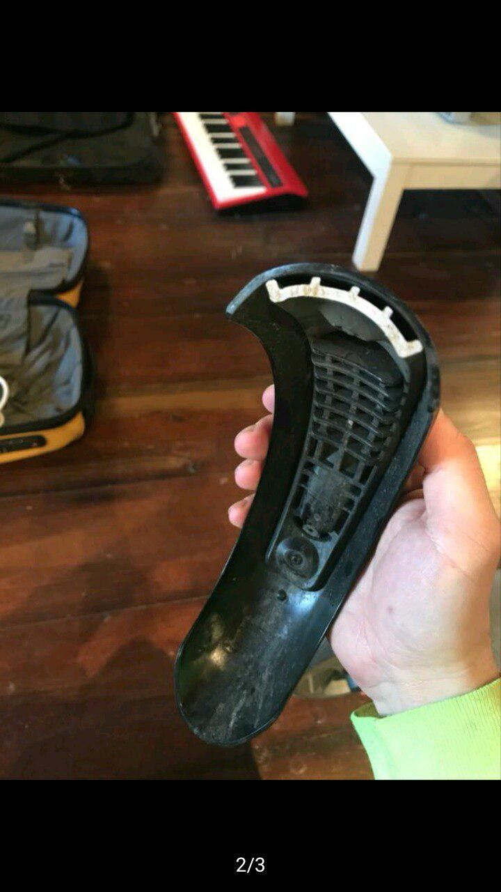]{style="overflow: hidden; display: inline-block; margin: 0.00px 0.00px; border: 0.00px solid #000000; transform: rotate(0.00rad) translateZ(0px); -webkit-transform: rotate(0.00rad) translateZ(0px); width: 196.50px; height: 349.62px;"}

[]{.c5}

### [3.5.7 Отломилось крыло от тормозной колодки ]{.c18} {#h.ph1qnxmhcm3b .c39 .c30}

[Источник:
]{}[[Перейти](https://t.me/Ninebot_ES/19288&sa=D&source=editors&ust=1636795599024000&usg=AOvVaw0gR-DIuluCFvkSnAnlveXM){.c11}]{.c7}

[]{.c5}

[Решение: Установка болтов в местах крепления крыла.
(]{}[[источник](https://t.me/Ninebot_ES/21084&sa=D&source=editors&ust=1636795599025000&usg=AOvVaw2iei5O-no6IzehXMT1AA7A){.c11}]{.c7}[)]{.c5}

[Уточнение: “Надо бы уточнить, что при такой схеме верхняя гайка мешает
при складывании самоката. Она упирается в рулевую стойку и не дает
защелкнусть крючку в паз на крыле.\
Не заметил сразу т.к. не складываю его”
(]{}[[источник](https://t.me/Ninebot_ES/23990&sa=D&source=editors&ust=1636795599025000&usg=AOvVaw0WaaBStvvwMuku52fsbjbT){.c11}]{.c7}[)]{.c5}

[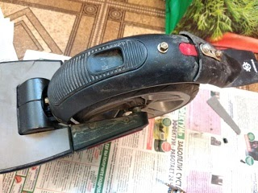]{style="overflow: hidden; display: inline-block; margin: 0.00px 0.00px; border: 0.00px solid #000000; transform: rotate(0.00rad) translateZ(0px); -webkit-transform: rotate(0.00rad) translateZ(0px); width: 320.00px; height: 240.00px;"}

[]{.c5}

### [3.5.8 Не ровное переднее крыло (единичный случай)]{.c18} {#h.24jqy786mjdx .c39 .c30}

[Источник:
]{}[[Перейти](https://t.me/NINEBOTES/5688&sa=D&source=editors&ust=1636795599027000&usg=AOvVaw0nfLU-RXF9Wik8YWRoyGGU){.c11}]{.c7}

[Видимо единичный случай]{.c5}

[]{.c5}

[]{style="overflow: hidden; display: inline-block; margin: 0.00px 0.00px; border: 0.00px solid #000000; transform: rotate(0.00rad) translateZ(0px); -webkit-transform: rotate(0.00rad) translateZ(0px); width: 187.31px; height: 250.50px;"}

[]{.c5}

### [3.5.9 Порезы покрышки]{.c18} {#h.c8zfqrnlux7f .c39 .c30}

[Источник:
]{}[[Перейти](https://t.me/KickscooterNinebot/26047&sa=D&source=editors&ust=1636795599028000&usg=AOvVaw1FDVp1RAnWQGo8RrMusL14){.c11}]{.c7}

[Пробег почти 200 км]{.c5}

[]{style="overflow: hidden; display: inline-block; margin: 0.00px 0.00px; border: 0.00px solid #000000; transform: rotate(0.00rad) translateZ(0px); -webkit-transform: rotate(0.00rad) translateZ(0px); width: 362.50px; height: 272.65px;"}

### [3.5.10 Самокат из коробки без заглушки в деке]{.c18} {#h.65m66rmbrhuj .c39 .c30}

[Источник:
]{}[[Перейти](https://t.me/Ninebot_ES/6200&sa=D&source=editors&ust=1636795599030000&usg=AOvVaw0F_JdLiTVY3ZLmntCmBYEB){.c11}]{.c7}

[У автора резинка]{}[[ приклеилась к коробке и чуть была не
выброшена](https://t.me/Ninebot_ES/6248&sa=D&source=editors&ust=1636795599030000&usg=AOvVaw0S5-IDJHzQC9LHk0RZO-aA){.c11}]{.c7}[.]{.c5}

[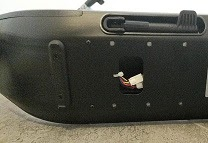]{style="overflow: hidden; display: inline-block; margin: 0.00px 0.00px; border: 0.00px solid #000000; transform: rotate(0.00rad) translateZ(0px); -webkit-transform: rotate(0.00rad) translateZ(0px); width: 208.00px; height: 143.00px;"}

### [3.5.11 Раскручиваются болты.]{.c18} {#h.wjis20hg24yy .c39 .c30}

[Решение: Перекрутить болты с синим фиксатором резьбы (красный можно
открутить при разогреве болта промышленным феном). Например
]{}[[таким](http://xn--80ac3bh.xn--p1ai/catalog/kley-svarka/fiksator-rezby-udalyaemyj-sinij/&sa=D&source=editors&ust=1636795599032000&usg=AOvVaw0Zre4p3HQD-xodfIZqtUEB){.c11}]{.c7}[.
(продается в магазинах с автозапчастями).]{.c5}

[]{.c5}

[]{#t.278720806c425dc6915e7570d00fa22f7137c4dc}[]{#t.11}
+-----------------------------------+-----------------------------------+
| [В основании руля раскручиваются  | [В нижней части руля 2 болта с    |
| после одной-двух поездок 4 болта  | фронта]{.c5}                      |
| (по 2 болта с каждой              |                                   |
| стороны)]{.c5}                    | [и 2 болта под гарантийной        |
|                                   | пломбой (]{}[нужно уточнить у     |
| []{.c5}                           | подавца, лишаетесь ли гарантии    |
|                                   | при повреждении пломбы или        |
| [.]{.c5}               |
| U_tcbsJgT6x4PWhyemSfc-xMPt6XrF8hb |                                   |
| LBcJQ.jpg)]{style="overflow: hidd | [ ]{}[]{style="overflow: |
| olid #000000; transform: rotate(0 |  hidden; display: inline-block; m |
| .00rad) translateZ(0px); -webkit- | argin: 0.00px 0.00px; border: 0.0 |
| transform: rotate(0.00rad) transl | 0px solid #000000; transform: rot |
| ateZ(0px); width: 162.50px; heigh | ate(0.00rad) translateZ(0px); -we |
| t: 197.95px;"}                    | bkit-transform: rotate(0.00rad) t |
|                                   | ranslateZ(0px); width: 111.50px;  |
|                                   | height: 198.22px;"}[]{st |
|                                   | yle="overflow: hidden; display: i |
|                                   | nline-block; margin: 0.00px 0.00p |
|                                   | x; border: 0.00px solid #000000;  |
|                                   | transform: rotate(0.00rad) transl |
|                                   | ateZ(0px); -webkit-transform: rot |
|                                   | ate(0.00rad) translateZ(0px); wid |
|                                   | th: 149.00px; height: 200.00px;"} |
+-----------------------------------+-----------------------------------+
| [В узле сложения]{.c5}            | []{.c5}                           |
|                                   |                                   |
| [Есть                             |                                   |
| ]{}[[видео](https://youtu.be/nH0U |                                   |
| M9DtbEU&sa=D&source=editors&ust=1 |                                   |
| 636795599036000&usg=AOvVaw0ySz3Pj |                                   |
| 4eTN7Mjp2g66RhT){.c11}]{.c7}[ с   |                                   |
| рассмотрением оси сложения. В     |                                   |
| ]{}[[данном                       |                                   |
| случае](https://t.me/Ninebot_ES/6 |                                   |
| 724&sa=D&source=editors&ust=16367 |                                   |
| 95599037000&usg=AOvVaw17RNJibm1Uk |                                   |
| bNxDMvZ-K2L){.c11}]{.c7}[ открути |                                   |
| вшийся                            |                                   |
| болт застрял в узле и самокат не  |                                   |
| смогли сложить. ]{.c5}            |                                   |
|                                   |                                   |
| []{style="overflow: hidd |                                   |
| en; display: inline-block; margin |                                   |
| : 0.00px 0.00px; border: 0.00px s |                                   |
| olid #000000; transform: rotate(0 |                                   |
| .00rad) translateZ(0px); -webkit- |                                   |
| transform: rotate(0.00rad) transl |                                   |
| ateZ(0px); width: 317.00px; heigh |                                   |
| t: 237.33px;"}                    |                                   |
+-----------------------------------+-----------------------------------+

### [3.5.12 Скрип тормозной колодки]{.c18} {#h.blx2hmcaq9z0 .c39 .c30}

[Источник:
]{}[[Перейти](https://t.me/Ninebot_ES/8662&sa=D&source=editors&ust=1636795599038000&usg=AOvVaw2Z2Jf-xkYyfJMJsDB_F3H9){.c11}]{.c7}

[Решение: Смазывать тут
(]{}[[источник](https://t.me/Ninebot_ES/8655&sa=D&source=editors&ust=1636795599039000&usg=AOvVaw2OBGzGObM_zj4UfuJZIuWo){.c11}]{.c7}[)]{.c5}

[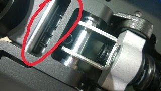]{style="overflow: hidden; display: inline-block; margin: 0.00px 0.00px; border: 0.00px solid #000000; transform: rotate(0.00rad) translateZ(0px); -webkit-transform: rotate(0.00rad) translateZ(0px); width: 320.00px; height: 180.00px;"}

### [3.5.13 Вибрация мотор колеса]{.c18} {#h.idu8bo8tmya .c39 .c30}

[Источник:
]{}[[Перейти](https://t.me/Ninebot_ES/7886&sa=D&source=editors&ust=1636795599040000&usg=AOvVaw1v7iMeSWN68bWZ4ZezRiK6){.c11}]{.c7}

[После замены подшипника (см. ]{}[[видео с разборкой мотор
колеса](https://youtu.be/eG0MJQOvydw&sa=D&source=editors&ust=1636795599041000&usg=AOvVaw0dFzVkRNwdOypTgxeBsEMY){.c11}]{.c7}[)
вибрация мотор колеса окончательно не ушла. Скорей всего вибрация
возникает от протектора колеса оставшегося по бокам после того как
сотрется часть по центру покрышки.]{.c5}

### [3.5.14 Колесо либо руль прокручивается на 360 градусов]{.c18} {#h.4bt80flm36ve .c39 .c30}

[Возможная причина: Сорвало стопорный болт. Необходима замена болта.
Болт М5х5
]{}[[https://opt.lamobile.ru/product/vint-m5-5-50-sht-14-01-0050-00](https://opt.lamobile.ru/product/vint-m5-5-50-sht-14-01-0050-00&sa=D&source=editors&ust=1636795599042000&usg=AOvVaw3TjoFX8Y-m9cFRWg4NiLBa){.c11}]{.c7}[ ]{.c5}

[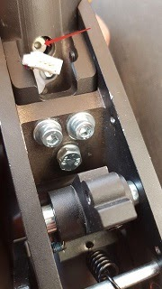]{style="overflow: hidden; display: inline-block; margin: 0.00px 0.00px; border: 0.00px solid #000000; transform: rotate(0.00rad) translateZ(0px); -webkit-transform: rotate(0.00rad) translateZ(0px); width: 180.00px; height: 320.00px;"}

[Возможная причина 2: Пришла в негодность пластиковая втулка в месте
установки вилки. Необходима замена втулки.]{.c5}

### [3.5.15 Стирается покрышка мотор колеса]{.c18} {#h.4fg8c0awq9s5 .c39 .c30}

[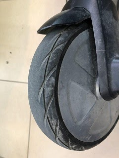]{style="overflow: hidden; display: inline-block; margin: 0.00px 0.00px; border: 0.00px solid #000000; transform: rotate(0.00rad) translateZ(0px); -webkit-transform: rotate(0.00rad) translateZ(0px); width: 240.00px; height: 320.00px;"}

[]{.c5}

[Возможное решение: Установка покрышки с заднего колеса
(]{}[[источник](https://t.me/NINEBOT_ES/73998&sa=D&source=editors&ust=1636795599044000&usg=AOvVaw2b05WvS1BVyXXz2n_wH1oi){.c11}]{.c7}[)]{.c5}

[Видео по замене покрышки:
]{}[[https://youtu.be/aa3wUTuo1VU](https://youtu.be/aa3wUTuo1VU&sa=D&source=editors&ust=1636795599044000&usg=AOvVaw3lP1YwQNAtl4Z1tJ0GoMy_){.c11}]{.c7}[ ]{.c5}

[]{.c5}

[]{style="overflow: hidden; display: inline-block; margin: 0.00px 0.00px; border: 0.00px solid #000000; transform: rotate(0.00rad) translateZ(0px); -webkit-transform: rotate(0.00rad) translateZ(0px); width: 258.00px; height: 194.00px;"}

### [3.5.16 Пробой в переднем амортизаторе]{.c18} {#h.4nv7e6nc0z7a .c39 .c30}

[Решение 1:]{.c50}[ Вставить в пружину баффер из топливного
шланга.]{.c5}

[]{.c5}

[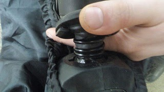]{style="overflow: hidden; display: inline-block; margin: 0.00px 0.00px; border: 0.00px solid #000000; transform: rotate(0.00rad) translateZ(0px); -webkit-transform: rotate(0.00rad) translateZ(0px); width: 320.00px; height: 180.00px;"}[]{style="overflow: hidden; display: inline-block; margin: 0.00px 0.00px; border: 0.00px solid #000000; transform: rotate(0.00rad) translateZ(0px); -webkit-transform: rotate(0.00rad) translateZ(0px); width: 320.00px; height: 180.00px;"}

[]{.c5}

[Решение 2:]{.c50}[ Прокладка из провода
]{}[[https://t.me/NINEBOT\_ES/158363](https://t.me/NINEBOT_ES/158363&sa=D&source=editors&ust=1636795599047000&usg=AOvVaw0GFtXVChtEiZZ6AIo1dWEm){.c11}]{.c7}[ ]{.c5}

[]{style="overflow: hidden; display: inline-block; margin: 0.00px 0.00px; border: 0.00px solid #000000; transform: rotate(0.00rad) translateZ(0px); -webkit-transform: rotate(0.00rad) translateZ(0px); width: 430.00px; height: 372.00px;"}

[Решение 3:]{.c50}[ Демпфер напечатанный на 3д принтере ]{.c5}

[Источник:
]{}[[http://4pda.ru/forum/index.php?s=&showtopic=839290&view=findpost&p=89508689](http://4pda.ru/forum/index.php?s%3D%26showtopic%3D839290%26view%3Dfindpost%26p%3D89508689&sa=D&source=editors&ust=1636795599048000&usg=AOvVaw0FJhB7sL_5c8a2uzvGxv9M){.c11}]{.c7}

[Модель:
]{}[[https://www.thingiverse.com/thing:3897204](https://www.thingiverse.com/thing:3897204&sa=D&source=editors&ust=1636795599049000&usg=AOvVaw3nrspKINcSxxSNkkkHwJyd){.c11}]{.c7}[ ]{.c5}

[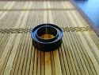]{style="overflow: hidden; display: inline-block; margin: 0.00px 0.00px; border: 0.00px solid #000000; transform: rotate(0.00rad) translateZ(0px); -webkit-transform: rotate(0.00rad) translateZ(0px); width: 125.00px; height: 94.00px;"}[]{style="overflow: hidden; display: inline-block; margin: 0.00px 0.00px; border: 0.00px solid #000000; transform: rotate(0.00rad) translateZ(0px); -webkit-transform: rotate(0.00rad) translateZ(0px); width: 125.00px; height: 94.00px;"}[]{style="overflow: hidden; display: inline-block; margin: 0.00px 0.00px; border: 0.00px solid #000000; transform: rotate(0.00rad) translateZ(0px); -webkit-transform: rotate(0.00rad) translateZ(0px); width: 125.00px; height: 107.00px;"}

[]{.c5}

[3.6 Узел сложения]{.c10} {#h.gqu6hjhs7840 .c8}
-------------------------

### [3.6.1 Выпадают резинки в узле сложения]{.c18} {#h.g87mh5mze28o .c39 .c30}

[Источник:
]{}[[Перейти](https://t.me/Ninebot_ES/3185&sa=D&source=editors&ust=1636795599051000&usg=AOvVaw3q7pGkBJ2tosJj-Uggf-AZ){.c11}]{.c7}

[]{.c5}

[Замечено у нескольких человек периодическое выскальзывание резинок.
Либо раз в 1-2 недели, либо \~20 складываний самоката. Так же в
]{}[[видео
ролике](https://electrotransport.ru/ussr/index.php?topic%3D48865.msg1290424%23msg1290424&sa=D&source=editors&ust=1636795599052000&usg=AOvVaw2w-mJK1MVBQmgDDXUQTbFS){.c11}]{.c7}[ было
упоминание, что резинки очень быстро приходят в негодность.]{.c5}

[]{.c5}

[Возможное решение: Приклеить резинки (на старых партиях) либо
подкрутить фикстирующие болты (на новых партиях), ]{}[[Замена резинки в
узел складывания на кусок топливного
шланга](#h.k1e431a4st2z){.c11}]{.c7}[.]{.c5}

[]{style="overflow: hidden; display: inline-block; margin: 0.00px 0.00px; border: 0.00px solid #000000; transform: rotate(0.00rad) translateZ(0px); -webkit-transform: rotate(0.00rad) translateZ(0px); width: 362.50px; height: 160.56px;"}

### [3.6.2 Плохие болты в узле сложения ]{.c18} {#h.ijy9sa2s0civ .c39 .c30}

[Источники: ]{.c5}

[[Обломился
болт](https://t.me/Ninebot_ES/6254&sa=D&source=editors&ust=1636795599054000&usg=AOvVaw07UWyGMeUM7oHOUJVkm064){.c11}]{.c7}

[[При затяжке срывает
резьбу](https://t.me/Ninebot_ES/8041&sa=D&source=editors&ust=1636795599055000&usg=AOvVaw1xan5N7lx4Vc_UB_N83IgX){.c11}]{.c7}

[Сообщение на ]{}[[форуме
электротранспорта](https://electrotransport.ru/ussr/index.php?topic%3D48865.msg1319817%23msg1319817&sa=D&source=editors&ust=1636795599055000&usg=AOvVaw0Id5mQHlknVRwp1vZwVL5e){.c11}]{.c7}

[Решение: Заменить болты на новые
]{}[[М5](https://t.me/Ninebot_ES/23675&sa=D&source=editors&ust=1636795599056000&usg=AOvVaw116X78zlHnrRGVDBw1JlQ0){.c11}]{.c7}[ длиной
]{}[[30
мм](https://t.me/Ninebot_ES/24572&sa=D&source=editors&ust=1636795599056000&usg=AOvVaw1jbf72tYAyGZn5B9bHwwSM){.c11}]{.c7}[ (с
шляпкой).]{.c5}

[]{style="overflow: hidden; display: inline-block; margin: 0.00px 0.00px; border: 0.00px solid #000000; transform: rotate(0.00rad) translateZ(0px); -webkit-transform: rotate(0.00rad) translateZ(0px); width: 161.50px; height: 215.33px;"}[]{style="overflow: hidden; display: inline-block; margin: 0.00px 0.00px; border: 0.00px solid #000000; transform: rotate(0.00rad) translateZ(0px); -webkit-transform: rotate(0.00rad) translateZ(0px); width: 265.00px; height: 183.00px;"}

### [3.6.3 Люфт втулок в узле сложения]{.c18} {#h.i6wy0znf5i7p .c39 .c30}

[Источник:
]{}[[Перейти](https://electrotransport.ru/ussr/index.php?topic%3D48865.msg1290424%23msg1290424&sa=D&source=editors&ust=1636795599057000&usg=AOvVaw0_2o_J_0HGxI8ZTzXrluHo){.c11}]{.c7}

[Решение: см. раздел ]{}[[Установка втулки в узел
сложения](#h.knxeohriuz20){.c11}]{.c7}

[]{.c5}

[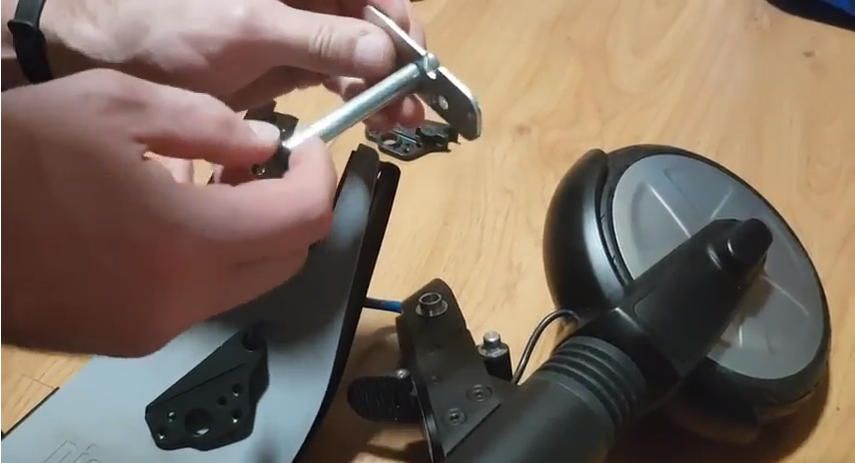]{style="overflow: hidden; display: inline-block; margin: 0.00px 0.00px; border: 0.00px solid #000000; transform: rotate(0.00rad) translateZ(0px); -webkit-transform: rotate(0.00rad) translateZ(0px); width: 299.50px; height: 160.91px;"}

### [3.6.4 Скрип в узле сложения]{.c18} {#h.1snnsb1qdk5p .c39 .c30}

[Решение: смазать силиконовой смазкой место примыкания боковых пластин
рулевой колонки с пластиковой прокладкой.]{.c5}

[]{.c5}

[]{style="overflow: hidden; display: inline-block; margin: 0.00px 0.00px; border: 0.00px solid #000000; transform: rotate(0.00rad) translateZ(0px); -webkit-transform: rotate(0.00rad) translateZ(0px); width: 328.50px; height: 184.41px;"}

[3.7 Прочее]{.c10} {#h.tiiyb5fibrqd .c8}
------------------

### [3.7.1 Отломилось крепление  курка]{.c18} {#h.oxbakqo8p2e5 .c39 .c30}

[Источник:
]{}[[Перейти](https://t.me/Ninebot_ES/9804&sa=D&source=editors&ust=1636795599060000&usg=AOvVaw1UKwTSHxw1AFqztkl2gPAE){.c11}]{.c7}

[]{.c5}

[]{style="overflow: hidden; display: inline-block; margin: 0.00px 0.00px; border: 0.00px solid #000000; transform: rotate(0.00rad) translateZ(0px); -webkit-transform: rotate(0.00rad) translateZ(0px); width: 240.00px; height: 320.00px;"}

### [3.7.2 Отвалилась опорная планка]{.c18} {#h.9fti918w4k6s .c39 .c30}

[Источник:
]{}[[Перейти](https://t.me/Ninebot_ES/7917&sa=D&source=editors&ust=1636795599061000&usg=AOvVaw1retakPWOkokaB03DSFipV){.c11}]{.c7}

[Решение: ]{.c5}

[Поставить автомобильные клипсы
(]{}[[источник](https://t.me/Ninebot_ES/9943&sa=D&source=editors&ust=1636795599062000&usg=AOvVaw2oJ7lgmj2chNgdrkWmLgqq){.c11}]{.c7}[)
Примечание: Если ставить много подкладок, самокат будет стоять не
устойчиво. Для дополнительной устойчивости можно распечатать на 3д
принтере ]{}[[деталь опорной
планки](#h.k4q90bb0mm46){.c11}]{.c7}[.]{.c5}

[]{.c5}

[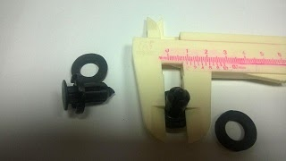]{style="overflow: hidden; display: inline-block; margin: 0.00px 0.00px; border: 0.00px solid #000000; transform: rotate(0.00rad) translateZ(0px); -webkit-transform: rotate(0.00rad) translateZ(0px); width: 320.00px; height: 180.00px;"}[]{style="overflow: hidden; display: inline-block; margin: 0.00px 0.00px; border: 0.00px solid #000000; transform: rotate(0.00rad) translateZ(0px); -webkit-transform: rotate(0.00rad) translateZ(0px); width: 170.00px; height: 292.00px;"}

### [3.7.3 Заедает курок газа (акселератора)]{.c18} {#h.fkkbemrqj8ak .c39 .c30}

[Источник:
]{}[[Перейти](https://electrotransport.ru/ussr/index.php?topic%3D48865.msg1317893%23msg1317893&sa=D&source=editors&ust=1636795599064000&usg=AOvVaw265BB8peNRvAnFbwCEdNXI){.c11}]{.c7}

[Вариант 1:]{.c2}

[Решение от автора: “ключём из комплекта открутил болтик снизу курка -
весь курок стал двигаться по рулю влево-вправо. Подвигал, попробовал
понажимать - проблема ушла. Закрутил, опробовал - все хорошо. Видимо на
самом деле от тряски что то чуть сдвинулось.”
(]{}[[источник](https://t.me/Ninebot_ES/10731&sa=D&source=editors&ust=1636795599065000&usg=AOvVaw335DLUlXpY86fSjnwQj46U){.c11}]{.c7}[)]{.c5}

[Вариант 2:]{.c2}

[Плотно прижата к курку грипса. (см.
]{}[[видео](https://t.me/Ninebot_ES/20700&sa=D&source=editors&ust=1636795599066000&usg=AOvVaw3fwKcEmUWxgmWetcNE7o6V){.c11}]{.c7}[)]{.c5}

### [3.7.4 На руле криво установлена кнопка]{.c18} {#h.j1b2yg7reibs .c39 .c30}

[Источник:
]{}[[Перейти](https://t.me/Ninebot_ES/11297&sa=D&source=editors&ust=1636795599067000&usg=AOvVaw1ritzIt29b5zm36y6qQCFT){.c11}]{.c7}

[Решение: Снять экран и ровно установить на место. см. ]{}[[видео по
разборке
руля](https://youtu.be/vIPf5ocy9-A&sa=D&source=editors&ust=1636795599067000&usg=AOvVaw1mQxubwdGvDn037JpL2CNJ){.c11}]{.c7}

[]{style="overflow: hidden; display: inline-block; margin: 0.00px 0.00px; border: 0.00px solid #000000; transform: rotate(0.00rad) translateZ(0px); -webkit-transform: rotate(0.00rad) translateZ(0px); width: 180.00px; height: 320.00px;"}

### [3.7.5 Облез отражатель в фаре]{.c18} {#h.pzxlthjzgzz .c39 .c30}

[Источник:
]{}[[Перейти](https://t.me/Ninebot_ES/11499&sa=D&source=editors&ust=1636795599069000&usg=AOvVaw01c7CervTmYWpWADUAal8l){.c11}]{.c7}

[Со
]{}[[слов](https://t.me/Ninebot_ES/11546&sa=D&source=editors&ust=1636795599069000&usg=AOvVaw027qSOOF2KMZKP9g_U9_SH){.c11}]{.c7}[автора:
“Подозреваю, что там нет отражателя, а коллиматор стоит, а пятна - это
значит что-то на внешнюю сторону попало, может герметик или клей.”]{.c5}

[]{style="overflow: hidden; display: inline-block; margin: 0.00px 0.00px; border: 0.00px solid #000000; transform: rotate(0.00rad) translateZ(0px); -webkit-transform: rotate(0.00rad) translateZ(0px); width: 183.00px; height: 194.00px;"}

### [3.7.6 Стук от подножки]{.c18} {#h.a5ko0795cw37 .c39 .c30}

[Источник (видео):
]{}[[Перейти](https://t.me/Ninebot_ES/13708&sa=D&source=editors&ust=1636795599071000&usg=AOvVaw0OhzU8lJ_bxUSoM_kb2uf_){.c11}]{.c7}

[Решение: Установить прокладку (как вариант упаковка из коробки от
самоката)]{.c5}

[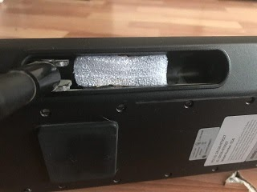]{style="overflow: hidden; display: inline-block; margin: 0.00px 0.00px; border: 0.00px solid #000000; transform: rotate(0.00rad) translateZ(0px); -webkit-transform: rotate(0.00rad) translateZ(0px); width: 320.00px; height: 240.00px;"}

[Вариант 2: Установ ить резинки
(]{}[[источник](https://t.me/NINEBOT_ES/32480&sa=D&source=editors&ust=1636795599072000&usg=AOvVaw3mULfcaC_sV9ztqwmbKU2G){.c11}]{.c7}[)]{.c5}

[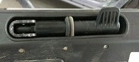]{style="overflow: hidden; display: inline-block; margin: 0.00px 0.00px; border: 0.00px solid #000000; transform: rotate(0.00rad) translateZ(0px); -webkit-transform: rotate(0.00rad) translateZ(0px); width: 324.50px; height: 145.73px;"}

### [3.7.7 Дребезжит подсветка в деке]{.c18} {#h.tmmyee3zz43k .c39 .c30}

[Источник:
]{}[[Перейти](https://t.me/NINEBOT_ES/36037&sa=D&source=editors&ust=1636795599073000&usg=AOvVaw0OblJQx0w7t-UscbkePsw-){.c11}]{.c7}

[Возможное решение: Приклеить светодиоды к деке клеем.]{.c5}

[]{style="overflow: hidden; display: inline-block; margin: 0.00px 0.00px; border: 0.00px solid #000000; transform: rotate(0.00rad) translateZ(0px); -webkit-transform: rotate(0.00rad) translateZ(0px); width: 320.00px; height: 180.00px;"}

[4 Самостоятельная доработка самоката]{.c78} {#h.y28p08cufgcu .c60 .c30}
============================================

[4.1 Ходовая]{.c10} {#h.19nwykl5whff .c8}
-------------------

### [4.1.1 Устранение люфта заднего колеса]{.c18} {#h.v2xvgl2oolzy .c39 .c30}

[]{#t.b7afe33f24a6d789effc68b33c88eeeb1d904dd9}[]{#t.12}
+-----------------------------------+-----------------------------------+
| [Установка втулок напечатанных на | [Установка дюралевых втулок на    |
| 3d принтере]{.c5}                 | заднее колесо]{.c5}               |
|                                   |                                   |
| [Источник:                        | [Источник:                        |
| ]{}[[Перейти](https://electrotran | ]{}[[Перейти](https://electrotran |
| sport.ru/ussr/index.php?topic%3D4 | sport.ru/ussr/index.php?topic%3D4 |
| 8865.msg1237218%23msg1237218&sa=D | 8865.msg1291627%23msg1291627&sa=D |
| &source=editors&ust=1636795599077 | &source=editors&ust=1636795599081 |
| 000&usg=AOvVaw006aqbgNfZKySqyq3OV | 000&usg=AOvVaw1WWHM3lk7N7E0XTUh_C |
| VG1){.c11}]{.c7}                  | SpS){.c11}]{.c7}                  |
|                                   |                                   |
| [Модель втулки stl:               | [Размеры деталей:                 |
| ]{}[[Перейти](#h.jyvmw2fomwxf){.c | ]{}[[Перейти](https://t.me/Ninebo |
| 11}]{.c7}                         | t_ES/936&sa=D&source=editors&ust= |
|                                   | 1636795599081000&usg=AOvVaw1RzlNx |
| [Видео по теме:]{.c5}             | e-fLPVkbCtOl0PJG){.c11}]{.c7}[ ]{ |
|                                   | .c5}                              |
| [[Новые втулки (теория + разбор   |                                   |
| задней                            | []{.c5}                           |
| оси)](https://youtu.be/7o_rsguPnu |                                   |
| k&sa=D&source=editors&ust=1636795 | [См. FAQ ]{}[[Где взять           |
| 599078000&usg=AOvVaw15h_w9HYdZ68n | ремкомплект](#h.tj3fwevp9v0e){.c1 |
| eSLqMG_Xc){.c11}]{.c7}            | 1}]{.c7}[.]{.c5}                  |
|                                   |                                   |
| [[Новые втулки задней оси         | ]{style="overflow: hidd |
| 1636795599078000&usg=AOvVaw0cDNtg | en; display: inline-block; margin |
| sD7Odx2vbKynxOBQ){.c11}]{.c7}     | : 0.00px 0.00px; border: 0.00px s |
|                                   | olid #000000; transform: rotate(0 |
| []{.c5}                           | .00rad) translateZ(0px); -webkit- |
|                                   | transform: rotate(0.00rad) transl |
| [См. FAQ ]{}[[Где взять           | ateZ(0px); width: 234.00px; heigh |
| ремкомплект](#h.tj3fwevp9v0e){.c1 | t: 159.00px;"}[]{style=" |
| []{style="overflow: hidd | rder: 0.00px solid #000000; trans |
| en; display: inline-block; margin | form: rotate(0.00rad) translateZ( |
| : 0.00px 0.00px; border: 0.00px s | 0px); -webkit-transform: rotate(0 |
| olid #000000; transform: rotate(0 | .00rad) translateZ(0px); width: 1 |
| .00rad) translateZ(0px); -webkit- | 47.50px; height: 163.22px;"}      |
| transform: rotate(0.00rad) transl |                                   |
| ateZ(0px); width: 282.50px; heigh | []{.c20}                          |
| t: 211.88px;"}                    |                                   |
|                                   |                                   |
| []{.c20}                          |                                   |
+-----------------------------------+-----------------------------------+
| [Устранение люфта фум             | [Установка прокладки из металла   |
| лентой]{.c5}                      | от баллончика с краской]{.c5}     |
|                                   |                                   |
| [Источник:                        | [Источник:                        |
| ]{}[[Перейти](https://electrotran | ]{}[[Перейти](https://t.me/Ninebo |
| sport.ru/ussr/index.php?topic%3D4 | t_ES/9451&sa=D&source=editors&ust |
| 8865.msg1291106%23msg1291106&sa=D | =1636795599085000&usg=AOvVaw35x-x |
| &source=editors&ust=1636795599084 | z889MwGiiVZg3zniy){.c11}]{.c7}    |
| 000&usg=AOvVaw3cMCRlZV26iVJe4ohfd |                                   |
| _MS){.c11}]{.c7}                  | []{style="overflow: hidd |
|                                   | en; display: inline-block; margin |
| []{style="overflow: hidd | .00rad) translateZ(0px); -webkit- |
| en; display: inline-block; margin | transform: rotate(0.00rad) transl |
| : 0.00px 0.00px; border: 0.00px s | ateZ(0px); width: 180.50px; heigh |
| olid #000000; transform: rotate(0 | t: 240.28px;"}                    |
| .00rad) translateZ(0px); -webkit- |                                   |
| transform: rotate(0.00rad) transl |                                   |
| ateZ(0px); width: 292.49px; heigh |                                   |
| t: 165.50px;"}                    |                                   |
|                                   |                                   |
| []{.c5}                           |                                   |
+-----------------------------------+-----------------------------------+

### [4.1.2 Установка втулки в рулевое]{.c18} {#h.jxkbvocbutgh .c39 .c30}

[Источник: ]{.c5}

[Часть 1:
]{}[[Перейти](https://electrotransport.ru/ussr/index.php?topic%3D48865.msg1284375%23msg1284375&sa=D&source=editors&ust=1636795599087000&usg=AOvVaw3mAvJVWfEf9JEtZZVcs9Ue){.c11}]{.c7}

[Часть 2:
]{}[[Перейти](https://electrotransport.ru/ussr/index.php?topic%3D48865.msg1286577%23msg1286577&sa=D&source=editors&ust=1636795599087000&usg=AOvVaw3YIlYzEDJTCMQkKDK4qLeR){.c11}]{.c7}

[Порядок установки втулки подробно расписан в источнике ]{}[[часть
1](https://electrotransport.ru/ussr/index.php?topic%3D48865.msg1284375%23msg1284375&sa=D&source=editors&ust=1636795599087000&usg=AOvVaw3mAvJVWfEf9JEtZZVcs9Ue){.c11}]{.c7}[ и
]{}[[часть
2](https://electrotransport.ru/ussr/index.php?topic%3D48865.msg1286577%23msg1286577&sa=D&source=editors&ust=1636795599088000&usg=AOvVaw1k1XfZZkrfdff3wO_ZbPm7){.c11}]{.c7}[ (картинки
под спойлерами). Из инструментов желательно иметь промышленный фен для
небольшого размягчения втулки (либо ]{}[[облить кипятком 5-10
секунд](https://t.me/Ninebot_ES/7426&sa=D&source=editors&ust=1636795599088000&usg=AOvVaw0eNMu-HFsrSnyfJkq2t-9h){.c11}]{.c7}[)
и специальный ключ, который можно изготовить из ]{}[[свечной
насадки](https://t.me/Ninebot_ES/7418&sa=D&source=editors&ust=1636795599088000&usg=AOvVaw0eMsduef1xPwjMExkk14RX){.c11}]{.c7}[ (возможно
подойдёт ]{}[[этот набор](#h.qrjyte5i1c9x){.c11}]{.c7}[, но никто не
тестировал). Тонкий ключ для этого не подойдёт см.
]{}[[пример](https://t.me/Ninebot_ES/7417&sa=D&source=editors&ust=1636795599088000&usg=AOvVaw1ezfyrn7Sy2CBifnXTEAl5){.c11}]{.c7}[.]{.c5}

[]{.c5}

[См. FAQ ]{}[[Где взять
ремкомплект](#h.tj3fwevp9v0e){.c11}]{.c7}[.]{.c5}

[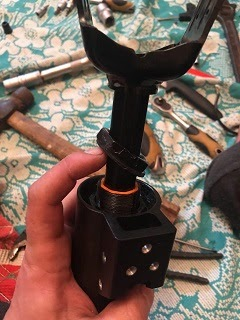]{style="overflow: hidden; display: inline-block; margin: 0.00px 0.00px; border: 0.00px solid #000000; transform: rotate(0.00rad) translateZ(0px); -webkit-transform: rotate(0.00rad) translateZ(0px); width: 240.00px; height: 320.00px;"} {#h.987bws4wh6t1 .c30 .c84}
-----------------------------------------------------------------------------------------------------------------------------------------------------------------------------------------------------------------------------------------------------------------------------------------------------------------------

### [4.1.3 Установка втулки в узел сложения]{.c18} {#h.knxeohriuz20 .c39 .c30}

[Источник:
]{}[[Перейти](https://electrotransport.ru/ussr/index.php?topic%3D48865.msg1305270%23msg1305270&sa=D&source=editors&ust=1636795599090000&usg=AOvVaw3JYjw5AQLeDN64sfpQKzKe){.c11}]{.c7}

[Видео:
]{}[[Перейти](https://youtu.be/Ikg9xlfDYLw&sa=D&source=editors&ust=1636795599090000&usg=AOvVaw3fHZW6y1lmgl0p214xdDN6){.c11}]{.c7}[ ]{.c5}

### [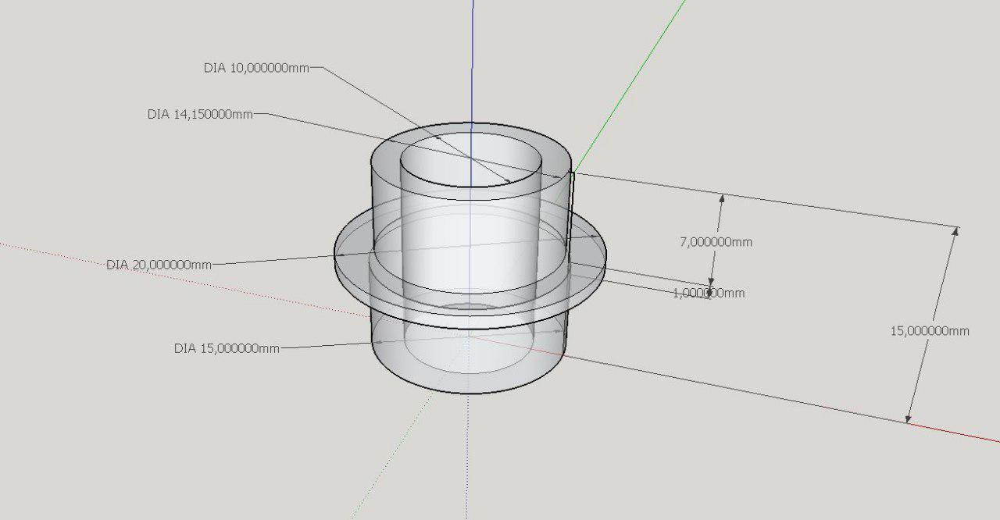]{style="overflow: hidden; display: inline-block; margin: 0.00px 0.00px; border: 0.00px solid #000000; transform: rotate(0.00rad) translateZ(0px); -webkit-transform: rotate(0.00rad) translateZ(0px); width: 700.00px; height: 364.00px;"} {#h.10k696jv59w5 .c30 .c105}

### []{.c18} {#h.2kd78wjug6ve .c39 .c30 .c101}

### [4.1.4 Замена подшипников]{.c18} {#h.vbqf87lfknie .c39 .c30}

[Источник:]{.c5}

[[https://electrotransport.ru/ussr/index.php?topic=48865.msg1237218\#msg1237218](https://electrotransport.ru/ussr/index.php?topic%3D48865.msg1237218%23msg1237218&sa=D&source=editors&ust=1636795599092000&usg=AOvVaw0QeIPGozrB72VNXO3k1oQb){.c11}]{.c7}[ ]{.c5}

[[https://electrotransport.ru/ussr/index.php?topic=48865.msg1292076\#msg1292076](https://electrotransport.ru/ussr/index.php?topic%3D48865.msg1292076%23msg1292076&sa=D&source=editors&ust=1636795599092000&usg=AOvVaw3TOSCrf6CfkkcdQ-Jqwiii){.c11}]{.c7}[ ]{.c5}

[]{.c5}

[Для заднего колеса нужны подшипники 6]{}[2]{.c90}[00, для мотор колеса
600]{}[2 ]{.c90}[(двойка в разных местах)]{.c5}

[]{.c5}

[Заменить стандартные подшипники на закрытые 6200-2RS (10х30х9).
(подходят от отопителя Камаза). Продаются в магазинах
автозапчастей.]{.c5}

[Комментарии пользователей: один нюанс по подшипникам, нужно искать
именно с наличием 2RS в маркировке, у них пыльник контактирует с внешним
и с внутренним кольцом в отличии от RS без цифры 2. Самая хорошая защита
у SKF 6200 2RSH, NSK 6200 DDU, SKF 6200 2RSR.]{.c5}

[]{.c5}

[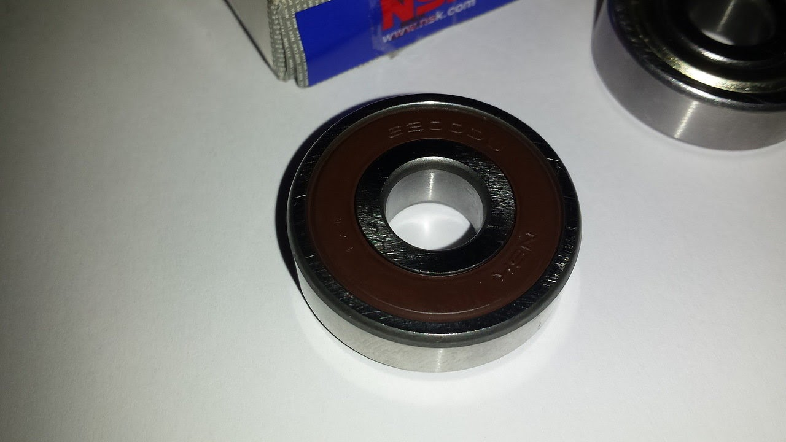]{style="overflow: hidden; display: inline-block; margin: 0.00px 0.00px; border: 0.00px solid #000000; transform: rotate(0.00rad) translateZ(0px); -webkit-transform: rotate(0.00rad) translateZ(0px); width: 178.00px; height: 159.00px;"}

### [4.1.5 Замена резинки в узел сложения]{.c18} {#h.k1e431a4st2z .c39 .c30}

[]{.c5}

[]{#t.d0a2e38d1bed89a44a1058523cba7238cf1840dd}[]{#t.13}
+-----------------------------------+-----------------------------------+
| [Источник:                        | [Источник:                        |
| ]{}[[Перейти](https://t.me/Ninebo | ]{}[[Перейти](https://t.me/Ninebo |
| t_ES/2424&sa=D&source=editors&ust | t_ES/4323&sa=D&source=editors&ust |
| =1636795599095000&usg=AOvVaw1Wd6R | =1636795599096000&usg=AOvVaw3uOng |
| 5sJqrGHfrC2L8DVfB){.c11}]{.c7}    | G2W_OaYPm9VrEJoQT){.c11}]{.c7}    |
|                                   |                                   |
| [Вариант 1. Из короткого отрезка  | [Вариант 2. Из длинного отрезка   |
| топливного шланга 5/14 либо из    | топливного шланга 5/14 либо из    |
| шланга охлаждающей жидкости       | шланга охлаждающей жидкости       |
| 5/11]{.c5}                        | 5/11]{.c5}                        |
|                                   |                                   |
| []{style="overflow: hidd | PeLG7.jpg)]{style="overflow: hidd |
| en; display: inline-block; margin | en; display: inline-block; margin |
| : 0.00px 0.00px; border: 0.00px s | : 0.00px 0.00px; border: 0.00px s |
| olid #000000; transform: rotate(0 | olid #000000; transform: rotate(0 |
| .00rad) translateZ(0px); -webkit- | .00rad) translateZ(0px); -webkit- |
| transform: rotate(0.00rad) transl | transform: rotate(0.00rad) transl |
| ateZ(0px); width: 185.00px; heigh | ateZ(0px); width: 317.00px; heigh |
| t: 195.00px;"}                    | t: 178.67px;"}                    |
|                                   |                                   |
| []{.c5}                           |                                   |
+-----------------------------------+-----------------------------------+

### [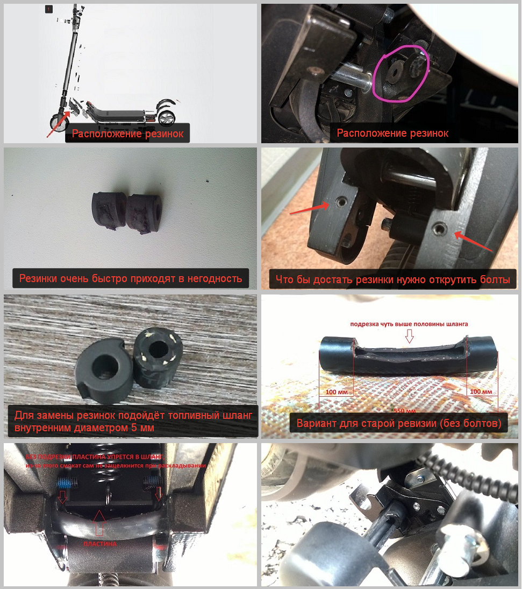]{style="overflow: hidden; display: inline-block; margin: 0.00px 0.00px; border: 0.00px solid #000000; transform: rotate(0.00rad) translateZ(0px); -webkit-transform: rotate(0.00rad) translateZ(0px); width: 700.00px; height: 789.33px;"} {#h.1u3y8n9mnpr5 .c105 .c30}

### [4.1.6 Установка шайбы гровера в узел крепления руля]{.c18} {#h.c31g9eqg7kod .c39 .c30}

[Отлично прошло тестирование. После замены болтов и установки установки
шайбы Гровера ничего не раскручивается даже без смазки фиксатором
резьбы.
(]{}[[источник](https://t.me/NINEBOT_ES/24951&sa=D&source=editors&ust=1636795599098000&usg=AOvVaw3b3Ijc1SntaZFbBsObWzjZ){.c11}]{.c7}[)]{.c5}

[]{style="overflow: hidden; display: inline-block; margin: 0.00px 0.00px; border: 0.00px solid #000000; transform: rotate(0.00rad) translateZ(0px); -webkit-transform: rotate(0.00rad) translateZ(0px); width: 173.00px; height: 100.00px;"}[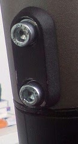]{style="overflow: hidden; display: inline-block; margin: 0.00px 0.00px; border: 0.00px solid #000000; transform: rotate(0.00rad) translateZ(0px); -webkit-transform: rotate(0.00rad) translateZ(0px); width: 130.00px; height: 239.00px;"}

[]{.c5}

### [4.1.7 Установка прокладки в узле соединения рулевой стойки с рулевой колонкой]{.c18} {#h.5xqbypb7fgw1 .c39 .c30}

[От болтанки руля хорошо спасает прокладка из фторопластовой пластины
0,2 мм
(]{}[[источник](https://t.me/NINEBOT_ES/16784&sa=D&source=editors&ust=1636795599099000&usg=AOvVaw1NV3yM7dXUzQjw9mqexlEf){.c11}]{.c7}[),
либо медная пластина 0,22 мм.
(]{}[[источник](https://t.me/NINEBOT_ES/20090&sa=D&source=editors&ust=1636795599099000&usg=AOvVaw2PO-CfpnKTR_jZUN116lVE){.c11}]{.c7}[)
либо армированным скотчем
(]{}[[источник](https://t.me/NINEBOT_ES/33970&sa=D&source=editors&ust=1636795599099000&usg=AOvVaw3ilSogpG8epZPV3HqSTBlt){.c11}]{.c7}[)]{.c5}

[]{.c5}

[Где купить: ]{.c5}

[[http://prodiel.ru/index.php?cat=120](http://prodiel.ru/index.php?cat%3D120&sa=D&source=editors&ust=1636795599100000&usg=AOvVaw3R2mwTo3PkVJjUmOFKlySk){.c11}]{.c7}

[[http://prodiel.ru/index.php?cat=149](http://prodiel.ru/index.php?cat%3D149&sa=D&source=editors&ust=1636795599101000&usg=AOvVaw2GEAbvfr-1_LBLBu-vTFIV){.c11}]{.c7}[ ]{.c5}

[]{style="overflow: hidden; display: inline-block; margin: 0.00px 0.00px; border: 0.00px solid #000000; transform: rotate(0.00rad) translateZ(0px); -webkit-transform: rotate(0.00rad) translateZ(0px); width: 180.00px; height: 320.00px;"}

### [4.1.8 Установка заднего пневмо колеса]{.c18} {#h.4wa6xfqym1d5 .c39 .c30}

[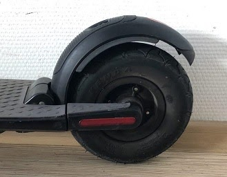]{style="overflow: hidden; display: inline-block; margin: 0.00px 0.00px; border: 0.00px solid #000000; transform: rotate(0.00rad) translateZ(0px); -webkit-transform: rotate(0.00rad) translateZ(0px); width: 329.00px; height: 256.00px;"}

[]{.c5}

[Источник
(]{}[[перейти](https://t.me/NINEBOT_ES/74507&sa=D&source=editors&ust=1636795599102000&usg=AOvVaw2hn_9JQpR09FayhQMIu89G){.c11}]{.c7}[):
Колесо приобреталось здесь:
]{}[[https://www.eltreco.ru/market/catalog/spares/item/PAT\_DRIVE\_P\_KOLESO/](https://www.eltreco.ru/market/catalog/spares/item/PAT_DRIVE_P_KOLESO/&sa=D&source=editors&ust=1636795599102000&usg=AOvVaw1S66Sg1TjwW9ja_dBMH2H5){.c11}]{.c7}

[[https://ecodrift.ru/shop/koleso-perednee-elektrosamokata-starway-speedway-mini4/](https://ecodrift.ru/shop/koleso-perednee-elektrosamokata-starway-speedway-mini4/&sa=D&source=editors&ust=1636795599103000&usg=AOvVaw13tnZhye9zMmniK86eRufF){.c11}]{.c7}[ ]{.c5}

[Со слов автора лучше брать с чёрным диском (внешне выглядит лучше, чем
серебряный). Покрышку сразу поменял на Kenda 200\*50.]{.c5}

### [4.1.9 Установка топливного шланга под язычок тормозной колодки]{.c18} {#h.f5epxhf8x5xc .c39 .c30}

[]{style="overflow: hidden; display: inline-block; margin: 0.00px 0.00px; border: 0.00px solid #000000; transform: rotate(0.00rad) translateZ(0px); -webkit-transform: rotate(0.00rad) translateZ(0px); width: 274.50px; height: 262.12px;"}

[Первоначально была установлена термоусаживаемая трубка и кусок резины
из камеры. Хватало на одну-две поездки.]{.c5}

[В итоге стоковая ось 6мм в диаметре была заменена на шпильку 4 мм и
установлен топливный шланг, который брался для ]{}[[замены резинок в
узле сложения](#h.k1e431a4st2z){.c11}]{.c7}[.]{.c5}

### [4.1.10 Установка заднего колеса с барабанным тормозом]{.c18} {#h.5edb09n1g8p4 .c39 .c30}

[Источник:
]{}[[https://t.me/NINEBOT\_ES/123709](https://t.me/NINEBOT_ES/123709&sa=D&source=editors&ust=1636795599104000&usg=AOvVaw19jwAEvctgfem9pd5gkiNk){.c11}]{.c7}

[Купить колесо:
]{}[[https://s.click.aliexpress.com/e/veceJfG](https://s.click.aliexpress.com/e/veceJfG&sa=D&source=editors&ust=1636795599105000&usg=AOvVaw3JPUr-qPPpRgeiflJnFsSC){.c11}]{.c7}[ ]{.c5}

[]{.c5}

[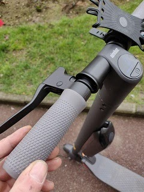]{style="overflow: hidden; display: inline-block; margin: 0.00px 0.00px; border: 0.00px solid #000000; transform: rotate(0.00rad) translateZ(0px); -webkit-transform: rotate(0.00rad) translateZ(0px); width: 240.00px; height: 320.00px;"}[]{style="overflow: hidden; display: inline-block; margin: 0.00px 0.00px; border: 0.00px solid #000000; transform: rotate(0.00rad) translateZ(0px); -webkit-transform: rotate(0.00rad) translateZ(0px); width: 156.00px; height: 320.00px;"}

[]{.c5}

### [4.1.10 Установка на мотор колесо ободного тормоза]{.c18} {#h.24ixjak9m1wy .c39 .c30}

[[https://t.me/NINEBOT\_ES/171240](https://t.me/NINEBOT_ES/171240&sa=D&source=editors&ust=1636795599107000&usg=AOvVaw2yl6usIT7NOk8DHvQ80Pa7){.c11}]{.c7}

[]{.c5}

[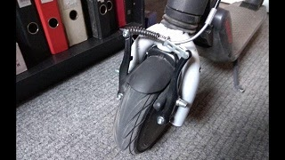]{style="overflow: hidden; display: inline-block; margin: 0.00px 0.00px; border: 0.00px solid #000000; transform: rotate(0.00rad) translateZ(0px); -webkit-transform: rotate(0.00rad) translateZ(0px); width: 320.00px; height: 180.00px;"}[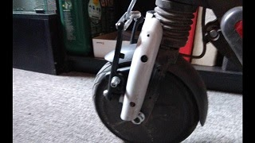]{style="overflow: hidden; display: inline-block; margin: 0.00px 0.00px; border: 0.00px solid #000000; transform: rotate(0.00rad) translateZ(0px); -webkit-transform: rotate(0.00rad) translateZ(0px); width: 320.00px; height: 180.00px;"}

[]{.c5}

### [4.1.10 Установка на заднее колесо дискового тормоза]{.c18} {#h.rwnrls7d5wlu .c39 .c30}

[[https://t.me/NINEBOT\_ES/154706](https://t.me/NINEBOT_ES/154706&sa=D&source=editors&ust=1636795599108000&usg=AOvVaw3npDnaeUiy45NwjHSyswD5){.c11}]{.c7}[ ]{.c5}

[]{style="overflow: hidden; display: inline-block; margin: 0.00px 0.00px; border: 0.00px solid #000000; transform: rotate(0.00rad) translateZ(0px); -webkit-transform: rotate(0.00rad) translateZ(0px); width: 430.00px; height: 392.00px;"}

[]{.c5}

### [4.1.11 Замена покрышки]{.c18} {#h.8mw4shypjj06 .c39 .c30}

[Видео 1:
]{}[[https://youtu.be/aa3wUTuo1VU](https://youtu.be/aa3wUTuo1VU&sa=D&source=editors&ust=1636795599109000&usg=AOvVaw3ItQxAjAkuGaWjYgs6BG50){.c11}]{.c7}[ ]{.c5}

[Видео 2:
]{}[[https://youtu.be/E4ivQrBA-YM](https://youtu.be/E4ivQrBA-YM&sa=D&source=editors&ust=1636795599110000&usg=AOvVaw3x7nABcIx38dhKKcPYt02l){.c11}]{.c7}[ ]{.c5}

[]{.c5}

[Покрышка оригинальная в разрезе:]{.c5}

[Источник:
]{}[[https://t.me/NINEBOT\_ES/124540](https://t.me/NINEBOT_ES/124540&sa=D&source=editors&ust=1636795599111000&usg=AOvVaw038ziaZ0rhcFu-nYHaxW8r){.c11}]{.c7}[ ]{.c5}

[]{.c5}

[]{style="overflow: hidden; display: inline-block; margin: 0.00px 0.00px; border: 0.00px solid #000000; transform: rotate(0.00rad) translateZ(0px); -webkit-transform: rotate(0.00rad) translateZ(0px); width: 156.00px; height: 320.00px;"}

[]{.c5}

### [4.1.12 Установка мотор колеса от Xiaomi Miija m365]{.c18} {#h.jjkvq4c3hygn .c39 .c30}

[Источник:
]{}[[https://t.me/NINEBOT\_ES/105486](https://t.me/NINEBOT_ES/105486&sa=D&source=editors&ust=1636795599112000&usg=AOvVaw2ft0VTjxG4a2_SQenoKDLF){.c11}]{.c7}[ ]{}

[]{.c5}

[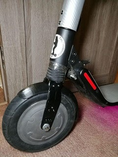]{style="overflow: hidden; display: inline-block; margin: 0.00px 0.00px; border: 0.00px solid #000000; transform: rotate(0.00rad) translateZ(0px); -webkit-transform: rotate(0.00rad) translateZ(0px); width: 240.00px; height: 320.00px;"}

### [4.1.13 Установка пневмо покрышки на мотор колесо]{.c18} {#h.scoxdao649d6 .c39 .c30}

[Источник:
]{}[[https://t.me/NINEBOT\_ES/121790](https://t.me/NINEBOT_ES/121790&sa=D&source=editors&ust=1636795599113000&usg=AOvVaw3FYzNUkywhisd78U8Xbfxd){.c11}]{.c7}[ ]{.c5}

[]{.c5}

[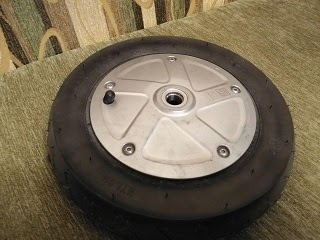]{style="overflow: hidden; display: inline-block; margin: 0.00px 0.00px; border: 0.00px solid #000000; transform: rotate(0.00rad) translateZ(0px); -webkit-transform: rotate(0.00rad) translateZ(0px); width: 320.00px; height: 240.00px;"}

[4.2 Амортизаторы]{.c10} {#h.a88imn2bakwx .c8}
------------------------

### [4.2.1 Пыльник для заднего амортизатора]{.c18} {#h.e35tr3yh5u94 .c39 .c30}

[]{.c5}

[]{#t.0fd8ee56b17a0762e362d198cbc4e02e001f88a6}[]{#t.14}
+-----------------------------------+-----------------------------------+
| [Источник: ]{.c5}                 | [Источник:                        |
|                                   | ]{}[[Перейти](https://t.me/Ninebo |
| [[Перейти](https://t.me/Ninebot_E | t_ES/8639&sa=D&source=editors&ust |
| S/12521&sa=D&source=editors&ust=1 | =1636795599119000&usg=AOvVaw0CMKv |
| 636795599115000&usg=AOvVaw0OUaald | WCC00Mkq_P2MP5wVK){.c11}]{.c7}    |
| JvNb-8nrdMhwqpe){.c11}]{.c7}      |                                   |
|                                   | [Установка пыльника из            |
| [[Перейти](https://electrotranspo | силиконовой трубки.]{.c5}         |
| rt.ru/ussr/index.php?topic%3D4886 |                                   |
| 5.msg1326466%23msg1326466&sa=D&so | []{style="overflow: hidd |
| ){.c11}]{.c7}                     | en; display: inline-block; margin |
|                                   | : 0.00px 0.00px; border: 0.00px s |
| [Пыльник из велосипедной          | olid #000000; transform: rotate(0 |
| камеры.]{.c5}                     | .00rad) translateZ(0px); -webkit- |
|                                   | transform: rotate(0.00rad) transl |
| [Желательно подобрать камеру      | ateZ(0px); width: 147.09px; heigh |
| размером приблизительно равной    | t: 261.50px;"}[{.c11}]{.c7} | 02dpGWaPipAnK3MJoDf.jpg)]{style=" |
|                                   | overflow: hidden; display: inline |
| []{style="overflow: hidd | form: rotate(0.00rad) translateZ( |
| en; display: inline-block; margin | 0px); -webkit-transform: rotate(0 |
| : 0.00px 0.00px; border: 0.00px s | .00rad) translateZ(0px); width: 1 |
| olid #000000; transform: rotate(0 | 48.22px; height: 263.50px;"}      |
| .00rad) translateZ(0px); -webkit- |                                   |
| transform: rotate(0.00rad) transl | []{.c5}                           |
| ateZ(0px); width: 320.00px; heigh |                                   |
| t: 180.00px;"}                    |                                   |
|                                   |                                   |
| []{style="overflow: hidd |                                   |
| en; display: inline-block; margin |                                   |
| : 0.00px 0.00px; border: 0.00px s |                                   |
| olid #000000; transform: rotate(0 |                                   |
| .00rad) translateZ(0px); -webkit- |                                   |
| transform: rotate(0.00rad) transl |                                   |
| ateZ(0px); width: 320.00px; heigh |                                   |
| t: 180.00px;"}                    |                                   |
|                                   |                                   |
| [Дополнительная защита из         |                                   |
| ]{}[[сантехнических переходных    |                                   |
| манжет 32х40                      |                                   |
| мм](https://leroymerlin.ru/produc |                                   |
| t/manzheta-perehodnaya-trehlepest |                                   |
| kovaya-simtek-32h40-mm-cvet-chern |                                   |
| yy-12627353/&sa=D&source=editors& |                                   |
| ust=1636795599118000&usg=AOvVaw0C |                                   |
| T8GrhhKF-BnSXG4ixzvs){.c11}]{.c7} |                                   |
|                                   |                                   |
| []{.c5}                           |                                   |
|                                   |                                   |
| []{style="overflow: hidd |                                   |
| en; display: inline-block; margin |                                   |
| : 0.00px 0.00px; border: 0.00px s |                                   |
| olid #000000; transform: rotate(0 |                                   |
| .00rad) translateZ(0px); -webkit- |                                   |
| transform: rotate(0.00rad) transl |                                   |
| ateZ(0px); width: 320.00px; heigh |                                   |
| t: 180.00px;"}                    |                                   |
|                                   |                                   |
| []{.c5}                           |                                   |
+-----------------------------------+-----------------------------------+
| [Не рабочий вариант.]{.c82}       | []{.c5}                           |
|                                   |                                   |
| [Источник:                        |                                   |
| ]{}[[Перейти](https://electrotran |                                   |
| sport.ru/ussr/index.php?topic%3D4 |                                   |
| 8865.msg1289429%23msg1289429%2520 |                                   |
| https://t.me/Ninebot_ES/2170&sa=D |                                   |
| &source=editors&ust=1636795599121 |                                   |
| 000&usg=AOvVaw1Ni5LbTJZbqmsfJeSQW |                                   |
| IiO){.c11}]{.c7}                  |                                   |
|                                   |                                   |
| [Подходит трубка внутренним       |                                   |
| диаметром 35 мм.]{.c5}            |                                   |
|                                   |                                   |
| [Примечание: необходимо           |                                   |
| додумывать дополнительную защиту. |                                   |
| После неаккуратной поездки        |                                   |
| пыльник моментально рвется, а в   |                                   |
| отверстие попадает грязь.]{.c5}   |                                   |
|                                   |                                   |
| []{style="overflow: hidd |                                   |
| en; display: inline-block; margin |                                   |
| : 0.00px 0.00px; border: 0.00px s |                                   |
| olid #000000; transform: rotate(0 |                                   |
| .00rad) translateZ(0px); -webkit- |                                   |
| transform: rotate(0.00rad) transl |                                   |
| ateZ(0px); width: 256.38px; heigh |                                   |
| t: 192.50px;"}[]{style=" |                                   |
| overflow: hidden; display: inline |                                   |
| -block; margin: 0.00px 0.00px; bo |                                   |
| rder: 0.00px solid #000000; trans |                                   |
| form: rotate(0.00rad) translateZ( |                                   |
| 0px); -webkit-transform: rotate(0 |                                   |
| .00rad) translateZ(0px); width: 1 |                                   |
| 46.50px; height: 195.33px;"}[]{style="overflow: hidden; d |                                   |
| isplay: inline-block; margin: 0.0 |                                   |
| 0px 0.00px; border: 0.00px solid  |                                   |
| #000000; transform: rotate(0.00ra |                                   |
| d) translateZ(0px); -webkit-trans |                                   |
| form: rotate(0.00rad) translateZ( |                                   |
| 0px); width: 108.50px; height: 19 |                                   |
| 4.50px;"}                         |                                   |
+-----------------------------------+-----------------------------------+

[]{.c5}

### [4.2.2 Доработка заднего амортизатора]{.c18} {#h.bnk15ygrq1a5 .c39 .c30}

#### [4.2.2.1 Установка прокладок/втулок]{.c20} {#h.dd2jez97p2jk .c89 .c30}

[]{.c5}

[]{#t.1b040f1b90852c3acc1626b3134681633492b052}[]{#t.15}
+-----------------------------------+-----------------------------------+
| [С изготовлением деталей на 3d    | [Замена на амортизатор от         |
| принтере]{.c5}                    | самоката Oxelo]{.c5}              |
|                                   |                                   |
| [Источник:]{.c5}                  | [Источник:                        |
|                                   | ]{}[[Перейти](https://electrotran |
| [1 часть:                         | sport.ru/ussr/index.php?topic%3D4 |
| ]{}[[Перейти](https://electrotran | 8865.msg1293359%23msg1293359&sa=D |
| sport.ru/ussr/index.php?topic%3D4 | &source=editors&ust=1636795599127 |
| 8865.msg1284375%23msg1284375&sa=D | 000&usg=AOvVaw2F_8cNAaO3TG7iemHZs |
| &source=editors&ust=1636795599125 | N04){.c11}]{.c7}                  |
| 000&usg=AOvVaw1yP21vEiY2HModM1xzW |                                   |
| iJD){.c11}]{.c7}                  | [Купить амортизатор               |
|                                   | ]{}[[https://www.decathlon.ru/nab |
| [2 часть:                         | or-podveskatormoz-town-7xl\_e1-id |
| ]{}[[Перейти](https://electrotran | \_8161741.html](https://www.decat |
| sport.ru/ussr/index.php?topic%3D4 | hlon.ru/nabor-podveskatormoz-town |
| 8865.msg1285331%23msg1285331&sa=D | -7xl_e1-id_8161741.html&sa=D&sour |
| &source=editors&ust=1636795599126 | ce=editors&ust=1636795599128000&u |
| 000&usg=AOvVaw1atAOuAjNTsY-JhmHut | sg=AOvVaw0LDPQwakS6dTfr6xllp5v9){ |
| DSw){.c11}]{.c7}                  | .c11}]{.c7}[ ]{.c5}               |
|                                   |                                   |
| [Полностью расписано по ссылкам   | []{.c5}                           |
| выше]{.c5}                        |                                   |
|                                   | []{style="overflow: hidd |
| 8CQgO.jpg)]{style="overflow: hidd | en; display: inline-block; margin |
| en; display: inline-block; margin | : 0.00px 0.00px; border: 0.00px s |
| : 0.00px 0.00px; border: 0.00px s | olid #000000; transform: rotate(0 |
| olid #000000; transform: rotate(0 | .00rad) translateZ(0px); -webkit- |
| .00rad) translateZ(0px); -webkit- | transform: rotate(0.00rad) transl |
| transform: rotate(0.00rad) transl | ateZ(0px); width: 306.17px; heigh |
| ateZ(0px); width: 203.50px; heigh | t: 177.50px;"}                    |
| t: 270.58px;"}                    |                                   |
|                                   | []{.c20}                          |
| []{.c20}                          |                                   |
+-----------------------------------+-----------------------------------+
| [Установка прокладки из           | [Видео от испанца]{.c5}           |
| фторопласта]{.c5}                 |                                   |
|                                   | [Источник:                        |
| [Источник: ]{}[[Часть             | ]{}[[Перейти](https://t.me/NINEBO |
| 1](https://t.me/Ninebot_ES/1209&s | TES/3024&sa=D&source=editors&ust= |
| a=D&source=editors&ust=1636795599 | 1636795599133000&usg=AOvVaw1j9lC_ |
| 129000&usg=AOvVaw3OsPMoVnA41ezg0d | 66BoS5CiZLe6lbeN){.c11}]{.c7}     |
| lKt-Zu){.c11}]{.c7}[ ]{}[[Часть   |                                   |
| 2](https://t.me/Ninebot_ES/3808&s | [Доработка амортизатора от        |
| a=D&source=editors&ust=1636795599 | испанца с видео.]{.c5}            |
| 130000&usg=AOvVaw30mchK4HnlE7IyFf |                                   |
| 3j_kcA){.c11}]{.c7}[ ]{.c5}       | []{style="overflow: hidd |
| фторопласта. Фторопласт брал тут  | en; display: inline-block; margin |
| ]{}[[http://prodiel.ru/index.php? | : 0.00px 0.00px; border: 0.00px s |
| cat=120](http://prodiel.ru/index. | olid #000000; transform: rotate(0 |
| php?cat%3D120&sa=D&source=editors | .00rad) translateZ(0px); -webkit- |
| &ust=1636795599130000&usg=AOvVaw3 | transform: rotate(0.00rad) transl |
| Npo6RaVKP_0U72SMzr4Rb){.c11}]{.c7 | ateZ(0px); width: 168.23px; heigh |
| }[ ]{.c5}                         | t: 295.50px;"}                    |
|                                   |                                   |
| [Сантехнические прокладки тут     | []{.c20}                          |
| ]{}[[https://leroymerlin.ru/produ |                                   |
| ct/prokladka-equation-12627775/]( |                                   |
| https://leroymerlin.ru/product/pr |                                   |
| okladka-equation-12627775/&sa=D&s |                                   |
| ource=editors&ust=163679559913100 |                                   |
| 0&usg=AOvVaw1DKDu_9gYkQ-bk1NCNRql |                                   |
| I){.c11}]{.c7}[ ]{.c5}            |                                   |
|                                   |                                   |
| [Отзыв по проверке прокладки      |                                   |
| после 20 км.                      |                                   |
| ]{}[[https://t.me/Ninebot\_ES/381 |                                   |
| 3](https://t.me/Ninebot_ES/3813&s |                                   |
| a=D&source=editors&ust=1636795599 |                                   |
| 131000&usg=AOvVaw33MgUQGOPYeLrS6d |                                   |
| A0F7Ng){.c11}]{.c7}[ ]{.c5}       |                                   |
|                                   |                                   |
| [Как вариант можно использовать   |                                   |
| прокладку из ]{}[[пластиковой     |                                   |
| крышки](https://t.me/Ninebot_ES/8 |                                   |
| 637&sa=D&source=editors&ust=16367 |                                   |
| 95599132000&usg=AOvVaw3FWUDLXlUeb |                                   |
| 5Hipi2PV_Pe){.c11}]{.c7}[.]{.c5}  |                                   |
|                                   |                                   |
| []{style="overflow: hidd |                                   |
| en; display: inline-block; margin |                                   |
| : 0.00px 0.00px; border: 0.00px s |                                   |
| olid #000000; transform: rotate(0 |                                   |
| .00rad) translateZ(0px); -webkit- |                                   |
| transform: rotate(0.00rad) transl |                                   |
| ateZ(0px); width: 161.50px; heigh |                                   |
| t: 205.06px;"}[]{style=" |                                   |
| overflow: hidden; display: inline |                                   |
| -block; margin: 0.00px 0.00px; bo |                                   |
| rder: 0.00px solid #000000; trans |                                   |
| form: rotate(0.00rad) translateZ( |                                   |
| 0px); -webkit-transform: rotate(0 |                                   |
| .00rad) translateZ(0px); width: 1 |                                   |
| 20.50px; height: 202.66px;"}[]{style="overflow: hidden; d |                                   |
| isplay: inline-block; margin: 0.0 |                                   |
| 0px 0.00px; border: 0.00px solid  |                                   |
| #000000; transform: rotate(0.00ra |                                   |
| d) translateZ(0px); -webkit-trans |                                   |
| form: rotate(0.00rad) translateZ( |                                   |
| 0px); width: 161.50px; height: 12 |                                   |
| 0.19px;"}[]{style="overf |                                   |
| low: hidden; display: inline-bloc |                                   |
| k; margin: 0.00px 0.00px; border: |                                   |
|  0.00px solid #000000; transform: |                                   |
|  rotate(0.00rad) translateZ(0px); |                                   |
|  -webkit-transform: rotate(0.00ra |                                   |
| d) translateZ(0px); width: 123.30 |                                   |
| px; height: 132.50px;"}           |                                   |
|                                   |                                   |
| []{.c20}                          |                                   |
+-----------------------------------+-----------------------------------+
| [Изготовление вкладыша из         | [С установкой подшипников.        |
| полиморфуса]{.c5}                 | Подшипники роликовые, 10х14х10 по |
|                                   | краям 2 штуки и в середине        |
| [Источник:                        | 10х14х12, можно использовать      |
| ]{}[[Перейти](https://t.me/Ninebo | втулку напечатанную на том же 3д  |
| t_ES/4455&sa=D&source=editors&ust | принтере за место подшипника      |
| =1636795599135000&usg=AOvVaw2wVkU | посередине]{.c5}                  |
| Dzr0ikwiAJt8bISdH){.c11}]{.c7}    |                                   |
|                                   | [Источник:                        |
| []{style="overflow: hidd | =1636795599136000&usg=AOvVaw30K6i |
| en; display: inline-block; margin | _eKLb05-VHeC7wgLt){.c11}]{.c7}    |
| : 0.00px 0.00px; border: 0.00px s |                                   |
| olid #000000; transform: rotate(0 | [ translateZ(0px); -webkit- | 29dENYXOI_Rnv4wIwtm9O1a1RBGGhBBGz |
| transform: rotate(0.00rad) transl | 0P2KL.jpg)]{style="overflow: hidd |
| ateZ(0px); width: 150.14px; heigh | en; display: inline-block; margin |
| t: 200.50px;"}                    | : 0.00px 0.00px; border: 0.00px s |
|                                   | olid #000000; transform: rotate(0 |
|                                   | .00rad) translateZ(0px); -webkit- |
|                                   | transform: rotate(0.00rad) transl |
|                                   | ateZ(0px); width: 317.00px; heigh |
|                                   | t: 178.67px;"}                    |
+-----------------------------------+-----------------------------------+

#### [4.2.2.2 Установка мебельных заглушек 17х17]{.c20} {#h.oqhet3bd0bg5 .c30 .c89}

[Источник:
]{}[[Перейти](https://t.me/Ninebot_ES/3810&sa=D&source=editors&ust=1636795599138000&usg=AOvVaw3gZvywAFa7-ZRfP_QX-KmL){.c11}]{.c7}[ ]{.c5}

[Выполнено с целью избавиться от лишних шумов, как указано в
]{}[[видео](https://youtu.be/X_DZFGyOrGo&sa=D&source=editors&ust=1636795599138000&usg=AOvVaw1fdZUiW9CyWYXq5hwM3D6g){.c11}]{.c7}[.]{.c5}

[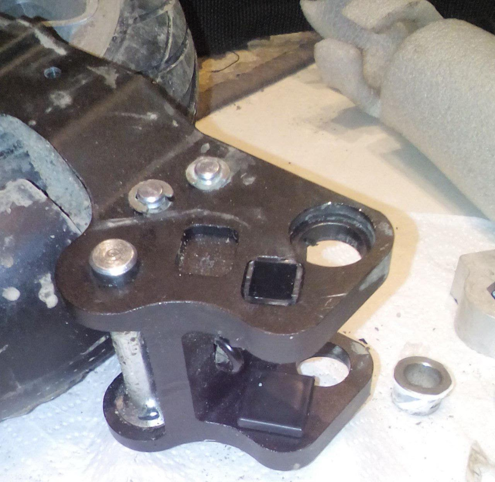]{style="overflow: hidden; display: inline-block; margin: 0.00px 0.00px; border: 0.00px solid #000000; transform: rotate(0.00rad) translateZ(0px); -webkit-transform: rotate(0.00rad) translateZ(0px); width: 174.53px; height: 170.50px;"}[]{style="overflow: hidden; display: inline-block; margin: 0.00px 0.00px; border: 0.00px solid #000000; transform: rotate(0.00rad) translateZ(0px); -webkit-transform: rotate(0.00rad) translateZ(0px); width: 121.38px; height: 232.50px;"}[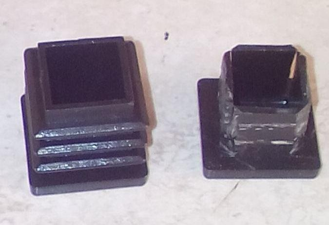]{style="overflow: hidden; display: inline-block; margin: 0.00px 0.00px; border: 0.00px solid #000000; transform: rotate(0.00rad) translateZ(0px); -webkit-transform: rotate(0.00rad) translateZ(0px); width: 181.50px; height: 124.39px;"}

#### [4.2.2.3 Замена пружины]{.c20} {#h.qv0kelov8gk .c89 .c30}

[Источник:
]{}[[Перейти](https://t.me/Ninebot_ES/5972&sa=D&source=editors&ust=1636795599139000&usg=AOvVaw36snqY87Xfnqu_5q1bOQ_6){.c11}]{.c7}

[В Корее ставят пружины разного цвета в зависимости от жесткости
пружины.]{.c5}

[Размеры можно посмотреть
]{}[[здесь](#h.picla3at4qdc){.c11}]{.c7}[.]{.c5}

[]{style="overflow: hidden; display: inline-block; margin: 0.00px 0.00px; border: 0.00px solid #000000; transform: rotate(0.00rad) translateZ(0px); -webkit-transform: rotate(0.00rad) translateZ(0px); width: 204.50px; height: 153.93px;"}[]{style="overflow: hidden; display: inline-block; margin: 0.00px 0.00px; border: 0.00px solid #000000; transform: rotate(0.00rad) translateZ(0px); -webkit-transform: rotate(0.00rad) translateZ(0px); width: 332.50px; height: 155.12px;"} {#h.2miq011idtrf .c84 .c30}
----------------------------------------------------------------------------------------------------------------------------------------------------------------------------------------------------------------------------------------------------------------------------------------------------------------------------------------------------------------------------------------------------------------------------------------------------------------------------------------------------------------------------------------------------------------------------------------------------------------------------------------------

### [4.2.3 Доработка переднего амортизатора]{.c18} {#h.3hhjg0yap5em .c39 .c30}

[Источник:
]{}[[Перейти](https://electrotransport.ru/ussr/index.php?topic%3D48865.msg1329882%23msg1329882&sa=D&source=editors&ust=1636795599141000&usg=AOvVaw1rz-nkVWMgLLVjQrBFAzPB){.c11}]{.c7}[ (Только
описательная часть без фото).]{.c5}

[4.3 Электроника]{.c10} {#h.r16o2ot8tmx8 .c8}
-----------------------

### [4.3.1 Защита кабеля]{.c18} {#h.piojl4z92hod .c39 .c30}

[]{#t.806d4ba5684ff491bcbe3119370d4718498b8c12}[]{#t.16}
+-----------------------------------+-----------------------------------+
| [Тканевой оплеткой]{.c40}         | [Кабельной оплеткой]{.c40}        |
|                                   |                                   |
| [Источник:                        | [Источник:                        |
| ]{}[[Перейти](https://electrotran | ]{}[[Перейти](https://t.me/Ninebo |
| sport.ru/ussr/index.php?topic%3D4 | t_ES/2123&sa=D&source=editors&ust |
| 8865.msg1235851%23msg1235851&sa=D | =1636795599144000&usg=AOvVaw0lAsW |
| &source=editors&ust=1636795599143 | Ox2iP8ICxO7e_FLu6){.c11}]{.c7}    |
| 000&usg=AOvVaw04IRcIxanMN-uJETvrI |                                   |
| Q5S){.c11}]{.c7}                  | []{style="overflow: hidd |
| XO0gWavurOsL1PJqh7mJYysV5SW8Tcj2U | en; display: inline-block; margin |
| TPRp8.jpg)]{style="overflow: hidd | : 0.00px 0.00px; border: 0.00px s |
| en; display: inline-block; margin | olid #000000; transform: rotate(0 |
| : 0.00px 0.00px; border: 0.00px s | .00rad) translateZ(0px); -webkit- |
| olid #000000; transform: rotate(0 | transform: rotate(0.00rad) transl |
| .00rad) translateZ(0px); -webkit- | ateZ(0px); width: 209.50px; heigh |
| transform: rotate(0.00rad) transl | t: 189.02px;"}                    |
| ateZ(0px); width: 192.50px; heigh |                                   |
| t: 200.00px;"}                    |                                   |
+-----------------------------------+-----------------------------------+
| [Из гофрированной трубки]{.c40}   | [Защита пружинкой]{.c40}          |
|                                   |                                   |
| [Источник:                        | [Источник:                        |
| ]{}[[Перейти](https://electrotran | ]{}[[Перейти](https://electrotran |
| sport.ru/ussr/index.php?topic%3D4 | sport.ru/ussr/index.php?topic%3D4 |
| 8865.msg1281673%23msg1281673&sa=D | 8865.msg1286428%23msg1286428&sa=D |
| &source=editors&ust=1636795599145 | &source=editors&ust=1636795599146 |
| 000&usg=AOvVaw3Xr0keBlCPiGYH2fpna | 000&usg=AOvVaw0sngacw2APP5YRaFbp9 |
| Jfa){.c11}]{.c7}                  | Swt){.c11}]{.c7}                  |
|                                   |                                   |
| []{style="overflow: hidd | s_j07.jpg)]{style="overflow: hidd |
| en; display: inline-block; margin | en; display: inline-block; margin |
| : 0.00px 0.00px; border: 0.00px s | : 0.00px 0.00px; border: 0.00px s |
| olid #000000; transform: rotate(0 | olid #000000; transform: rotate(0 |
| .00rad) translateZ(0px); -webkit- | .00rad) translateZ(0px); -webkit- |
| transform: rotate(0.00rad) transl | transform: rotate(0.00rad) transl |
| ateZ(0px); width: 162.45px; heigh | ateZ(0px); width: 219.50px; heigh |
| t: 180.50px;"}                    | t: 180.44px;"}                    |
+-----------------------------------+-----------------------------------+

[Прочие решения:]{.c5}

[[Скруглить угол об который трётся
кабель](https://t.me/Ninebot_ES/3538&sa=D&source=editors&ust=1636795599147000&usg=AOvVaw0lxvGBbi4gsJG_sCKCwuBt){.c11}]{.c7}

[[Использовать прокладку из
коробки](https://t.me/Ninebot_ES/3526&sa=D&source=editors&ust=1636795599148000&usg=AOvVaw1STSlkl1pYHtPOBTVyj05L){.c11}]{.c7}

### [4.3.2 Гидроизоляция электрики в деке]{.c18} {#h.yifg9dqxy73g .c39 .c30}

[Источник: ]{.c5}

[Часть 1:
]{}[[Перейти](https://t.me/Ninebot_ES/2047&sa=D&source=editors&ust=1636795599149000&usg=AOvVaw3oFzJdHr5y34qkEhitxC9f){.c11}]{.c7}

[Часть 2:
]{}[[Перейти](https://t.me/Ninebot_ES/2158&sa=D&source=editors&ust=1636795599149000&usg=AOvVaw1y2cIb4WGd69anAKAyxWub){.c11}]{.c7}

[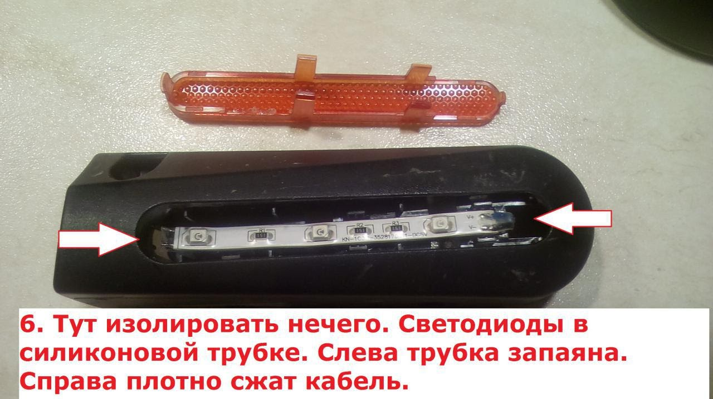]{style="overflow: hidden; display: inline-block; margin: 0.00px 0.00px; border: 0.00px solid #000000; transform: rotate(0.00rad) translateZ(0px); -webkit-transform: rotate(0.00rad) translateZ(0px); width: 354.17px; height: 199.50px;"}[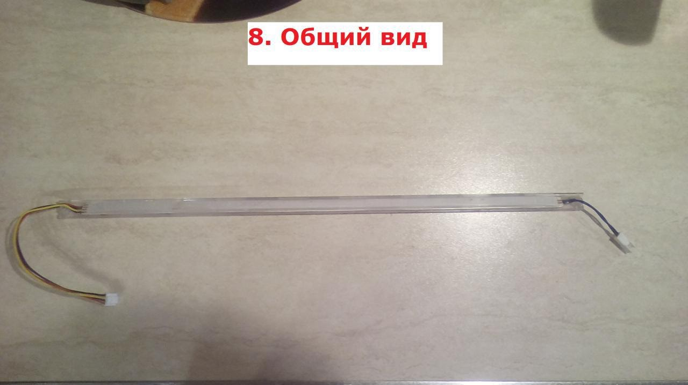]{style="overflow: hidden; display: inline-block; margin: 0.00px 0.00px; border: 0.00px solid #000000; transform: rotate(0.00rad) translateZ(0px); -webkit-transform: rotate(0.00rad) translateZ(0px); width: 350.81px; height: 196.50px;"} {#h.kws37mdorqd1 .c84 .c30}
----------------------------------------------------------------------------------------------------------------------------------------------------------------------------------------------------------------------------------------------------------------------------------------------------------------------------------------------------------------------------------------------------------------------------------------------------------------------------------------------------------------------------------------------------------------------------------------------------------------------------------------------

### [4.3.3 Защита от шума внешней батареи.]{.c18} {#h.i8ruannrr7ma .c39 .c30}

[Источник:
]{}[[Перейти](https://t.me/Ninebot_ES/7904&sa=D&source=editors&ust=1636795599150000&usg=AOvVaw3NKxOCtPwfYupp8PozRFju){.c11}]{.c7}

[Со слов автора: “По рекомендации Ивана исправил эффект «телеги» во
внешнем аккумуляторе. Открутил боковые блоки, где лента. Приклеил белый
рассеиватель света к пластику. Проклеил внутри оконным уплотнителем.
Звук после сборки пропал полностью и разбирать аккум не пришлось.”]{.c5}

[]{style="overflow: hidden; display: inline-block; margin: 0.00px 0.00px; border: 0.00px solid #000000; transform: rotate(0.00rad) translateZ(0px); -webkit-transform: rotate(0.00rad) translateZ(0px); width: 240.00px; height: 320.00px;"}

### [4.3.4 Кабель-переходник для дополнительной батареи.]{.c18} {#h.85ooxqmnpfbj .c39 .c30}

[Источник:
]{}[[https://t.me/NINEBOT\_ES/199177](https://t.me/NINEBOT_ES/199177&sa=D&source=editors&ust=1636795599152000&usg=AOvVaw0uzZwOzJ3g_vMtmI2mZEfc){.c11}]{.c7}[ ]{.c5}

[Собрал удлинитель для батки, тестовый заезд сегодня утром в 8км - всё
отлично. На фото - процесс. При езде провод свободно свисает из рюкзака,
как на предпоследнем фото, таскать самик в переходах не мешает.]{.c5}

[Разъемы в батке и самокате оставил родные. Ответную часть разъемов
делал из говна и палок: для батки - силовые контакты - xt30, rx-tx -
просто пины откуда-то (пришлось чуть-чуть подточить чтобы влезли). В
самом самокате - тот же xt30 + обычные 2.54 как в ардуине. Провода -
силовые - силиконовые 16awg, для данных - 26awg (не силиконовые, хз), ну
и чтобы люди в метро не пугались - всё в белой термоусадке).]{}

[]{.c5}

[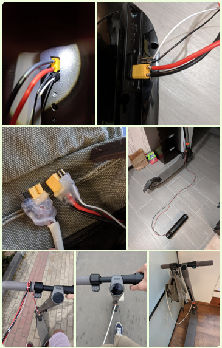]{style="overflow: hidden; display: inline-block; margin: 0.00px 0.00px; border: 0.00px solid #000000; transform: rotate(0.00rad) translateZ(0px); -webkit-transform: rotate(0.00rad) translateZ(0px); width: 365.00px; height: 573.00px;"}

### [4.3.4 Быстросъемная доп.батарея из внутренней.]{.c18} {#h.j7o7b2nbkm75 .c39 .c30}

[Модель для 3д принтера:
]{}[[https://www.thingiverse.com/thing:3702069](https://www.thingiverse.com/thing:3702069&sa=D&source=editors&ust=1636795599153000&usg=AOvVaw0bWanx8P9ugqCymT3zTqZB){.c11}]{.c7}[ ]{}

[]{style="overflow: hidden; display: inline-block; margin: 0.00px 0.00px; border: 0.00px solid #000000; transform: rotate(0.00rad) translateZ(0px); -webkit-transform: rotate(0.00rad) translateZ(0px); width: 234.00px; height: 414.00px;"}

[]{.c5}

[Значения разъемов:]{.c5}

[]{.c5}

[]{#t.b1199f7c2262eaa20727c463701024d8370090f0}[]{#t.17}
+-----------------------------------+-----------------------------------+
| [[https://t.me/NINEBOT\_ES/200585 | [[https://t.me/NINEBOT\_ES/202922 |
| ](https://t.me/NINEBOT_ES/200585& | ](https://t.me/NINEBOT_ES/202922& |
| sa=D&source=editors&ust=163679559 | sa=D&source=editors&ust=163679559 |
| 9156000&usg=AOvVaw1vs7izmLsQ7Y0lK | 9156000&usg=AOvVaw2CEvVTKbtato4-y |
| 3bJ5zEJ){.c11}]{.c7}              | qAy4nHx){.c11}]{.c7}              |
+-----------------------------------+-----------------------------------+
| []{style="overflow: hidd | YzSsH.jpg)]{style="overflow: hidd |
| en; display: inline-block; margin | en; display: inline-block; margin |
| : 0.00px 0.00px; border: 0.00px s | : 0.00px 0.00px; border: 0.00px s |
| olid #000000; transform: rotate(0 | olid #000000; transform: rotate(0 |
| .00rad) translateZ(0px); -webkit- | .00rad) translateZ(0px); -webkit- |
| transform: rotate(0.00rad) transl | transform: rotate(0.00rad) transl |
| ateZ(0px); width: 335.00px; heigh | ateZ(0px); width: 335.00px; heigh |
| t: 596.00px;"}                    | t: 596.00px;"}                    |
+-----------------------------------+-----------------------------------+

[]{.c5}

### [4.3.5 USB разъем]{.c18} {#h.qbgwx4it7nk3 .c39 .c30}

[Источник:
]{}[[https://t.me/NINEBOT\_ES/247213](https://t.me/NINEBOT_ES/247213&sa=D&source=editors&ust=1636795599158000&usg=AOvVaw3PYMbArGyqMYYtfgF1Cdxj){.c11}]{.c7}

[]{.c5}

[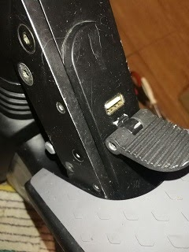]{style="overflow: hidden; display: inline-block; margin: 0.00px 0.00px; border: 0.00px solid #000000; transform: rotate(0.00rad) translateZ(0px); -webkit-transform: rotate(0.00rad) translateZ(0px); width: 240.00px; height: 320.00px;"}

[4.4 Обвес]{.c10} {#h.9qjo54e0t0aw .c8}
-----------------

### [4.4.1 Детский руль]{.c18} {#h.nyie5kwrja6o .c39 .c30}

[]{#t.c89fed6a82d8e8168cfbf5ff1bdbcb3a19418286}[]{#t.18}
+-----------------------+-----------------------+-----------------------+
| [Источник:            | [Источник:            | [Источник:            |
| ]{}[[Перейти](https:/ | ]{}[[Перейти](https:/ | ]{}[[Перейти](https:/ |
| /t.me/Ninebot_ES/1887 | /electrotransport.ru/ | /t.me/Ninebot_ES/3127 |
| &sa=D&source=editors& | ussr/index.php?topic% | &sa=D&source=editors& |
| ust=1636795599160000& | 3D48865.msg1235851%23 | ust=1636795599163000& |
| usg=AOvVaw2c8SZwrqJi_ | msg1235851&sa=D&sourc | usg=AOvVaw2rcHkPFlBWg |
| VjfkvZEGiVq){.c11}]{. | e=editors&ust=1636795 | XGY5un6Tict){.c11}]{. |
| c7}                   | 599161000&usg=AOvVaw3 | c7}                   |
|                       | OcqObsGp_Dp4ddgdmASjn |                       |
| []{.c18}              | ){.c11}]{.c7}         | [Самодельный из трубы |
|                       |                       | и хомута]{.c40}       |
| []{style= | []{.c40}              | UlqPzu5KTxnYOJ1GjB1mR |
| "overflow: hidden; di |                       | RIHmNEyD.jpg)]{style= |
| splay: inline-block;  | []{style= | ; border: 0.00px soli |
|  rotate(0.00rad) tran | "overflow: hidden; di | d #000000; transform: |
| slateZ(0px); -webkit- | splay: inline-block;  |  rotate(0.00rad) tran |
| transform: rotate(0.0 | margin: 0.00px 0.00px | slateZ(0px); -webkit- |
| 0rad) translateZ(0px) | ; border: 0.00px soli | transform: rotate(0.0 |
| ; width: 206.00px; he | d #000000; transform: | 0rad) translateZ(0px) |
| ight: 276.00px;"}     |  rotate(0.00rad) tran | ; width: 206.00px; he |
|                       | slateZ(0px); -webkit- | ight: 116.00px;"}     |
|                       | transform: rotate(0.0 |                       |
|                       | 0rad) translateZ(0px) | []{style= |
|                       | AMDLS5ijVhc37OihXwqW6 | "overflow: hidden; di |
|                       | ktzKZl206NwfDqcPU-b-N | splay: inline-block;  |
|                       | 6thc.jpg)]{style="ove | margin: 0.00px 0.00px |
|                       | rflow: hidden; displa | ; border: 0.00px soli |
|                       | y: inline-block; marg | d #000000; transform: |
|                       | in: 0.00px 0.00px; bo |  rotate(0.00rad) tran |
|                       | rder: 0.00px solid #0 | slateZ(0px); -webkit- |
|                       | 00000; transform: rot | transform: rotate(0.0 |
|                       | ate(0.00rad) translat | 0rad) translateZ(0px) |
|                       | eZ(0px); -webkit-tran | ; width: 206.00px; he |
|                       | sform: rotate(0.00rad | ight: 116.00px;"}     |
|                       | ) translateZ(0px); wi |                       |
|                       | dth: 206.00px; height | []{style= |
|                       |                       | "overflow: hidden; di |
|                       |                       | splay: inline-block;  |
|                       |                       | margin: 0.00px 0.00px |
|                       |                       | ; border: 0.00px soli |
|                       |                       | d #000000; transform: |
|                       |                       |  rotate(0.00rad) tran |
|                       |                       | slateZ(0px); -webkit- |
|                       |                       | transform: rotate(0.0 |
|                       |                       | 0rad) translateZ(0px) |
|                       |                       | ; width: 206.00px; he |
|                       |                       | ight: 114.67px;"}     |
+-----------------------+-----------------------+-----------------------+

### [4.4.2 Брызговики на заднее колесо]{.c18} {#h.97ox0fjwf1l6 .c39 .c30}

[]{.c5}

[]{#t.bf2d6dfe6fe716084686f965559ca87aee946dc4}[]{#t.19}
+-----------------------+-----------------------+-----------------------+
| [Источник:            | [Источник:            | [Источник:            |
| ]{}[[Перейти](https:/ | ]{}[[Перейти](https:/ | ]{}[[Перейти](https:/ |
| /t.me/NINEBOTES/2807& | /t.me/NINEBOTES/2275& | /electrotransport.ru/ |
| sa=D&source=editors&u | sa=D&source=editors&u | ussr/index.php?topic% |
| st=1636795599165000&u | st=1636795599167000&u | 3D48865.msg1289699%23 |
| sg=AOvVaw09PwISRUlTF7 | sg=AOvVaw3kZO2gtB-lQ- | msg1289699&sa=D&sourc |
| BzLtNapXio){.c11}]{.c | g0jKNBy4bY){.c11}]{.c | e=editors&ust=1636795 |
| 7}                    | 7}                    | 599168000&usg=AOvVaw2 |
|                       |                       | an_1JZHkfEikTG9dwGsRs |
| [Из пластиковой       | [Из пластиковой       | ){.c11}]{.c7}         |
| бутылки]{.c5}         | бутылки]{.c5}         |                       |
|                       |                       | [Из пластиковой       |
| [От брызгов защищает, | []{style= | mxAwk6yPuVc5yxbUEdAVQ |
| за колесо.]{.c5}      | "overflow: hidden; di | dK2JP7vNnZF4a5ubxxPEp |
|                       | splay: inline-block;  | 6Js8f8jG.jpg)]{style= |
| []{style= |  rotate(0.00rad) tran | ; border: 0.00px soli |
| "overflow: hidden; di | slateZ(0px); -webkit- | d #000000; transform: |
| splay: inline-block;  | transform: rotate(0.0 |  rotate(0.00rad) tran |
| margin: 0.00px 0.00px | 0rad) translateZ(0px) | slateZ(0px); -webkit- |
| ; border: 0.00px soli | ; width: 166.50px; he | transform: rotate(0.0 |
| d #000000; transform: | ight: 222.27px;"}     | 0rad) translateZ(0px) |
|  rotate(0.00rad) tran |                       | ; width: 161.76px; he |
| slateZ(0px); -webkit- |                       | ight: 224.50px;"}     |
| transform: rotate(0.0 |                       |                       |
| 0rad) translateZ(0px) |                       |                       |
| ; width: 175.50px; he |                       |                       |
| ight: 223.55px;"}     |                       |                       |
+-----------------------+-----------------------+-----------------------+
| [Источник:            | [Источник:            | [Источник:            |
| ]{}[[Перейти](https:/ | ]{}[[Перейти](https:/ | ]{}[[Перейти](https:/ |
| /t.me/NINEBOTES/2257& | /t.me/NINEBOTES/4317& | /t.me/NINEBOT_ES/1270 |
| sa=D&source=editors&u | sa=D&source=editors&u | 59&sa=D&source=editor |
| st=1636795599169000&u | st=1636795599171000&u | s&ust=163679559917200 |
| sg=AOvVaw2EdJVu8GjYvI | sg=AOvVaw1Y_TCeyU3cU- | 0&usg=AOvVaw3_78ZNwTp |
| YbLVGcfrNg){.c11}]{.c | ANwWjkQW0e){.c11}]{.c | 4MFWUEsDjtB9F){.c11}] |
| 7}                    | 7}                    | {.c7}                 |
|                       |                       |                       |
| [Распечатанный на 3д  | [Из пластиковой       | [Крыло распечатанное  |
| принтере]{.c5}        | бутылки]{.c5}         | на 3д принтере.]{.c5} |
|                       |                       |                       |
| [В результате “не     | [{.c11}]{.c7}     |
| /NINEBOTES/2274](http | EWxBB2DR.jpg)]{style= |                       |
| s://t.me/NINEBOTES/22 | "overflow: hidden; di | []{.c5}               |
| 74&sa=D&source=editor | splay: inline-block;  |                       |
| s&ust=163679559917000 | margin: 0.00px 0.00px | [{.c11}] | d #000000; transform: | 0CvlpVJx75Ka_8RTMMAgv |
| {.c7}[ ]{.c5}         |  rotate(0.00rad) tran | NhYRmdBK.png)]{style= |
|                       | slateZ(0px); -webkit- | "overflow: hidden; di |
| [ translateZ(0px) | margin: 0.00px 0.00px |
| 80k3YvOsbMyhX2-nq2yP7 | ; width: 206.00px; he | ; border: 0.00px soli |
| b1w0-5ZD.jpg)]{style= | ight: 114.67px;"}     | d #000000; transform: |
| "overflow: hidden; di |                       |  rotate(0.00rad) tran |
| splay: inline-block;  |                       | slateZ(0px); -webkit- |
| margin: 0.00px 0.00px |                       | transform: rotate(0.0 |
| ; border: 0.00px soli |                       | 0rad) translateZ(0px) |
| d #000000; transform: |                       | ; width: 219.00px; he |
|  rotate(0.00rad) tran |                       | ight: 193.33px;"}     |
| slateZ(0px); -webkit- |                       |                       |
| transform: rotate(0.0 |                       |                       |
| 0rad) translateZ(0px) |                       |                       |
| ; width: 146.00px; he |                       |                       |
| ight: 203.00px;"}     |                       |                       |
+-----------------------+-----------------------+-----------------------+
| [Источник:            | [Источник:            | [Источник:            |
| ]{}[[Перейти](https:/ | ]{}[[Перейти](https:/ | ]{}[[Перейти](https:/ |
| /electrotransport.ru/ | /electrotransport.ru/ | /t.me/Ninebot_ES/1759 |
| ussr/index.php?topic% | ussr/index.php?topic% | 7&sa=D&source=editors |
| 3D48865.msg1298635%23 | 3D48865.msg1306927%23 | &ust=1636795599177000 |
| msg1298635&sa=D&sourc | msg1306927&sa=D&sourc | &usg=AOvVaw2JmOtrZzi_ |
| e=editors&ust=1636795 | e=editors&ust=1636795 | 5rG7jlUzq5CU){.c11}]{ |
| 599174000&usg=AOvVaw2 | 599175000&usg=AOvVaw0 | .c7}                  |
| AQttKtiV08gt7PxqLTmdK | 9A-MsBbRY8TchizbGv5zE |                       |
| ){.c11}]{.c7}         | ){.c11}]{.c7}         | [Брызговик из         |
|                       |                       | скотча.]{.c5}         |
| [Из офисной           | [Шаблон dwg:          |                       |
| папки]{.c5}           | ]{}[[Скачать](https:/ | []{style= |
| a0D8Cel3Dql8Zb2FFWueY | 8865.0;attach%3D21658 | "overflow: hidden; di |
| w9oYZK1k.jpg)]{style= | 8&sa=D&source=editors | splay: inline-block;  |
| "overflow: hidden; di | &ust=1636795599175000 | margin: 0.00px 0.00px |
| splay: inline-block;  | &usg=AOvVaw0xqI-6PpsT | ; border: 0.00px soli |
| margin: 0.00px 0.00px | patBM-IgxYzh){.c11}]{ | d #000000; transform: |
| ; border: 0.00px soli | .c7}                  |  rotate(0.00rad) tran |
| d #000000; transform: |                       | slateZ(0px); -webkit- |
|  rotate(0.00rad) tran | [В таком виде крыло   | transform: rotate(0.0 |
| slateZ(0px); -webkit- | не защищает от брызг  | 0rad) translateZ(0px) |
| transform: rotate(0.0 | летящих сзади.        | ; width: 203.00px; he |
| 0rad) translateZ(0px) | ]{}[[Источник](https: | ight: 360.00px;"}     |
| ; width: 147.41px; he | //t.me/Ninebot_ES/548 |                       |
| ight: 195.50px;"}     | 8&sa=D&source=editors |                       |
|                       | &ust=1636795599176000 |                       |
|                       | &usg=AOvVaw1KA4TVPncN |                       |
|                       | uRY51qpzdqJM){.c11}]{ |                       |
|                       | .c7}                  |                       |
|                       |                       |                       |
|                       | []{.c5}               |                       |
|                       |                       |                       |
|                       | []{style= |                       |
|                       | "overflow: hidden; di |                       |
|                       | splay: inline-block;  |                       |
|                       | margin: 0.00px 0.00px |                       |
|                       | ; border: 0.00px soli |                       |
|                       | d #000000; transform: |                       |
|                       |  rotate(0.00rad) tran |                       |
|                       | slateZ(0px); -webkit- |                       |
|                       | transform: rotate(0.0 |                       |
|                       | 0rad) translateZ(0px) |                       |
|                       | ; width: 206.00px; he |                       |
|                       | ight: 161.33px;"}     |                       |
+-----------------------+-----------------------+-----------------------+
| [Источник:            | [Источник:            | []{.c5}               |
| ]{}[[Перейти](https:/ | ]{}[[Перейти](https:/ |                       |
| /t.me/NINEBOT_ES/1301 | /t.me/NINEBOT_ES/1400 |                       |
| 05&sa=D&source=editor | 39&sa=D&source=editor |                       |
| s&ust=163679559917800 | s&ust=163679559918000 |                       |
| 0&usg=AOvVaw3s_rvZ-5t | 0&usg=AOvVaw36hxH8f66 |                       |
| dDaTNjID3qR3J){.c11}] | v4g9qS9XtZwP-){.c11}] |                       |
| {.c7}                 | {.c7}                 |                       |
|                       |                       |                       |
| [Из папки]{.c5}       | [Из скотча]{.c5}      |                       |
|                       |                       |                       |
| [Есть трафарет        | []{style= |                       |
| tion%3Ddlattach;topic | "overflow: hidden; di |                       |
| %3D48865.0;attach%3D2 | splay: inline-block;  |                       |
| 16415&sa=D&source=edi | margin: 0.00px 0.00px |                       |
| tors&ust=163679559917 | ; border: 0.00px soli |                       |
| 9000&usg=AOvVaw0rM-oC | d #000000; transform: |                       |
| p-0MXn4b4IxK0dzK){.c1 |  rotate(0.00rad) tran |                       |
| 1}]{.c7}              | slateZ(0px); -webkit- |                       |
|                       | transform: rotate(0.0 |                       |
| [ translateZ(0px) |                       |
| sh7x6Rsw-PrWF5pC4NGLY | ; width: 180.00px; he |                       |
| ZErvzuLhgUzBAny3Gaqsx | ight: 320.00px;"}     |                       |
| FlHY___v.jpg)]{style= |                       |                       |
| "overflow: hidden; di |                       |                       |
| splay: inline-block;  |                       |                       |
| margin: 0.00px 0.00px |                       |                       |
| ; border: 0.00px soli |                       |                       |
| d #000000; transform: |                       |                       |
|  rotate(0.00rad) tran |                       |                       |
| slateZ(0px); -webkit- |                       |                       |
| transform: rotate(0.0 |                       |                       |
| 0rad) translateZ(0px) |                       |                       |
| ; width: 219.00px; he |                       |                       |
| ight: 292.00px;"}     |                       |                       |
+-----------------------+-----------------------+-----------------------+

### [4.4.3 Защита крыла от боковой грязи]{.c18} {#h.ddwm6zurnip4 .c39 .c30}

[]{#t.50e75b2379a2134886d3fd1a72e9006d2e4b9024}[]{#t.20}
+-----------------------------------+-----------------------------------+
| [Из уплотнителя ]{.c69}[жабо ВАЗ  | [Источник:                        |
| 2110]{.c5}                        | ]{}[[Перейти](https://t.me/Ninebo |
|                                   | t_ES/1912&sa=D&source=editors&ust |
| [Источник: ]{}[[Ссылка            | =1636795599184000&usg=AOvVaw3sU6g |
| 1](https://t.me/NINEBOTES/4388&sa | RVBbMp2uQyn1ppXZk){.c11}]{.c7}    |
| =D&source=editors&ust=16367955991 |                                   |
| 82000&usg=AOvVaw3ZhgTSWVrISWjs39U | [Из уплотнителя типа Z (пока      |
| 6UHkl){.c11}]{.c7}[ ]{}[[Ссылка   | только заказан на Али).]{.c5}     |
| 2](https://t.me/Ninebot_ES/1694&s |                                   |
| a=D&source=editors&ust=1636795599 | []{.c5}                           |
| 182000&usg=AOvVaw2Q-sxaIo-QbGCTiu |                                   |
| iO2fS_){.c11}]{.c7}               | []{style="overflow: hidd |
| ]{}[[отзыва](https://t.me/Ninebot | en; display: inline-block; margin |
| _ES/3988&sa=D&source=editors&ust= | : 0.00px 0.00px; border: 0.00px s |
| 1636795599183000&usg=AOvVaw3-ku8E | olid #000000; transform: rotate(0 |
| eEvxRjR88fROQpqx){.c11}]{.c7}[ по | .00rad) translateZ(0px); -webkit- |
| лностью                           | transform: rotate(0.00rad) transl |
| избавиться от грязи не            | ateZ(0px); width: 201.50px; heigh |
| получилось, но в любом случае     | t: 201.50px;"}                    |
| стало лучше, чем было.]{.c5}      |                                   |
|                                   |                                   |
| []{style="overflow: hidd |                                   |
| en; display: inline-block; margin |                                   |
| : 0.00px 0.00px; border: 0.00px s |                                   |
| olid #000000; transform: rotate(0 |                                   |
| .00rad) translateZ(0px); -webkit- |                                   |
| transform: rotate(0.00rad) transl |                                   |
| ateZ(0px); width: 146.50px; heigh |                                   |
| t: 201.19px;"}[]{style=" |                                   |
| overflow: hidden; display: inline |                                   |
| -block; margin: 0.00px 0.00px; bo |                                   |
| rder: 0.00px solid #000000; trans |                                   |
| form: rotate(0.00rad) translateZ( |                                   |
| 0px); -webkit-transform: rotate(0 |                                   |
| .00rad) translateZ(0px); width: 1 |                                   |
| 12.12px; height: 199.50px;"}      |                                   |
|                                   |                                   |
| []{.c5}                           |                                   |
+-----------------------------------+-----------------------------------+
| [Источник: ]{}[[Ссылка            | [Источник:                        |
| 1](https://t.me/Ninebot_ES/584&sa | ]{.c69}[[Перейти](https://electro |
| =D&source=editors&ust=16367955991 | transport.ru/ussr/index.php?topic |
| 86000&usg=AOvVaw1FvukeGBNe3Yq1dj9 | %3D48865.msg1302524%23msg1302524& |
| 0kbpe){.c11}]{.c7}[ ]{}[[Ссылка   | sa=D&source=editors&ust=163679559 |
| 2](https://t.me/Ninebot_ES/7311&s | 9189000&usg=AOvVaw0oJ9s4oM_kWORyy |
| a=D&source=editors&ust=1636795599 | wWgC38C){.c11}]{.c7}              |
| 187000&usg=AOvVaw1dGAsCkqFDhj3OtL |                                   |
| DdSUoG){.c11}]{.c7}[ ]{}[[Ссылка  | [Есть трафарет                    |
| 3](https://t.me/Ninebot_ES/7317&s | ]{.c69}[[скачать](https://electro |
| a=D&source=editors&ust=1636795599 | transport.ru/ussr/index.php?actio |
| 187000&usg=AOvVaw0HC84wj0I8IYm-x_ | n%3Ddlattach;topic%3D48865.0;atta |
| OiTLTq){.c11}]{.c7}               | ch%3D216415&sa=D&source=editors&u |
|                                   | st=1636795599189000&usg=AOvVaw3vV |
| [Из скотча с испытаниями.         | AMsDYfPQtjUvJIwUG7K){.c11}]{.c7}  |
| Избавляет от грязи, но со         |                                   |
| временем начинает коробиться      | [Согласно                         |
| брызговик и скотч и выглядит      | ]{.c69}[[отзыва](https://t.me/Nin |
| соответственно некомильфо.]{.c5}  | ebot_ES/4261&sa=D&source=editors& |
|                                   | ust=1636795599190000&usg=AOvVaw1v |
| []{.c5}                           | aQTltDdkAqzdD3fVUXoh){.c11}]{.c7} |
|                                   | [ полностью                       |
| []{style="overflow: hidd | меньше.]{.c40}                    |
| en; display: inline-block; margin |                                   |
| : 0.00px 0.00px; border: 0.00px s | []{.c40}                          |
| olid #000000; transform: rotate(0 |                                   |
| .00rad) translateZ(0px); -webkit- | [ transl | 1cjdXrWJzQkc73lKFPMbi75KkJ73mzBWH |
| ateZ(0px); width: 264.50px; heigh | hNoq0.jpg)]{style="overflow: hidd |
| t: 149.35px;"}                    | en; display: inline-block; margin |
|                                   | : 0.00px 0.00px; border: 0.00px s |
| []{.c5}                           | olid #000000; transform: rotate(0 |
|                                   | .00rad) translateZ(0px); -webkit- |
| [ transl |
| SYrpytEgcsk44PjbXqVI0H-L6gcs7WePT | ateZ(0px); width: 189.50px; heigh |
| mmccW.jpg)]{style="overflow: hidd | t: 188.62px;"}                    |
| en; display: inline-block; margin |                                   |
| : 0.00px 0.00px; border: 0.00px s |                                   |
| olid #000000; transform: rotate(0 |                                   |
| .00rad) translateZ(0px); -webkit- |                                   |
| transform: rotate(0.00rad) transl |                                   |
| ateZ(0px); width: 143.03px; heigh |                                   |
| t: 120.50px;"}[]{style=" |                                   |
| overflow: hidden; display: inline |                                   |
| -block; margin: 0.00px 0.00px; bo |                                   |
| rder: 0.00px solid #000000; trans |                                   |
| form: rotate(0.00rad) translateZ( |                                   |
| 0px); -webkit-transform: rotate(0 |                                   |
| .00rad) translateZ(0px); width: 1 |                                   |
| 47.76px; height: 119.50px;"}      |                                   |
+-----------------------------------+-----------------------------------+

### [4.4.4 Брызговик на деку]{.c18} {#h.w0qafbevk9jp .c39 .c30}

[Источник:
]{}[[Перейти](https://electrotransport.ru/ussr/index.php?topic%3D48865.msg1293186%23msg1293186&sa=D&source=editors&ust=1636795599191000&usg=AOvVaw39BqwqtaCysOdm6HQxp6v_){.c11}]{.c7}

[]{.c5}

[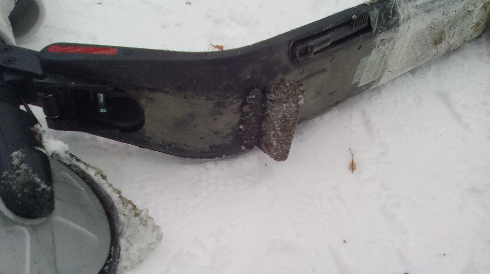]{style="overflow: hidden; display: inline-block; margin: 0.00px 0.00px; border: 0.00px solid #000000; transform: rotate(0.00rad) translateZ(0px); -webkit-transform: rotate(0.00rad) translateZ(0px); width: 374.50px; height: 209.65px;"}

### [4.4.5 Брызговик на переднее колесо]{.c18} {#h.smmsg91xraf7 .c39 .c30}

[Источник:
]{}[[Перейти](https://electrotransport.ru/ussr/index.php?topic%3D48865.msg1306302%23msg1306302&sa=D&source=editors&ust=1636795599192000&usg=AOvVaw3ysMjUzAIyRrJ4Eg7cyF23){.c11}]{.c7}

[С фото по разборке]{.c5}

[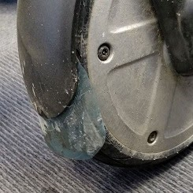]{style="overflow: hidden; display: inline-block; margin: 0.00px 0.00px; border: 0.00px solid #000000; transform: rotate(0.00rad) translateZ(0px); -webkit-transform: rotate(0.00rad) translateZ(0px); width: 207.50px; height: 207.50px;"}[ ]{}[]{style="overflow: hidden; display: inline-block; margin: 0.00px 0.00px; border: 0.00px solid #000000; transform: rotate(0.00rad) translateZ(0px); -webkit-transform: rotate(0.00rad) translateZ(0px); width: 154.88px; height: 207.50px;"} {#h.94g04lgh7zh .c84 .c30}
---------------------------------------------------------------------------------------------------------------------------------------------------------------------------------------------------------------------------------------------------------------------------------------------------------------------------------------------------------------------------------------------------------------------------------------------------------------------------------------------------------------------------------------------------------------------------------------------------------------------------------------------------

[]{.c5}

[4.5 Прочее]{.c10} {#h.duqid7tmwqti .c8}
------------------

### [4.5.1 Утепление батареи]{.c18} {#h.ugwfinjmalek .c39 .c30}

[Источник: ]{.c5}

[[https://t.me/Ninebot\_ES/478](https://t.me/Ninebot_ES/478&sa=D&source=editors&ust=1636795599194000&usg=AOvVaw3XKSgLznwgkprHA99Tsuyc){.c11}]{.c7}[ ]{.c5}

[]{.c5}

[Подходит трубки внутренним диаметром 57 мм.]{.c5}

[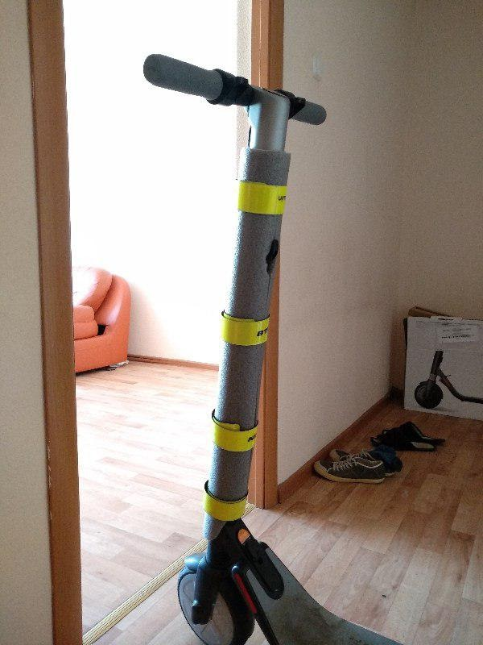]{style="overflow: hidden; display: inline-block; margin: 0.00px 0.00px; border: 0.00px solid #000000; transform: rotate(0.00rad) translateZ(0px); -webkit-transform: rotate(0.00rad) translateZ(0px); width: 174.59px; height: 233.50px;"}[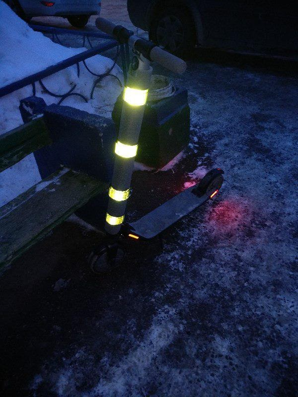]{style="overflow: hidden; display: inline-block; margin: 0.00px 0.00px; border: 0.00px solid #000000; transform: rotate(0.00rad) translateZ(0px); -webkit-transform: rotate(0.00rad) translateZ(0px); width: 176.63px; height: 235.50px;"}

[]{.c5}

[Источник: ]{.c5}

[[https://t.me/NINEBOT\_ES/115114](https://t.me/NINEBOT_ES/115114&sa=D&source=editors&ust=1636795599195000&usg=AOvVaw3nHj884Jwr3Vrj4_6ynlYe){.c11}]{.c7}[ ]{.c5}

[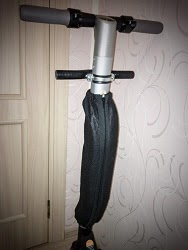]{style="overflow: hidden; display: inline-block; margin: 0.00px 0.00px; border: 0.00px solid #000000; transform: rotate(0.00rad) translateZ(0px); -webkit-transform: rotate(0.00rad) translateZ(0px); width: 188.00px; height: 250.00px;"}[]{style="overflow: hidden; display: inline-block; margin: 0.00px 0.00px; border: 0.00px solid #000000; transform: rotate(0.00rad) translateZ(0px); -webkit-transform: rotate(0.00rad) translateZ(0px); width: 188.50px; height: 251.33px;"}

### [4.5.2 Переноска на руль]{.c18} {#h.7t9fxp31spit .c39 .c30}

[]{.c5}

[]{#t.4eae19dbf9d014e34a219c8708de5094faa4244d}[]{#t.21}
+-----------------------------------+-----------------------------------+
| [Источник:                        | [Источник:                        |
| ]{}[[Перейти](https://t.me/Ninebo | ]{}[[Перейти](https://electrotran |
| t_ES/3013&sa=D&source=editors&ust | sport.ru/ussr/index.php?topic%3D4 |
| =1636795599197000&usg=AOvVaw0OjqM | 8865.msg1328250%23msg1328250&sa=D |
| kpd2vABJPejE0A87T){.c11}]{.c7}[ ] | &source=editors&ust=1636795599198 |
| {.c5}                             | 000&usg=AOvVaw2hTDqV_9fT4pJTdKc9w |
|                                   | Xh7){.c11}]{.c7}                  |
| ### []{style="overflow:  |                                   |
| hidden; display: inline-block; ma | []{style="overflow: hidd |
| te(0.00rad) translateZ(0px); -web | en; display: inline-block; margin |
| kit-transform: rotate(0.00rad) tr | : 0.00px 0.00px; border: 0.00px s |
| anslateZ(0px); width: 187.50px; h | olid #000000; transform: rotate(0 |
| eight: 105.13px;"}[ translateZ(0px); -webkit- |
| ilWPwgVWOHtsVgZ1Bk2GfdRrj45h_ebD1 | transform: rotate(0.00rad) transl |
| 9pSnM0Bs3F6DXnMM1kTQ1sX.jpg)]{sty | ateZ(0px); width: 335.00px; heigh |
| le="overflow: hidden; display: in | t: 188.00px;"}                    |
| line-block; margin: 0.00px 0.00px |                                   |
| ; border: 0.00px solid #000000; t |                                   |
| ransform: rotate(0.00rad) transla |                                   |
| teZ(0px); -webkit-transform: rota |                                   |
| te(0.00rad) translateZ(0px); widt |                                   |
| h: 187.87px; height: 104.83px;"}  |                                   |
| {#h.p0uihzo61aw4 .c105 .c30}      |                                   |
+-----------------------------------+-----------------------------------+
| [Источник:                        | []{.c5}                           |
| ]{}[[Перейти](https://electrotran |                                   |
| sport.ru/ussr/index.php?topic%3D4 |                                   |
| 8865.msg1335881%23msg1335881&sa=D |                                   |
| &source=editors&ust=1636795599199 |                                   |
| 000&usg=AOvVaw2jzkKuiddabe-ewX-Ff |                                   |
| FjX){.c11}]{.c7}                  |                                   |
|                                   |                                   |
| []{.c5}                           |                                   |
|                                   |                                   |
| []{style="overflow: hidd |                                   |
| en; display: inline-block; margin |                                   |
| : 0.00px 0.00px; border: 0.00px s |                                   |
| olid #000000; transform: rotate(0 |                                   |
| .00rad) translateZ(0px); -webkit- |                                   |
| transform: rotate(0.00rad) transl |                                   |
| ateZ(0px); width: 320.00px; heigh |                                   |
| t: 180.00px;"}                    |                                   |
|                                   |                                   |
| []{.c5}                           |                                   |
+-----------------------------------+-----------------------------------+

### [4.5.3 Ремень на руль]{.c18} {#h.vczi0viaetpr .c39 .c30}

[]{.c5}

[]{#t.a947015fcdc7c6608fd6c6e3b1b1748001919b0c}[]{#t.22}
+-----------------------------------+-----------------------------------+
| [Источник:                        | [Источник:                        |
| ]{}[[Перейти](https://t.me/Ninebo | ]{}[[Перейти](https://electrotran |
| t_ES/3603&sa=D&source=editors&ust | sport.ru/ussr/index.php?topic%3D4 |
| =1636795599201000&usg=AOvVaw0lU_- | 8865.msg1311402%23msg1311402&sa=D |
| AgLdlVqTiDRTGiz5D){.c11}]{.c7}    | &source=editors&ust=1636795599203 |
|                                   | 000&usg=AOvVaw13O2-aOFyjyGpkluPZ0 |
| [Отзыв:                           | t9k){.c11}]{.c7}                  |
| ]{}[[Перейти](https://t.me/Ninebo |                                   |
| t_ES/3607&sa=D&source=editors&ust | []{.c5}                           |
| =1636795599202000&usg=AOvVaw0b3v- |                                   |
| 452iD7JW-eiIqzIHW){.c11}]{.c7}    | []{style="overflow: hidd |
| Eu5g-IoIZd97ytUkgTFqSZFXQybwSehfa | en; display: inline-block; margin |
| M_jnB.jpg)]{style="overflow: hidd | : 0.00px 0.00px; border: 0.00px s |
| en; display: inline-block; margin | olid #000000; transform: rotate(0 |
| : 0.00px 0.00px; border: 0.00px s | .00rad) translateZ(0px); -webkit- |
| olid #000000; transform: rotate(0 | transform: rotate(0.00rad) transl |
| .00rad) translateZ(0px); -webkit- | ateZ(0px); width: 187.00px; heigh |
| transform: rotate(0.00rad) transl | t: 243.00px;"}                    |
| ateZ(0px); width: 317.00px; heigh |                                   |
| t: 177.33px;"}                    |                                   |
|                                   |                                   |
| []{.c5}                           |                                   |
+-----------------------------------+-----------------------------------+

### [4.5.4 Защита в месте контакта руля с задним крылом.]{.c18} {#h.7tsomgp53unk .c39 .c30}

[Источник: ]{}[[Исходник на
корейском](https://docs.google.com/document/d/1vC43gIny226W6dJXI6_fTs4uuSUprYa8bew6wChzEtU/edit&sa=D&source=editors&ust=1636795599204000&usg=AOvVaw1Fml-ERtWQg-RH_AgiAnIT){.c11}]{.c7}[ ]{}[[Автоперевод](https://docs.google.com/document/d/1xwSq0Gc27AyJogYoKZlOmzG30ETNhEnHx9ftSmHyaE0/edit%23&sa=D&source=editors&ust=1636795599205000&usg=AOvVaw2rOuFaS-kAc3saFCfbZ0Ym){.c11}]{.c7}

[]{style="overflow: hidden; display: inline-block; margin: 0.00px 0.00px; border: 0.00px solid #000000; transform: rotate(0.00rad) translateZ(0px); -webkit-transform: rotate(0.00rad) translateZ(0px); width: 173.00px; height: 226.00px;"}

### [4.5.5 Чехол]{.c18} {#h.5c3cs72j3d33 .c39 .c30}

[Источник:
]{}[[Перейти](https://t.me/Ninebot_ES/12193&sa=D&source=editors&ust=1636795599206000&usg=AOvVaw04GQJmgiOb23oFqIk8hsIg){.c11}]{.c7}

[]{.c5}

[]{style="overflow: hidden; display: inline-block; margin: 0.00px 0.00px; border: 0.00px solid #000000; transform: rotate(0.00rad) translateZ(0px); -webkit-transform: rotate(0.00rad) translateZ(0px); width: 436.00px; height: 365.00px;"}

[]{.c5}

### [4.5.6 Сиденья]{.c18} {#h.vlswiie0yqla .c39 .c30}

[Источник:]{.c5}

[[Перейти](https://electrotransport.ru/ussr/index.php?topic%3D48865.msg1310834%23msg1310834&sa=D&source=editors&ust=1636795599207000&usg=AOvVaw1h02HGt7cagb7OvPxKrtV_){.c11}]{.c7}

[[Перейти](https://t.me/Ninebot_ES/15282&sa=D&source=editors&ust=1636795599208000&usg=AOvVaw3mq81nXBAAD00ETc8X5ycM){.c11}]{.c7}

[]{style="overflow: hidden; display: inline-block; margin: 0.00px 0.00px; border: 0.00px solid #000000; transform: rotate(0.00rad) translateZ(0px); -webkit-transform: rotate(0.00rad) translateZ(0px); width: 550.00px; height: 299.00px;"}

### [4.5.7 Доработка курка. Избавление от треска при вибрации]{.c18} {#h.fqx01pny328l .c39 .c30}

[Источник:
]{}[[Перейти](https://t.me/NINEBOT_ES/22274&sa=D&source=editors&ust=1636795599209000&usg=AOvVaw1DyrySunmLLaxTrdNCum2J){.c11}]{.c7}

[]{.c5}

[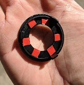]{style="overflow: hidden; display: inline-block; margin: 0.00px 0.00px; border: 0.00px solid #000000; transform: rotate(0.00rad) translateZ(0px); -webkit-transform: rotate(0.00rad) translateZ(0px); width: 165.00px; height: 167.00px;"}

### [4.5.8 Оклейка самоката винилом]{.c18} {#h.8n0p7de7kidf .c39 .c30}

[]{.c5}

[]{#t.dbef478faf3e848a85fee10e9a2249b938f0807d}[]{#t.23}
+-----------------------------------+-----------------------------------+
| [Источник:                        | [Источник:                        |
| ]{}[[Перейти](https://t.me/NINEBO | ]{}[[Перейти](https://t.me/NINEBO |
| T_ES/120015&sa=D&source=editors&u | T_ES/119339&sa=D&source=editors&u |
| st=1636795599210000&usg=AOvVaw2ET | st=1636795599212000&usg=AOvVaw2FX |
| _q07q6-effyWBtf5mCM){.c11}]{.c7}  | CurWJwO_4CD4ELMWgiD){.c11}]{.c7}  |
|                                   |                                   |
| []{.c5}                           | []{.c5}                           |
|                                   |                                   |
| []{style="overflow: hidd | wLOow.jpg)]{style="overflow: hidd |
| en; display: inline-block; margin | en; display: inline-block; margin |
| : 0.00px 0.00px; border: 0.00px s | : 0.00px 0.00px; border: 0.00px s |
| olid #000000; transform: rotate(0 | olid #000000; transform: rotate(0 |
| .00rad) translateZ(0px); -webkit- | .00rad) translateZ(0px); -webkit- |
| transform: rotate(0.00rad) transl | transform: rotate(0.00rad) transl |
| ateZ(0px); width: 240.00px; heigh | ateZ(0px); width: 230.00px; heigh |
| t: 320.00px;"}                    | t: 320.00px;"}                    |
+-----------------------------------+-----------------------------------+

[]{.c5}

### [4.5.9 Стальная планка под дополнительную батарею ]{.c18} {#h.8udkydoyop1g .c39 .c30}

[[https://t.me/NINEBOT\_ES/203068](https://t.me/NINEBOT_ES/203068&sa=D&source=editors&ust=1636795599213000&usg=AOvVaw0XOTz1sZz4aW1VmDcvLBS-){.c11}]{.c7}[ ]{.c5}

[]{.c5}

[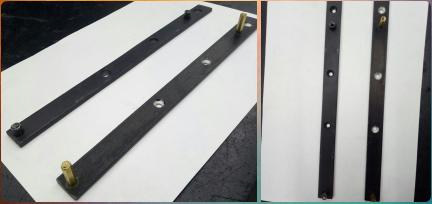]{style="overflow: hidden; display: inline-block; margin: 0.00px 0.00px; border: 0.00px solid #000000; transform: rotate(0.00rad) translateZ(0px); -webkit-transform: rotate(0.00rad) translateZ(0px); width: 432.00px; height: 204.00px;"}

[5 Покупные аксессуары для самоката]{.c78} {#h.21jvuad1sg9r .c60 .c30}
==========================================

------------------------------------------------------------------------

[]{.c5}

[5.1 Детский руль]{.c10} {#h.27cxfxb9tm4n .c8}
------------------------

[]{#t.505c5a5c6e614b27faae1e716059dfa1875754f0}[]{#t.24}
+-----------------------------------+-----------------------------------+
| [Ручки из декатлона]{.c40}        | [Источник:                        |
|                                   | ]{}[[Перейти](https://t.me/NINEBO |
| [Источник:                        | TES/659&sa=D&source=editors&ust=1 |
| ]{}[[Перейти](https://t.me/Ninebo | 636795599216000&usg=AOvVaw3hRgBwx |
| t_ES/1887&sa=D&source=editors&ust | OpvltaIisF31cWK){.c11}]{.c7}      |
| =1636795599216000&usg=AOvVaw0RFG5 |                                   |
| d5yq204EMPe-cXy6a){.c11}]{.c7}    | [На алиэкспресс:                  |
|                                   | ]{}[[Перейти](https://ru.aliexpre |
| []{style="overflow: hidd | l%26cpt%3D1521445382238%26sk%3DuR |
| en; display: inline-block; margin | 7uBY3Rz%26aff_trace_key%3D6ecc55d |
| : 0.00px 0.00px; border: 0.00px s | b4dd14dcd818fc03f2f92c5ea-1521445 |
| olid #000000; transform: rotate(0 | 382238-08566-uR7uBY3Rz%26terminal |
| .00rad) translateZ(0px); -webkit- | _id%3D579d6a071d134b0288222417e67 |
| transform: rotate(0.00rad) transl | 264cd&sa=D&source=editors&ust=163 |
| ateZ(0px); width: 162.50px; heigh | 6795599217000&usg=AOvVaw1hji8OR09 |
| t: 216.91px;"}                    | FnFh2s9hK63-h){.c11}]{.c7}        |
|                                   |                                   |
|                                   | []{.c18}                          |
|                                   |                                   |
|                                   | []{style="overflow: hidd |
|                                   | en; display: inline-block; margin |
|                                   | : 0.00px 0.00px; border: 0.00px s |
|                                   | olid #000000; transform: rotate(0 |
|                                   | .00rad) translateZ(0px); -webkit- |
|                                   | transform: rotate(0.00rad) transl |
|                                   | ateZ(0px); width: 235.50px; heigh |
|                                   | t: 112.18px;"}                    |
+-----------------------------------+-----------------------------------+

[5.2 Брызговики на заднее колесо]{.c10} {#h.ozpqsayz2icr .c8}
---------------------------------------

[]{#t.016ebe9e3a44f97bbbbe20bafb104ddd3bee37c7}[]{#t.25}
+-----------------------------------+-----------------------------------+
| [Источник:                        | [Брызговик Stronglight]{.c5}      |
| ]{}[[Перейти](https://electrotran |                                   |
| sport.ru/ussr/index.php?topic%3D4 | [Источник:                        |
| 8865.msg1289074%23msg1289074&sa=D | ]{}[[Перейти](https://electrotran |
| &source=editors&ust=1636795599218 | sport.ru/ussr/index.php?topic%3D4 |
| 000&usg=AOvVaw06270LYheQTV50qJCf2 | 8865.msg1281673%23msg1281673&sa=D |
| 2KF){.c11}]{.c7}                  | &source=editors&ust=1636795599220 |
|                                   | 000&usg=AOvVaw1yi1O0kdDMNpe-RCghv |
| []{.c5}                           | AZR){.c11}]{.c7}                  |
|                                   |                                   |
| []{style="overflow: hidd | []{style="overflow: hidd |
| olid #000000; transform: rotate(0 | en; display: inline-block; margin |
| .00rad) translateZ(0px); -webkit- | : 0.00px 0.00px; border: 0.00px s |
| transform: rotate(0.00rad) transl | olid #000000; transform: rotate(0 |
| ateZ(0px); width: 131.50px; heigh | .00rad) translateZ(0px); -webkit- |
| t: 175.55px;"}                    | transform: rotate(0.00rad) transl |
|                                   | ateZ(0px); width: 206.00px; heigh |
|                                   | t: 116.00px;"}                    |
+-----------------------------------+-----------------------------------+
| [Брызговик от Omix Store]{.c5}    | []{.c5}                           |
|                                   |                                   |
| [Источник: ]{}[[Ссылка            |                                   |
| 1](https://t.me/NINEBOTES/2748&sa |                                   |
| =D&source=editors&ust=16367955992 |                                   |
| 21000&usg=AOvVaw1MB-VulHBQVC5YeZa |                                   |
| etAnQ){.c11}]{.c7}[ ]{}[[Ссылка   |                                   |
| 2](https://t.me/NINEBOTES/3922&sa |                                   |
| =D&source=editors&ust=16367955992 |                                   |
| 21000&usg=AOvVaw0hS0EtVExhmaJVubY |                                   |
| i780S){.c11}]{.c7}                |                                   |
|                                   |                                   |
| []{.c5}                           |                                   |
|                                   |                                   |
| [Отзыв: брызги всё равно попадают |                                   |
| ]{}[[Ссылка](https://t.me/Ninebot |                                   |
| _ES/3837&sa=D&source=editors&ust= |                                   |
| 1636795599222000&usg=AOvVaw2KqsSf |                                   |
| lc2MZG5VjwDftDx-){.c11}]{.c7}     |                                   |
|                                   |                                   |
| []{.c40}                          |                                   |
|                                   |                                   |
| []{style="overflow: hidd |                                   |
| en; display: inline-block; margin |                                   |
| : 0.00px 0.00px; border: 0.00px s |                                   |
| olid #000000; transform: rotate(0 |                                   |
| .00rad) translateZ(0px); -webkit- |                                   |
| transform: rotate(0.00rad) transl |                                   |
| ateZ(0px); width: 157.50px; heigh |                                   |
| t: 210.25px;"}                    |                                   |
+-----------------------------------+-----------------------------------+

[5.3 Подставка для ребенка]{.c10} {#h.wt65ifb67cnn .c8}
---------------------------------

[Источник:
]{}[[Перейти](https://electrotransport.ru/ussr/index.php?topic%3D48865.msg1289328%23msg1289328&sa=D&source=editors&ust=1636795599223000&usg=AOvVaw15AOw9GbFEkCSwfQ-MHsQo){.c11}]{.c7}

[Где купить:
]{}[[https://www.decathlon.ru/podstavka-dl-rebenka-na-samokat\_e1-id\_8329939.html](https://www.decathlon.ru/podstavka-dl-rebenka-na-samokat_e1-id_8329939.html&sa=D&source=editors&ust=1636795599224000&usg=AOvVaw17D63-fAjcgZi3dMbVwt8p){.c11}]{.c7}[ ]{.c5}

[]{.c5}

[]{style="overflow: hidden; display: inline-block; margin: 0.00px 0.00px; border: 0.00px solid #000000; transform: rotate(0.00rad) translateZ(0px); -webkit-transform: rotate(0.00rad) translateZ(0px); width: 196.42px; height: 262.50px;"}[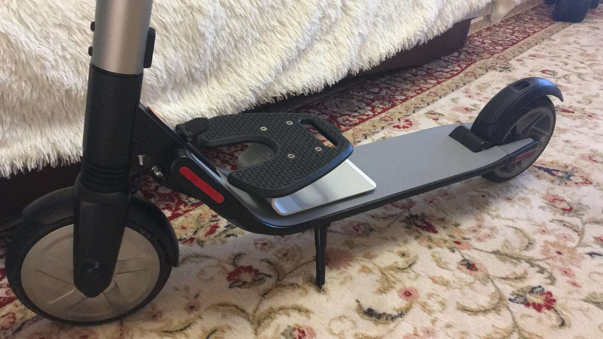]{style="overflow: hidden; display: inline-block; margin: 0.00px 0.00px; border: 0.00px solid #000000; transform: rotate(0.00rad) translateZ(0px); -webkit-transform: rotate(0.00rad) translateZ(0px); width: 386.04px; height: 217.50px;"}

[5.4 Чехол для самоката]{.c10} {#h.cp4ixyp86h08 .c8}
------------------------------

[]{.c5}

[]{#t.3a7457cbf868886c6e8cbae34522570399049e89}[]{#t.26}
+-----------------------------------+-----------------------------------+
| [Продавец Москва:                 | [Продавец СПб:                    |
| ]{}[[tidyrider.ru](http://tidyrid | ]{}[[https://ridersbag.ru/](https |
| er.ru/&sa=D&source=editors&ust=16 | ://ridersbag.ru/&sa=D&source=edit |
| 36795599226000&usg=AOvVaw0FMX3aa_ | ors&ust=1636795599227000&usg=AOvV |
| 1LpvsILcM10vgn){.c11}]{.c7}[ ]{.c | aw3Qe1fy7ROMdtk6LG_jCHzD){.c11}]{ |
| 5}                                | .c7}                              |
|                                   |                                   |
| []{.c5}                           | [Телеграм: @RidersBag]{.c5}       |
|                                   |                                   |
| []{style="overflow: hidd | []{style="overflow: hidd |
| olid #000000; transform: rotate(0 | en; display: inline-block; margin |
| .00rad) translateZ(0px); -webkit- | : 0.00px 0.00px; border: 0.00px s |
| transform: rotate(0.00rad) transl | olid #000000; transform: rotate(0 |
| ateZ(0px); width: 213.50px; heigh | .00rad) translateZ(0px); -webkit- |
| t: 161.57px;"}                    | transform: rotate(0.00rad) transl |
|                                   | ateZ(0px); width: 335.00px; heigh |
| []{style="overflow: hidd |                                   |
| en; display: inline-block; margin |                                   |
| : 0.00px 0.00px; border: 0.00px s |                                   |
| olid #000000; transform: rotate(0 |                                   |
| .00rad) translateZ(0px); -webkit- |                                   |
| transform: rotate(0.00rad) transl |                                   |
| ateZ(0px); width: 215.10px; heigh |                                   |
| t: 161.50px;"}                    |                                   |
+-----------------------------------+-----------------------------------+

[]{.c5}

[]{.c5}

[]{.c5}

[5.5 Ремень на руль]{.c10} {#h.y9hparlpltwm .c8}
--------------------------

[]{.c5}

[]{#t.aeec6285c0d58514f720344c112ef83e4a6c11b0}[]{#t.27}
+-----------------------------------+-----------------------------------+
| [Источник:                        | [Источник:                        |
| ]{}[[Перейти](https://electrotran | ]{}[[Перейти](https://t.me/Ninebo |
| sport.ru/ussr/index.php?topic%3D4 | t_ES/9358&sa=D&source=editors&ust |
| 8865.msg1285893%23msg1285893&sa=D | =1636795599231000&usg=AOvVaw3xz4S |
| &source=editors&ust=1636795599229 | 1YmJJi_g9Pezjqej6){.c11}]{.c7}    |
| 000&usg=AOvVaw1HJhAcesZggSEVIF0u4 |                                   |
| Bm6){.c11}]{.c7}                  | [Алиэкспресс:                     |
|                                   | ]{}[[Перейти](http://s.aliexpress |
| [Продавец:                        | .com/ABzaeMjm&sa=D&source=editors |
| ]{}[[tidyrider.ru](http://tidyrid | &ust=1636795599231000&usg=AOvVaw2 |
| er.ru/&sa=D&source=editors&ust=16 | 8SSzLz2EZKMuAm77Qiumg){.c11}]{.c7 |
| 36795599230000&usg=AOvVaw0YC6wHIq | }                                 |
| q3TWAO5w9mvS8W){.c11}]{.c7}[      |                                   |
| ]{.c5}                            | [Ремень из переноски для          |
|                                   | лыж.]{.c5}                        |
| []{style="overflow: hidd | uzmcBAKIoUNZnWjyenCVmKqSKLWQqrkls |
| en; display: inline-block; margin | YEFEi.jpg)]{style="overflow: hidd |
| : 0.00px 0.00px; border: 0.00px s | en; display: inline-block; margin |
| olid #000000; transform: rotate(0 | : 0.00px 0.00px; border: 0.00px s |
| .00rad) translateZ(0px); -webkit- | olid #000000; transform: rotate(0 |
| transform: rotate(0.00rad) transl | .00rad) translateZ(0px); -webkit- |
| ateZ(0px); width: 192.27px; heigh | transform: rotate(0.00rad) transl |
| t: 256.50px;"}                    | ateZ(0px); width: 180.00px; heigh |
|                                   | t: 320.00px;"}                    |
+-----------------------------------+-----------------------------------+

[5.6 Крепление на стену]{.c10} {#h.t5jztamb88da .c8}
------------------------------

[]{#t.7b65f14bc0e11d3597b035100740c535f26e46a4}[]{#t.28}
+-----------------------------------+-----------------------------------+
| [Источник: ]{}[[Ссылка            | [Источник:                        |
| 1](https://t.me/Ninebot_ES/1700&s | ]{}[[Перейти](https://t.me/Ninebo |
| a=D&source=editors&ust=1636795599 | t_ES/3145&sa=D&source=editors&ust |
| 232000&usg=AOvVaw3nLK-BqLkcJKoGZw | =1636795599234000&usg=AOvVaw2hUSA |
| 6m7N13){.c11}]{.c7}[ ]{}[[Ссылка  | yAdcqym2OVTXLOUFJ){.c11}]{.c7}    |
| 2](https://t.me/Ninebot_ES/2236&s |                                   |
| a=D&source=editors&ust=1636795599 | []{.c5}                           |
| 233000&usg=AOvVaw3yP0OtFjMHdBhj2E |                                   |
| wfA4JN){.c11}]{.c7}               | []{.c5}                           |
|                                   |                                   |
| []{.c5}                           | []{.c5}                           |
|                                   |                                   |
| [Продаются в Леруа Мерлен. ]{.c5} | []{style="overflow: hidd |
|                                   | en; display: inline-block; margin |
| []{style="overflow: hidd | .00rad) translateZ(0px); -webkit- |
| en; display: inline-block; margin | transform: rotate(0.00rad) transl |
| : 0.00px 0.00px; border: 0.00px s | ateZ(0px); width: 152.50px; heigh |
| olid #000000; transform: rotate(0 | t: 202.21px;"}[ translateZ(0px); -webkit- | Y4v4kgoKk6kjGR2WRxHgsOAz81sxBOiSQ |
| transform: rotate(0.00rad) transl | dwpTqOXQJwPaUALr5S9.jpg)]{style=" |
| ateZ(0px); width: 135.38px; heigh | overflow: hidden; display: inline |
| t: 181.50px;"}[]{style=" | form: rotate(0.00rad) translateZ( |
| overflow: hidden; display: inline | 0px); -webkit-transform: rotate(0 |
| -block; margin: 0.00px 0.00px; bo | .00rad) translateZ(0px); width: 1 |
| rder: 0.00px solid #000000; trans | 52.63px; height: 203.50px;"}      |
| form: rotate(0.00rad) translateZ( |                                   |
| 0px); -webkit-transform: rotate(0 | []{.c18}                          |
| .00rad) translateZ(0px); width: 1 |                                   |
| 36.50px; height: 183.39px;"}      |                                   |
|                                   |                                   |
| []{style="overflow: hidd |                                   |
| en; display: inline-block; margin |                                   |
| : 0.00px 0.00px; border: 0.00px s |                                   |
| olid #000000; transform: rotate(0 |                                   |
| .00rad) translateZ(0px); -webkit- |                                   |
| transform: rotate(0.00rad) transl |                                   |
| ateZ(0px); width: 132.50px; heigh |                                   |
| t: 235.44px;"}[]{style=" |                                   |
| overflow: hidden; display: inline |                                   |
| -block; margin: 0.00px 0.00px; bo |                                   |
| rder: 0.00px solid #000000; trans |                                   |
| form: rotate(0.00rad) translateZ( |                                   |
| 0px); -webkit-transform: rotate(0 |                                   |
| .00rad) translateZ(0px); width: 1 |                                   |
| 33.50px; height: 237.45px;"}      |                                   |
+-----------------------------------+-----------------------------------+

[5.7 Звонок]{.c10} {#h.vkf2uq84vol8 .c8}
------------------

[]{#t.bdfc94a42f34e88581397212e5197cb092c69c2e}[]{#t.29}
+-----------------------------------+-----------------------------------+
| [Источник:                        | [Источник:                        |
| ]{}[[Перейти](https://electrotran | ]{}[[Перейти](https://electrotran |
| sport.ru/ussr/index.php?topic%3D4 | sport.ru/ussr/index.php?topic%3D4 |
| 8865.msg1297281%23msg1297281&sa=D | 8865.msg1286825%23msg1286825&sa=D |
| &source=editors&ust=1636795599236 | &source=editors&ust=1636795599238 |
| 000&usg=AOvVaw3kkKwNkTWATcbHz70M7 | 000&usg=AOvVaw2f-mrbmRzs9E-oSXg7T |
| 5CH){.c11}]{.c7}                  | 5Bq){.c11}]{.c7}                  |
|                                   |                                   |
| [Алиэкспресс:                     | [Алиэкспресс:                     |
| ]{}[[Перейти](https://ru.aliexpre | ]{}[[Перейти](http://s.aliexpress |
| ss.com/item/32834707705/328347077 | .com/ZVBfQ7ZF&sa=D&source=editors |
| 05.html?shortkey%3D7FrEv2QN%26add | &ust=1636795599238000&usg=AOvVaw3 |
| resstype%3D600&sa=D&source=editor | RTnEmo95W3ddIdhyci_og){.c11}]{.c7 |
| s&ust=1636795599237000&usg=AOvVaw | }                                 |
| 16_u588LEi_oEKjEhzp_YU){.c11}]{.c |                                   |
| 7}[ ]{.c5}                        | [Видео:                           |
|                                   | ]{}[[Перейти](https://t.me/Kicksc |
| []{style="overflow: hidd | vVaw285uXqfYBUSJDNEW0E7l2d){.c11} |
| en; display: inline-block; margin | ]{.c7}                            |
| : 0.00px 0.00px; border: 0.00px s |                                   |
| olid #000000; transform: rotate(0 | [ translateZ(0px); -webkit- | NNEpEcRSu1SqU9Nnc19bLjY_AVWmVcoRZ |
| transform: rotate(0.00rad) transl | WT1nH.jpg)]{style="overflow: hidd |
| ateZ(0px); width: 146.50px; heigh | en; display: inline-block; margin |
| t: 142.50px;"}                    | : 0.00px 0.00px; border: 0.00px s |
|                                   | olid #000000; transform: rotate(0 |
|                                   | .00rad) translateZ(0px); -webkit- |
|                                   | transform: rotate(0.00rad) transl |
|                                   | ateZ(0px); width: 181.50px; heigh |
|                                   | t: 136.35px;"}                    |
+-----------------------------------+-----------------------------------+
| [Источник:                        | [Источник:                        |
| ]{}[[Перейти](https://t.me/Ninebo | ]{}[[Перейти](https://t.me/Ninebo |
| t_ES/3702&sa=D&source=editors&ust | t_ES/3904&sa=D&source=editors&ust |
| =1636795599240000&usg=AOvVaw378Wx | =1636795599241000&usg=AOvVaw3te0B |
| YLQcXjthGqk8Odyyr){.c11}]{.c7}    | wEfD3R78wXbJ0kFMQ){.c11}]{.c7}    |
|                                   |                                   |
| [Алиэкспресс:                     | []{.c5}                           |
| ]{}[[Перейти](https://ru.aliexpre |                                   |
| ss.com/item/ROCKBROS/32848412484. | [Обычный звонок с веломагазина с  |
| html?pvid%3D4e36da6d-b3be-4b59-ad | резинкой от велокомпьютера]{.c5}  |
| cb-cbd69d95d9eb%26scm%3D1007.1333 |                                   |
| 8.98539.000000000000000%26spm%3Da | []{.c5}                           |
| 2g0v.10010108.1000014.10.36034c97 |                                   |
| 1wniyE%26tpp%3D1%26traffic_analys | []{style="overflow: hidd |
| 26cpt%3D1521898780826%26sk%3DuR7u | en; display: inline-block; margin |
| BY3Rz%26aff_trace_key%3D73f14d2bd | : 0.00px 0.00px; border: 0.00px s |
| 6ec457c8730d9137285e80d-152189878 | olid #000000; transform: rotate(0 |
| 0826-04463-uR7uBY3Rz%26terminal_i | .00rad) translateZ(0px); -webkit- |
| d%3D579d6a071d134b0288222417e6726 | transform: rotate(0.00rad) transl |
| 4cd&sa=D&source=editors&ust=16367 | ateZ(0px); width: 206.00px; heigh |
| 95599240000&usg=AOvVaw3L0RN5q7tBa | t: 116.00px;"}                    |
| uMt3PiA1Fat){.c11}]{.c7}          |                                   |
|                                   |                                   |
| []{style="overflow: hidd |                                   |
| en; display: inline-block; margin |                                   |
| : 0.00px 0.00px; border: 0.00px s |                                   |
| olid #000000; transform: rotate(0 |                                   |
| .00rad) translateZ(0px); -webkit- |                                   |
| transform: rotate(0.00rad) transl |                                   |
| ateZ(0px); width: 145.50px; heigh |                                   |
| t: 194.24px;"}                    |                                   |
+-----------------------------------+-----------------------------------+
| [Источник (видео):                | [Источник:                        |
| ]{}[[Перейти](https://t.me/Ninebo | ]{}[[Перейти](https://t.me/Ninebo |
| t_ES/3696&sa=D&source=editors&ust | t_ES/9886&sa=D&source=editors&ust |
| =1636795599243000&usg=AOvVaw1gQvT | =1636795599244000&usg=AOvVaw1w8lI |
| 3Za1GbffyhY-6RNGe){.c11}]{.c7}    | KBOSvRkvZcEtPeRfL){.c11}]{.c7}    |
|                                   |                                   |
| []{.c5}                           | [Алиэкспресс:                     |
|                                   | ]{}[[Перейти](http://s.aliexpress |
| [Звонок “ORP”]{.c5}               | .com/eeUnQzm2&sa=D&source=editors |
|                                   | &ust=1636795599245000&usg=AOvVaw1 |
| []{.c5}                           | q5NhwrL0G1bNeWDHUDr6G){.c11}]{.c7 |
|                                   | }                                 |
| []{style="overflow: hidd |                                   |
| en; display: inline-block; margin | [Отзыв владельца: “Гудок супер!   |
| : 0.00px 0.00px; border: 0.00px s | Но ОЧЕНЬ громкий...”]{.c5}        |
| olid #000000; transform: rotate(0 |                                   |
| .00rad) translateZ(0px); -webkit- | [ transl | z8NywTYHQ_G6feywMhdUUXQXPApU_aEwU |
| ateZ(0px); width: 131.96px; heigh | yyYQT.jpg)]{style="overflow: hidd |
| t: 137.50px;"}                    | en; display: inline-block; margin |
|                                   | : 0.00px 0.00px; border: 0.00px s |
|                                   | olid #000000; transform: rotate(0 |
|                                   | .00rad) translateZ(0px); -webkit- |
|                                   | transform: rotate(0.00rad) transl |
|                                   | ateZ(0px); width: 206.00px; heigh |
|                                   | t: 137.33px;"}                    |
+-----------------------------------+-----------------------------------+
| [Источник:                        | [Источник:                        |
| ]{}[[Перейти](https://t.me/Ninebo | ]{}[[Перейти](https://t.me/NINEBO |
| t_ES/20553&sa=D&source=editors&us | T_ES/28990&sa=D&source=editors&us |
| t=1636795599246000&usg=AOvVaw3sOu | t=1636795599248000&usg=AOvVaw3Ve7 |
| QVNlCslIz-wKX-NmN2){.c11}]{.c7}   | BQhnwk1bPPxUnMqyNm){.c11}]{.c7}[  |
|                                   | (видео)]{.c5}                     |
| []{.c5}                           |                                   |
|                                   | [Алиэкспресс:                     |
| [[СИГНАЛ MINI                     | ]{}[[Перейти](https://ru.aliexpre |
| HORNET](http://globber-russia.ru/ | ss.com/item/ROCKBROS-Stainless-st |
| accessoire/signal-mini-hornet/&sa | eel-Bicycle-Bell-Bike-Cycling-Hor |
| =D&source=editors&ust=16367955992 | ns-Bike-Handlebar-Bell-Bicycle-Ac |
| 46000&usg=AOvVaw3QStt9iYm9v7NMytz | cessories/32742291754.html?spm%3D |
| Ebm8-){.c11}]{.c7}                | a2g0s.9042311.0.0.4af933ed8XY42G& |
|                                   | sa=D&source=editors&ust=163679559 |
| [{.c11}]{.c7}              |
| TgZn-.jpg)]{style="overflow: hidd |                                   |
| en; display: inline-block; margin | []{.c5}                           |
| : 0.00px 0.00px; border: 0.00px s |                                   |
| olid #000000; transform: rotate(0 | [ translateZ(0px); -webkit- | 34Bucjc1ynZhqbLiWsvlDs19_1qEyJjoY |
| transform: rotate(0.00rad) transl | PunOs.png)]{style="overflow: hidd |
| ateZ(0px); width: 335.00px; heigh | en; display: inline-block; margin |
| t: 188.00px;"}                    | : 0.00px 0.00px; border: 0.00px s |
|                                   | olid #000000; transform: rotate(0 |
| []{.c5}                           | .00rad) translateZ(0px); -webkit- |
|                                   | transform: rotate(0.00rad) transl |
|                                   | ateZ(0px); width: 335.00px; heigh |
|                                   | t: 184.00px;"}                    |
+-----------------------------------+-----------------------------------+

[5.8 Противоугонный трос]{.c10} {#h.qtwmubs2htvp .c8}
-------------------------------

[Источник:
]{}[[Перейти](https://electrotransport.ru/ussr/index.php?topic%3D48865.msg1297281%23msg1297281&sa=D&source=editors&ust=1636795599250000&usg=AOvVaw0LncSFvB3RZ9W_d5SuQQJl){.c11}]{.c7}

[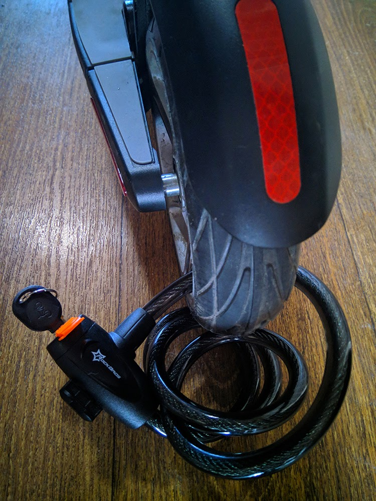]{style="overflow: hidden; display: inline-block; margin: 0.00px 0.00px; border: 0.00px solid #000000; transform: rotate(0.00rad) translateZ(0px); -webkit-transform: rotate(0.00rad) translateZ(0px); width: 239.43px; height: 319.50px;"}

[5.9 Накладка на деку]{.c10} {#h.66ez7fypztgr .c8}
----------------------------

[]{#t.88abd74ee713b2e663e3d548de41f6988c533c5d}[]{#t.30}
+-----------------------------------+-----------------------------------+
| [Источник:                        | [Омикс:                           |
| ]{}[[Перейти](https://t.me/Ninebo | ]{}[[Перейти](https://omix-store. |
| t_ES/2692&sa=D&source=editors&ust | ru/product/kickscooter-es2-5/&sa= |
| =1636795599251000&usg=AOvVaw2JxB2 | D&source=editors&ust=163679559925 |
| _bC3g-6-ZBstBh0ua){.c11}]{.c7}    | 3000&usg=AOvVaw32hpeiz-FiJCEp3FfP |
|                                   | T58u){.c11}]{.c7}                 |
| [Алиэкспресс:                     |                                   |
| ]{}[[Перейти](https://ru.aliexpre | [Ламобайл:                        |
| ss.com/item/32840650442/328406504 | ]{}[[Перейти](https://opt.lamobil |
| 42.html?addresstype%3D600%26short | e.ru/product/rezinovoe-pokrytie-d |
| key%3DqqqEvUnI%26aff_platform%3Dl | eki-14-01-0031-02-dlya-kickscoote |
| ink-c-tool%26cpt%3D1521527243843% | r-es2&sa=D&source=editors&ust=163 |
| 26sk%3DuR7uBY3Rz%26aff_trace_key% | 6795599253000&usg=AOvVaw2iseEOWw3 |
| 3D960648c0d4d046029d0e70c0ea5e4b6 | TzTEElUmTpqS4){.c11}]{.c7}        |
| c-1521527243843-08184-uR7uBY3Rz%2 |                                   |
| 6terminal_id%3D579d6a071d134b0288 | []{style="overflow: hidd |
| 1UgbHmKrTfBAiBJQnJxsfb){.c11}]{.c | en; display: inline-block; margin |
| 7}                                | : 0.00px 0.00px; border: 0.00px s |
|                                   | olid #000000; transform: rotate(0 |
| []{.c5}                           | .00rad) translateZ(0px); -webkit- |
|                                   | transform: rotate(0.00rad) transl |
| [; width: 204.00px; heigh |
| 5lDWCcT-5-rmHs-Pp23RQ0Riw9nRbNsvR | t: 204.00px;"}                    |
| 55jgK.jpg)]{style="overflow: hidd |                                   |
| en; display: inline-block; margin |                                   |
| : 0.00px 0.00px; border: 0.00px s |                                   |
| olid #000000; transform: rotate(0 |                                   |
| .00rad) translateZ(0px); -webkit- |                                   |
| transform: rotate(0.00rad) transl |                                   |
| ateZ(0px); width: 205.50px; heigh |                                   |
| t: 204.56px;"}                    |                                   |
+-----------------------------------+-----------------------------------+
| [Источник:                        | []{.c5}                           |
| ]{}[[Перейти](https://t.me/NINEBO |                                   |
| T_ES/112050&sa=D&source=editors&u |                                   |
| st=1636795599254000&usg=AOvVaw3Wl |                                   |
| OkUCiYE2L4MuMQuQzLJ){.c11}]{.c7}  |                                   |
|                                   |                                   |
| []{.c5}                           |                                   |
|                                   |                                   |
| []{style="overflow: hidd |                                   |
| en; display: inline-block; margin |                                   |
| : 0.00px 0.00px; border: 0.00px s |                                   |
| olid #000000; transform: rotate(0 |                                   |
| .00rad) translateZ(0px); -webkit- |                                   |
| transform: rotate(0.00rad) transl |                                   |
| ateZ(0px); width: 198.00px; heigh |                                   |
| t: 316.00px;"}                    |                                   |
+-----------------------------------+-----------------------------------+

[5.10 Держатель для телефона]{.c10} {#h.vwz01k3rzmon .c8}
-----------------------------------

[]{#t.8d8dfed52a15ffa14bcc898eff109586670a2240}[]{#t.31}
+-----------------------------------+-----------------------------------+
| [Onetto Bike Mount Easy One       | [С влагозащищенным чехлом]{.c40}  |
| Touch]{.c5}                       |                                   |
|                                   | [Источник: ]{.c5}                 |
| [Источник:                        |                                   |
| ]{}[[Перейти](https://t.me/NINEBO | [[Перейти](https://electrotranspo |
| TES/3616&sa=D&source=editors&ust= | rt.ru/ussr/index.php?topic%3D4886 |
| 1636795599256000&usg=AOvVaw0waHX- | 5.msg1286825%23msg1286825&sa=D&so |
| dTbRRbUiJb3lh8Bw){.c11}]{.c7}     | urce=editors&ust=1636795599258000 |
|                                   | &usg=AOvVaw06Hjcan6du2cie_442bd16 |
| [Продавец:                        | ){.c11}]{.c7}                     |
| ]{}[[Перейти](https://omix-store. |                                   |
| ru/product/onetto-bike-mount-easy | [[Перейти](https://electrotranspo |
| -one-touch/&sa=D&source=editors&u | rt.ru/ussr/index.php?topic%3D4886 |
| st=1636795599257000&usg=AOvVaw004 | 5.msg1287250%23msg1287250&sa=D&so |
| WNrxmIE5DPUYO_3DyzK){.c11}]{.c7}[ | urce=editors&ust=1636795599259000 |
|  ]{.c5}                           | &usg=AOvVaw06JC8jQNQo28vOLFGoiW0k |
|                                   | ){.c11}]{.c7}[ ]{.c5}             |
| []{.c5}                           |                                   |
|                                   | []{style="overflow: hidd |
| T_Ax-.jpg)]{style="overflow: hidd | en; display: inline-block; margin |
| en; display: inline-block; margin | : 0.00px 0.00px; border: 0.00px s |
| : 0.00px 0.00px; border: 0.00px s | olid #000000; transform: rotate(0 |
| olid #000000; transform: rotate(0 | .00rad) translateZ(0px); -webkit- |
| .00rad) translateZ(0px); -webkit- | transform: rotate(0.00rad) transl |
| transform: rotate(0.00rad) transl | ateZ(0px); width: 164.50px; heigh |
| ateZ(0px); width: 279.56px; heigh | t: 124.21px;"}[]{style=" |
|                                   | overflow: hidden; display: inline |
|                                   | -block; margin: 0.00px 0.00px; bo |
|                                   | rder: 0.00px solid #000000; trans |
|                                   | form: rotate(0.00rad) translateZ( |
|                                   | 0px); -webkit-transform: rotate(0 |
|                                   | .00rad) translateZ(0px); width: 1 |
|                                   | 67.50px; height: 125.20px;"}      |
+-----------------------------------+-----------------------------------+
| [Силиконовый]{.c40}               | []{.c18}                          |
|                                   |                                   |
| [Источник:                        |                                   |
| ]{}[[Перейти](https://electrotran |                                   |
| sport.ru/ussr/index.php?topic%3D4 |                                   |
| 8865.msg1299031%23msg1299031&sa=D |                                   |
| &source=editors&ust=1636795599260 |                                   |
| 000&usg=AOvVaw3VKo4sTok3LVm7lMCut |                                   |
| 811){.c11}]{.c7}                  |                                   |
|                                   |                                   |
| [Алиэкспресс:                     |                                   |
| ]{}[[Перейти](https://ru.aliexpre |                                   |
| ss.com/item/-/32843877276.html?sc |                                   |
| m%3D1007.13441.76633.0%26amp%2525 |                                   |
| 3Bpvid%3D1a94abc8-10b0-4704-86da- |                                   |
| f1874ca078ef%26amp%25253Btpp%3D1% |                                   |
| 26af%3D1294638%26cv%3D13725523%26 |                                   |
| cn%3D43p7ogcsq5qo5uzl46qwfxocex6x |                                   |
| jkr1%26dp%3Dv5_43p7ogcsq5qo5uzl46 |                                   |
| qwfxocex6xjkr1%26mall_affr%3Dpr1% |                                   |
| 26aff_platform%3Ddefault%26cpt%3D |                                   |
| 1524552652514%26sk%3Djqf2Rf6%26af |                                   |
| f_trace_key%3Df7b0a0a0130d40d3a2b |                                   |
| 03038943ebf81-1524552652514-04807 |                                   |
| -jqf2Rf6%26terminal_id%3D579d6a07 |                                   |
| 1d134b0288222417e67264cd&sa=D&sou |                                   |
| rce=editors&ust=1636795599260000& |                                   |
| usg=AOvVaw3QCanEBUIFiNRnl1chy07I) |                                   |
| {.c11}]{.c7}                      |                                   |
|                                   |                                   |
| []{.c5}                           |                                   |
|                                   |                                   |
| []{style="overflow: hidd |                                   |
| en; display: inline-block; margin |                                   |
| : 0.00px 0.00px; border: 0.00px s |                                   |
| olid #000000; transform: rotate(0 |                                   |
| .00rad) translateZ(0px); -webkit- |                                   |
| transform: rotate(0.00rad) transl |                                   |
| ateZ(0px); width: 164.92px; heigh |                                   |
| t: 124.50px;"}                    |                                   |
|                                   |                                   |
| []{style="overflow: hidd |                                   |
| en; display: inline-block; margin |                                   |
| : 0.00px 0.00px; border: 0.00px s |                                   |
| olid #000000; transform: rotate(0 |                                   |
| .00rad) translateZ(0px); -webkit- |                                   |
| transform: rotate(0.00rad) transl |                                   |
| ateZ(0px); width: 166.97px; heigh |                                   |
| t: 124.50px;"}                    |                                   |
|                                   |                                   |
| []{.c5}                           |                                   |
+-----------------------------------+-----------------------------------+

[5.11 Ручки на руль]{.c10} {#h.29peeyggswda .c8}
--------------------------

[Источник:
]{}[[Перейти](https://t.me/Ninebot_ES/2723&sa=D&source=editors&ust=1636795599262000&usg=AOvVaw1wj2yAq3-MIAS5cJ7KyPa4){.c11}]{.c7}[ ]{.c5}

[Алиэкспресс: ]{}[[Ссылка
1](http://s.aliexpress.com/ABVfAbm6?fromSns%3DTelegram&sa=D&source=editors&ust=1636795599263000&usg=AOvVaw38Qnrw51RS-jdTpiIZnba1){.c11}]{.c7}[ ]{}[[Ссылка
2](http://s.aliexpress.com/iI3EZnUj&sa=D&source=editors&ust=1636795599263000&usg=AOvVaw1TbUyM6uhPQGUn-hskf6ba){.c11}]{.c7}[ ]{.c5}

[Отзыв: ]{}[Они не подходят на 100% без колхоза из-за разных размеров
внутренних]{.c36}

[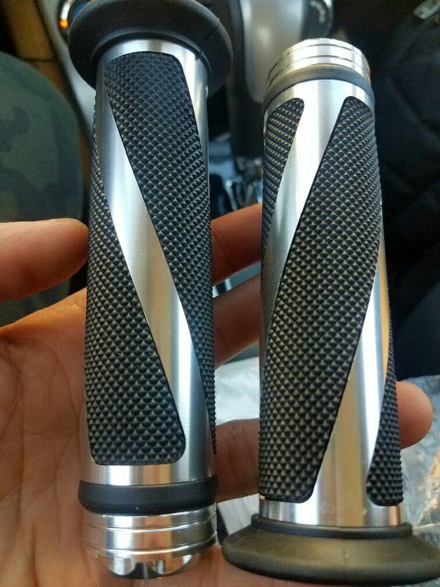]{style="overflow: hidden; display: inline-block; margin: 0.00px 0.00px; border: 0.00px solid #000000; transform: rotate(0.00rad) translateZ(0px); -webkit-transform: rotate(0.00rad) translateZ(0px); width: 168.50px; height: 225.27px;"}[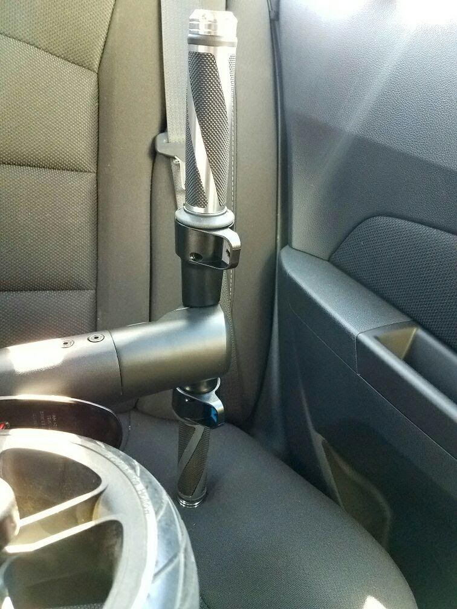]{style="overflow: hidden; display: inline-block; margin: 0.00px 0.00px; border: 0.00px solid #000000; transform: rotate(0.00rad) translateZ(0px); -webkit-transform: rotate(0.00rad) translateZ(0px); width: 169.50px; height: 226.20px;"}

[5.12 Подставка для стакана/музыкальной колонки]{.c10} {#h.ypticm46o0qk .c8}
------------------------------------------------------

[Источник:
]{}[[Перейти](https://t.me/Ninebot_ES/15732&sa=D&source=editors&ust=1636795599264000&usg=AOvVaw3hUKLatpJWfX8s4X7Lz4nW){.c11}]{.c7}

[]{style="overflow: hidden; display: inline-block; margin: 0.00px 0.00px; border: 0.00px solid #000000; transform: rotate(0.00rad) translateZ(0px); -webkit-transform: rotate(0.00rad) translateZ(0px); width: 240.50px; height: 319.90px;"}

[5.13 Переноска на руль]{.c10} {#h.kex4f1mnp0xv .c8}
------------------------------

[Источник:
]{}[[https://t.me/Ninebot\_ES/3019](https://t.me/Ninebot_ES/3019&sa=D&source=editors&ust=1636795599265000&usg=AOvVaw01tTb908fQTd1fqJWKkG2O){.c11}]{.c7}[ ]{.c5}

[Аналог на али (уточнить расстояние, возможно 20см трубки не хватит).
Расстояние между краем газа и тормоза 19 см. Крепление \~1.5 см.
Желательно, что бы по краям трубка выходила на 0,5 см. Итого трубка
должна быть \~ 19+1.5\*2+0.5\*2 = 23 см
]{}[[http://s.aliexpress.com/BfYbuM7N](http://s.aliexpress.com/BfYbuM7N&sa=D&source=editors&ust=1636795599265000&usg=AOvVaw1MJYrqt-nRl5Y7sREp83T0){.c11}]{.c7}[ ]{.c5}

[Как выглядит заказанная с али
]{}[[https://t.me/Ninebot\_ES/8601](https://t.me/Ninebot_ES/8601&sa=D&source=editors&ust=1636795599266000&usg=AOvVaw1Fe7aWUfMtkpV7VM2NzsBs){.c11}]{.c7}[ ]{.c5}

[]{.c5}

[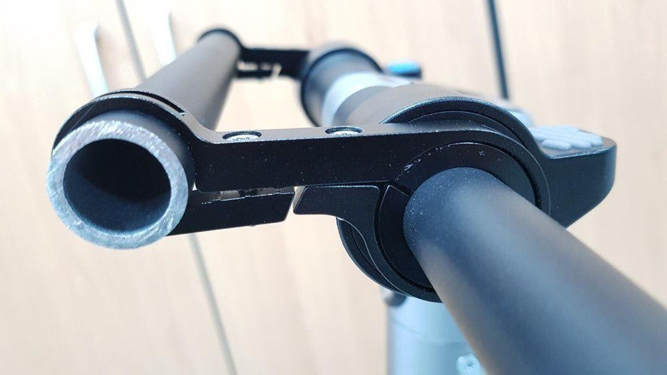]{style="overflow: hidden; display: inline-block; margin: 0.00px 0.00px; border: 0.00px solid #000000; transform: rotate(0.00rad) translateZ(0px); -webkit-transform: rotate(0.00rad) translateZ(0px); width: 265.64px; height: 149.50px;"}

[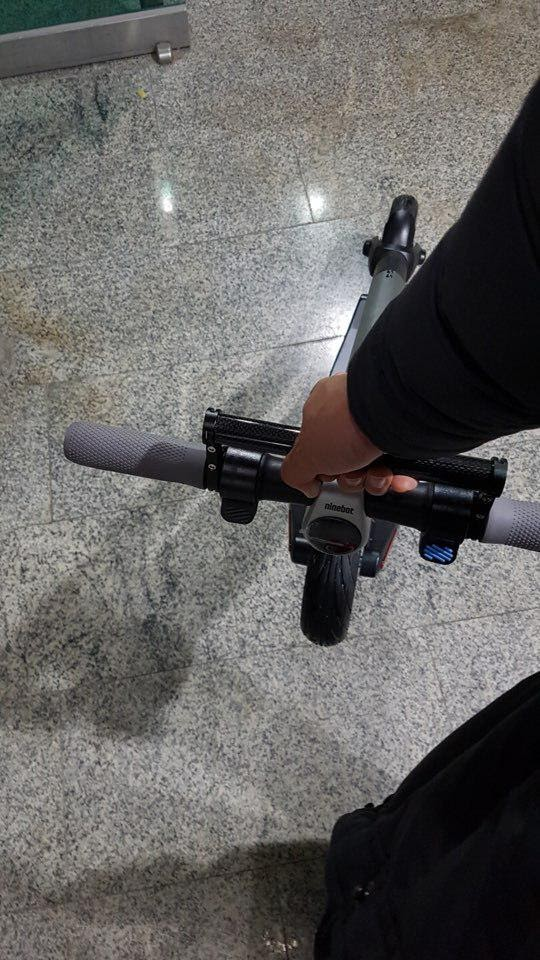]{style="overflow: hidden; display: inline-block; margin: 0.00px 0.00px; border: 0.00px solid #000000; transform: rotate(0.00rad) translateZ(0px); -webkit-transform: rotate(0.00rad) translateZ(0px); width: 265.00px; height: 259.00px;"}

[5.14 Фонари]{.c10} {#h.x3d4ehiln1h5 .c8}
-------------------

[Источник:
]{}[[Перейти](https://t.me/Ninebot_ES/15788&sa=D&source=editors&ust=1636795599267000&usg=AOvVaw2gY9gepHBKhxItR7xAW-Sb){.c11}]{.c7}

[]{style="overflow: hidden; display: inline-block; margin: 0.00px 0.00px; border: 0.00px solid #000000; transform: rotate(0.00rad) translateZ(0px); -webkit-transform: rotate(0.00rad) translateZ(0px); width: 240.00px; height: 320.00px;"}

[]{.c5}

[КОМПЛЕКТ ФОНАРЕЙ VIOO CITY 500
]{}[[https://www.decathlon.ru/komplekt-fonarej-vioo-city-500\_e1-id\_8402868.html](https://www.decathlon.ru/komplekt-fonarej-vioo-city-500_e1-id_8402868.html&sa=D&source=editors&ust=1636795599268000&usg=AOvVaw32ThmGt96VKgY8q01A7CRB){.c11}]{.c7}[ ]{.c5}

[]{.c5}

[]{style="overflow: hidden; display: inline-block; margin: 0.00px 0.00px; border: 0.00px solid #000000; transform: rotate(0.00rad) translateZ(0px); -webkit-transform: rotate(0.00rad) translateZ(0px); width: 390.00px; height: 479.00px;"}

[5.15 Сумка с креплением на руль]{.c10} {#h.7plyrx7x4ow4 .c8}
---------------------------------------

[]{.c5}

[]{#t.ab994e38114bf4380140d83012c0fa0e060d8af9}[]{#t.32}
+-----------------------------------+-----------------------------------+
| [Источник:                        | [Купить:                          |
| ]{}[[Перейти](https://t.me/Ninebo | ]{}[[Алиэкспресс](http://s.aliexp |
| t_ES/23609&sa=D&source=editors&us | ress.com/eY7JnMBR?fromSns%3DTeleg |
| t=1636795599270000&usg=AOvVaw0iNv | ram&sa=D&source=editors&ust=16367 |
| ambmVR0a0Qn91zyC4l){.c11}]{.c7}   | 95599272000&usg=AOvVaw0nnKlcbB0W2 |
|                                   | j3sXBgtn9t6){.c11}]{.c7}          |
| [Купить: ]{}[[Крепление на        |                                   |
| руль](http://brobike.ru/shop/acce | []{.c5}                           |
| ssories/luggage/product/qfcba&sa= |                                   |
| D&source=editors&ust=163679559927 | [{.c11}]{.c7}[ +              | zM4GB.jpg)]{style="overflow: hidd |
| ]{}[[сумка](http://brobike.ru/sho | en; display: inline-block; margin |
| p/accessories/luggage/product/b01 | : 0.00px 0.00px; border: 0.00px s |
| 7b&sa=D&source=editors&ust=163679 | olid #000000; transform: rotate(0 |
| 5599271000&usg=AOvVaw3J10looP-tV0 | .00rad) translateZ(0px); -webkit- |
| 9uzLBrzPBi){.c11}]{.c7}           | transform: rotate(0.00rad) transl |
|                                   | ateZ(0px); width: 269.00px; heigh |
| []{style="overflow: hidd | []{.c5}                           |
| en; display: inline-block; margin |                                   |
| : 0.00px 0.00px; border: 0.00px s |                                   |
| olid #000000; transform: rotate(0 |                                   |
| .00rad) translateZ(0px); -webkit- |                                   |
| transform: rotate(0.00rad) transl |                                   |
| ateZ(0px); width: 270.00px; heigh |                                   |
| t: 270.00px;"}                    |                                   |
|                                   |                                   |
| []{.c5}                           |                                   |
+-----------------------------------+-----------------------------------+
| []{.c5}                           | []{.c5}                           |
|                                   |                                   |
| [Купить:                          |                                   |
| ]{}[[Алиэкспресс](http://s.aliexp |                                   |
| ress.com/MVJ3EV3Y?fromSns%3DTeleg |                                   |
| ram&sa=D&source=editors&ust=16367 |                                   |
| 95599274000&usg=AOvVaw3dicW8fScDo |                                   |
| ymt5T2bGCb-){.c11}]{.c7}          |                                   |
|                                   |                                   |
| []{.c5}                           |                                   |
|                                   |                                   |
| []{style="overflow: hidd |                                   |
| en; display: inline-block; margin |                                   |
| : 0.00px 0.00px; border: 0.00px s |                                   |
| olid #000000; transform: rotate(0 |                                   |
| .00rad) translateZ(0px); -webkit- |                                   |
| transform: rotate(0.00rad) transl |                                   |
| ateZ(0px); width: 272.00px; heigh |                                   |
| t: 276.00px;"}                    |                                   |
+-----------------------------------+-----------------------------------+

[]{.c5}

[5.16 Сиденье]{.c10} {#h.li3iz4xh0hui .c8}
--------------------

[Купить: ]{.c5}

[[Алиэкспресс](https://ru.aliexpress.com/item/ES1-ES2-Mijia-M365/32880470788.html?shortkey%3DuUNjQZji%26addresstype%3D600&sa=D&source=editors&ust=1636795599277000&usg=AOvVaw3NmOSP4WyG9Ft-oz3nHW5l){.c11}]{.c7}

[[Tmall](https://detail.tmall.com/item.htm?id%3D569638088063%26spm%3Da312a.7700824.201.11.65a4787efvjIdD%26skuId%3D3830859255346&sa=D&source=editors&ust=1636795599278000&usg=AOvVaw3_J0__Kottk2aUW9hutClq){.c11}]{.c7}

[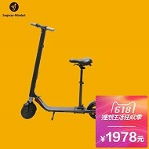]{style="overflow: hidden; display: inline-block; margin: 0.00px 0.00px; border: 0.00px solid #000000; transform: rotate(0.00rad) translateZ(0px); -webkit-transform: rotate(0.00rad) translateZ(0px); width: 190.00px; height: 190.00px;"}

[5.17 Зеркала заднего вида]{.c10} {#h.yhlda25n8288 .c8}
---------------------------------

[Купить:
]{}[[Алиэкспресс](https://ru.aliexpress.com/item/Reflection-Mirror-and-mobile-bracket-for-Ninebot-Nine-Electrical-Scooter-Accessories-and-parts/32881425950.html?spm%3Da2g0v.search0604.3.788.d67fd295d8Pe1z%26ws_ab_test%3Dsearchweb0_0,searchweb201602_1_10152_10151_10065_10344_10068_10342_10343_5722611_10340_10341_10696_5722911_5711411_5722811_10084_5722711_10083_10618_10307_10059_100031_10103_5711511_10624_10623_10622_10621_10620_5722511_10125,searchweb201603_55,ppcSwitch_5%26algo_expid%3D90f25dcd-d5ba-4de0-baf8-c9f7447f31b0-41%26algo_pvid%3D90f25dcd-d5ba-4de0-baf8-c9f7447f31b0%26priceBeautifyAB%3D0&sa=D&source=editors&ust=1636795599279000&usg=AOvVaw1eqCSdkmtWKHA-5Az_a9BD){.c11}]{.c7}

[]{style="overflow: hidden; display: inline-block; margin: 0.00px 0.00px; border: 0.00px solid #000000; transform: rotate(0.00rad) translateZ(0px); -webkit-transform: rotate(0.00rad) translateZ(0px); width: 199.00px; height: 199.57px;"}

[]{.c5}

[Отзыв владельца: “Оно не подходит для стоящих водителей, из-за
короткого плеча, видно только туловища водителя, и ещё резьба короткая у
крепежного винта.”]{.c5}

[]{.c5}

[]{style="overflow: hidden; display: inline-block; margin: 0.00px 0.00px; border: 0.00px solid #000000; transform: rotate(0.00rad) translateZ(0px); -webkit-transform: rotate(0.00rad) translateZ(0px); width: 380.48px; height: 185.50px;"}[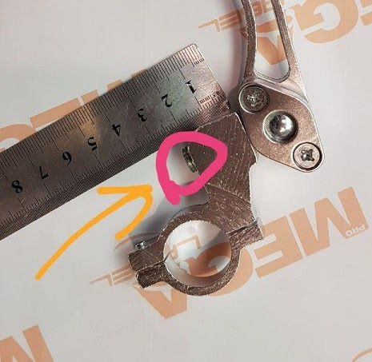]{style="overflow: hidden; display: inline-block; margin: 0.00px 0.00px; border: 0.00px solid #000000; transform: rotate(0.00rad) translateZ(0px); -webkit-transform: rotate(0.00rad) translateZ(0px); width: 192.15px; height: 186.50px;"}

[5.18 Шлем]{.c10} {#h.limtwxn8a231 .c8}
-----------------

[По инструкции на самокате необходимо ездить в шлеме.]{.c5}

[Для противников езды в шлеме желательно посмотреть что может случиться
на скорости 17 км/ч (фото в спойлере)
]{}[[https://4pda.ru/forum/index.php?showtopic=796353&st=2460\#entry63461823](https://4pda.ru/forum/index.php?showtopic%3D796353%26st%3D2460%23entry63461823&sa=D&source=editors&ust=1636795599281000&usg=AOvVaw0HCsfkdnjm18goyNK_EUPW){.c11}]{.c7}

[]{.c5}

[]{#t.e546e7a231af409984a62cee9420a0264389332e}[]{#t.33}
+-----------------------------------+-----------------------------------+
| [Источник:                        | [Источник:                        |
| ]{}[[Перейти](https://t.me/Ninebo | ]{}[[Перейти](https://t.me/Ninebo |
| t_ES/6534&sa=D&source=editors&ust | t_ES/4481&sa=D&source=editors&ust |
| =1636795599282000&usg=AOvVaw0rQGP | =1636795599283000&usg=AOvVaw3euGq |
| Qn6gVvcaN3FR36g1n){.c11}]{.c7}    | xNDitnbjs-cLxvsY-){.c11}]{.c7}    |
|                                   |                                   |
| [Grancorso - Met Helmets]{.c5}    | []{.c5}                           |
|                                   |                                   |
| []{.c5}                           | []{.c5}                           |
|                                   |                                   |
| []{style="overflow: hidd | scv8h.jpg)]{style="overflow: hidd |
| en; display: inline-block; margin | en; display: inline-block; margin |
| : 0.00px 0.00px; border: 0.00px s | : 0.00px 0.00px; border: 0.00px s |
| olid #000000; transform: rotate(0 | olid #000000; transform: rotate(0 |
| .00rad) translateZ(0px); -webkit- | .00rad) translateZ(0px); -webkit- |
| transform: rotate(0.00rad) transl | transform: rotate(0.00rad) transl |
| ateZ(0px); width: 206.00px; heigh | ateZ(0px); width: 144.00px; heigh |
| t: 137.33px;"}                    | t: 136.31px;"}                    |
+-----------------------------------+-----------------------------------+
| [Источник:                        | []{.c5}                           |
| ]{}[[Перейти](https://t.me/Ninebo |                                   |
| t_ES/11502&sa=D&source=editors&us |                                   |
| t=1636795599284000&usg=AOvVaw0Oey |                                   |
| _KmysfXzkgNK-AMRVB){.c11}]{.c7}   |                                   |
|                                   |                                   |
| [Ninebot Комплект защиты]{.c5}    |                                   |
|                                   |                                   |
| [Ламобайл:                        |                                   |
| ]{}[[Перейти](https://lamobile.ru |                                   |
| /product/komplekt_zaschiti_dlya_g |                                   |
| iroskytera.html&sa=D&source=edito |                                   |
| rs&ust=1636795599285000&usg=AOvVa |                                   |
| w33QUWeWlYadM9dvXLSry7U){.c11}]{. |                                   |
| c7}                               |                                   |
|                                   |                                   |
| []{.c5}                           |                                   |
|                                   |                                   |
| []{style="overflow: hidd |                                   |
| en; display: inline-block; margin |                                   |
| : 0.00px 0.00px; border: 0.00px s |                                   |
| olid #000000; transform: rotate(0 |                                   |
| .00rad) translateZ(0px); -webkit- |                                   |
| transform: rotate(0.00rad) transl |                                   |
| ateZ(0px); width: 221.00px; heigh |                                   |
| t: 118.00px;"}                    |                                   |
+-----------------------------------+-----------------------------------+

[5.19 Инструмент]{.c10} {#h.qrjyte5i1c9x .c8}
-----------------------

[Источник:
]{}[[Перейти](https://electrotransport.ru/ussr/index.php?topic%3D48865.msg1306855%23msg1306855&sa=D&source=editors&ust=1636795599287000&usg=AOvVaw0nGDXSOpfQcVM1iAIOw4r3){.c11}]{.c7}

[Головки корончатые для откручивания втулки переднего колеса. ]{}[На
данный момент не испытывались]{.c90}[.]{.c5}

[Головки корончатые 8 предм. станкоимпорт КА-8201]{.c5}

[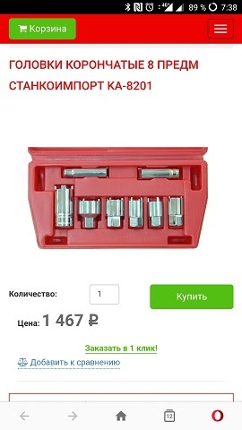]{style="overflow: hidden; display: inline-block; margin: 0.00px 0.00px; border: 0.00px solid #000000; transform: rotate(0.00rad) translateZ(0px); -webkit-transform: rotate(0.00rad) translateZ(0px); width: 184.78px; height: 328.50px;"}

[6 Запчасти]{.c78} {#h.eo0u0i1h6ca9 .c60 .c30}
==================

[[https://omix-store.ru/product-category/service/](https://omix-store.ru/product-category/service/&sa=D&source=editors&ust=1636795599288000&usg=AOvVaw3zIqDjuivvO-_k6uNuqQLZ){.c11}]{.c7}

[[https://opt.lamobile.ru/catalog/categories/224](https://opt.lamobile.ru/catalog/categories/224&sa=D&source=editors&ust=1636795599288000&usg=AOvVaw3TnT2-3y8UqcyZaubS6Rgk){.c11}]{.c7}

[6.1 Рама]{.c10} {#h.xl31cskjifg7 .c8}
----------------

[]{.c5}

[]{style="overflow: hidden; display: inline-block; margin: 0.00px 0.00px; border: 0.00px solid #000000; transform: rotate(0.00rad) translateZ(0px); -webkit-transform: rotate(0.00rad) translateZ(0px); width: 582.00px; height: 297.00px;"}

[]{.c5}

[]{#t.967c9a858f1cde1fdef4942d9566d0a3fdcb9894}[]{#t.34}
+-----------------+-----------------+-----------------+-----------------+
| [№]{.c5}        | [Артикул]{.c5}  | [Кол-во]{.c5}   | [Наименование]{ |
|                 |                 |                 | .c5}            |
+-----------------+-----------------+-----------------+-----------------+
| [1]{.c5}        | [14.01.0005.00] | [1]{.c5}        | [Рама]{.c5}     |
|                 | {.c5}           |                 |                 |
+-----------------+-----------------+-----------------+-----------------+
| [2]{.c5}        | [14.01.0038.00] | [1]{.c5}        | [Передняя       |
|                 | {.c5}           |                 | резиновая       |
|                 |                 |                 | заглушка,       |
|                 |                 |                 | правая]{.c5}    |
+-----------------+-----------------+-----------------+-----------------+
| [3]{.c5}        | [14.01.0031.02] | [1]{.c5}        | [Резиновое      |
|                 | {.c5}           |                 | покрытие        |
|                 |                 |                 | деки]{.c5}      |
+-----------------+-----------------+-----------------+-----------------+
| [4]{.c5}        | [14.01.0039.00] | [1]{.c5}        | [Передняя       |
|                 | {.c5}           |                 | резиновая       |
|                 |                 |                 | заглушка,       |
|                 |                 |                 | правая ]{.c5}   |
+-----------------+-----------------+-----------------+-----------------+
| [5]{.c5}        | [14.01.0063.00] | [2]{.c5}        | [Стопорные      |
|                 | {.c5}           |                 | гайки]{.c5}     |
+-----------------+-----------------+-----------------+-----------------+
| [6]{.c5}        | [14.01.0007.00] | [2]{.c5}        | [Светоотражающи |
|                 | {.c5}           |                 | е               |
|                 |                 |                 | катафоты]{.c5}  |
+-----------------+-----------------+-----------------+-----------------+
| [7]{.c5}        | [14.02.0013.00] | [1]{.c5}        | [LED-подсветка  |
|                 | {.c5}           |                 | деки]{.c5}      |
+-----------------+-----------------+-----------------+-----------------+
| [8]{.c5}        | [14.01.0041.00] | [1]{.c5}        | [Задняя         |
|                 | {.c5}           |                 | резиновая       |
|                 |                 |                 | заглушка,       |
|                 |                 |                 | правая ]{.c5}   |
+-----------------+-----------------+-----------------+-----------------+
| [9]{.c5}        | [14.01.0040.00] | [1]{.c5}        | [Задняя         |
|                 | {.c5}           |                 | резиновая       |
|                 |                 |                 | заглушка        |
|                 |                 |                 | (левая) ]{.c5}  |
+-----------------+-----------------+-----------------+-----------------+
| [10]{.c5}       | [14.01.0029.00] | [1]{.c5}        | [Задние         |
|                 | {.c5}           |                 | накладки на     |
|                 |                 |                 | деку            |
|                 |                 |                 | (sport)]{.c5}   |
+-----------------+-----------------+-----------------+-----------------+
| [11]{.c5}       | [14.01.0076.00] | [1]{.c5}        | [Силиконовая    |
|                 | {.c5}           |                 | накладка шасси  |
|                 |                 |                 | ]{.c5}          |
+-----------------+-----------------+-----------------+-----------------+
| [12]{.c5}       | [14.01.0008.00] | [1]{.c5}        | [Подножка для   |
|                 | {.c5}           |                 | ES1, ES2]{.c5}  |
+-----------------+-----------------+-----------------+-----------------+
| [13]{.c5}       | [14.01.0037.00] | [1]{.c5}        | [Заглушка       |
|                 | {.c5}           |                 | резиновая       |
|                 |                 |                 | передняя для    |
|                 |                 |                 | KickScooter.    |
|                 |                 |                 | Левая]{.c5}     |
+-----------------+-----------------+-----------------+-----------------+
| [14]{.c5}       | [14.01.0036.00] | [1]{.c5}        | [Заглушка       |
|                 | {.c5}           |                 | резиновая       |
|                 |                 |                 | передняя для    |
|                 |                 |                 | KickScooter.    |
|                 |                 |                 | Правая]{.c5}    |
+-----------------+-----------------+-----------------+-----------------+
| [15]{.c5}       | [14.01.0027.00] | [1]{.c5}        | [Передние       |
|                 | {.c5}           |                 | накладки на     |
|                 |                 |                 | деку]{.c5}      |
+-----------------+-----------------+-----------------+-----------------+

[]{.c5}

[6.2 Рулевая стойка]{.c10} {#h.7j0pcjbuegft .c8}
--------------------------

[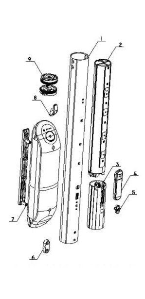]{style="overflow: hidden; display: inline-block; margin: 0.00px 0.00px; border: 0.00px solid #000000; transform: rotate(0.00rad) translateZ(0px); -webkit-transform: rotate(0.00rad) translateZ(0px); width: 298.00px; height: 616.00px;"}

[]{.c5}

[]{.c5}

[]{#t.1f705e32f24b4103a65805bec7ccf2adf633c67d}[]{#t.35}
[№]{.c5}

[Артикул]{.c5}

[Кол-во]{.c5}

[Наименование]{.c5}

[1]{.c5}

[14.01.0016.02]{.c5}

[1]{.c5}

[Рулевая стойка]{.c5}

[14.01.0016.01]{.c5}

[1]{.c5}

[]{.c5}

[2]{.c5}

[14.02.0018.00]{.c5}

[1]{.c5}

[]{.c5}

[14.02.0018.10]{.c5}

[1]{.c5}

[Аккумулятор]{.c5}

[3]{.c5}

[14.02.0017.00]{.c5}

[1]{.c5}

[Материнская плата]{.c5}

[4]{.c5}

[14.01.0061.00]{.c5}

[1]{.c5}

[Заглушка гнезда зарядки]{.c5}

[5]{.c5}

[14.02.0032.00]{.c5}

[1]{.c5}

[Гнездо зарядки]{.c5}

[6]{.c5}

[14.01.0035.00]{.c5}

[1]{.c5}

[Крепеж передней вилки]{.c5}

[7]{.c5}

[14.02.0019.00]{.c5}

[1]{.c5}

[]{.c5}

[14.02.0019.10]{.c5}

[1]{.c5}

[]{.c5}

[8]{.c5}

[14.01.0006.00]{.c5}

[1]{.c5}

[Крючок на руле]{.c5}

[9]{.c5}

[14.01.0017.00]{.c5}

[2]{.c5}

[]{.c5}

[]{.c5}

[6.3 Задний амортизатор]{.c10} {#h.d6zklotubj1h .c8}
------------------------------

[]{style="overflow: hidden; display: inline-block; margin: 0.00px 0.00px; border: 0.00px solid #000000; transform: rotate(0.00rad) translateZ(0px); -webkit-transform: rotate(0.00rad) translateZ(0px); width: 618.00px; height: 300.00px;"}

[]{.c5}

[]{#t.bff42b621baed68a4d72d511acef17b8cdbc1ac7}[]{#t.36}
+-----------------+-----------------+-----------------+-----------------+
| [№]{.c5}        | [Артикул]{.c5}  | [Кол-во]{.c5}   | [Наименование]{ |
|                 |                 |                 | .c5}            |
+-----------------+-----------------+-----------------+-----------------+
| [1]{.c5}        | [14.01.0024.00] | [1]{.c5}        | [Задний         |
|                 | {.c5}           |                 | амортизатор в   |
|                 |                 |                 | сборе]{.c5}     |
+-----------------+-----------------+-----------------+-----------------+
| [2]{.c5}        | [14.01.0025.00] | [1]{.c5}        | [Заднее крыло   |
|                 | {.c5}           |                 | ]{.c5}          |
+-----------------+-----------------+-----------------+-----------------+
| [3]{.c5}        | [14.01.0033.00] | [1]{.c5}        | [Светоотражающи |
|                 | {.c5}           |                 | е               |
|                 |                 |                 | катафоты]{.c5}  |
+-----------------+-----------------+-----------------+-----------------+
| [4]{.c5}        | [14.01.0026.01] | [1]{.c5}        | [Заднее колесо  |
|                 | {.c5}           |                 | в сборе]{.c5}   |
+-----------------+-----------------+-----------------+-----------------+
| [5]{.c5}        | [14.02.0025.00] | [1]{.c5}        | [Стоп-огни,     |
|                 | {.c5}           |                 | правые]{.c5}    |
+-----------------+-----------------+-----------------+-----------------+
| [6]{.c5}        | [14.02.0024.00] | [1]{.c5}        | [Стоп-огни,     |
|                 | {.c5}           |                 | левые]{.c5}     |
+-----------------+-----------------+-----------------+-----------------+

[]{.c5}

[6.4 Руль]{.c10} {#h.n0g32zsvcfyq .c8}
----------------

[]{style="overflow: hidden; display: inline-block; margin: 0.00px 0.00px; border: 0.00px solid #000000; transform: rotate(0.00rad) translateZ(0px); -webkit-transform: rotate(0.00rad) translateZ(0px); width: 548.00px; height: 302.00px;"}

[]{.c5}

[]{#t.d9309fa65097895ae40e32fc957182d218a9e4f2}[]{#t.37}
[№]{.c5}

[Артикул]{.c5}

[Кол-во]{.c5}

[Наименование]{.c5}

[1]{.c5}

[14.01.0010.00]{.c5}

[1]{.c5}

[]{.c5}

[2]{.c5}

[14.02.0015.00]{.c5}

[1]{.c5}

[Рычаг акселератора]{.c5}

[3]{.c5}

[14.01.0013.00]{.c5}

[2]{.c5}

[Резиновые ручки на руль]{.c5}

[14.01.0013.10]{.c5}

[2]{.c5}

[Полеуретановые ручки на руль ]{.c5}

[4]{.c5}

[14.01.0011.00]{.c5}

[2]{.c5}

[]{.c5}

[5]{.c5}

[14.02.0014.00]{.c5}

[1]{.c5}

[Передняя фара NineBot ]{.c5}

[6]{.c5}

[14.01.0009.02]{.c5}

[1]{.c5}

[Крепление руля]{.c5}

[14.01.0009.01]{.c5}

[1]{.c5}

[]{.c5}

[7]{.c5}

[14.02.0031.00]{.c5}

[1]{.c5}

[Приборная панель]{.c5}

[8]{.c5}

[14.02.0016.00]{.c5}

[1]{.c5}

[Рычаг тормоза]{.c5}

[6.5 Узел сложения]{.c10} {#h.muu0t5tenzpw .c8}
-------------------------

[]{.c5}

[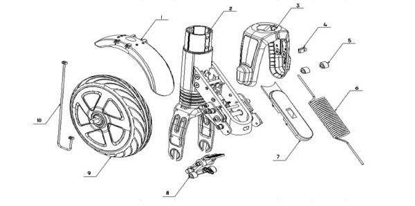]{style="overflow: hidden; display: inline-block; margin: 0.00px 0.00px; border: 0.00px solid #000000; transform: rotate(0.00rad) translateZ(0px); -webkit-transform: rotate(0.00rad) translateZ(0px); width: 600.00px; height: 298.00px;"}

[]{.c5}

[]{.c5}

[]{#t.740574322d99d9992c97d4f2ab2b4d91ab4d29d6}[]{#t.38}
[№]{.c5}

[Артикул]{.c5}

[Кол-во]{.c5}

[Наименование]{.c5}

[1]{.c5}

[14.01.0019.00]{.c5}

[1]{.c5}

[Переднее крыло]{.c5}

[2]{.c5}

[14.01.0018.10]{.c5}

[1]{.c5}

[Передняя вилка в сборе]{.c5}

[14.01.0018.00]{.c5}

[1]{.c5}

[Передняя вилка в сборе]{.c5}

[3]{.c5}

[14.01.0020.00]{.c5}

[2]{.c5}

[Передняя защита вилки]{.c5}

[4]{.c5}

[14.01.0077.00]{.c5}

[1]{.c5}

[]{.c5}

[5]{.c5}

[14.01.0078.00]{.c5}

[2]{.c5}

[Демпферы складного механизма]{.c5}

[6]{.c5}

[14.02.0022.00]{.c5}

[1]{.c5}

[Кабель контроллера]{.c5}

[7]{.c5}

[14.01.0023.00]{.c5}

[1]{.c5}

[Язычок складного механизма]{.c5}

[8]{.c5}

[14.01.0022.00]{.c5}

[1]{.c5}

[Педаль механизма складывания]{.c5}

[9]{.c5}

[14.02.0021.00]{.c5}

[1]{.c5}

[Мотор-колесо для Ninebot KickScooter ES2]{.c5}

[14.02.0021.10]{.c5}

[1]{.c5}

[Мотор-колесо для Ninebot KickScooter ES1]{.c5}

[10]{.c5}

[14.02.0023.00]{.c5}

[1]{.c5}

[Кабель LED-подсветки деки]{.c5}

[]{.c5}

[6.6 Винты]{.c10} {#h.np303685wl86 .c8}
-----------------

[]{.c5}

[]{#t.09f1eef9c213d295285e1b243d518532a29bd44e}[]{#t.39}
+-------------+-------------+-------------+-------------+-------------+
| [№]{.c5}    | [Артикул]{. | [Наименован | [Фото]{.c5} | [Расположен |
|             | c5}         | ие]{.c5}    |             | ие]{.c5}    |
+-------------+-------------+-------------+-------------+-------------+
| [1]{.c5}    | [14.01.0052 | [Винт       | [] |             |
|             |             |             | {style="ove |             |
|             |             |             | rflow: hidd |             |
|             |             |             | en; display |             |
|             |             |             | : inline-bl |             |
|             |             |             | ock; margin |             |
|             |             |             | : 0.00px 0. |             |
|             |             |             | 00px; borde |             |
|             |             |             | r: 0.00px s |             |
|             |             |             | olid #00000 |             |
|             |             |             | 0; transfor |             |
|             |             |             | m: rotate(0 |             |
|             |             |             | .00rad) tra |             |
|             |             |             | nslateZ(0px |             |
|             |             |             | ); -webkit- |             |
|             |             |             | transform:  |             |
|             |             |             | rotate(0.00 |             |
|             |             |             | rad) transl |             |
|             |             |             | ateZ(0px);  |             |
|             |             |             | width: 97.0 |             |
|             |             |             | 0px; height |             |
|             |             |             | : 97.33px;" |             |
|             |             |             | }           |             |
+-------------+-------------+-------------+-------------+-------------+
| [2]{.c5}    | [14.01.0074 | [Винт       | []{.c5 |
|             |             |             | XcFvTPXQHqz | }           |
|             |             |             | g5-zJFh3yfD |             |
|             |             |             | va44Z.jpg)] |             |
|             |             |             | {style="ove |             |
|             |             |             | rflow: hidd |             |
|             |             |             | en; display |             |
|             |             |             | : inline-bl |             |
|             |             |             | ock; margin |             |
|             |             |             | : 0.00px 0. |             |
|             |             |             | 00px; borde |             |
|             |             |             | r: 0.00px s |             |
|             |             |             | olid #00000 |             |
|             |             |             | 0; transfor |             |
|             |             |             | m: rotate(0 |             |
|             |             |             | .00rad) tra |             |
|             |             |             | nslateZ(0px |             |
|             |             |             | ); -webkit- |             |
|             |             |             | transform:  |             |
|             |             |             | rotate(0.00 |             |
|             |             |             | rad) transl |             |
|             |             |             | ateZ(0px);  |             |
|             |             |             | width: 97.0 |             |
|             |             |             | 0px; height |             |
|             |             |             | : 97.33px;" |             |
|             |             |             | }           |             |
+-------------+-------------+-------------+-------------+-------------+
| [3]{.c5}    | [14.01.0065 | [Винт       | [] |             |
|             |             |             | {style="ove |             |
|             |             |             | rflow: hidd |             |
|             |             |             | en; display |             |
|             |             |             | : inline-bl |             |
|             |             |             | ock; margin |             |
|             |             |             | : 0.00px 0. |             |
|             |             |             | 00px; borde |             |
|             |             |             | r: 0.00px s |             |
|             |             |             | olid #00000 |             |
|             |             |             | 0; transfor |             |
|             |             |             | m: rotate(0 |             |
|             |             |             | .00rad) tra |             |
|             |             |             | nslateZ(0px |             |
|             |             |             | ); -webkit- |             |
|             |             |             | transform:  |             |
|             |             |             | rotate(0.00 |             |
|             |             |             | rad) transl |             |
|             |             |             | ateZ(0px);  |             |
|             |             |             | width: 97.0 |             |
|             |             |             | 0px; height |             |
|             |             |             | : 97.33px;" |             |
|             |             |             | }           |             |
+-------------+-------------+-------------+-------------+-------------+
| [4]{.c5}    | [14.01.0046 | [Винт       | [] |             |
|             |             |             | {style="ove |             |
|             |             |             | rflow: hidd |             |
|             |             |             | en; display |             |
|             |             |             | : inline-bl |             |
|             |             |             | ock; margin |             |
|             |             |             | : 0.00px 0. |             |
|             |             |             | 00px; borde |             |
|             |             |             | r: 0.00px s |             |
|             |             |             | olid #00000 |             |
|             |             |             | 0; transfor |             |
|             |             |             | m: rotate(0 |             |
|             |             |             | .00rad) tra |             |
|             |             |             | nslateZ(0px |             |
|             |             |             | ); -webkit- |             |
|             |             |             | transform:  |             |
|             |             |             | rotate(0.00 |             |
|             |             |             | rad) transl |             |
|             |             |             | ateZ(0px);  |             |
|             |             |             | width: 97.0 |             |
|             |             |             | 0px; height |             |
|             |             |             | : 97.33px;" |             |
|             |             |             | }           |             |
+-------------+-------------+-------------+-------------+-------------+
| [5]{.c5}    | [14.01.0073 | [Винт       | []{.c5}     | []{.c5}     |
|             | .00]{.c5}   | M5\*14]{.c5 |             |             |
|             |             | }           |             |             |
+-------------+-------------+-------------+-------------+-------------+
| [6]{.c5}    | [10.01.7030 | [Винт       | [] |             |
|             |             |             | {style="ove |             |
|             |             |             | rflow: hidd |             |
|             |             |             | en; display |             |
|             |             |             | : inline-bl |             |
|             |             |             | ock; margin |             |
|             |             |             | : 0.00px 0. |             |
|             |             |             | 00px; borde |             |
|             |             |             | r: 0.00px s |             |
|             |             |             | olid #00000 |             |
|             |             |             | 0; transfor |             |
|             |             |             | m: rotate(0 |             |
|             |             |             | .00rad) tra |             |
|             |             |             | nslateZ(0px |             |
|             |             |             | ); -webkit- |             |
|             |             |             | transform:  |             |
|             |             |             | rotate(0.00 |             |
|             |             |             | rad) transl |             |
|             |             |             | ateZ(0px);  |             |
|             |             |             | width: 97.0 |             |
|             |             |             | 0px; height |             |
|             |             |             | : 97.33px;" |             |
|             |             |             | }           |             |
+-------------+-------------+-------------+-------------+-------------+
| [7]{.c5}    | [14.01.0053 | [Винт       | []{.c5}     | []{.c5}     |
|             | .00]{.c5}   | M4\*20      |             |             |
|             |             | ]{.c5}      |             |             |
+-------------+-------------+-------------+-------------+-------------+
| [8]{.c5}    | [14.01.0048 | [Винт       | [] |             |
|             |             |             | {style="ove |             |
|             |             |             | rflow: hidd |             |
|             |             |             | en; display |             |
|             |             |             | : inline-bl |             |
|             |             |             | ock; margin |             |
|             |             |             | : 0.00px 0. |             |
|             |             |             | 00px; borde |             |
|             |             |             | r: 0.00px s |             |
|             |             |             | olid #00000 |             |
|             |             |             | 0; transfor |             |
|             |             |             | m: rotate(0 |             |
|             |             |             | .00rad) tra |             |
|             |             |             | nslateZ(0px |             |
|             |             |             | ); -webkit- |             |
|             |             |             | transform:  |             |
|             |             |             | rotate(0.00 |             |
|             |             |             | rad) transl |             |
|             |             |             | ateZ(0px);  |             |
|             |             |             | width: 97.0 |             |
|             |             |             | 0px; height |             |
|             |             |             | : 97.33px;" |             |
|             |             |             | }           |             |
+-------------+-------------+-------------+-------------+-------------+
| [9]{.c5}    | [14.01.0049 | [Винт       | [] |             |
|             |             |             | {style="ove |             |
|             |             |             | rflow: hidd |             |
|             |             |             | en; display |             |
|             |             |             | : inline-bl |             |
|             |             |             | ock; margin |             |
|             |             |             | : 0.00px 0. |             |
|             |             |             | 00px; borde |             |
|             |             |             | r: 0.00px s |             |
|             |             |             | olid #00000 |             |
|             |             |             | 0; transfor |             |
|             |             |             | m: rotate(0 |             |
|             |             |             | .00rad) tra |             |
|             |             |             | nslateZ(0px |             |
|             |             |             | ); -webkit- |             |
|             |             |             | transform:  |             |
|             |             |             | rotate(0.00 |             |
|             |             |             | rad) transl |             |
|             |             |             | ateZ(0px);  |             |
|             |             |             | width: 97.0 |             |
|             |             |             | 0px; height |             |
|             |             |             | : 97.33px;" |             |
|             |             |             | }           |             |
+-------------+-------------+-------------+-------------+-------------+
| [10]{.c5}   | [10.01.5066 | [Винт М4\*6 | [] |             |
|             |             |             | {style="ove |             |
|             |             |             | rflow: hidd |             |
|             |             |             | en; display |             |
|             |             |             | : inline-bl |             |
|             |             |             | ock; margin |             |
|             |             |             | : 0.00px 0. |             |
|             |             |             | 00px; borde |             |
|             |             |             | r: 0.00px s |             |
|             |             |             | olid #00000 |             |
|             |             |             | 0; transfor |             |
|             |             |             | m: rotate(0 |             |
|             |             |             | .00rad) tra |             |
|             |             |             | nslateZ(0px |             |
|             |             |             | ); -webkit- |             |
|             |             |             | transform:  |             |
|             |             |             | rotate(0.00 |             |
|             |             |             | rad) transl |             |
|             |             |             | ateZ(0px);  |             |
|             |             |             | width: 97.0 |             |
|             |             |             | 0px; height |             |
|             |             |             | : 97.33px;" |             |
|             |             |             | }           |             |
+-------------+-------------+-------------+-------------+-------------+
| [11]{.c5}   | [14.01.0058 | [Винт       | []{.c5}     | []{.c5}     |
|             | .00]{.c5}   | M5\*10]{.c5 |             |             |
|             |             | }           |             |             |
+-------------+-------------+-------------+-------------+-------------+
| [12]{.c5}   | [14.01.0066 | [Винт       | []{.c5}     | []{.c5}     |
|             | .00]{.c5}   | M4\*10]{.c5 |             |             |
|             |             | }           |             |             |
+-------------+-------------+-------------+-------------+-------------+
| [13]{.c5}   | [14.01.0050 | [Винт M5\*5 | []{.c5}     | []{.c5}     |
|             | .00]{.c5}   | ]{.c5}      |             |             |
+-------------+-------------+-------------+-------------+-------------+
| [14]{.c5}   | [14.01.0051 | [Винт M4\*6 | []{.c5}     | []{.c5}     |
|             | .00]{.c5}   | ]{.c5}      |             |             |
+-------------+-------------+-------------+-------------+-------------+
| [15]{.c5}   | [14.01.0064 | [Винт       | [] |             |
|             |             |             | {style="ove |             |
|             |             |             | rflow: hidd |             |
|             |             |             | en; display |             |
|             |             |             | : inline-bl |             |
|             |             |             | ock; margin |             |
|             |             |             | : 0.00px 0. |             |
|             |             |             | 00px; borde |             |
|             |             |             | r: 0.00px s |             |
|             |             |             | olid #00000 |             |
|             |             |             | 0; transfor |             |
|             |             |             | m: rotate(0 |             |
|             |             |             | .00rad) tra |             |
|             |             |             | nslateZ(0px |             |
|             |             |             | ); -webkit- |             |
|             |             |             | transform:  |             |
|             |             |             | rotate(0.00 |             |
|             |             |             | rad) transl |             |
|             |             |             | ateZ(0px);  |             |
|             |             |             | width: 97.0 |             |
|             |             |             | 0px; height |             |
|             |             |             | : 97.33px;" |             |
|             |             |             | }           |             |
+-------------+-------------+-------------+-------------+-------------+
| [16]{.c5}   | [14.01.0057 | [Винт M5\*8 | [] |             |
|             |             |             | {style="ove |             |
|             |             |             | rflow: hidd |             |
|             |             |             | en; display |             |
|             |             |             | : inline-bl |             |
|             |             |             | ock; margin |             |
|             |             |             | : 0.00px 0. |             |
|             |             |             | 00px; borde |             |
|             |             |             | r: 0.00px s |             |
|             |             |             | olid #00000 |             |
|             |             |             | 0; transfor |             |
|             |             |             | m: rotate(0 |             |
|             |             |             | .00rad) tra |             |
|             |             |             | nslateZ(0px |             |
|             |             |             | ); -webkit- |             |
|             |             |             | transform:  |             |
|             |             |             | rotate(0.00 |             |
|             |             |             | rad) transl |             |
|             |             |             | ateZ(0px);  |             |
|             |             |             | width: 97.0 |             |
|             |             |             | 0px; height |             |
|             |             |             | : 97.33px;" |             |
|             |             |             | }           |             |
+-------------+-------------+-------------+-------------+-------------+
| [17]{.c5}   | [14.01.0056 | [Винт       | [] |             |
|             |             |             | {style="ove |             |
|             |             |             | rflow: hidd |             |
|             |             |             | en; display |             |
|             |             |             | : inline-bl |             |
|             |             |             | ock; margin |             |
|             |             |             | : 0.00px 0. |             |
|             |             |             | 00px; borde |             |
|             |             |             | r: 0.00px s |             |
|             |             |             | olid #00000 |             |
|             |             |             | 0; transfor |             |
|             |             |             | m: rotate(0 |             |
|             |             |             | .00rad) tra |             |
|             |             |             | nslateZ(0px |             |
|             |             |             | ); -webkit- |             |
|             |             |             | transform:  |             |
|             |             |             | rotate(0.00 |             |
|             |             |             | rad) transl |             |
|             |             |             | ateZ(0px);  |             |
|             |             |             | width: 97.0 |             |
|             |             |             | 0px; height |             |
|             |             |             | : 64.00px;" |             |
|             |             |             | }           |             |
+-------------+-------------+-------------+-------------+-------------+
| [18]{.c5}   | [14.01.0047 | [Винт       | []{.c5}     | []{.c5}     |
|             | .00]{.c5}   | M6\*14]{.c5 |             |             |
|             |             | }           |             |             |
+-------------+-------------+-------------+-------------+-------------+
| [19]{.c5}   | [14.01.0044 | [Винт       | []{.c5}     | []{.c5}     |
|             | .00]{.c5}   | M5\*10]{.c5 |             |             |
|             |             | }           |             |             |
+-------------+-------------+-------------+-------------+-------------+
| [20]{.c5}   | [14.01.0060 | [Винт       | [] |             |
|             |             |             | {style="ove |             |
|             |             |             | rflow: hidd |             |
|             |             |             | en; display |             |
|             |             |             | : inline-bl |             |
|             |             |             | ock; margin |             |
|             |             |             | : 0.00px 0. |             |
|             |             |             | 00px; borde |             |
|             |             |             | r: 0.00px s |             |
|             |             |             | olid #00000 |             |
|             |             |             | 0; transfor |             |
|             |             |             | m: rotate(0 |             |
|             |             |             | .00rad) tra |             |
|             |             |             | nslateZ(0px |             |
|             |             |             | ); -webkit- |             |
|             |             |             | transform:  |             |
|             |             |             | rotate(0.00 |             |
|             |             |             | rad) transl |             |
|             |             |             | ateZ(0px);  |             |
|             |             |             | width: 97.0 |             |
|             |             |             | 0px; height |             |
|             |             |             | : 97.33px;" |             |
|             |             |             | }           |             |
+-------------+-------------+-------------+-------------+-------------+
| [21]{.c5}   | [14.01.0043 | [Винт       | [] |             |
|             |             |             | {style="ove |             |
|             |             |             | rflow: hidd |             |
|             |             |             | en; display |             |
|             |             |             | : inline-bl |             |
|             |             |             | ock; margin |             |
|             |             |             | : 0.00px 0. |             |
|             |             |             | 00px; borde |             |
|             |             |             | r: 0.00px s |             |
|             |             |             | olid #00000 |             |
|             |             |             | 0; transfor |             |
|             |             |             | m: rotate(0 |             |
|             |             |             | .00rad) tra |             |
|             |             |             | nslateZ(0px |             |
|             |             |             | ); -webkit- |             |
|             |             |             | transform:  |             |
|             |             |             | rotate(0.00 |             |
|             |             |             | rad) transl |             |
|             |             |             | ateZ(0px);  |             |
|             |             |             | width: 97.0 |             |
|             |             |             | 0px; height |             |
|             |             |             | : 97.33px;" |             |
|             |             |             | }           |             |
+-------------+-------------+-------------+-------------+-------------+
| [22]{.c5}   | [14.01.0059 | [Винт       | [] |             |
|             |             |             | {style="ove |             |
|             |             |             | rflow: hidd |             |
|             |             |             | en; display |             |
|             |             |             | : inline-bl |             |
|             |             |             | ock; margin |             |
|             |             |             | : 0.00px 0. |             |
|             |             |             | 00px; borde |             |
|             |             |             | r: 0.00px s |             |
|             |             |             | olid #00000 |             |
|             |             |             | 0; transfor |             |
|             |             |             | m: rotate(0 |             |
|             |             |             | .00rad) tra |             |
|             |             |             | nslateZ(0px |             |
|             |             |             | ); -webkit- |             |
|             |             |             | transform:  |             |
|             |             |             | rotate(0.00 |             |
|             |             |             | rad) transl |             |
|             |             |             | ateZ(0px);  |             |
|             |             |             | width: 97.0 |             |
|             |             |             | 0px; height |             |
|             |             |             | : 97.33px;" |             |
|             |             |             | }           |             |
+-------------+-------------+-------------+-------------+-------------+
| [23]{.c5}   | [14.01.0067 | [Винт M4\*8 | [] |             |
|             |             |             | {style="ove |             |
|             |             |             | rflow: hidd |             |
|             |             |             | en; display |             |
|             |             |             | : inline-bl |             |
|             |             |             | ock; margin |             |
|             |             |             | : 0.00px 0. |             |
|             |             |             | 00px; borde |             |
|             |             |             | r: 0.00px s |             |
|             |             |             | olid #00000 |             |
|             |             |             | 0; transfor |             |
|             |             |             | m: rotate(0 |             |
|             |             |             | .00rad) tra |             |
|             |             |             | nslateZ(0px |             |
|             |             |             | ); -webkit- |             |
|             |             |             | transform:  |             |
|             |             |             | rotate(0.00 |             |
|             |             |             | rad) transl |             |
|             |             |             | ateZ(0px);  |             |
|             |             |             | width: 97.0 |             |
|             |             |             | 0px; height |             |
|             |             |             | : 97.33px;" |             |
|             |             |             | }           |             |
+-------------+-------------+-------------+-------------+-------------+
| [24]{.c5}   | [14.01.0042 | [Винт       | [] |             |
|             |             |             | {style="ove |             |
|             |             |             | rflow: hidd |             |
|             |             |             | en; display |             |
|             |             |             | : inline-bl |             |
|             |             |             | ock; margin |             |
|             |             |             | : 0.00px 0. |             |
|             |             |             | 00px; borde |             |
|             |             |             | r: 0.00px s |             |
|             |             |             | olid #00000 |             |
|             |             |             | 0; transfor |             |
|             |             |             | m: rotate(0 |             |
|             |             |             | .00rad) tra |             |
|             |             |             | nslateZ(0px |             |
|             |             |             | ); -webkit- |             |
|             |             |             | transform:  |             |
|             |             |             | rotate(0.00 |             |
|             |             |             | rad) transl |             |
|             |             |             | ateZ(0px);  |             |
|             |             |             | width: 97.0 |             |
|             |             |             | 0px; height |             |
|             |             |             | : 97.33px;" |             |
|             |             |             | }           |             |
+-------------+-------------+-------------+-------------+-------------+
| [25]{.c5}   | [14.01.0073 | [Винт       | []{.c5}     | []{.c5}     |
|             | .00]{.c5}   | M5\*10]{.c5 |             |             |
|             |             | }           |             |             |
+-------------+-------------+-------------+-------------+-------------+
| [26]{.c5}   | [14.01.0070 | [Винт       | []{.c5 |
|             |             |             | jPJJRJ_dwSA | }           |
|             |             |             | kCkxq.jpg)] |             |
|             |             |             | {style="ove |             |
|             |             |             | rflow: hidd |             |
|             |             |             | en; display |             |
|             |             |             | : inline-bl |             |
|             |             |             | ock; margin |             |
|             |             |             | : 0.00px 0. |             |
|             |             |             | 00px; borde |             |
|             |             |             | r: 0.00px s |             |
|             |             |             | olid #00000 |             |
|             |             |             | 0; transfor |             |
|             |             |             | m: rotate(0 |             |
|             |             |             | .00rad) tra |             |
|             |             |             | nslateZ(0px |             |
|             |             |             | ); -webkit- |             |
|             |             |             | transform:  |             |
|             |             |             | rotate(0.00 |             |
|             |             |             | rad) transl |             |
|             |             |             | ateZ(0px);  |             |
|             |             |             | width: 97.0 |             |
|             |             |             | 0px; height |             |
|             |             |             | : 97.33px;" |             |
|             |             |             | }           |             |
+-------------+-------------+-------------+-------------+-------------+
| [27]{.c5}   | [10.01.3084 | [Винт       | [] |             |
|             |             |             | {style="ove |             |
|             |             |             | rflow: hidd |             |
|             |             |             | en; display |             |
|             |             |             | : inline-bl |             |
|             |             |             | ock; margin |             |
|             |             |             | : 0.00px 0. |             |
|             |             |             | 00px; borde |             |
|             |             |             | r: 0.00px s |             |
|             |             |             | olid #00000 |             |
|             |             |             | 0; transfor |             |
|             |             |             | m: rotate(0 |             |
|             |             |             | .00rad) tra |             |
|             |             |             | nslateZ(0px |             |
|             |             |             | ); -webkit- |             |
|             |             |             | transform:  |             |
|             |             |             | rotate(0.00 |             |
|             |             |             | rad) transl |             |
|             |             |             | ateZ(0px);  |             |
|             |             |             | width: 97.0 |             |
|             |             |             | 0px; height |             |
|             |             |             | : 97.33px;" |             |
|             |             |             | }           |             |
+-------------+-------------+-------------+-------------+-------------+
| [28]{.c5}   | [14.01.3066 | [Винт       | []{.c5}     | []{.c5}     |
|             | .00]{.c5}   | M4\*8]{.c5} |             |             |
+-------------+-------------+-------------+-------------+-------------+

[]{.c5}

[6.7 Альтернативные запчасти]{.c10} {#h.62gv8z2yvdi7 .c8}
-----------------------------------

[Подшипник в рулевой стакан]{.c5}

[Источник:
]{}[[https://t.me/NINEBOT\_ES/275256](https://t.me/NINEBOT_ES/275256&sa=D&source=editors&ust=1636795599450000&usg=AOvVaw1RMu1uFWCPuTHsRFPaG7eT){.c11}]{.c7}[ ]{.c5}

[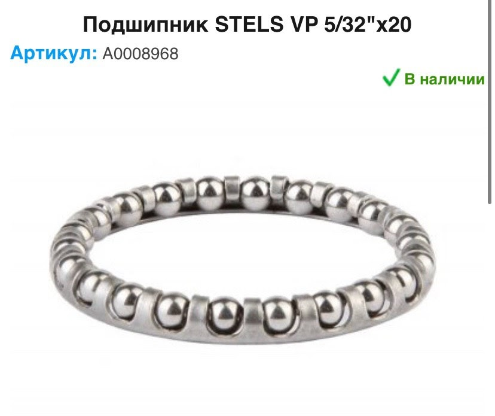]{style="overflow: hidden; display: inline-block; margin: 0.00px 0.00px; border: 0.00px solid #000000; transform: rotate(0.00rad) translateZ(0px); -webkit-transform: rotate(0.00rad) translateZ(0px); width: 345.72px; height: 290.18px;"}

[]{.c5}

[7 STL модели для 3d принтера]{.c78} {#h.jyvmw2fomwxf .c60 .c30}
====================================

[!! Смотрите так же]{.c90 .c50}[ ]{}[FAQ ]{.c90 .c50}[[Какой пластик
использовать для печати деталей?](#h.4hzr6ra4hwas){.c11}]{.c7}

[7.1 Втулки, деталь амортизатора]{.c10} {#h.eh6xdf7n3dc3 .c8}
---------------------------------------

[Новая версия (на 03.04.2019):
]{}[[Скачать](https://drive.google.com/open?id%3D1gXpmoWDKeAfDr3ndDuE0VVN-fteAZ3ot&sa=D&source=editors&ust=1636795599452000&usg=AOvVaw3aRr_Yy7NgYZDYXeb3V5gq){.c11}]{.c7}[(]{}[[Источник](https://t.me/ES_techsupport/91&sa=D&source=editors&ust=1636795599452000&usg=AOvVaw3ftZi9sF-Bpv5m44i0OFxo){.c11}]{.c7}[)]{}

[]{style="overflow: hidden; display: inline-block; margin: 0.00px 0.00px; border: 0.00px solid #000000; transform: rotate(0.00rad) translateZ(0px); -webkit-transform: rotate(0.00rad) translateZ(0px); width: 192.00px; height: 239.00px;"} {#h.xjzkevvo0asx .c84 .c30}
-----------------------------------------------------------------------------------------------------------------------------------------------------------------------------------------------------------------------------------------------------------------------------------------------------------------------

[]{.c5}

[[https://www.thingiverse.com/thing:2815063](https://www.thingiverse.com/thing:2815063&sa=D&source=editors&ust=1636795599453000&usg=AOvVaw2_WL5vJP9x87K1s-b26HRF){.c11}]{.c7}[ ]{.c5}

[]{.c5}

[]{style="overflow: hidden; display: inline-block; margin: 0.00px 0.00px; border: 0.00px solid #000000; transform: rotate(0.00rad) translateZ(0px); -webkit-transform: rotate(0.00rad) translateZ(0px); width: 151.50px; height: 113.87px;"}[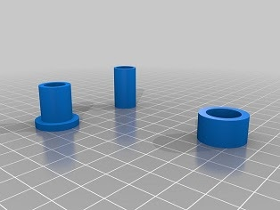]{style="overflow: hidden; display: inline-block; margin: 0.00px 0.00px; border: 0.00px solid #000000; transform: rotate(0.00rad) translateZ(0px); -webkit-transform: rotate(0.00rad) translateZ(0px); width: 153.50px; height: 115.37px;"}[]{style="overflow: hidden; display: inline-block; margin: 0.00px 0.00px; border: 0.00px solid #000000; transform: rotate(0.00rad) translateZ(0px); -webkit-transform: rotate(0.00rad) translateZ(0px); width: 151.71px; height: 114.50px;"}

[]{.c10} {#h.h7gtk6tpddkj .c84 .c30 .c127}
--------

[7.2 Втулки для заднего колеса]{.c10} {#h.imi84f2glzc0 .c8}
-------------------------------------

[Источник: ]{.c5}

[[Ссылка
1](https://electrotransport.ru/ussr/index.php?topic%3D48865.msg1256272%23msg1256272&sa=D&source=editors&ust=1636795599455000&usg=AOvVaw12Iply05Il6oOG7aUteyo-){.c11}]{.c7}[ ]{.c5}

[[Ссылка
2](https://t.me/Ninebot_ES/4509&sa=D&source=editors&ust=1636795599456000&usg=AOvVaw0SidFvfbEgfqsQ_uF2oCsM){.c11}]{.c7}[ ]{.c5}

[]{.c5}

[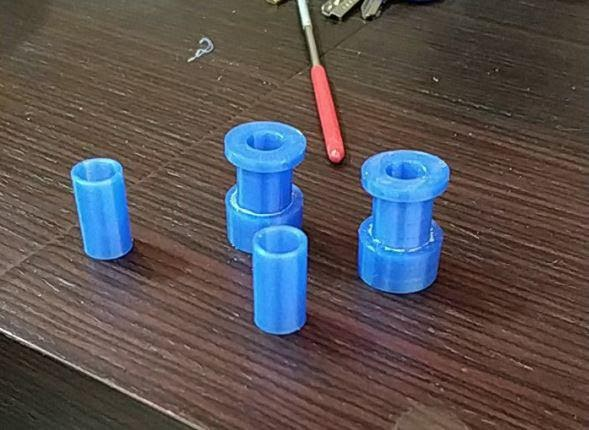]{style="overflow: hidden; display: inline-block; margin: 0.00px 0.00px; border: 0.00px solid #000000; transform: rotate(0.00rad) translateZ(0px); -webkit-transform: rotate(0.00rad) translateZ(0px); width: 203.08px; height: 147.50px;"}

[7.3 Крючок на руль]{.c10} {#h.nwymjfrz0a5a .c8}
--------------------------

[Источник:
]{}[[Перейти](https://t.me/Ninebot_ES/4512&sa=D&source=editors&ust=1636795599457000&usg=AOvVaw2gJzXmiPnN_8wfL9uZI9U5){.c11}]{.c7}

[]{.c5}

[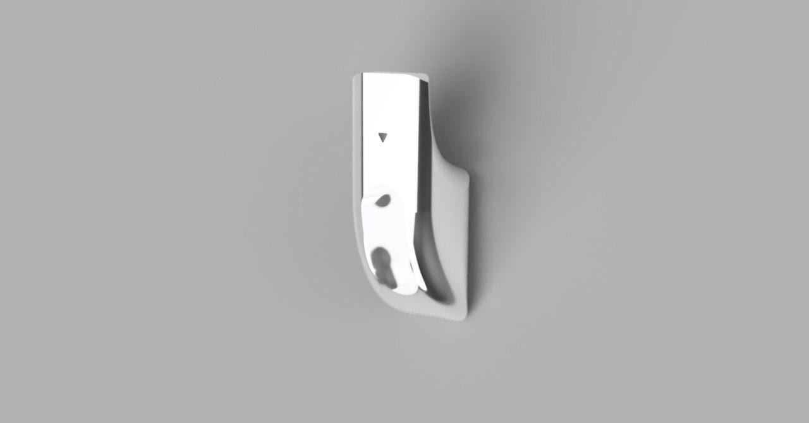]{style="overflow: hidden; display: inline-block; margin: 0.00px 0.00px; border: 0.00px solid #000000; transform: rotate(0.00rad) translateZ(0px); -webkit-transform: rotate(0.00rad) translateZ(0px); width: 117.50px; height: 178.77px;"}

[7.4 Опорная планка для деки]{.c10} {#h.k4q90bb0mm46 .c8}
-----------------------------------

[Источник:
]{}[[Перейти](https://t.me/Ninebot_ES/13811&sa=D&source=editors&ust=1636795599459000&usg=AOvVaw0Cb4N8Ko1u67dSaGDXx1MY){.c11}]{.c7}

[]{style="overflow: hidden; display: inline-block; margin: 0.00px 0.00px; border: 0.00px solid #000000; transform: rotate(0.00rad) translateZ(0px); -webkit-transform: rotate(0.00rad) translateZ(0px); width: 320.00px; height: 180.00px;"}

[]{.c5}

[7.5 Ручка для переноски]{.c10} {#h.hedlbimsliee .c8}
-------------------------------

[Источник:
]{}[[Перейти](https://pinshape.com/items/44152-3d-printed-ninebot-kick-scooter-foldable-easy-transportation-handle&sa=D&source=editors&ust=1636795599460000&usg=AOvVaw2NEAfTGrilEdmggm1no6lm){.c11}]{.c7}

[]{.c5}

[]{style="overflow: hidden; display: inline-block; margin: 0.00px 0.00px; border: 0.00px solid #000000; transform: rotate(0.00rad) translateZ(0px); -webkit-transform: rotate(0.00rad) translateZ(0px); width: 276.00px; height: 205.78px;"}

[]{.c49}

[7.6 Втулка амортизатора]{.c10} {#h.9wh8p8yfc73u .c8}
-------------------------------

[Источник:
]{}[[Перейти](https://t.me/ES_techsupport/92&sa=D&source=editors&ust=1636795599462000&usg=AOvVaw2Q98wJKJXxld7iGIphKdJ1){.c11}]{.c7}

[Модель:
]{}[[Скачать](https://drive.google.com/open?id%3D1odhaJgCBEhuFKMMLy_og1FeAhUvLtrtF&sa=D&source=editors&ust=1636795599462000&usg=AOvVaw3Gd94se7WuZ1Dy9l2r5E4t){.c11}]{.c7}

[]{.c5}

[]{.c5}

[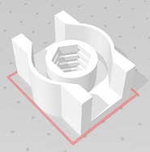]{style="overflow: hidden; display: inline-block; margin: 0.00px 0.00px; border: 0.00px solid #000000; transform: rotate(0.00rad) translateZ(0px); -webkit-transform: rotate(0.00rad) translateZ(0px); width: 185.00px; height: 188.00px;"}

[7.8 Коробочка разъем (большая)]{.c10} {#h.sbfru7vukptu .c8}
--------------------------------------

[Источник:
]{}[[Перейти](https://t.me/ES_techsupport/88&sa=D&source=editors&ust=1636795599464000&usg=AOvVaw1s5lQooij0GsnVKCy_AFby){.c11}]{.c7}

[Модель:
]{}[[Скачать](https://drive.google.com/open?id%3D1WI-e7bYAGHSgR3eeAXcCQI2QoUpQo7Vv&sa=D&source=editors&ust=1636795599464000&usg=AOvVaw15Q9EVShcS8ZmuAiySQNe8){.c11}]{.c7}

[]{style="overflow: hidden; display: inline-block; margin: 0.00px 0.00px; border: 0.00px solid #000000; transform: rotate(0.00rad) translateZ(0px); -webkit-transform: rotate(0.00rad) translateZ(0px); width: 198.00px; height: 192.00px;"}

[7.9 Коробочка разъем (малая)]{.c10} {#h.bhup8ne0bcn3 .c8}
------------------------------------

[Источник:
]{}[[Перейти](https://t.me/ES_techsupport/89&sa=D&source=editors&ust=1636795599465000&usg=AOvVaw3H0N7AX7pEQZ1mGgqHEP8Y){.c11}]{.c7}

[Модель:
]{}[[Скачать](https://drive.google.com/open?id%3D1kNpQtRh6Sc_b8VduCJySk0KyLqYfogXA&sa=D&source=editors&ust=1636795599466000&usg=AOvVaw34y_Ikdxxa9Ey0DgTdGsrc){.c11}]{.c7}

[]{style="overflow: hidden; display: inline-block; margin: 0.00px 0.00px; border: 0.00px solid #000000; transform: rotate(0.00rad) translateZ(0px); -webkit-transform: rotate(0.00rad) translateZ(0px); width: 299.00px; height: 268.00px;"}

[7.10 Пыльник деки]{.c10} {#h.9cx2m3wj27bt .c8}
-------------------------

[Источник:
]{}[[Перейти](https://t.me/ES_techsupport/90&sa=D&source=editors&ust=1636795599467000&usg=AOvVaw1TcjTh2_tpFO7PhQrGQss0){.c11}]{.c7}

[Модель:
]{}[[Скачать](https://drive.google.com/open?id%3D128T0hXzRNHrWUMxjrfJFu3ueMO_cZ4Va&sa=D&source=editors&ust=1636795599468000&usg=AOvVaw0-YB905w4URN-ONTYOnSii){.c11}]{.c7}

[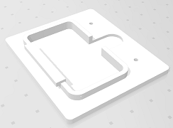]{style="overflow: hidden; display: inline-block; margin: 0.00px 0.00px; border: 0.00px solid #000000; transform: rotate(0.00rad) translateZ(0px); -webkit-transform: rotate(0.00rad) translateZ(0px); width: 244.00px; height: 180.00px;"} {#h.amekod74zm5q .c84 .c30}
-----------------------------------------------------------------------------------------------------------------------------------------------------------------------------------------------------------------------------------------------------------------------------------------------------------------------

[7.11 Рулевая втулка со смещением (3’)]{.c10} {#h.ikgi4ujy4b1s .c8}
---------------------------------------------

[Источник:
]{}[[Перейти](https://t.me/Ninebot_ES/26042&sa=D&source=editors&ust=1636795599469000&usg=AOvVaw1Tg4uW0sFO_GMeWfuUvCW4){.c11}]{.c7}

[Модель:
]{}[[Скачать](https://drive.google.com/open?id%3D1gY0g831FqGdEzTo5AWHRZ1fEb2KCX_l9&sa=D&source=editors&ust=1636795599470000&usg=AOvVaw1y15xgdIIGzMtVRm9jFptQ){.c11}]{.c7}

[]{.c5}

[]{style="overflow: hidden; display: inline-block; margin: 0.00px 0.00px; border: 0.00px solid #000000; transform: rotate(0.00rad) translateZ(0px); -webkit-transform: rotate(0.00rad) translateZ(0px); width: 203.00px; height: 240.00px;"}

[7.12 Рулевая втулка со смещением (4’)]{.c10} {#h.u1cbv9gczkmw .c8}
---------------------------------------------

[Источник:
]{}[[Перейти](https://t.me/Ninebot_ES/26042&sa=D&source=editors&ust=1636795599471000&usg=AOvVaw0CSVynKWOf1wJNNdKnFfmf){.c11}]{.c7}

[Модель:
]{}[[Скачать](https://drive.google.com/open?id%3D12b5P2KvL_OJrFZBhxoWaO4c0wuhX_JxC&sa=D&source=editors&ust=1636795599472000&usg=AOvVaw3sW1xNJHK-kx5EiMWsetP0){.c11}]{.c7}

[]{.c5}

[]{style="overflow: hidden; display: inline-block; margin: 0.00px 0.00px; border: 0.00px solid #000000; transform: rotate(0.00rad) translateZ(0px); -webkit-transform: rotate(0.00rad) translateZ(0px); width: 203.00px; height: 240.00px;"}

[]{.c5}

[7.13 Ручка переноски]{.c10} {#h.h995r3wpdoob .c8}
----------------------------

[Модель: https://www.thingiverse.com/thing:3095684]{.c5}

[]{style="overflow: hidden; display: inline-block; margin: 0.00px 0.00px; border: 0.00px solid #000000; transform: rotate(0.00rad) translateZ(0px); -webkit-transform: rotate(0.00rad) translateZ(0px); width: 365.22px; height: 274.50px;"}

[7.14 Крепление самоката к стене]{.c10} {#h.jp18btuu0pkg .c8}
---------------------------------------

[Модель:
]{}[[https://www.thingiverse.com/thing:3101731](https://www.thingiverse.com/thing:3101731&sa=D&source=editors&ust=1636795599475000&usg=AOvVaw1jpBQyPYfDk5bENNdy7WXs){.c11}]{.c7}[ ]{.c5}

[]{.c5}

[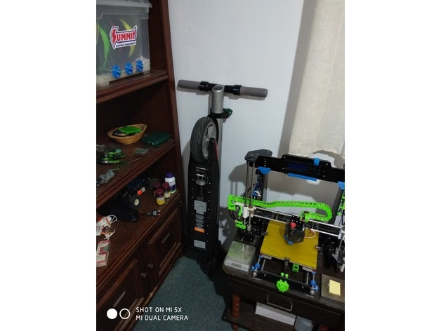]{style="overflow: hidden; display: inline-block; margin: 0.00px 0.00px; border: 0.00px solid #000000; transform: rotate(0.00rad) translateZ(0px); -webkit-transform: rotate(0.00rad) translateZ(0px); width: 352.50px; height: 264.94px;"}

[7.15 Опорная планка]{.c10} {#h.r3rtillsck39 .c8}
---------------------------

[Модель:
]{}[[https://www.thingiverse.com/thing:3074862](https://www.thingiverse.com/thing:3074862&sa=D&source=editors&ust=1636795599476000&usg=AOvVaw3xJjL-NvtbbzkAtcPmlQSh){.c11}]{.c7}

[]{.c5}

[]{style="overflow: hidden; display: inline-block; margin: 0.00px 0.00px; border: 0.00px solid #000000; transform: rotate(0.00rad) translateZ(0px); -webkit-transform: rotate(0.00rad) translateZ(0px); width: 304.02px; height: 228.50px;"}

[]{.c5}

[7.16 Крючок]{.c10} {#h.35lcqtcde84q .c8}
-------------------

[Модель:
]{}[[https://www.thingiverse.com/thing:3034236](https://www.thingiverse.com/thing:3034236&sa=D&source=editors&ust=1636795599478000&usg=AOvVaw1Rqat04ZtbiFcUvs2T14dt){.c11}]{.c7}

[]{.c5}

[]{style="overflow: hidden; display: inline-block; margin: 0.00px 0.00px; border: 0.00px solid #000000; transform: rotate(0.00rad) translateZ(0px); -webkit-transform: rotate(0.00rad) translateZ(0px); width: 296.04px; height: 222.50px;"}

[]{.c5}

[7.17 Брызговик]{.c10} {#h.2plher6qyk8i .c8}
----------------------

[Модель:
]{}[[https://drive.google.com/open?id=1BC3tbt2lPtai77A1d4fDAbIXgM7LFqMI](https://drive.google.com/open?id%3D1BC3tbt2lPtai77A1d4fDAbIXgM7LFqMI&sa=D&source=editors&ust=1636795599479000&usg=AOvVaw2XEvTlbI9UHGtwrPhi1dHb){.c11}]{.c7}[ ]{.c5}

[]{.c5}

[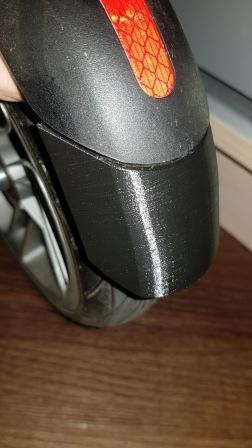]{style="overflow: hidden; display: inline-block; margin: 0.00px 0.00px; border: 0.00px solid #000000; transform: rotate(0.00rad) translateZ(0px); -webkit-transform: rotate(0.00rad) translateZ(0px); width: 252.00px; height: 448.00px;"}

[7.18 Планка для доп. батареи]{.c10} {#h.kh6yser4d34b .c8}
------------------------------------

[Модель:
]{}[[https://www.thingiverse.com/thing:3147315](https://www.thingiverse.com/thing:3147315&sa=D&source=editors&ust=1636795599481000&usg=AOvVaw3XeWIkNkcaD21ry4J2529G){.c11}]{.c7}

[]{.c5}

[]{style="overflow: hidden; display: inline-block; margin: 0.00px 0.00px; border: 0.00px solid #000000; transform: rotate(0.00rad) translateZ(0px); -webkit-transform: rotate(0.00rad) translateZ(0px); width: 414.50px; height: 311.31px;"}

[]{.c5}

[7.19 Детали в узел сложения]{.c10} {#h.qhiwy3k2b9uu .c8}
-----------------------------------

[Модель:
]{}[[https://www.thingiverse.com/thing:3046499](https://www.thingiverse.com/thing:3046499&sa=D&source=editors&ust=1636795599482000&usg=AOvVaw0YZhVF3hbSoJ4VaGpb9PYG){.c11}]{.c7}[ ]{.c5}

[]{.c5}

[]{style="overflow: hidden; display: inline-block; margin: 0.00px 0.00px; border: 0.00px solid #000000; transform: rotate(0.00rad) translateZ(0px); -webkit-transform: rotate(0.00rad) translateZ(0px); width: 365.50px; height: 274.71px;"}

[7.20 Подстаканник]{.c10} {#h.tcyp3ixu8az0 .c8}
-------------------------

[Модель:
]{}[[https://www.thingiverse.com/thing:3082418](https://www.thingiverse.com/thing:3082418&sa=D&source=editors&ust=1636795599484000&usg=AOvVaw2Hr2Yg_W-y7HRkE7yRVqMM){.c11}]{.c7}

[]{.c5}

[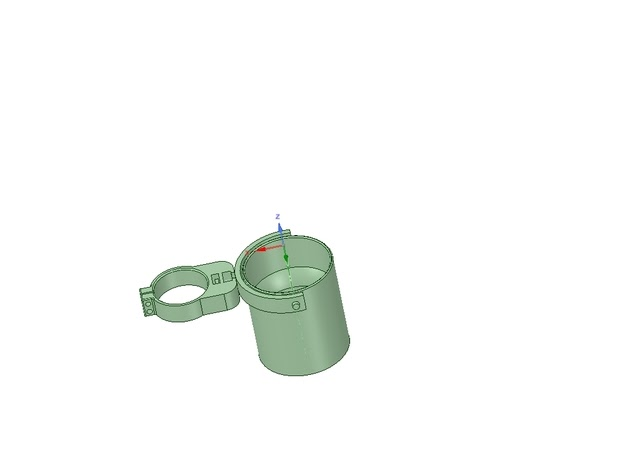]{style="overflow: hidden; display: inline-block; margin: 0.00px 0.00px; border: 0.00px solid #000000; transform: rotate(0.00rad) translateZ(0px); -webkit-transform: rotate(0.00rad) translateZ(0px); width: 322.50px; height: 242.39px;"}

[7.21 Деталь подставки]{.c10} {#h.8874rp8kj17u .c8}
-----------------------------

[Модель:
]{}[[https://www.thingiverse.com/thing:3153202](https://www.thingiverse.com/thing:3153202&sa=D&source=editors&ust=1636795599485000&usg=AOvVaw0x0vpztjlvW9LGr256uMbV){.c11}]{.c7}

[]{.c5}

[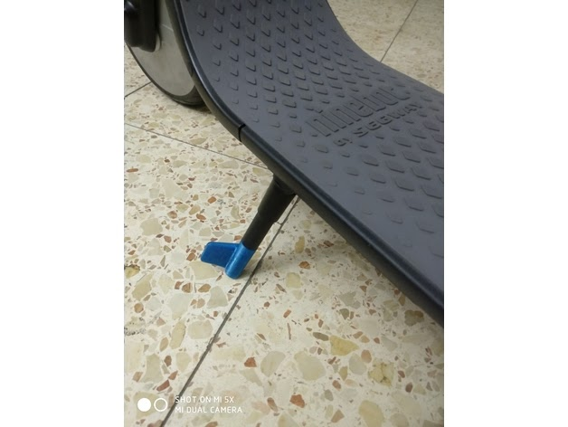]{style="overflow: hidden; display: inline-block; margin: 0.00px 0.00px; border: 0.00px solid #000000; transform: rotate(0.00rad) translateZ(0px); -webkit-transform: rotate(0.00rad) translateZ(0px); width: 421.11px; height: 316.50px;"}

[]{.c5}

[7.22 Крепление на стену]{.c10} {#h.8o9z0sf6mtst .c8}
-------------------------------

[Модель:
]{}[[https://www.thingiverse.com/thing:3140826](https://www.thingiverse.com/thing:3140826&sa=D&source=editors&ust=1636795599487000&usg=AOvVaw1MHsZaiP1EwtPZ6J7Gi1mY){.c11}]{.c7}

[]{.c5}

[]{style="overflow: hidden; display: inline-block; margin: 0.00px 0.00px; border: 0.00px solid #000000; transform: rotate(0.00rad) translateZ(0px); -webkit-transform: rotate(0.00rad) translateZ(0px); width: 348.50px; height: 261.93px;"}

[]{.c5}

[7.23 Брызговик]{.c10} {#h.6zxiv5im62hw .c8}
----------------------

[Модель:
]{}[[https://www.thingiverse.com/thing:3138036](https://www.thingiverse.com/thing:3138036&sa=D&source=editors&ust=1636795599489000&usg=AOvVaw2KURsUrll9wQ--3wLGhfsq){.c11}]{.c7}

[]{.c5}

[]{style="overflow: hidden; display: inline-block; margin: 0.00px 0.00px; border: 0.00px solid #000000; transform: rotate(0.00rad) translateZ(0px); -webkit-transform: rotate(0.00rad) translateZ(0px); width: 424.50px; height: 319.05px;"}

[7.24 Крыло на переднее колесо]{.c10} {#h.9x9qr7wuqmix .c8}
-------------------------------------

[Модель:
]{}[[https://www.thingiverse.com/thing:3290445](https://www.thingiverse.com/thing:3290445&sa=D&source=editors&ust=1636795599490000&usg=AOvVaw1yfuDMgc0rL7tDP7AMuEda){.c11}]{.c7}

[]{.c5}

[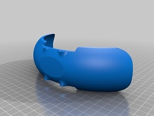]{style="overflow: hidden; display: inline-block; margin: 0.00px 0.00px; border: 0.00px solid #000000; transform: rotate(0.00rad) translateZ(0px); -webkit-transform: rotate(0.00rad) translateZ(0px); width: 314.00px; height: 236.00px;"}

[7.24 Крыло на заднее колесо]{.c10} {#h.if99xgjpskvg .c8}
-----------------------------------

[Источник:
]{}[[https://t.me/ES\_techsupport/93](https://t.me/ES_techsupport/93&sa=D&source=editors&ust=1636795599491000&usg=AOvVaw0N4zpql5SCTG6qv-YlcS7z){.c11}]{.c7}[ ]{.c5}

[Модель:
]{}[[Скачать](https://drive.google.com/open?id%3D1gv-bTO64FGU-TMHna1oKWlMgww_9lJ4d&sa=D&source=editors&ust=1636795599492000&usg=AOvVaw1XSIN6p6h8b0BpZyQxLbEF){.c11}]{.c7}

[]{.c5}

[]{style="overflow: hidden; display: inline-block; margin: 0.00px 0.00px; border: 0.00px solid #000000; transform: rotate(0.00rad) translateZ(0px); -webkit-transform: rotate(0.00rad) translateZ(0px); width: 307.00px; height: 208.00px;"}

[7.25 Крышка датчика холла в курок]{.c10} {#h.kdavgr53uokz .c8}
-----------------------------------------

[Источник:
]{}[[https://t.me/ES\_techsupport](https://t.me/ES_techsupport&sa=D&source=editors&ust=1636795599494000&usg=AOvVaw16WxopfY4txd_jt-x5OmPI){.c11}]{.c7}[ ]{.c5}

[Модель:
]{}[[Скачать](https://drive.google.com/file/d/1nXU1104wEAXEOWRZNyhZz28oIA6b4v40/view?usp%3Dsharing&sa=D&source=editors&ust=1636795599495000&usg=AOvVaw0oojfi4PlfTKD2QF3DKgTn){.c11}]{.c7}

[]{.c5}

[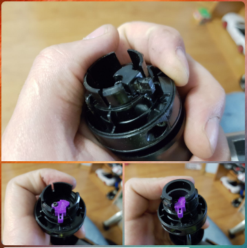]{style="overflow: hidden; display: inline-block; margin: 0.00px 0.00px; border: 0.00px solid #000000; transform: rotate(0.00rad) translateZ(0px); -webkit-transform: rotate(0.00rad) translateZ(0px); width: 359.00px; height: 360.00px;"}

[7.26 Демпфер в пружину переднего амортизатора]{.c10} {#h.tlycgt8z20g2 .c8}
-----------------------------------------------------

[Модель:
]{}[[https://www.thingiverse.com/thing:3897204](https://www.thingiverse.com/thing:3897204&sa=D&source=editors&ust=1636795599496000&usg=AOvVaw09dnDlTTq4dt0wWUVvf0OY){.c11}]{.c7}

[]{style="overflow: hidden; display: inline-block; margin: 0.00px 0.00px; border: 0.00px solid #000000; transform: rotate(0.00rad) translateZ(0px); -webkit-transform: rotate(0.00rad) translateZ(0px); width: 125.00px; height: 94.00px;"}[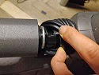]{style="overflow: hidden; display: inline-block; margin: 0.00px 0.00px; border: 0.00px solid #000000; transform: rotate(0.00rad) translateZ(0px); -webkit-transform: rotate(0.00rad) translateZ(0px); width: 125.00px; height: 94.00px;"}[]{style="overflow: hidden; display: inline-block; margin: 0.00px 0.00px; border: 0.00px solid #000000; transform: rotate(0.00rad) translateZ(0px); -webkit-transform: rotate(0.00rad) translateZ(0px); width: 125.00px; height: 107.00px;"}

[8 Размеры деталей самоката]{.c78} {#h.im0qp28jdu39 .c60 .c30}
==================================

[8.1 Задний амортизатор]{.c10} {#h.phhuiiy9vr10 .c8}
------------------------------

[Источник:
]{}[[https://t.me/Ninebot\_ES/8594](https://t.me/Ninebot_ES/8594&sa=D&source=editors&ust=1636795599498000&usg=AOvVaw34P5V4cCV3Xzb0R9o74bSg){.c11}]{.c7}

[]{style="overflow: hidden; display: inline-block; margin: 0.00px 0.00px; border: 0.00px solid #000000; transform: rotate(0.00rad) translateZ(0px); -webkit-transform: rotate(0.00rad) translateZ(0px); width: 661.00px; height: 286.00px;"}[]{style="overflow: hidden; display: inline-block; margin: 0.00px 0.00px; border: 0.00px solid #000000; transform: rotate(0.00rad) translateZ(0px); -webkit-transform: rotate(0.00rad) translateZ(0px); width: 437.00px; height: 525.00px;"}[]{style="overflow: hidden; display: inline-block; margin: 0.00px 0.00px; border: 0.00px solid #000000; transform: rotate(0.00rad) translateZ(0px); -webkit-transform: rotate(0.00rad) translateZ(0px); width: 234.00px; height: 290.00px;"}[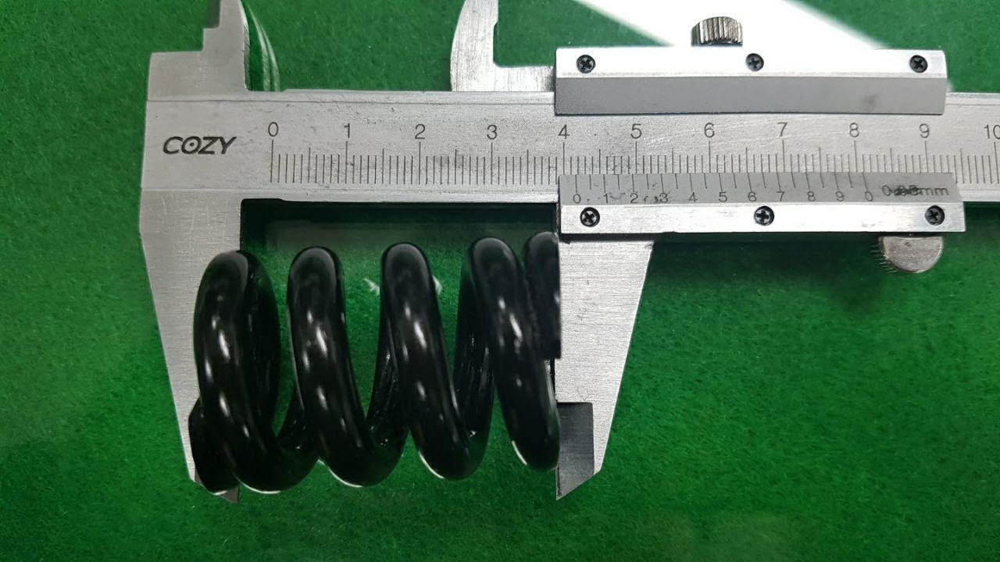]{style="overflow: hidden; display: inline-block; margin: 0.00px 0.00px; border: 0.00px solid #000000; transform: rotate(0.00rad) translateZ(0px); -webkit-transform: rotate(0.00rad) translateZ(0px); width: 357.00px; height: 372.00px;"}

[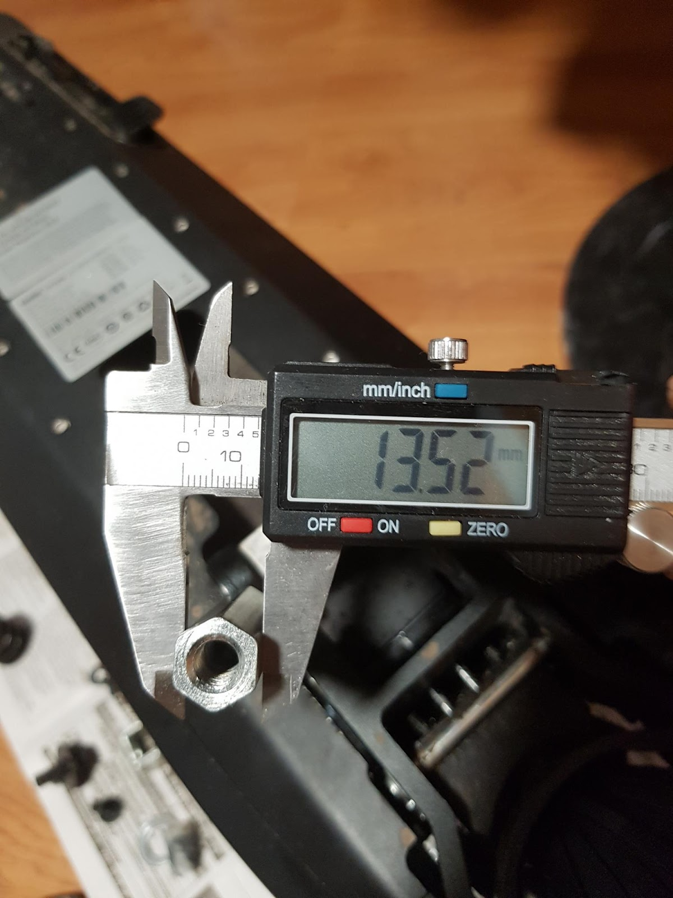]{style="overflow: hidden; display: inline-block; margin: 0.00px 0.00px; border: 0.00px solid #000000; transform: rotate(0.00rad) translateZ(0px); -webkit-transform: rotate(0.00rad) translateZ(0px); width: 328.99px; height: 438.50px;"}[]{style="overflow: hidden; display: inline-block; margin: 0.00px 0.00px; border: 0.00px solid #000000; transform: rotate(0.00rad) translateZ(0px); -webkit-transform: rotate(0.00rad) translateZ(0px); width: 340.50px; height: 255.38px;"}

[8.2 Руль]{.c10} {#h.mhapp6g3qed3 .c8}
----------------

[Источник:
]{}[[Перейти](https://t.me/Ninebot_ES/8594&sa=D&source=editors&ust=1636795599499000&usg=AOvVaw2d2za5opozdmTzNR1z1IUZ){.c11}]{.c7}[ ]{.c5}

[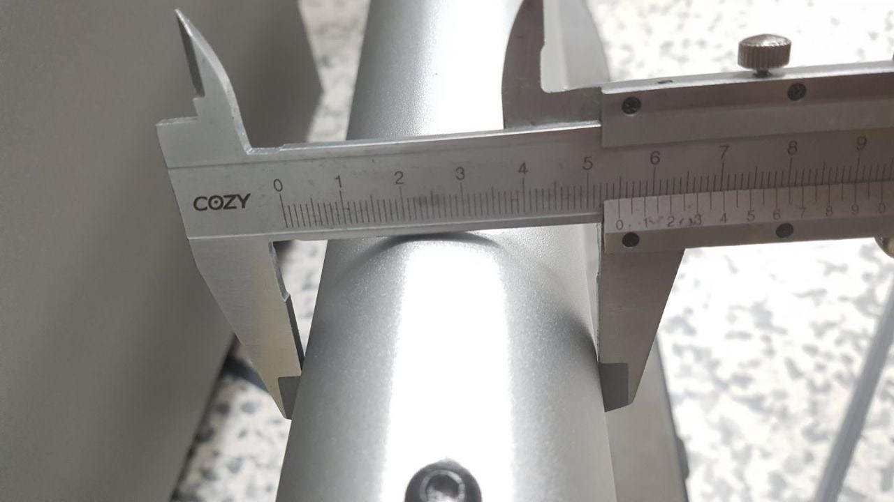]{style="overflow: hidden; display: inline-block; margin: 0.00px 0.00px; border: 0.00px solid #000000; transform: rotate(0.00rad) translateZ(0px); -webkit-transform: rotate(0.00rad) translateZ(0px); width: 414.00px; height: 358.00px;"}

[Источник:
]{}[[Перейти](https://electrotransport.ru/ussr/index.php?topic%3D48865.msg1286716%23msg1286716&sa=D&source=editors&ust=1636795599501000&usg=AOvVaw0n1rUyFVPOaxAfD5V2aS_x){.c11}]{.c7}

[]{style="overflow: hidden; display: inline-block; margin: 0.00px 0.00px; border: 0.00px solid #000000; transform: rotate(0.00rad) translateZ(0px); -webkit-transform: rotate(0.00rad) translateZ(0px); width: 301.50px; height: 402.49px;"}[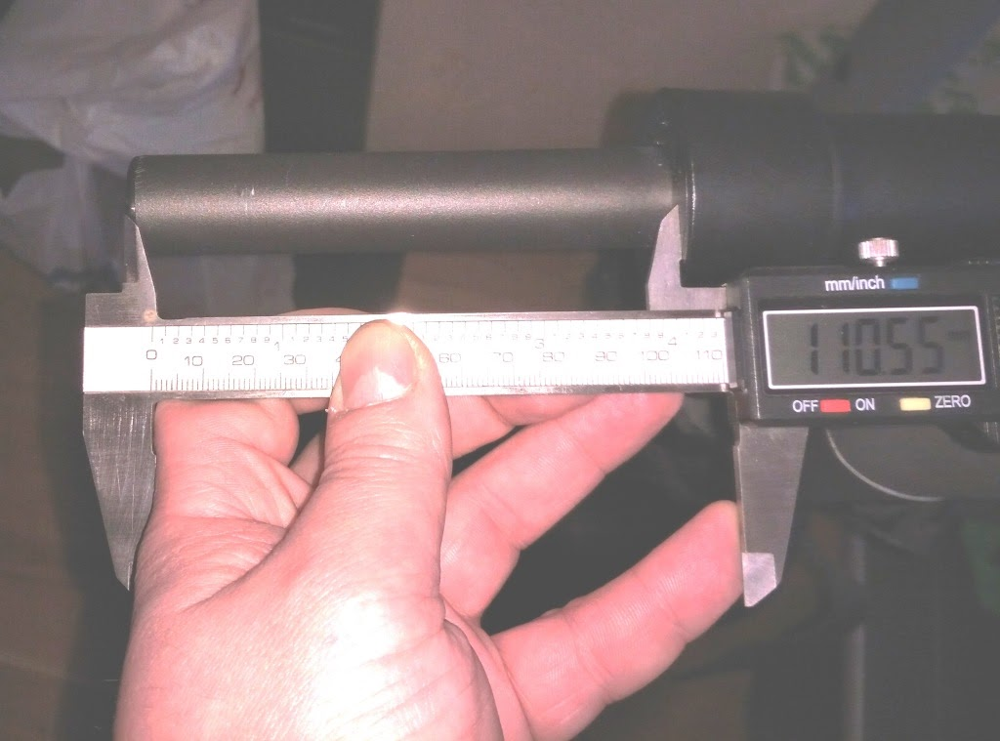]{style="overflow: hidden; display: inline-block; margin: 0.00px 0.00px; border: 0.00px solid #000000; transform: rotate(0.00rad) translateZ(0px); -webkit-transform: rotate(0.00rad) translateZ(0px); width: 428.50px; height: 316.13px;"}

[8.3 Покрышка]{.c10} {#h.o9ddy9fdc096 .c8}
--------------------

[Источник:
]{}[[Перейти](https://t.me/Ninebot_ES/9549&sa=D&source=editors&ust=1636795599503000&usg=AOvVaw03C7rqfemXKMKDBHEzWLUz){.c11}]{.c7}

[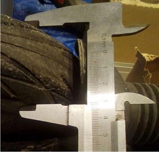]{style="overflow: hidden; display: inline-block; margin: 0.00px 0.00px; border: 0.00px solid #000000; transform: rotate(0.00rad) translateZ(0px); -webkit-transform: rotate(0.00rad) translateZ(0px); width: 311.00px; height: 297.00px;"}[]{style="overflow: hidden; display: inline-block; margin: 0.00px 0.00px; border: 0.00px solid #000000; transform: rotate(0.00rad) translateZ(0px); -webkit-transform: rotate(0.00rad) translateZ(0px); width: 300.00px; height: 294.00px;"}

[]{style="overflow: hidden; display: inline-block; margin: 0.00px 0.00px; border: 0.00px solid #000000; transform: rotate(0.00rad) translateZ(0px); -webkit-transform: rotate(0.00rad) translateZ(0px); width: 300.00px; height: 296.00px;"}

[]{.c5}

[8.4 Передний амортизатор]{.c10} {#h.9mbb36m94o05 .c8}
--------------------------------

[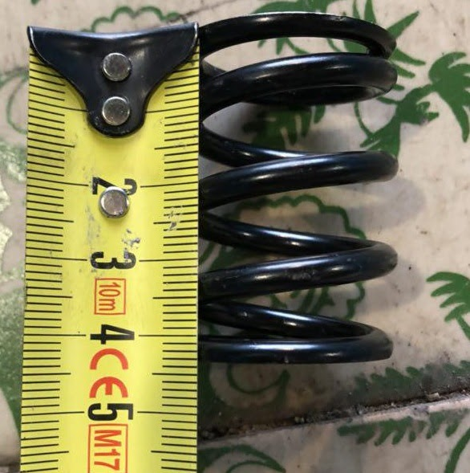]{style="overflow: hidden; display: inline-block; margin: 0.00px 0.00px; border: 0.00px solid #000000; transform: rotate(0.00rad) translateZ(0px); -webkit-transform: rotate(0.00rad) translateZ(0px); width: 586.00px; height: 589.00px;"}[]{style="overflow: hidden; display: inline-block; margin: 0.00px 0.00px; border: 0.00px solid #000000; transform: rotate(0.00rad) translateZ(0px); -webkit-transform: rotate(0.00rad) translateZ(0px); width: 569.00px; height: 462.00px;"}

[8.5 Мотор колесо]{.c10} {#h.3oyztoeh7hp .c8}
------------------------

[]{style="overflow: hidden; display: inline-block; margin: 0.00px 0.00px; border: 0.00px solid #000000; transform: rotate(0.00rad) translateZ(0px); -webkit-transform: rotate(0.00rad) translateZ(0px); width: 700.00px; height: 392.00px;"}[]{style="overflow: hidden; display: inline-block; margin: 0.00px 0.00px; border: 0.00px solid #000000; transform: rotate(0.00rad) translateZ(0px); -webkit-transform: rotate(0.00rad) translateZ(0px); width: 700.00px; height: 392.00px;"}[]{style="overflow: hidden; display: inline-block; margin: 0.00px 0.00px; border: 0.00px solid #000000; transform: rotate(0.00rad) translateZ(0px); -webkit-transform: rotate(0.00rad) translateZ(0px); width: 700.00px; height: 392.00px;"}[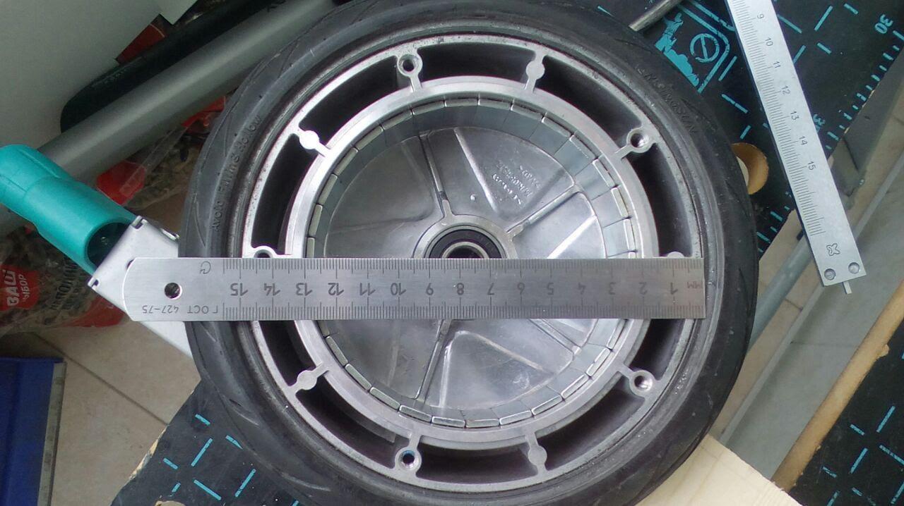]{style="overflow: hidden; display: inline-block; margin: 0.00px 0.00px; border: 0.00px solid #000000; transform: rotate(0.00rad) translateZ(0px); -webkit-transform: rotate(0.00rad) translateZ(0px); width: 700.00px; height: 392.00px;"}[]{style="overflow: hidden; display: inline-block; margin: 0.00px 0.00px; border: 0.00px solid #000000; transform: rotate(0.00rad) translateZ(0px); -webkit-transform: rotate(0.00rad) translateZ(0px); width: 700.00px; height: 392.00px;"}[]{style="overflow: hidden; display: inline-block; margin: 0.00px 0.00px; border: 0.00px solid #000000; transform: rotate(0.00rad) translateZ(0px); -webkit-transform: rotate(0.00rad) translateZ(0px); width: 700.00px; height: 392.00px;"}[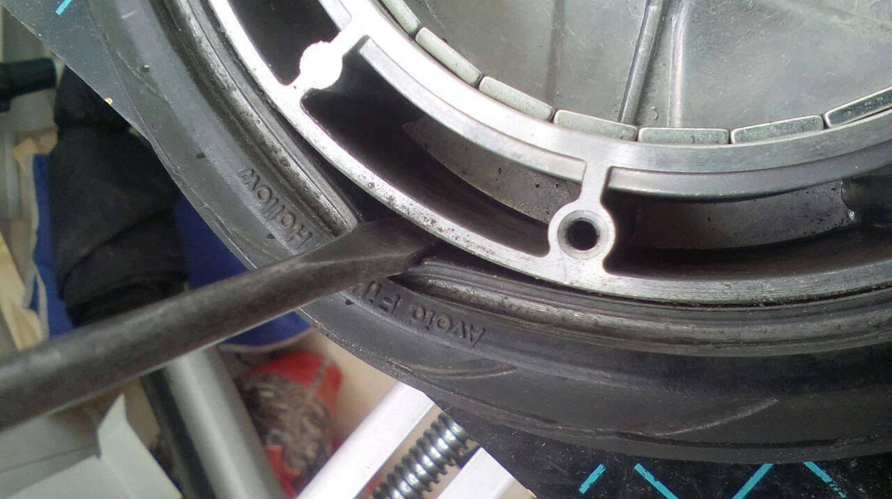]{style="overflow: hidden; display: inline-block; margin: 0.00px 0.00px; border: 0.00px solid #000000; transform: rotate(0.00rad) translateZ(0px); -webkit-transform: rotate(0.00rad) translateZ(0px); width: 700.00px; height: 392.00px;"}[]{style="overflow: hidden; display: inline-block; margin: 0.00px 0.00px; border: 0.00px solid #000000; transform: rotate(0.00rad) translateZ(0px); -webkit-transform: rotate(0.00rad) translateZ(0px); width: 700.00px; height: 392.00px;"}

[8.6 Корончатая гайка, резиновый демпфер и шток переднего колеса]{.c10} {#h.owrxoxllagcu .c8}
-----------------------------------------------------------------------

[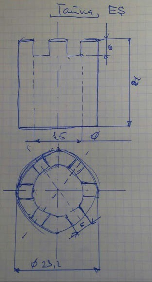]{style="overflow: hidden; display: inline-block; margin: 0.00px 0.00px; border: 0.00px solid #000000; transform: rotate(0.00rad) translateZ(0px); -webkit-transform: rotate(0.00rad) translateZ(0px); width: 313.00px; height: 579.00px;"}

[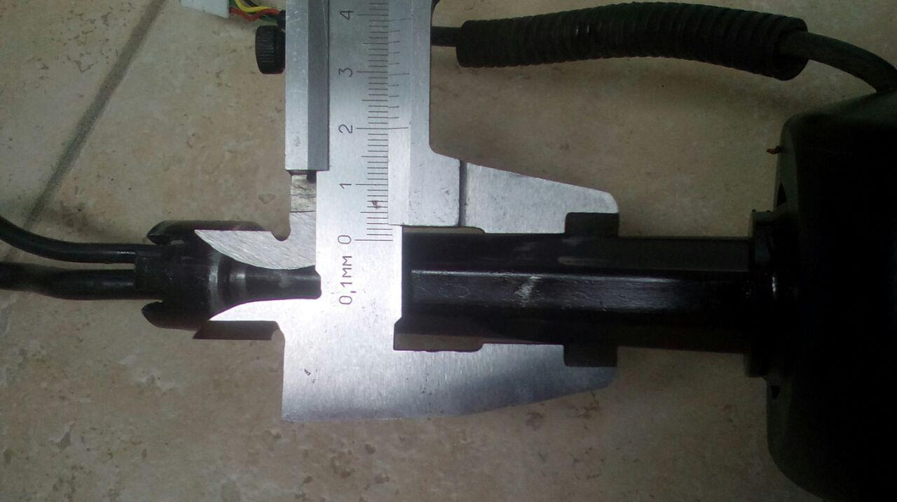]{style="overflow: hidden; display: inline-block; margin: 0.00px 0.00px; border: 0.00px solid #000000; transform: rotate(0.00rad) translateZ(0px); -webkit-transform: rotate(0.00rad) translateZ(0px); width: 700.00px; height: 392.00px;"}[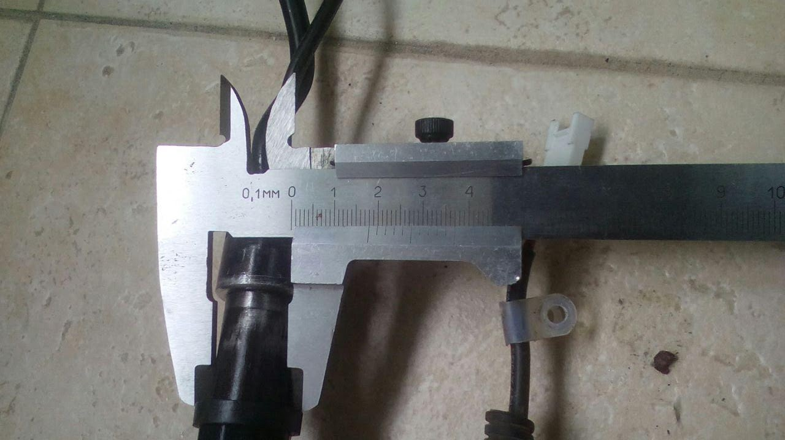]{style="overflow: hidden; display: inline-block; margin: 0.00px 0.00px; border: 0.00px solid #000000; transform: rotate(0.00rad) translateZ(0px); -webkit-transform: rotate(0.00rad) translateZ(0px); width: 700.00px; height: 392.00px;"}[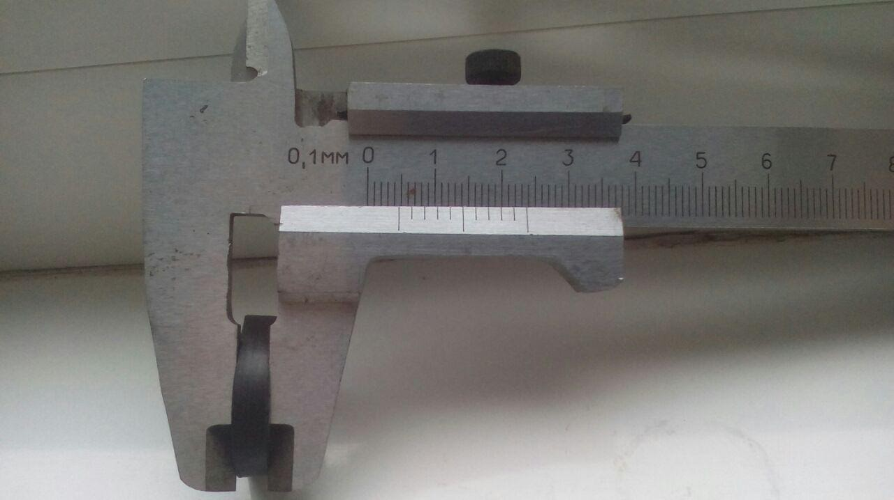]{style="overflow: hidden; display: inline-block; margin: 0.00px 0.00px; border: 0.00px solid #000000; transform: rotate(0.00rad) translateZ(0px); -webkit-transform: rotate(0.00rad) translateZ(0px); width: 700.00px; height: 392.00px;"}[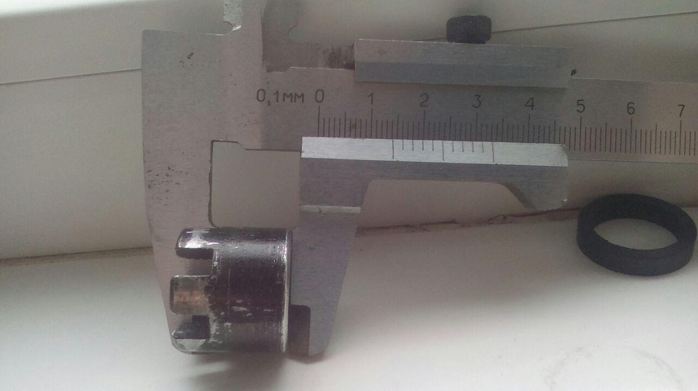]{style="overflow: hidden; display: inline-block; margin: 0.00px 0.00px; border: 0.00px solid #000000; transform: rotate(0.00rad) translateZ(0px); -webkit-transform: rotate(0.00rad) translateZ(0px); width: 700.00px; height: 392.00px;"}[]{style="overflow: hidden; display: inline-block; margin: 0.00px 0.00px; border: 0.00px solid #000000; transform: rotate(0.00rad) translateZ(0px); -webkit-transform: rotate(0.00rad) translateZ(0px); width: 700.00px; height: 392.00px;"}[]{style="overflow: hidden; display: inline-block; margin: 0.00px 0.00px; border: 0.00px solid #000000; transform: rotate(0.00rad) translateZ(0px); -webkit-transform: rotate(0.00rad) translateZ(0px); width: 700.00px; height: 392.00px;"}[]{style="overflow: hidden; display: inline-block; margin: 0.00px 0.00px; border: 0.00px solid #000000; transform: rotate(0.00rad) translateZ(0px); -webkit-transform: rotate(0.00rad) translateZ(0px); width: 700.00px; height: 392.00px;"}[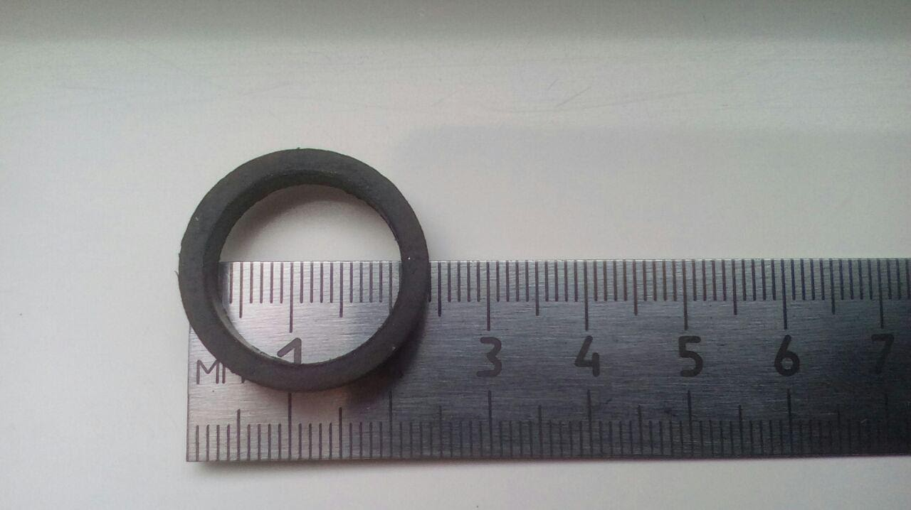]{style="overflow: hidden; display: inline-block; margin: 0.00px 0.00px; border: 0.00px solid #000000; transform: rotate(0.00rad) translateZ(0px); -webkit-transform: rotate(0.00rad) translateZ(0px); width: 700.00px; height: 392.00px;"}

[9 Различная полезная информация]{.c78} {#h.tcw2ctb3ras6 .c60 .c30}
=======================================

[9.1 Wiki статья по литий ионным аккумуляторам]{.c10} {#h.3chkz4z1jvyg .c8}
-----------------------------------------------------

[[https://ru.wikipedia.org/wiki/%D0%9B%D0%B8%D1%82%D0%B8%D0%B9-%D0%B8%D0%BE%D0%BD%D0%BD%D1%8B%D0%B9\_%D0%B0%D0%BA%D0%BA%D1%83%D0%BC%D1%83%D0%BB%D1%8F%D1%82%D0%BE%D1%80](https://ru.wikipedia.org/wiki/%25D0%259B%25D0%25B8%25D1%2582%25D0%25B8%25D0%25B9-%25D0%25B8%25D0%25BE%25D0%25BD%25D0%25BD%25D1%258B%25D0%25B9_%25D0%25B0%25D0%25BA%25D0%25BA%25D1%2583%25D0%25BC%25D1%2583%25D0%25BB%25D1%258F%25D1%2582%25D0%25BE%25D1%2580&sa=D&source=editors&ust=1636795599507000&usg=AOvVaw2GR8gbQKozpYrN4xGAi6x8){.c11}]{.c7}

[9.2 Фотографии электронной начинки]{.c10} {#h.1y4mqiyth8n7 .c8}
------------------------------------------

[]{#t.af6f05a101e19616cb795ca01bf8d820f302ab70}[]{#t.40}
+-----------------------+-----------------------+-----------------------+
| [Источник:            | [Источник:            | [Источник:            |
| ]{}[[Перейти](https:/ | ]{}[[Перейти](https:/ | ]{}[[Перейти](https:/ |
| /electrotransport.ru/ | /electrotransport.ru/ | /electrotransport.ru/ |
| ussr/index.php?topic% | ussr/index.php?topic% | ussr/index.php?topic% |
| 3D48865.msg1178115%23 | 3D48865.msg1202395%23 | 3D48865.msg1202395%23 |
| msg1178115&sa=D&sourc | msg1202395&sa=D&sourc | msg1202395&sa=D&sourc |
| e=editors&ust=1636795 | e=editors&ust=1636795 | e=editors&ust=1636795 |
| 599508000&usg=AOvVaw0 | 599510000&usg=AOvVaw2 | 599511000&usg=AOvVaw0 |
| LPrc_ioPI00XGj2-D-h3O | xj-mc_vsnuQq_OK17l4yt | 6QzrNcpu_7mP8Npx99R3_ |
| ){.c11}]{.c7}         | ){.c11}]{.c7}         | ){.c11}]{.c7}[]{style="overflo |
| []{style= | w: hidden; display: i |
| hHgGk25_EJXciVHWnxOIK | "overflow: hidden; di | nline-block; margin:  |
| 3i-5BNftimr6nIAL_bLxf | splay: inline-block;  | 0.00px 0.00px; border |
| I9QmsHcF.jpg)]{style= | margin: 0.00px 0.00px | : 0.00px solid #00000 |
| "overflow: hidden; di | ; border: 0.00px soli | 0; transform: rotate( |
| splay: inline-block;  | d #000000; transform: | 0.00rad) translateZ(0 |
| margin: 0.00px 0.00px |  rotate(0.00rad) tran | px); -webkit-transfor |
| ; border: 0.00px soli | slateZ(0px); -webkit- | m: rotate(0.00rad) tr |
| d #000000; transform: | transform: rotate(0.0 | anslateZ(0px); width: |
|  rotate(0.00rad) tran | 0rad) translateZ(0px) |  206.00px; height: 15 |
| slateZ(0px); -webkit- | ; width: 206.00px; he | 0.67px;"}             |
| transform: rotate(0.0 | ight: 136.00px;"}     |                       |
| 0rad) translateZ(0px) |                       |                       |
| ; width: 206.00px; he |                       |                       |
| ight: 137.33px;"}     |                       |                       |
+-----------------------+-----------------------+-----------------------+
| [Источник:            | [Источник:            | [Источник:            |
| ]{}[[Перейти](https:/ | ]{}[[Перейти](https:/ | ]{}[[Перейти](https:/ |
| /t.me/Ninebot_ES/6170 | /t.me/Ninebot_ES/6151 | /t.me/Ninebot_ES/6150 |
| &sa=D&source=editors& | &sa=D&source=editors& | &sa=D&source=editors& |
| ust=1636795599512000& | ust=1636795599513000& | ust=1636795599514000& |
| usg=AOvVaw2WJSfD0Avsn | usg=AOvVaw1Ty4ZKsrMNO | usg=AOvVaw2arbDb_nyBk |
| waTKGuyS-vn){.c11}]{. | VHXjFqjF4q_){.c11}]{. | 45fXSG3WCfH){.c11}]{. |
| c7}                   | c7}                   | c7}                   |
|                       |                       |                       |
| [Плата в руле]{.c5}   | []{style= | NxGzvAA-.jpg)]{style= |
| 19YPYud1OzEBUKSfsonBq | "overflow: hidden; di | "overflow: hidden; di |
| Dw4D4MoI.jpg)]{style= | splay: inline-block;  | splay: inline-block;  |
| "overflow: hidden; di | margin: 0.00px 0.00px | margin: 0.00px 0.00px |
| splay: inline-block;  | ; border: 0.00px soli | ; border: 0.00px soli |
| margin: 0.00px 0.00px | d #000000; transform: | d #000000; transform: |
| ; border: 0.00px soli |  rotate(0.00rad) tran |  rotate(0.00rad) tran |
| d #000000; transform: | slateZ(0px); -webkit- | slateZ(0px); -webkit- |
|  rotate(0.00rad) tran | transform: rotate(0.0 | transform: rotate(0.0 |
| slateZ(0px); -webkit- | 0rad) translateZ(0px) | 0rad) translateZ(0px) |
| transform: rotate(0.0 | ; width: 206.00px; he | ; width: 206.00px; he |
| 0rad) translateZ(0px) | ight: 274.67px;"}     | ight: 154.67px;"}     |
| ; width: 204.50px; he |                       |                       |
| ight: 273.00px;"}     |                       |                       |
+-----------------------+-----------------------+-----------------------+
| [Источник:            | [Источник:            | [Источник:            |
| ]{}[[Перейти](https:/ | ]{}[[Перейти](https:/ | ]{}[[Перейти](https:/ |
| /t.me/Ninebot_ES/6298 | /drive.google.com/dri | /drive.google.com/dri |
| &sa=D&source=editors& | ve/folders/107p52dGf1 | ve/folders/107p52dGf1 |
| ust=1636795599515000& | bQ4dJqxZvwEDKqbMf1M2f | bQ4dJqxZvwEDKqbMf1M2f |
| usg=AOvVaw2wgoBTsVLk8 | sm&sa=D&source=editor | sm&sa=D&source=editor |
| rJG5aKFFlH9){.c11}]{. | s&ust=163679559951600 | s&ust=163679559951700 |
| c7}                   | 0&usg=AOvVaw2AH7hhhXK | 0&usg=AOvVaw1Rbk9ngNK |
|                       | 03tzAXjlgpa67){.c11}] | KCpTnf3tlM8WY){.c11}] |
| [Плата из фары.]{.c5} | {.c7}                 | {.c7}                 |
|                       |                       |                       |
| []{style= | []{style= | hSy4DM_s.jpg)]{style= |
| ; border: 0.00px soli | "overflow: hidden; di | "overflow: hidden; di |
| d #000000; transform: | splay: inline-block;  | splay: inline-block;  |
|  rotate(0.00rad) tran | margin: 0.00px 0.00px | margin: 0.00px 0.00px |
| slateZ(0px); -webkit- | ; border: 0.00px soli | ; border: 0.00px soli |
| transform: rotate(0.0 | d #000000; transform: | d #000000; transform: |
| 0rad) translateZ(0px) |  rotate(0.00rad) tran |  rotate(0.00rad) tran |
| ; width: 206.00px; he | slateZ(0px); -webkit- | slateZ(0px); -webkit- |
| ight: 129.00px;"}     | transform: rotate(0.0 | transform: rotate(0.0 |
|                       | 0rad) translateZ(0px) | 0rad) translateZ(0px) |
|                       | ; width: 206.00px; he | ; width: 206.00px; he |
|                       | ight: 116.00px;"}     | ight: 116.00px;"}     |
+-----------------------+-----------------------+-----------------------+
| [Источник:            | [Источник:            | [[https://t.me/NINEBO |
| ]{}[[Перейти](https:/ | ]{}[[Перейти](https:/ | T\_ES/200585](https:/ |
| /t.me/Ninebot_ES/6358 | /electrotransport.ru/ | /t.me/NINEBOT_ES/2005 |
| &sa=D&source=editors& | ussr/index.php?topic% | 85&sa=D&source=editor |
| ust=1636795599519000& | 3D48865.msg1316488%23 | s&ust=163679559952300 |
| usg=AOvVaw2EDwrUdrb6f | msg1316488&sa=D&sourc | 0&usg=AOvVaw1tkZAqFzY |
| m5L9zvgBcSX){.c11}]{. | e=editors&ust=1636795 | FBECUqz5qF8Bw){.c11}] |
| c7}                   | 599520000&usg=AOvVaw3 | {.c7}[ ]{.c5}         |
|                       | DnfTaZTLBl7NS4DDuRyZG |                       |
| [Для зарядки Ninebot  | ){.c11}]{.c7}         | []{.c5}               |
| ES подходит зарядное  |                       |                       |
| устройство от Xiaomi  | []{.c5}               | []{style= |
| sa=D&source=editors&u | комментариями.]{.c5}  | "overflow: hidden; di |
| st=1636795599519000&u |                       | splay: inline-block;  |
| sg=AOvVaw2qj4nGpy0ggm | []{.c5}               | margin: 0.00px 0.00px |
| 2TVYv7ObQw){.c11}]{.c |                       | ; border: 0.00px soli |
| 7}[)]{.c5}            | [ tran |
| [; -webkit- |
| MrL49tiAHVcLxJnLQHs1m | bnIFVD-X.jpg)]{style= | transform: rotate(0.0 |
| Ar-bgNAuMOjRbV8QHr7q2 | "overflow: hidden; di | 0rad) translateZ(0px) |
| cpA_MgiJ.jpg)]{style= | splay: inline-block;  | ; width: 219.00px; he |
| "overflow: hidden; di | margin: 0.00px 0.00px | ight: 389.33px;"}     |
| splay: inline-block;  | ; border: 0.00px soli |                       |
| margin: 0.00px 0.00px | d #000000; transform: |                       |
| ; border: 0.00px soli |  rotate(0.00rad) tran |                       |
| d #000000; transform: | slateZ(0px); -webkit- |                       |
|  rotate(0.00rad) tran | transform: rotate(0.0 |                       |
| slateZ(0px); -webkit- | 0rad) translateZ(0px) |                       |
| transform: rotate(0.0 | ; width: 206.00px; he |                       |
| 0rad) translateZ(0px) | ight: 154.67px;"}     |                       |
| ; width: 180.00px; he |                       |                       |
| ight: 320.00px;"}     | []{.c5}               |                       |
+-----------------------+-----------------------+-----------------------+

[9.3 Правовые аспекты пользования самокатом]{.c10} {#h.t58wwij2tb4j .c8}
--------------------------------------------------

[Согласно ]{}[[ПДД
РФ](http://www.consultant.ru/document/cons_doc_LAW_2709/5894b193fda5648afe1c1a5e70c028f25cd29099/&sa=D&source=editors&ust=1636795599525000&usg=AOvVaw0T5AllX5pYyXIvVO0Z7-1F){.c11}]{.c7}[:]{.c5}

[ "Пешеход" - лицо, находящееся вне транспортного средства на дороге
либо на пешеходной или велопешеходной дорожке и не производящее на них
работу. К пешеходам приравниваются лица, передвигающиеся в инвалидных
колясках без двигателя, ведущие велосипед, мопед, мотоцикл, везущие
санки, тележку, детскую или инвалидную коляску, ]{}[а также
использующие]{.c90 .c50}[ для передвижения роликовые коньки,
]{}[самокаты]{.c90 .c50}[ и иные аналогичные средства.]{.c5}

[]{.c5}

["Мопед" - ]{}[двух-]{.c90 .c50}[ или трех]{}[колесное]{.c90
.c50}[ механическое ]{}[транспортное средство]{.c90 .c50}[, максимальная
конструктивная скорость которого не превышает 50 км/ч, имеющее двигатель
внутреннего сгорания с рабочим объемом, не превышающим 50 куб. см,
]{}[или электродвигатель номинальной максимальной мощностью в режиме
длительной нагрузки более 0,25 кВт и менее 4 кВт]{.c90 .c50}[. К мопедам
приравниваются квадрициклы, имеющие аналогичные технические
характеристики.]{.c5}

[]{.c5}

[Вопрос спорный к какой категории относить Ninebot ES 2/4 так как
согласно
]{}[[инструкции](https://t.me/Ninebot_ES/2448&sa=D&source=editors&ust=1636795599527000&usg=AOvVaw02l1XykpIUjFhdxW3T2teX){.c11}]{.c7}[ Ninebot
ES - это “транспортное средство”. Термин “самокат” в инструкции нигде не
указан. Минимальная мощность ES 2/4 составляет 300 Вт (0,3 кВт), что
попадает под критерии “мопеда”.]{.c5}

[]{.c5}

[Полезные документы:]{.c5}

[[Письмо МВД России № 45/Н-230 от 08.06.2012 об отсутствии определения
самоката как транспортного
средства.](http://cs5-3.4pda.to/10693785.jpg&sa=D&source=editors&ust=1636795599528000&usg=AOvVaw3_ZQoDXrJFuqJNH-MydTIs){.c11}]{.c7}[ ]{.c5}

[[Постановление от 3 августа 2015 г. по делу №
5-563/2015](http://sudact.ru/magistrate/doc/06bJNvWhkcxw/?magistrate-txt%3D%25D1%258D%25D0%25BB%25D0%25B5%25D0%25BA%25D1%2582%25D1%2580%25D0%25BE%25D0%25B2%25D0%25B5%25D0%25BB%25D0%25BE%25D1%2581%25D0%25B8%25D0%25BF%25D0%25B5%25D0%25B4%26magistrate-case_doc%3D%26magistrate-lawchunkinfo%3D%26magistrate-doc_type%3D%26magistrate-date_from%3D%26magistrate-date_to%3D%26magistrate-area%3D%26magistrate-court%3D%26magistrate-judge%3D%26_%3D1520650064572&sa=D&source=editors&ust=1636795599529000&usg=AOvVaw3dHzEVxVZJJFe04dbP3Ayr){.c11}]{.c7}[ (возможно
не совсем корректно для самоката, т.к. в деле рассматривался
электромопед ]{}[[“Золотой
жасмин”](https://yandex.ru/images/search?text%3D%25D0%25B7%25D0%25BE%25D0%25BB%25D0%25BE%25D1%2582%25D0%25BE%25D0%25B9%2520%25D0%25B6%25D0%25B0%25D1%2581%25D0%25BC%25D0%25B8%25D0%25BD%2520%25D1%258D%25D0%25BB%25D0%25B5%25D0%25BA%25D1%2582%25D1%2580%25D0%25BE%25D0%25BC%25D0%25BE%25D0%25B1%25D0%25B8%25D0%25BB%25D1%258C&sa=D&source=editors&ust=1636795599529000&usg=AOvVaw0NDpG5myrMgqAI7vbgNqXL){.c11}]{.c7}[)]{.c5}

[]{.c5}

[Аналогичные вопросы в теме обсуждения сяоката:]{.c5}

[[Правила провоза багажа в общественном
транспорте](http://4pda.ru/forum/index.php?showtopic%3D796353%26view%3Dfindpost%26p%3D64215178&sa=D&source=editors&ust=1636795599530000&usg=AOvVaw1cxw8h2UnDvJxTZN083lk2){.c11}]{.c7}[\
]{}[[Правовой статус электросамоката в
России](http://4pda.ru/forum/index.php?showtopic%3D796353%26view%3Dfindpost%26p%3D63171637&sa=D&source=editors&ust=1636795599531000&usg=AOvVaw1SziuMuxA9Zu6-kGnVDfah){.c11}]{.c7}[\
]{}[[Мнение
1](http://4pda.ru/forum/index.php?showtopic%3D796353%26view%3Dfindpost%26p%3D61865388&sa=D&source=editors&ust=1636795599531000&usg=AOvVaw2-_i_u0vZ9GKfpAAb5E7VX){.c11}]{.c7}[\
]{}[[Касаемо провоза в
транспорте](http://4pda.ru/forum/index.php?showtopic%3D796353%26view%3Dfindpost%26p%3D61944654&sa=D&source=editors&ust=1636795599531000&usg=AOvVaw0CgrrvzBoQ17Pv1muWugFE){.c11}]{.c7}[\
]{}[[Особенности провоза электросамоката в авиатранспорте
рф](http://4pda.ru/forum/index.php?showtopic%3D796353%26view%3Dfindpost%26p%3D62722721&sa=D&source=editors&ust=1636795599531000&usg=AOvVaw2Zw58INVPDgIE_9q2GePEj){.c11}]{.c7}[\
]{}[[Движение на электросамокате согласно ПДД
Беларуси](http://4pda.ru/forum/index.php?showtopic%3D796353%26view%3Dfindpost%26p%3D63163346&sa=D&source=editors&ust=1636795599532000&usg=AOvVaw0FsGVWPatqO-BS6EHpEqg0){.c11}]{.c7}[\
]{}[[Движение на электросамокате в
России](http://4pda.ru/forum/index.php?showtopic%3D796353%26view%3Dfindpost%26p%3D63164540&sa=D&source=editors&ust=1636795599532000&usg=AOvVaw0ha7EdwE9UqIHrPY1x3nuY){.c11}]{.c7}[\
]{}[[Правовые аспекты самоката в
Казахстане](http://4pda.ru/forum/index.php?showtopic%3D796353%26view%3Dfindpost%26p%3D63164963&sa=D&source=editors&ust=1636795599532000&usg=AOvVaw1tEdVe64Ka-lMB-PJWRrYL){.c11}]{.c7}

[9.4 Замеры на разных режимах езды]{.c10} {#h.iu4fu85oewu1 .c8}
-----------------------------------------

[Все режимы проверял тапка в пол 30 км/ч; 25 км/ч; 16 км/ч
(]{}[[источник](https://electrotransport.ru/ussr/index.php?msg%3D1313022&sa=D&source=editors&ust=1636795599533000&usg=AOvVaw3zcH0zKn4l9SwF_LhGCgi2){.c11}]{.c7}[)]{.c5}

[Сегодня тестил на разных режимах: красный s 21 ампер; s 10 ампер ;
эконом 4 ампера
(]{}[[источник](https://electrotransport.ru/ussr/index.php?msg%3D1313001&sa=D&source=editors&ust=1636795599534000&usg=AOvVaw39wDf3ZEU-TKpPOi4P2vJ9){.c11}]{.c7}[)]{.c5}

[]{.c5}

[9.5 Где подчерпнуть информацию по самокату]{.c10} {#h.hgm611tpt0xu .c21 .c111}
--------------------------------------------------

[Русский чат телеграм          
]{}[[https://t.me/NINEBOT\_ES](https://t.me/NINEBOT_ES&sa=D&source=editors&ust=1636795599535000&usg=AOvVaw1X_Zv7l2mXHZLZHOPg-_4V){.c11}]{.c7}

[Испанский чат телеграм      
]{}[[https://t.me/KickscooterNinebot](https://t.me/KickscooterNinebot&sa=D&source=editors&ust=1636795599535000&usg=AOvVaw3xRqNrQl21nfo_1ebbK76S){.c11}]{.c7}[ ]{.c5}

[4pda.ru                                  
]{}[[http://4pda.ru/forum/index.php?showtopic=839290](http://4pda.ru/forum/index.php?showtopic%3D839290&sa=D&source=editors&ust=1636795599536000&usg=AOvVaw2wK-LL3ntZfujlhsOmZiTW){.c11}]{.c7}[ ]{.c5}

[electrotransport.ru                
 ]{}[[https://electrotransport.ru/ussr/index.php?topic=48865.0](https://electrotransport.ru/ussr/index.php?topic%3D48865.0&sa=D&source=editors&ust=1636795599537000&usg=AOvVaw3XpAvBMTcItdqmC3MMHaIn){.c11}]{.c7}[ ]{.c5}

[]{.c5}

[10 Софт для самоката]{.c78} {#h.4q4hmq17b9da .c60 .c30}
============================

[10.1 NINEBattery (информация по батареям)]{.c10} {#h.hgbyngm3mjy2 .c8}
-------------------------------------------------

[[https://mimod.ru/ninebattery/](https://mimod.ru/ninebattery/&sa=D&source=editors&ust=1636795599538000&usg=AOvVaw2W0N5bbQeuTGzREXJuL2jQ){.c11}]{.c7}[ ]{}

[]{.c5}

[]{style="overflow: hidden; display: inline-block; margin: 0.00px 0.00px; border: 0.00px solid #000000; transform: rotate(0.00rad) translateZ(0px); -webkit-transform: rotate(0.00rad) translateZ(0px); width: 180.00px; height: 320.00px;"}

[]{.c5}

[10.2 NinebotFun utility (информация по батареям) ]{.c10} {#h.u6hz6wplzon7 .c8}
---------------------------------------------------------

[[https://play.google.com/store/apps/details?id=fun.ninebot.utility](https://play.google.com/store/apps/details?id%3Dfun.ninebot.utility&sa=D&source=editors&ust=1636795599540000&usg=AOvVaw3zLA8dkN3qvulS-UcblWQ7){.c11}]{.c7}[ ]{.c5}

[]{.c5}

[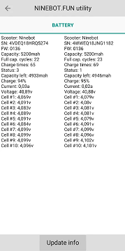]{style="overflow: hidden; display: inline-block; margin: 0.00px 0.00px; border: 0.00px solid #000000; transform: rotate(0.00rad) translateZ(0px); -webkit-transform: rotate(0.00rad) translateZ(0px); width: 179.00px; height: 360.00px;"}

[10.3 ES RollBack Android утилита для отката и восстановления прошивок модулей самоката.]{.c10} {#h.r85muazeqksx .c8}
-----------------------------------------------------------------------------------------------

[[https://mimod.ru/ru\_RU/es-rollback/](https://mimod.ru/ru_RU/es-rollback/&sa=D&source=editors&ust=1636795599542000&usg=AOvVaw1ndTJaYnjRBn8MdW_Jeggc){.c11}]{.c7}[ ]{.c5}

[]{.c5}

[Программа гарантированно работает на Android 6.x и выше. На 4.4.х могут
быть проблемы.]{.c5}

[Если хотите откатиться на v1.2.0, вам придётся откатить еще и батареи
до версии БМС v1.2.2. Рекомендую сделать это до изменения прошивки
основного контроллера.
(]{}[[источник](https://t.me/NINEBOT_ES/135858&sa=D&source=editors&ust=1636795599543000&usg=AOvVaw1a8U-dfkeKcjSOdmXk1Cnx){.c11}]{.c7}[)]{.c5}

[]{.c5}

[Последовательность прошивки до v1.2.0:]{.c5}

1.  [Прошить внешнюю батарею BMS 1.2.2 (External battery)]{.c5}
2.  [Прошить внутреннюю батарею BMS 1.2.2 (Internal battery)]{.c5}
3.  [Прошить контроллер 1.2.0 (Main controller)]{.c5}

[]{.c5}

[Если контроллер не будет видеть внешнюю батарею попробовать
следующее:]{.c5}

1.  [При соединении к внешней батареи через приложение нажимать на
    внешней батарее кнопку (которая рядом с 4 светодиодами)]{.c5}
2.  [Попробовать несколько раз прошить внешнюю батарею на BMS 1.2.2. Не
    с первого раза получается. Помогает простое выключение/включение
    самоката.]{.c5}
3.  [Прошиться на последние версии контроллера Main v.1.3.9 и BMS
    v1.3.6]{.c5}
4.  [Снять внешнюю батарею и проверить контакты]{.c5}
5.  [Повторно выполнить действия по прошивке v1.2.0]{.c5}

[]{.c5}

[]{.c5}

[]{style="overflow: hidden; display: inline-block; margin: 0.00px 0.00px; border: 0.00px solid #000000; transform: rotate(0.00rad) translateZ(0px); -webkit-transform: rotate(0.00rad) translateZ(0px); width: 180.00px; height: 320.00px;"}

[10.4 ESmax free кастомная прошивка]{.c10} {#h.dyxfvb6bei18 .c8}
------------------------------------------

[[https://mimod.ru/ru\_RU/esmaxfree/](https://mimod.ru/ru_RU/esmaxfree/&sa=D&source=editors&ust=1636795599549000&usg=AOvVaw2FL8QgNegkOeDYZece-Nzi){.c11}]{.c7}

[]{.c5}

[Инструкция:
 ]{}[[http://4pda.ru/forum/index.php?s=&showtopic=839290&view=findpost&p=86630368](http://4pda.ru/forum/index.php?s%3D%26showtopic%3D839290%26view%3Dfindpost%26p%3D86630368&sa=D&source=editors&ust=1636795599551000&usg=AOvVaw3iJY0CxhZCPzDNKij0yuyv){.c11}]{.c7}[ ]{.c5}

[1) перезагрузи самокат]{.c5}

[2) соединить через esmaxfree]{.c5}

[3) next]{.c5}

[4) read]{.c5}

[5) select preset]{.c5}

[6) linear 2 bat]{.c5}

[7) install esmaxfree и не отходи от него]{.c5}

[8) Flash -100%]{.c5}

[9) Back ]{.c5}

[10) linear 2 bat]{.c5}

[11) select preset]{.c5}

[12) чтобы было выбрано linear 2 bat, затем read]{.c5}

[13) apply]{.c5}

[]{.c5}

[]{style="overflow: hidden; display: inline-block; margin: 0.00px 0.00px; border: 0.00px solid #000000; transform: rotate(0.00rad) translateZ(0px); -webkit-transform: rotate(0.00rad) translateZ(0px); width: 150.00px; height: 300.00px;"}

[10.5 Darknessbot]{.c10} {#h.g1s4cmg16ika .c8}
------------------------

[[https://electrotransport.ru/ussr/index.php?topic=43883.0](https://electrotransport.ru/ussr/index.php?topic%3D43883.0&sa=D&source=editors&ust=1636795599555000&usg=AOvVaw0heS4PomoABKGI8zJ_5piW){.c11}]{.c7}[ ]{.c5}

[]{.c5}

[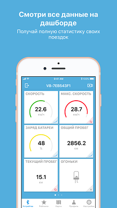]{style="overflow: hidden; display: inline-block; margin: 0.00px 0.00px; border: 0.00px solid #000000; transform: rotate(0.00rad) translateZ(0px); -webkit-transform: rotate(0.00rad) translateZ(0px); width: 230.00px; height: 409.00px;"}

[10.6 Ninebot (+ старые версии)]{.c10} {#h.aytbuo8vfd1e .c8}
--------------------------------------

[[http://4pda.ru/forum/index.php?showtopic=704842](http://4pda.ru/forum/index.php?showtopic%3D704842&sa=D&source=editors&ust=1636795599557000&usg=AOvVaw0Lj4zh4Z4Q6VocSbnlgkCu){.c11}]{.c7}[ ]{.c5}

[]{.c5}

[]{style="overflow: hidden; display: inline-block; margin: 0.00px 0.00px; border: 0.00px solid #000000; transform: rotate(0.00rad) translateZ(0px); -webkit-transform: rotate(0.00rad) translateZ(0px); width: 270.00px; height: 480.00px;"}

[]{.c5}

[]{.c5}

[]{.c5}

[]{.c5}

[]{.c5}

